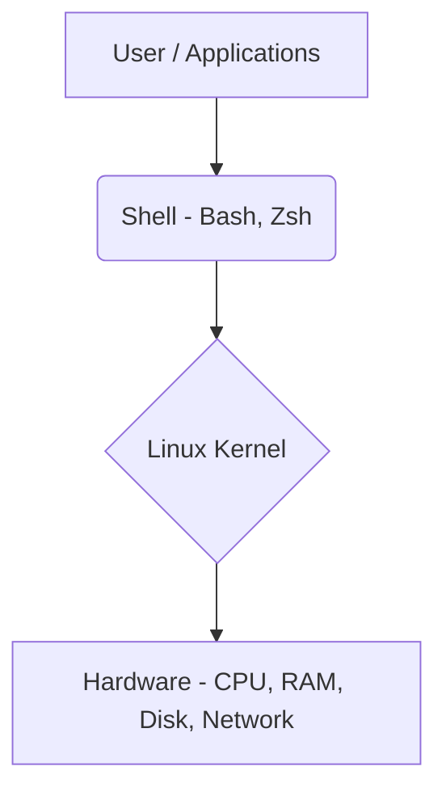
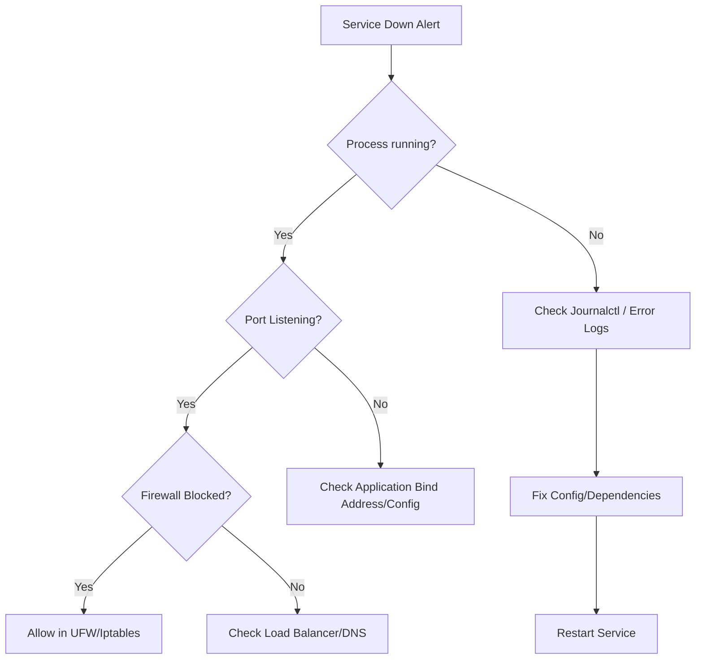

# Overview

**Linux kya hai? Kyu use hota hai?**
Linux ek open-source operating system kernel hai jo hardware aur applications ke beech ka foundation banta hai. Real life analogy: Jaise ghar ki neev (foundation) hoti hai jis par saari building banti hai, waise hi modern infrastructure ki neev Linux hai.
Production servers, Docker containers, Kubernetes nodes, CI/CD runners — almost har jagah Linux use hota hai. Agar aap DevOps Engineer banna chahte ho, toh Linux aana non-negotiable hai kyunki production mein koi GUI nahi hota, sirf CLI (Command Line Interface) hota hai.

**Industry kaha use karti hai?**
- AWS, Azure, Google Cloud (GCP) ke 90%+ VMs Linux par chalte hain.
- Kubernetes clusters ka pura backend Linux hai.
- Load balancers (Nginx, HAProxy) aur databases (PostgreSQL, MongoDB) primarily Linux environments ke liye optimized hain.

**Architecture**


---

# Working

**Internal Working:**
Jab aap terminal mein command (jaise `ls` ya `ping`) type karte ho, toh Shell us command ko interpret karta hai aur system call ke through Linux Kernel ko bhejta hai. Kernel hardware resource allocate karta hai aur output wapas Shell ke through terminal par dikhata hai.

- **Data Flow:** User -> Terminal -> Shell -> Kernel -> Hardware.
- **Root Directory (`/`):** Sab kuch ek hierarchy mein hota hai. No C: or D: drives.
- **Everything is a file:** Linux mein hardware (e.g. `/dev/sda`), processes (e.g. `/proc`), aur directories sab ko files ki tarah treat kiya jata hai.

---

# Installation

**Prerequisites:** Internet connection, basic understanding of terminal, virtualization software (VirtualBox, VMware) or Cloud Account (AWS/GCP/Azure).

**Installation:**
Cloud pe directly VM spin-up karna easy hai. Local machine (Windows) pe WSL (Windows Subsystem for Linux) best approach hai.

```bash
# WSL2 pe Ubuntu install karne ka command (Run in PowerShell as Admin)
wsl --install -d Ubuntu
```

**Verification:**
```bash
cat /etc/os-release
uname -r
```

---

# Practical Lab

**Step-by-step implementation: Fresh Server Setup for DevOps**

Yeh lab ek fresh Ubuntu VM (jaise AWS EC2) par execute karein. Production mein hum ye commands manually type nahi karte, balki ek bootstrap script use karte hain.

**Manual Steps vs Automated Bootstrap:**
1. **System Update & Upgrade:** OS security patches (`sudo apt update && sudo apt upgrade -y`).
2. **Create DevOps User:** Dedicated user for operations, no direct root access.
3. **Secure SSH Login:** Disable root login in `/etc/ssh/sshd_config`.
4. **Install Essential Packages:** `curl`, `wget`, `git`, `htop`, `jq`, `vim`.
5. **Firewall (UFW) Configuration:** Open port 22/tcp and 80/tcp.

**Production-ready Bootstrap Bash Script (`setup.sh`):**
*(Save this as `setup.sh` and run it as root on a fresh VM)*
```bash
#!/bin/bash
set -e # Exit immediately if a command exits with a non-zero status.

echo "==> Updating System Packages..."
apt-get update && apt-get upgrade -y

echo "==> Installing Core Utilities..."
apt-get install -y curl wget git htop net-tools unzip jq vim tmux ufw

echo "==> Creating devops_user..."
if id "devops_user" &>/dev/null; then
    echo "User already exists"
else
    useradd -m -s /bin/bash devops_user
    echo "devops_user:Password123!" | chpasswd
    usermod -aG sudo devops_user
fi

echo "==> Securing SSH (Disabling Root Login)..."
sed -i 's/^#PermitRootLogin yes/PermitRootLogin no/' /etc/ssh/sshd_config
sed -i 's/^PermitRootLogin yes/PermitRootLogin no/' /etc/ssh/sshd_config
systemctl restart sshd

echo "==> Configuring UFW Firewall..."
ufw --force enable
ufw allow 22/tcp
ufw allow 80/tcp

echo "==> Fresh Server Setup Complete! 🚀"
```

**Expected Output:** Script execute hone ke baad, aapka server fully secure, updated, aur standard DevOps tasks ke liye ready hoga without manual intervention.

---

# Daily Engineer Tasks

- **L1 Engineer:** Checking disk space (`df -h`), restarting services (`systemctl restart nginx`), reading logs (`tail -f /var/log/syslog`).
- **L2 Engineer:** User management (`useradd`, `chmod`), basic network troubleshooting (`ping`, `curl`, `ss`), setting up cron jobs.
- **L3 / Senior Engineer:** Kernel tuning (sysctl), deep log analysis (awk, sed), writing bash automation scripts, configuring advanced firewalls (iptables/firewalld).
- **DevOps Engineer:** Configuring SSH keys for CI/CD, managing package dependencies for applications, building golden OS images (Packer).

---

# Real Industry Tasks

1. **Real Change Request: Deploying Nginx Web Server**
   ```bash
   sudo apt install nginx -y
   sudo systemctl enable --now nginx
   sudo systemctl status nginx
   ```
2. **Patch Management:**
   Every weekend, updating security packages across 100 VMs using tools like Ansible (which internally runs `apt upgrade` or `yum update`).
3. **Log Rotation:**
   Configuring `/etc/logrotate.d/` so that logs don't consume entire disk space.

---

# Troubleshooting

**Symptom:** `No space left on device`
- **Possible Root Cause:** Koi log file disk ko 100% full kar rahi hai.
- **Investigation Steps:**
  ```bash
  # Check kaunsa partition full hai
  df -h
  # Check kaunsi file/folder sabse zyada space le raha hai
  sudo du -sh /var/* | sort -rh | head -10
  ```
- **Resolution:**
  Never use `rm -rf` on active log files, varna service crash ho sakti hai ya logging band ho sakti hai. Humesha file truncate karo:
  ```bash
  sudo truncate -s 0 /var/log/nginx/access.log
  ```
- **Prevention:** Configure appropriate `logrotate` rules.

---

# Interview Preparation

### Top Interview Questions (Basic to FAANG Level)

**Basic (L1):**
1. **Soft Link aur Hard Link mein kya difference hai?**
   *Expected Answer:* Hard link actual file/inode ka direct reference hoti hai. Agar original file delete ki toh hard link chalti rahegi. Soft link ek shortcut ki tarah hoti hai (path pointer). Agar original file delete ki, toh soft link "dangling" (broken) ban jayegi. `ln` se hard link, aur `ln -s` se soft link banti hai.
2. **`chmod 755` ka kya matlab hai?**
   *Expected Answer:* 7 (Owner) = Read(4)+Write(2)+Execute(1). 5 (Group) = Read(4)+Execute(1). 5 (Others) = Read(4)+Execute(1). Owner file ko modify aur execute kar sakta hai, baaki sab sirf read aur execute kar sakte hain. Default directory permission yahi hoti hai.

**Intermediate (L2/L3):**
3. **Difference between `du` and `df`?**
   *Expected Answer:* `df` dikhata hai total disk space available/used for the entire filesystem. `du` dikhata hai space used by specific files/directories.
4. **Boot process of Linux kya hota hai?**
   *Expected Answer:* BIOS/UEFI -> MBR/GPT -> GRUB (Bootloader) -> Kernel -> Init/systemd -> Runlevels/Targets.
5. **Zombie process kya hota hai aur isko kaise kill karte hain?**
   *Expected Answer:* Zombie process wo child process hai jo execute ho chuka hai but uska parent process abhi tak uski exit status read nahi kar paya. Zombie ko directly kill nahi kar sakte (`kill -9` wont work), aapko uske parent process ko kill karna padta hai ya parent ko `wait()` call bhejna padta hai.

**Advanced/FAANG Scenario:**
6. **Ek application port 8080 par chalni chahiye, par "Port already in use" error aa raha hai. Kaise troubleshoot karoge?**
   *Expected Answer:* Pehle check karunga kaunsa process port use kar raha hai: `sudo ss -tulnp | grep 8080` ya `sudo lsof -i :8080`. Output se PID nikalunga. Phir `ps -p <PID>` se process ki details check karunga. Agar vo unwanted process hai, toh gracefully stop karunga `kill -15 <PID>`, agar na ho to `sudo kill -9 <PID>` se terminate karke apni application start karunga.
7. **Server load average 15.0 hai on a 4-core CPU. Iska kya matlab hai aur kaise investigate karoge?**
   *Expected Answer:* 4 cores pe load > 4 matlab server heavily overloaded hai (processes are waiting for CPU time). Main `htop` ya `top` use karke check karunga CPU bound tasks. Agar CPU idle 0% hai, to process issue hai. Agar `%wa` (I/O wait) high hai, toh disk I/O bottleneck hai (check with `iostat -x 1`).
8. **Ek large 50GB log file system space full kar rahi hai, jab aapne `rm` se usko delete kiya, disk space abhi bhi 100% full dikha rahi hai. Why?**
   *Expected Answer:* Kyunki process (jaise Nginx) abhi bhi us file descriptor ko open karke write kar raha hai. File disk se tabhi actually remove hoti hai jab sabhi links aur open file handles close ho jayein. Aise case mein `lsof +L1` karke deleted open files dhundhunga aur us process ko restart karunga (ya `kill -HUP`). Future prevention ke liye `truncate -s 0 file.log` karna chahiye bajaye `rm` ke.

**Top Production Issues (SRE Level):**
- Disk I/O bottlenecks causing high Load Average but low CPU usage.
- Inodes running out (100% `IUse` in `df -i`) due to millions of small temporary files in `/tmp`.
- Out Of Memory (OOM) Killer randomly terminating critical database processes.
- Unintentional root file system read-only mount due to disk corruption.

---

# Production Scenarios

**Scenario: Production Web Server unresponsive (Website Down)**
- **How to think:** Network issue hai? Service crash hui hai? Disk full ho gayi hai? CPU/RAM maxed out hai?
- **Where to check:**
  1. SSH login working? Agar haan, toh OS zinda hai.
  2. `htop` ya `top` se CPU/RAM load check karo.
  3. `df -h` se disk space check karo (100% full to nahi?)
  4. `sudo systemctl status nginx` se web server check karo.
- **Commands:**
  ```bash
  tail -n 100 /var/log/nginx/error.log
  dmesg -T | grep -i oom
  ```
- **Resolution:** Agar OOM (Out of Memory) killer ne Nginx ko maara hai, toh RAM upgrade karni hogi ya memory leak fix karni hogi. For quick resolution, `systemctl restart nginx`.

---

# Commands

| Command | Purpose | Syntax | Example | Output | When NOT to use |
|---|---|---|---|---|---|
| `ls` | List directory contents | `ls [options] [path]` | `ls -lah` | File sizes, permissions | Don't use inside scripts for parsing, use `find` |
| `grep` | Search text patterns | `grep [options] 'pattern' file` | `grep -i "error" /var/log/syslog` | Matching lines | Avoid on massive binary files |
| `find` | Search files by attributes | `find [path] [options]` | `find / -name "*.conf"` | List of paths | `find /` without filters is slow |
| `chmod` | Change file permissions | `chmod [permissions] [file]` | `chmod +x script.sh` | (Silent on success) | Don't use `chmod 777` in production |
| `chown` | Change file owner | `chown [user]:[group] [file]` | `chown devops:devops app/` | (Silent on success) | - |
| `systemctl`| Manage systemd services | `systemctl [action] [service]` | `systemctl restart docker` | Service status | - |

---

# Cheat Sheet

- **Most Important Commands:** `df -h` (Disk), `free -m` (RAM), `htop` (CPU), `ss -tulnp` (Ports), `tail -f` (Logs).
- **Important Config Files:**
  - `/etc/passwd`: User info
  - `/etc/fstab`: Disk mounts
  - `/etc/ssh/sshd_config`: SSH config
  - `/etc/hosts`: Local DNS mapping
- **Interview Shortcut:** OOM killer kills process when RAM is full. Sticky bit (`chmod +t`) allows only the owner to delete their files in a shared folder (like `/tmp`).

---

# SOP & Runbook & KB Article

**SOP: Adding a New User for Developer Access**
- **Purpose:** Securely create an account for a new developer.
- **Procedure:**
  1. `sudo useradd -m -s /bin/bash <username>`
  2. `sudo mkdir /home/<username>/.ssh`
  3. Copy public key to `/home/<username>/.ssh/authorized_keys`
  4. `sudo chown -R <username>:<username> /home/<username>/.ssh`
  5. `sudo chmod 700 /home/<username>/.ssh` && `sudo chmod 600 /home/<username>/.ssh/authorized_keys`
- **Validation:** Developer se SSH login verify karao without password.

**Runbook: Disk 90% Alert Triggered**
- **Detection:** Prometheus/Grafana alert fires.
- **Investigation:** Run `df -h` and `du -sh /* | sort -rh | head -5`.
- **Resolution:** Truncate huge log files using `> /path/to/logfile` or `truncate -s 0 /path/to/logfile`. Check logrotate config.

---

# Best Practices & Beginner Mistakes

**Best Practices:**
- Humesha least privilege principle follow karo (Don't run apps as root).
- Always configure `logrotate` for custom apps.
- SSH key-based authentication only (Password auth = no).

**Beginner Mistakes:**
- ❌ **Mistake:** Using `chmod 777` to fix permission denied errors.
  **Impact:** Anyone can modify/execute the file. Security risk.
  **Correct Approach:** Use correct `chown` and `chmod 755` or `644`.
- ❌ **Mistake:** Deleting active log files with `rm -rf`.
  **Impact:** Service keeps writing to the deleted inode, disk space is NOT freed until service restarts.
  **Correct Approach:** Use `truncate` to empty the file while preserving the inode.

---

# Advanced Concepts

- **Linux Namespaces & Cgroups:** Yeh do kernel features Docker containers ka foundation hain. Namespaces process isolation provide karte hain (networking, mount points) aur Cgroups resource limiting (CPU, RAM) provide karte hain.
- **Inodes:** Har file ka ek unique inode number hota hai jo uske metadata (permissions, disk blocks location) ko store karta hai. Agar disk me space hai but "No space left" error aata hai, toh check karo inodes full toh nahi ho gaye (`df -i`).

---

# Related Topics & Flashcards & Revision

**Related Topics:**
- Next: [[LX-02 Shell Scripting for DevOps]]
- Previous: [[00 DevOps Master Index]]
- Containerization: [[Docker Fundamentals]]

**Flashcards:**
- *Q: Difference between `du` and `df`?* -> *A: `df` entire filesystem ka space dikhata hai, `du` specific directory/file ka size dikhata hai.*
- *Q: What port does SSH use?* -> *A: Port 22.*

---

# Real Production Logs & Commands & Decision Tree

**Log Analysis Example (`/var/log/auth.log`):**
```text
Jun 27 15:32:01 prod-db sshd[12345]: Failed password for invalid user admin from 192.168.1.100 port 54322 ssh2
Jun 27 15:32:05 prod-db sshd[12346]: Accepted publickey for devops from 10.0.0.5 port 54323 ssh2
```
*Explanation:*
- First line: Koi hacker ya automated bot IP `192.168.1.100` se `admin` user try kar raha tha aur fail hua.
- Second line: `devops` user IP `10.0.0.5` se securely SSH key use karke successfully login hua.

**Decision Tree for Service Down:**

