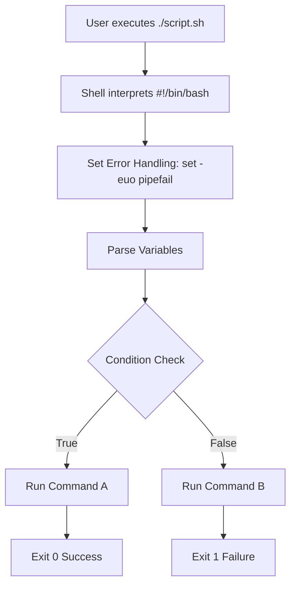
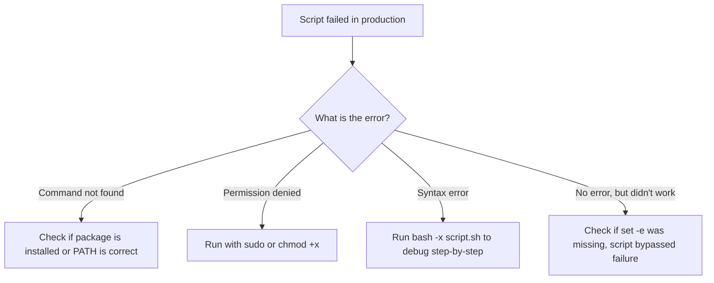

# LX-02 Shell Scripting for DevOps

> [!important]
> **God Mode Vault**: Shell scripting is the duct tape of DevOps. This note covers production-grade Bash scripting, error handling, automation, and FAANG-level interview questions.

## # Overview

**Ye kya hai?**
Shell script ek plain-text file hoti hai jisme hum Linux commands ko ek sequence mein likhte hain taaki wo automatically execute ho sakein. 

**Kyu use hota hai?**
DevOps engineers din bhar manual commands type nahi karte. Agar ek kaam 2 se zyada baar karna pade, toh hum uski script bana dete hain. (e.g., daily database backups, log rotation, bulk user creation).

**Real life example / Simple Analogy:**
Shell script ek **Recipe (Nuskha)** ki tarah hai. 
- **Variables** = Ingredients (Aata, Namak).
- **Commands** = Steps (Pani milao, gas pe rakho).
- **Conditionals (if/else)** = Agar namak kam hai, toh thoda aur daalo.
- **Loops (for/while)** = Har roti ko ek-ek karke seko.

**Industry kaha use karti hai? / Real production use-case:**
CI/CD pipelines (Jenkins, GitHub Actions) ke andar maximum logic shell scripts me likha hota hai. Health checks, deployments, aur cron jobs sab script-based hote hain.

**Architecture (Shell Execution Flow):**


---

## # Working

**Internal working:**
Script jab run hoti hai, toh OS `#!` (shebang) line dekhta hai. `#!/bin/bash` ka matlab hai is file ko Bash interpreter ke hawale kar do. Bash ek-ek line padhta hai aur system calls (exec, fork) karta hai.

**Data flow & Variables:**
- `export VAR="value"`: Child processes (doosre scripts) ko bhi ye variable milega.
- `local VAR="value"`: Sirf ek function ke andar use hoga.
- `$` sign se variable ki value access hoti hai (`echo $VAR`).

---

## # Installation

**Prerequisites:** Linux/Mac terminal. Bash by default installed hota hai.

**Verification:**
```bash
bash --version
```

---

## # Practical Lab

**Step-by-step implementation (Disk Usage Alert Script):**

Bajaaye script ko scratch se likhne ke, aap ready-made script ko `examples/` folder se run kar sakte hain. See: [disk_alert.sh](file:///C:/Users/SPTL/Documents/devops/devops/examples/01-Linux/disk_alert.sh).

**CLI Method (Bash):**
1. Navigate to the examples directory:
   ```bash
   cd ../../examples/01-Linux/
   ```
2. Review the code inside `disk_alert.sh`:
```bash
#!/bin/bash
set -euo pipefail # God mode error handling

THRESHOLD=80
# awk aur df use karke / partition ka percentage nikalna
USAGE=$(df / | grep / | awk '{ print $5 }' | sed 's/%//g')

if [ "$USAGE" -gt "$THRESHOLD" ]; then
    echo "CRITICAL: Disk space is at ${USAGE}%"
    # yaha email bhejne ka logic aa sakta hai
else
    echo "OK: Disk space is at ${USAGE}%"
fi
```
3. Make it executable: `chmod +x disk_alert.sh`
4. Run: `./disk_alert.sh`
**Expected Output:** `OK: Disk space is at 45%`

---

## # Daily Engineer Tasks

- **L1 Engineer:** Scripts run karna (e.g., `./restart_services.sh`), logs check karna agar script fail ho jaye.
- **L2 Engineer:** Existing scripts ko modify karna, naye variables add karna, cron jobs setup karna.
- **L3 / Senior Engineer:** Complex CI/CD glue scripts likhna, `sed`/`awk` use karke log parsing karna, error handling (`trap`, `set -e`) robust banana.

---

## # Real Industry Tasks

- **Real tickets:** "Database logs var/log partition ko full kar rahe hain." -> Resolution: Log rotation script likh kar cron me daalo.
- **Real maintenance work:** 500 servers par naya user create karna. (Action: Write a `for` loop script with SSH).
- **Migration:** Purane server se naye server par files rsync karne ki automated script.

---

## # Troubleshooting

**Common Issue 1: Script fails but continues running**
- **Symptoms:** Database backup fail ho gaya, par script ne purane backups delete kar diye!
- **Root causes:** Aapne `set -e` nahi lagaya. Default bash me error aane par script next line par chali jati hai.
- **Resolution:** Hamesha script ke top par `set -euo pipefail` likho.

**Common Issue 2: `Permission denied`**
- **Symptoms:** `./script.sh` gives permission denied.
- **Resolution:** `chmod +x script.sh`

**Common Issue 3: `\r: command not found`**
- **Symptoms:** Script Windows me likhi gayi thi aur Linux par chalai.
- **Resolution:** `dos2unix script.sh` run karo.

---

## # Production Scenarios

### Scenario: Service down, auto-restart needed
**How to think:** Ek unstable service (e.g., legacy app) baar baar crash hoti hai. Hum K8s use nahi kar rahe.
**Where to check:** Service status: `systemctl is-active myapp`
**Commands/Script:**

Refer to the full script in the vault: [healthcheck.sh](file:///C:/Users/SPTL/Documents/devops/devops/examples/01-Linux/healthcheck.sh)

```bash
#!/bin/bash
if ! systemctl is-active --quiet myapp; then
    echo "Service down! Restarting..."
    systemctl restart myapp
    echo "Alert: MyApp was restarted" | mail -s "Service Alert" admin@company.com
fi
```
**Resolution:** Put this script in crontab to run every 5 minutes: `*/5 * * * * /opt/scripts/healthcheck.sh`

---

## # Commands

| Command | Purpose | Example |
|---------|---------|---------|
| `awk` | Text processing by column | `awk '{print $1}' access.log` (Gets IP address) |
| `sed` | Find and replace in stream | `sed -i 's/ERROR/INFO/g' config.yml` |
| `grep`| Search text | `grep -r "TODO" /src` |
| `cut` | Cut specific parts of line | `cut -d: -f1 /etc/passwd` (Gets usernames) |
| `trap`| Catch signals (Ctrl+C, Errors) | `trap 'rm -f /tmp/lock' EXIT` |

---

## # Cheat Sheet

- **Arguments:** `$1` (first arg), `$@` (all args), `$#` (number of args).
- **Status:** `$?` (exit code of last command. 0 = Success, >0 = Fail).
- **Loops:**
  ```bash
  for item in 1 2 3; do echo $item; done
  ```
- **Conditions:** `if [[ $A == $B ]]; then ... fi`

---

## # SOP & Runbook

**SOP: Creating a new Production Script**
**Procedure:**
1. Hamesha shebang `#!/bin/bash` do.
2. Hamesha `set -euo pipefail` use karo.
3. Hamesha variables ko double quotes me rakho: `"$MY_VAR"` taaki spaces se code break na ho.
4. Hardcoded passwords script me mat rakho, Environment Variables se lo.

---

## # KB Article

**Problem:** `[: too many arguments` error in script.
**Symptoms:** `if [ $VAR == "test" ]` fails when `$VAR` is empty or has spaces.
**Cause:** Word splitting. If `$VAR` is "hello world", it becomes `if [ hello world == "test" ]`, which is invalid syntax.
**Resolution:** Always use double brackets in Bash: `if [[ $VAR == "test" ]]` or quote the variable `if [ "$VAR" == "test" ]`.

---

## # Best Practices

- **Functions use karo:** Agar code 2 baar se zyada repeat ho raha hai, toh usey `function my_func() {}` me daal do.
- **Logs likho:** Script kya kar rahi hai, usko file me redirect karo: `echo "Starting..." >> /var/log/myscript.log`.
- **Dry-run mode:** Badi scripts (file deletion wali) me ek `--dry-run` flag zarur hona chahiye.

---

## # Beginner Mistakes

- **Mistake:** Variable assign karte time space dena. `VAR = "hello"` (Galat). `VAR="hello"` (Sahi).
- **Impact:** Bash sochega ki `VAR` ek command hai aur error dega.
- **Mistake:** `rm -rf $DIR/` bina check kiye. Agar `$DIR` empty hai, toh wo `rm -rf /` ban jayega!
- **Correct approach:** `rm -rf "${DIR:?Variable not set}/"` (Use bash parameter expansion to fail if empty).

---

## # Advanced Concepts

- **Parameter Expansion:** `${VAR:-default}` agar VAR empty hai toh 'default' assign kar dega.
- **Process Substitution:** `<(command)` - output ko as a file treat karta hai. Example: `diff <(ls dir1) <(ls dir2)`.
- **Arrays:** 
  ```bash
  MY_ARRAY=("apple" "banana" "cherry")
  echo ${MY_ARRAY[1]} # Prints banana
  ```

---

## # Related Topics

- Prerequisites: [[01-Linux-Foundation/LX-01 Linux for DevOps|Linux OS Basics]]
- Next Steps: [[01-Linux-Foundation/LX-03 Process and System Management|Process Management]]

---

## # Flashcards

**Q:** Script me `set -e` ka kya kaam hai?
**A:** Ye script ko turant stop kar deta hai agar koi bhi command fail (non-zero exit code) hoti hai.

**Q:** `$?` kya return karta hai?
**A:** Pichi chalayi gayi command ka exit code (0 for success, 1-255 for error).

---

## # Revision

- **5 min revision:** Bash scripts automate tasks. Use `set -euo pipefail`. Variables have NO spaces around `=`. Use `$1`, `$2` for arguments. `awk` for columns, `sed` for replacing text. Use `[[ ]]` for conditions.
- **Interview revision:** They will ask you to write a script to find IP addresses from a log file. (Ans: `awk '{print $1}' access.log | sort | uniq -c | sort -nr`).

---

## # Real Production Logs

**Error Log Investigation:**
```text
/opt/scripts/backup.sh: line 14: AWS_KEY: unbound variable
```
**Explanation:** Script me `set -u` laga hua hai (jo ki achhi baat hai). Script line 14 par `$AWS_KEY` variable use kar rahi hai, par usko wo variable assign nahi hua (shayad environment env file missing hai). Fix: Export the variable before running.

---

## # Decision Tree



---

## # INTERVIEW PREPARATION (HIGH PRIORITY)

### Top 20 Interview Questions

**Basic:**
1. What is the shebang line? (`#!/bin/bash`)
2. How do you pass arguments to a script? (`$1`, `$2`)
3. What is the difference between `$@` and `$*`? 
4. How do you assign output of a command to a variable? (`VAR=$(command)`)
5. What does `chmod +x` do?

**Intermediate:**
6. Explain `set -e`, `set -u`, and `set -o pipefail`.
7. Write a command to find all `.log` files and delete them. (`find /var/log -name "*.log" -type f -delete`)
8. How do you check if a file exists in an `if` condition? (`if [[ -f /path/to/file ]]; then`)
9. What is the difference between `awk` and `sed`?
10. How do you redirect both stdout and stderr to a file? (`> output.log 2>&1`)

**Advanced / FAANG:**
11. How would you parse a JSON file using a bash script? *(Ans: Don't use awk/grep. Use `jq`).*
12. Write a script to find the top 5 IP addresses hitting your Nginx server from an `access.log`.
13. Explain how the `trap` command works. How do you ensure temporary files are deleted even if the script crashes?
14. Your script runs perfectly in your terminal, but fails when run by `cron`. Why? *(Ans: Cron has a minimal $PATH and doesn't load .bashrc).*
15. How do you handle multi-threading or parallel execution in bash? *(Ans: Background processes with `&` and `wait`, or using `xargs -P` / `parallel`).*

**Scenario Based:**
16. You have a folder with 10,000 files. `rm *` gives "Argument list too long". How do you delete them? *(Ans: `find . -type f -delete` or `ls | xargs rm`).*
17. A script needs to connect to a DB. How do you securely pass the password? *(Ans: Environment variables or reading from a secure vault. Never hardcode).*
18. Your backup script takes 2 hours. How do you run it on a remote server so it doesn't stop if your SSH disconnects? *(Ans: Use `tmux`, `screen`, or `nohup ./backup.sh &`).*
19. How do you check if a port (e.g., 8080) is listening using a shell script? *(Ans: `netstat -tulpn | grep 8080` or `ss -tulpn` or `nc -vz localhost 8080`).*
20. You need to replace "http" with "https" in 100 configuration files. Command? *(Ans: `sed -i 's/http/https/g' *.conf`).*

**Common Interview Mistakes:**
- Writing complex 500-line shell scripts in interviews. *(Pro tip: If a script goes beyond 100 lines, say "I would write this in Python or Go instead of Bash for maintainability").*
- Not quoting variables in `[ ]` tests.
- Forgetting to mention `chmod +x` before running a script.

---
