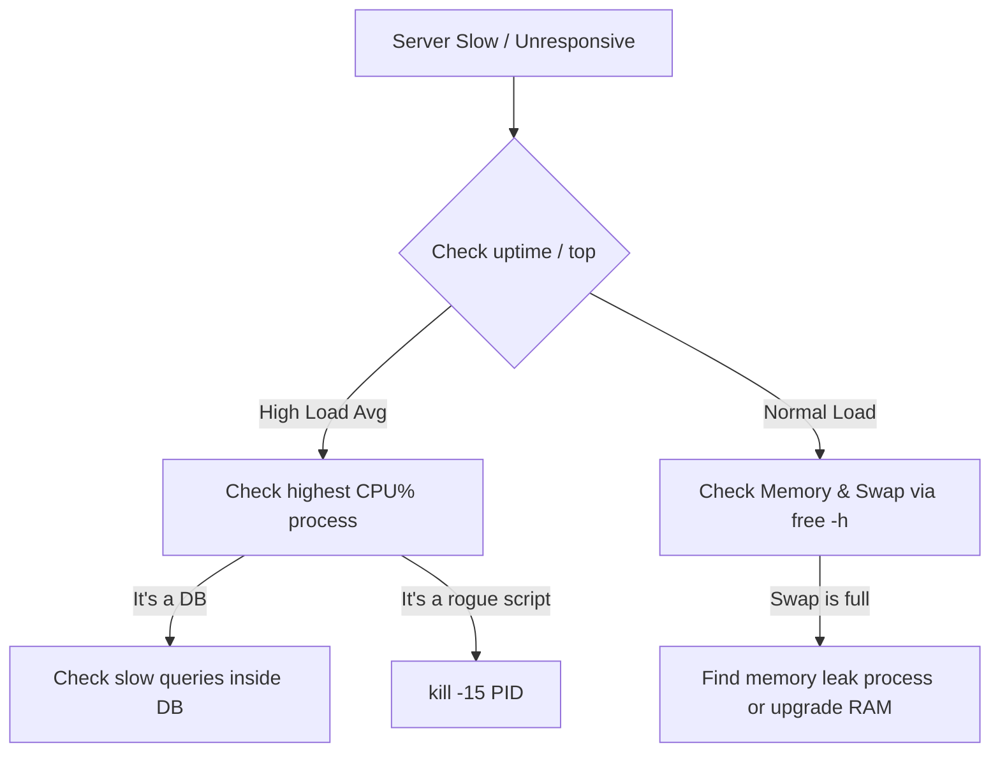

# LX-03 Process and System Management

> [!important]
> **God Mode Vault**: Process management is the pulse-monitoring of your infrastructure. This note covers how to observe, control, prioritize, and terminate Linux processes without bringing down production.

## # Overview

**Ye kya hai?**
Linux me chalne wala har program ek **process** hai (e.g., Nginx, DB, scripts). Process management ka matlab hai in programs ko monitor karna, unki CPU/RAM limit set karna, aur agar wo hang ho jayein toh unko marna (kill).

**Kyu use hota hai?**
Ek bug wala process server ki 100% CPU kha sakta hai (Runaway process). DevOps engineer ko pata hona chahiye ki kaunsa process server ko slow kar raha hai aur usko bina baki system ko disturb kiye kaise theek kiya jaye.

**Real life example / Simple Analogy:**
Yeh ek **Traffic Police** wale jaisa kaam hai. 
- Process = Vehicles (Gadiyan).
- CPU/RAM = Road aur parking space.
- Load Balancing = Traffic divert karna.
- `kill` command = Galat parking wale ko fine lagana ya uthana.

**Industry kaha use karti hai? / Real production use-case:**
Production servers par high CPU load hone par alerts aate hain. Engineer server me SSH karke `top` command chalata hai, culprit process dhundhta hai aur usko gracefully restart karta hai.

**Architecture (Process Tree):**
```mermaid
graph TD
    A[PID 1: systemd/init] --> B[sshd]
    A --> C[nginx]
    A --> D[cron]
    B --> E[bash (User Session)]
    E --> F[top command]
    C --> G[nginx worker 1]
    C --> H[nginx worker 2]
```

---

## # Working

**Internal working:**
Har process ka ek **PID** (Process ID) hota hai. Sabse pehla process jo boot hone par start hota hai wo PID 1 (`init` ya `systemd`) hota hai. Baki sab uske bachhe (child processes) hote hain. Kernel (OS ka dimag) decide karta hai kis process ko kitna CPU time milega (Scheduling).

**Signals (Baat karne ka tareeka):**
OS processes se "Signals" ke zariye baat karta hai.
- `SIGTERM (15)`: Graceful kill (Process apna bachha khucha kaam khatam karke band hota hai).
- `SIGKILL (9)`: Force kill (Process ko turant marna padta hai).

---

## # Installation

**Prerequisites:** Ubuntu/CentOS/RHEL VM.
`htop` install kar lo (better visibility ke liye):
```bash
sudo apt install htop -y
```

---

## # Practical Lab

**Step-by-step implementation (Finding and Killing a CPU Hog):**

**CLI Method:**
1. Ek dummy CPU-hogging process chalao:
   ```bash
   cat /dev/urandom > /dev/null &
   ```
2. `top` ya `htop` command run karo aur CPU usage dekho. Sabse upar `cat` dikhega.
3. Uska PID (e.g., 1234) note karo.
4. Process ko check karo:
   ```bash
   ps aux | grep 1234
   ```
5. Process ko kill karo (Pehle gracefully, fir forcefully):
   ```bash
   kill -15 1234
   # Agar na mare toh:
   kill -9 1234
   ```

---

## # Daily Engineer Tasks

- **L1 Engineer:** `top` command se load check karna aur L2 ko report karna.
- **L2 Engineer:** `htop` aur `ps` use karke memory leak dhundhna. Hang processes ko kill karna.
- **L3 / Senior Engineer:** Kernel parameters (`sysctl`) tune karna taaki zyada load handle ho sake. `ulimit` set karna taaki ek user poora server na down kar de.

---

## # Real Industry Tasks

- **Real tickets:** "Database server RAM is at 99%, OOM (Out Of Memory) killer is terminating processes."
- **Real maintenance work:** Editing `/etc/security/limits.conf` to increase max open files for a web server from 1024 to 65535.
- **Log Management:** `logrotate` configure karna taaki server ki disk log files se full na ho jaye.

---

## # Troubleshooting

**Common Issue 1: Server response is very slow**
- **Symptoms:** SSH lene me 10 seconds lag rahe hain.
- **Investigation:** Run `uptime` to check load average. Run `top` and press `P` to sort by CPU. Look for the culprit.
- **Resolution:** Restart the misbehaving service or run `kill -9 <PID>`.

**Common Issue 2: "Too many open files" error**
- **Symptoms:** Nginx starts throwing 500 errors or fails to start.
- **Investigation:** Run `ulimit -n` and check if it's set to default 1024.
- **Resolution:** Increase open file limit in `/etc/security/limits.conf`.

---

## # Production Scenarios

### Scenario: The Unkillable Zombie Process
**How to think:** Ek process `Z` state (Zombie) me chala gaya hai aur `kill -9` se bhi nahi mar raha.
**Where to check:** `ps aux | grep 'Z'`
**Root Cause:** Zombie process tab banta hai jab process apna execution finish kar leta hai par uska "Parent" process usko acknowledge nahi karta.
**Resolution:** Zombie ko directly kill nahi kar sakte. Aapko uske **Parent Process** ko marna hoga ya restart karna hoga (`kill -9 <Parent_PID>`).

---

## # Commands

| Command | Purpose | Syntax | Danger Level |
|---------|---------|--------|--------------|
| `ps aux` | List all processes | `ps aux \| grep nginx` | Low |
| `top` / `htop` | Real-time process monitor | `top` | Low |
| `kill` | Send signal to PID | `kill -15 1234` | Medium |
| `pkill` | Kill by name | `pkill nginx` | High |
| `nice` | Start process with low priority | `nice -n 10 ./script.sh` | Low |
| `nohup` | Run process in background (ignores hangup) | `nohup ./backup.sh &` | Medium |
| `lsof` | List open files by process | `lsof -p 1234` | Low |

---

## # Cheat Sheet

- **Load Average (`uptime`):** 3 numbers hote hain (1-min, 5-min, 15-min). Agar 4-core CPU hai, toh load 4.0 matlab 100% full. 5.0 matlab overload.
- **Nice Values:** -20 (Highest priority, needs root) se 19 (Lowest priority).
- **Foreground to Background:** `Ctrl+Z` dabao (suspend), fir `bg` type karo.

---

## # SOP & Runbook

**Runbook: High CPU Usage Alert**
**Detection:** Datadog alerts `CPU > 95% for 5 mins`.
**Investigation:**
1. SSH to the server.
2. Run `top -b -n 1 | head -20` to capture the current state.
3. Identify the process ID.
4. Run `lsof -p <PID>` to see what files it's writing to.
**Resolution:** If it's a known non-critical batch job, lower its priority: `renice -n 15 -p <PID>`. If it's a stuck loop, kill it: `kill -15 <PID>`.

---

## # KB Article

**Problem:** Cannot run background scripts after exiting SSH.
**Symptoms:** Script started with `&` stops when PuTTY/Terminal is closed.
**Cause:** SSH session sends SIGHUP (Hangup) signal to all child processes when closed.
**Resolution:** Use `nohup ./script.sh &` or use a multiplexer like `tmux` or `screen`.

---

## # Best Practices & Beginner Mistakes

- **Best Practice:** Production me scripts hamesha `systemd` timers ya crontab me chalani chahiye, manual `nohup` nahi.
- **Beginner Mistake:** Hamesha `kill -9` use karna.
- **Impact:** Process files ko corrupt kar sakta hai kyunki usko save karne ka time nahi milta.
- **Correct approach:** Hamesha pehle `kill -15` (SIGTERM) use karo. Agar 30 sec me na mare, tab `kill -9` (SIGKILL) use karo.

---

## # Advanced Concepts

- **/proc filesystem:** Linux me `/proc` ek virtual filesystem hai. Har process ka data idhar file ki tarah store hota hai. (Try: `cat /proc/cpuinfo` or `cat /proc/<PID>/cmdline`).
- **OOM Killer:** Jab RAM khatam ho jati hai, Linux ka kernel khud decide karta hai ki sabse zyada memory khane wale non-critical process ko maar de taaki OS zinda rahe. Isey Out-Of-Memory Killer kehte hain.

---

## # Related Topics

- Prerequisites: [[01-Linux-Foundation/LX-01 Linux for DevOps|Linux OS Basics]]
- Next Steps: [[01-Linux-Foundation/LX-04 OS Concepts for DevOps|File Systems and Kernel]]

---

## # Flashcards

**Q:** SIGTERM (15) aur SIGKILL (9) me kya difference hai?
**A:** SIGTERM process ko gracefully close hone ka time deta hai. SIGKILL process ko OS ke level se forcefully destroy kar deta hai.

**Q:** `nohup` ka kya use hai?
**A:** "No Hangup". Ye script ko background me chalta rakhta hai chahe aap SSH session close kar do.

---

## # Revision

- **5 min revision:** `top` for CPU/RAM. `ps aux` for list. `kill -15` is polite, `kill -9` is rude. Load average depends on CPU cores (load = 2 on 2 cores is 100%). `/proc` holds kernel info. `ulimit` controls resources.
- **Interview revision:** They will ask about Zombie processes and how to find load average.

---

## # Real Production Logs & Commands & Decision Tree

**OOM Killer Log:**
```text
Out of memory: Killed process 4521 (java) total-vm:45829M, anon-rss:32840M, file-rss:0M
```
**Explanation:** Kernel ne dekha ki RAM 100% full hai, isliye usne `java` process ko mar diya. Fix: App me memory leak check karo, ya server ki RAM badhao.

**Decision Tree:**


---

## # INTERVIEW PREPARATION (HIGH PRIORITY)

### Top 15 Interview Questions

**Basic:**
1. How do you find the PID of a running process? (`pgrep nginx` or `ps aux | grep nginx`)
2. What is the difference between `top` and `htop`?
3. How do you run a job in the background? (`&` operator)

**Intermediate:**
4. What is a Zombie process? How do you kill it? *(Ans: Process is dead but parent hasn't acknowledged. You can't kill a zombie, you must kill its parent).*
5. Explain Load Average (e.g., 1.5, 2.0, 2.5). *(Ans: 1-min, 5-min, 15-min avg of processes waiting for CPU).*
6. What is the difference between `kill -15` and `kill -9`?
7. What is `ulimit`? *(Ans: Sets restrictions on user resources like max open files or max processes).*

**Advanced / FAANG:**
8. You have a 4-core CPU and your 1-minute load average is 8.0. What does this mean? *(Ans: Your server is overloaded by 200%. 4 cores can handle load of 4.0 smoothly).*
9. How does the OOM (Out of Memory) killer decide which process to kill? *(Ans: It calculates an `oom_score` based on memory consumption and priority).*
10. What information can you extract from the `/proc` directory? *(Ans: Real-time kernel and process information, file descriptors, cpu/mem info).*
11. A process is taking 100% CPU but it's a critical production database. You cannot kill it. What do you do? *(Ans: Use `renice` to lower its priority temporarily while investigating).*

**Scenario Based:**
12. Application logs say "Too many open files". How do you fix this permanently? *(Ans: Edit `/etc/security/limits.conf` and update `fs.file-max` in `sysctl`).*
13. You close your SSH session and your long-running database import stops. Why? *(Ans: SIGHUP signal was sent. Should have used `tmux` or `nohup`).*
14. How do you find out which ports are being used by which processes? *(Ans: `netstat -tulpn` or `ss -tulpn` or `lsof -i`).*
15. A server crashes every night at 2:00 AM. Where do you start troubleshooting? *(Ans: Check `crontab -l` and `/var/log/syslog` or `journalctl` around that timestamp).*
