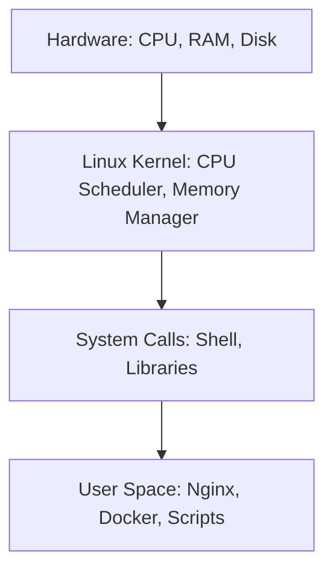

# LX-04 OS Concepts for DevOps

> [!important]
> **God Mode Vault**: To troubleshoot a server, you must think like the server. This note breaks down the Linux Kernel, File Systems, Permissions, and I/O — the absolute core of DevOps OS knowledge.

## # Overview

**Ye kya hai?**
Operating System (OS) hardware aur applications ke beech ka bridge hai. Linux me Kernel, File System, Users/Groups aur Permissions milkar ek secure aur stable environment banate hain.

**Kyu use hota hai?**
Agar aapko ye nahi pata ki Linux me "Everything is a file", toh aap devops me fass jaoge. Permissions (`chmod`), Users (`chown`), aur Disk management aana bohot zaroori hai.

**Real life example / Simple Analogy:**
OS ko ek **Hotel** ki tarah socho:
- **Kernel** = Hotel ka Manager (Jo decide karta hai kisko kaunsa room milega).
- **Hardware** = Rooms aur Beds (CPU/RAM).
- **File System** = Hotel ka Record Book (Kaunsi cheez kahan rakhi hai).
- **Permissions** = Keycards (Sirf VIP log hi VIP room me jaa sakte hain).

**Industry kaha use karti hai? / Real production use-case:**
Containers (Docker/Kubernetes) under the hood Linux OS concepts (cgroups, namespaces) par hi chalte hain. Bina OS concepts ke Kubernetes samajhna namumkin hai.

**Architecture (Linux Layers):**


---

## # Working

**Internal working:**
Linux is built on two spaces:
1. **Kernel Space:** Yahan OS ka core code chalta hai (drivers, memory management). Ye bohot protected hota hai.
2. **User Space:** Yahan humari applications chalti hain (Nginx, bash). Jab application ko hardware chahiye hota hai, toh wo "System Call" karke Kernel ko request karti hai.

**File Permissions (rwx):**
Linux me 3 types ke permission hote hain: Read (4), Write (2), Execute (1).
- `chmod 777` = Everyone can read, write, execute (Danger!).
- `chmod 644` = User can read/write. Group & Others can only read (Standard for files).
- `chmod 755` = User can read/write/execute. Others can read/execute (Standard for folders/scripts).

---

## # Installation

**Prerequisites:** None. OS is already installed!
Basic commands like `ls`, `chmod`, `chown` are built-in.

---

## # Practical Lab

**Step-by-step implementation (Fixing Permissions):**

**CLI Method:**
1. Ek secure config file banao:
   ```bash
   touch db_password.txt
   echo "admin123" > db_password.txt
   ```
2. By default permissions check karo:
   ```bash
   ls -l db_password.txt
   # Outputs: -rw-r--r-- (644)
   ```
3. Secure it so ONLY the owner can read it (chmod 400):
   ```bash
   chmod 400 db_password.txt
   ls -l db_password.txt
   # Outputs: -r-------- (400)
   ```
4. Change the owner of the file to a service user:
   ```bash
   sudo chown www-data:www-data db_password.txt
   ```

---

## # Daily Engineer Tasks

- **L1 Engineer:** `chmod +x` lagana taaki scripts run ho sakein. Users ke passwords reset karna.
- **L2 Engineer:** Disks mount karna (`/etc/fstab` use karke). Disk space full hone par inodes aur large files check karna.
- **L3 / Senior Engineer:** Custom users/groups create karna taaki security policies enforce ho sakein (Least Privilege Principle).

---

## # Real Industry Tasks

- **Real tickets:** "Jenkins cannot deploy to /var/www/html due to permission denied."
- **Action:** Add `jenkins` user to the `www-data` group instead of giving 777 permissions.
- **Storage Expansion:** Cloud VM me naya 100GB disk attach karna aur usko format/mount karna LVM (Logical Volume Manager) ke through.

---

## # Troubleshooting

**Common Issue 1: `Permission denied`**
- **Symptoms:** You cannot run a script or edit a file.
- **Investigation:** Run `ls -l script.sh`. If you see `-rw-r--r--`, it lacks the `x` (execute) bit.
- **Resolution:** Run `chmod +x script.sh`.

**Common Issue 2: `No space left on device` but disk is only 50% full**
- **Symptoms:** Cannot create new files, but `df -h` shows plenty of space.
- **Root causes:** You ran out of INODES (index nodes). Too many millions of tiny files.
- **Investigation:** Run `df -i` to check inode usage. Find the folder with millions of tiny logs/cache files.

---

## # Production Scenarios

### Scenario: The "777" Security Breach
**How to think:** Ek junior developer ne app ko work karane ke liye `/var/www/html` par `chmod -R 777` chala diya. Hacker ne ek malicious script upload ki aur execute kar di.
**Where to check:** Check file ownerships (`ls -la`). 
**Resolution:**
Never use 777.
Instead, set proper ownership: `chown -R www-data:www-data /var/www/html`
Set folders to 755: `find /var/www/html -type d -exec chmod 755 {} \;`
Set files to 644: `find /var/www/html -type f -exec chmod 644 {} \;`

---

## # Commands

| Command | Purpose | Example | Danger Level |
|---------|---------|---------|--------------|
| `chmod` | Change permissions | `chmod 644 file.txt` | Medium |
| `chown` | Change owner | `chown user:group file` | Medium |
| `df -h` | Disk space usage | `df -h` | Low |
| `du -sh`| Directory size | `du -sh /var/log` | Low |
| `ln -s` | Create soft link (Shortcut) | `ln -s /path/to/real /shortcut` | Low |

---

## # Cheat Sheet

- **File Types:** `-` (regular file), `d` (directory), `l` (symlink).
- **Permissions Map:**
  - `4` = Read (r)
  - `2` = Write (w)
  - `1` = Execute (x)
  - `7` = rwx, `6` = rw-, `5` = r-x, `4` = r--
- **Sticky Bit:** Used on `/tmp`. Anyone can write, but you can only delete YOUR own files.

---

## # SOP & Runbook

**SOP: Adding a New Disk in Linux**
**Procedure:**
1. Check attached disk: `lsblk`
2. Format the disk: `sudo mkfs.ext4 /dev/xvdb`
3. Create mount point: `sudo mkdir /data`
4. Mount it: `sudo mount /dev/xvdb /data`
5. Make it persistent: Add entry in `/etc/fstab` (using UUID from `blkid`).

---

## # KB Article

**Problem:** Cannot delete a file even as root!
**Symptoms:** `rm file.txt` says "Operation not permitted" even if you are `root`.
**Cause:** The file has the immutable attribute set.
**Resolution:** Check with `lsattr file.txt`. If you see `i`, remove it with `chattr -i file.txt`, then delete it.

---

## # Best Practices & Beginner Mistakes

- **Beginner Mistake:** Troubleshooting permission issues by running `chmod 777`.
- **Impact:** Massive security vulnerability. Any process (including malware) can overwrite those files.
- **Correct approach:** Find out WHICH user the process is running as (e.g., `www-data`), and give ownership to that user using `chown`.

---

## # Advanced Concepts

- **Namespaces & Cgroups:**
  - **Namespaces:** Isolate resources. (Container A cannot see Container B's processes).
  - **Cgroups (Control Groups):** Limit resources. (Container A can only use 500MB RAM).
  *Docker inhi dono Linux kernel features ka wrapper hai!*
- **Hard Link vs Soft Link:**
  - Soft Link (`ln -s`): Windows ke shortcut jaisa. Original delete toh shortcut toot jayega.
  - Hard Link (`ln`): Ek hi file data ke 2 naam. Original delete karne par bhi hard link kaam karega.

---

## # Related Topics

- Prerequisites: [[01-Linux-Foundation/LX-01 Linux for DevOps|Linux OS Basics]]
- Containers: [[03-Containerization/DOC-01 Docker Fundamentals|Docker Architecture]]

---

## # Flashcards

**Q:** Linux me 'Inode' kya hota hai?
**A:** Inode ek metadata structure hai jo file ka data block location, size, aur permissions store karta hai (lekin file ka naam nahi).

**Q:** Hard link aur Soft link me kya difference hai?
**A:** Hard link same inode point karta hai (can't cross filesystems). Soft link dusri file path point karta hai (shortcut).

---

## # Revision

- **5 min revision:** Linux is separated into Kernel and User space. Permissions are r(4), w(2), x(1). Use 755 for dirs, 644 for files. Disk full issues can be space (`df -h`) or inodes (`df -i`). 
- **Interview revision:** They will ask about `chmod 777` (never use it), Inodes, and how Docker uses Linux OS concepts (Namespaces/Cgroups).

---

## # Real Production Logs & Commands & Decision Tree

**Disk Mount Error Log:**
```text
mount: /data: wrong fs type, bad option, bad superblock on /dev/xvdb, missing codepage or helper program, or other error.
```
**Explanation:** Aapne disk ko format (`mkfs`) kiye bina mount karne ki koshish ki hai, ya filesystem corrupted hai.

**Decision Tree:**
```mermaid
graph TD
    A[Disk Space 100% Full Alert] --> B{Check df -h /}
    B -->|Large files exist| C[Use: du -sh /* | sort -h]
    C -->|It's logs in /var/log| D[Truncate logs: > /var/log/syslog]
    B -->|df -h says 50%, but still failing| E[Check inodes: df -i]
    E -->|Inodes 100%| F[Find folder with millions of small files and delete them]
```

---

## # INTERVIEW PREPARATION (HIGH PRIORITY)

### Top 15 Interview Questions

**Basic:**
1. Explain the Linux file permission system (rwx).
2. What does `chmod 755` mean? *(Ans: User can rwx, group and others can rx).*
3. How do you check available disk space? (`df -h`)
4. How do you find the size of a specific directory? (`du -sh /path`)

**Intermediate:**
5. What is an Inode? *(Ans: Metadata about a file. Limits how many files you can create).*
6. What is the difference between Hard Links and Soft Links?
7. Explain the difference between `chmod` and `chown`.
8. What is the purpose of the `/etc/fstab` file? *(Ans: Mounts disks automatically on boot).*

**Advanced / FAANG:**
9. A server's disk space is full according to the app, but `df -h` shows 40% free space. What is the root cause? *(Ans: Inode exhaustion. Check `df -i`).*
10. You deleted a massive 50GB log file to free up space, but `df -h` still shows the disk is 100% full. Why? *(Ans: A running process still holds an open file descriptor to it. You must restart/reload the process holding it).*
11. How do containers (like Docker) work under the hood in Linux? *(Ans: They use Kernel Namespaces for isolation and Cgroups for resource limits).*

**Scenario Based:**
12. Developer says "Script is not running, permission denied". You see it has `644` permissions. How do you fix it? *(Ans: Give execute permission: `chmod +x script.sh`).*
13. You need a folder where any user can upload files, but they can only delete their own files. How? *(Ans: Apply the Sticky Bit: `chmod 1777 /folder`).*
14. A user is added to the `docker` group but still gets permission denied when running `docker ps`. Why? *(Ans: Group changes require a new login session. Run `newgrp docker` or logout/login).*
15. How do you securely grant a user root privileges to run just ONE specific command? *(Ans: Configure `/etc/sudoers` via `visudo` and restrict them to that command).*
