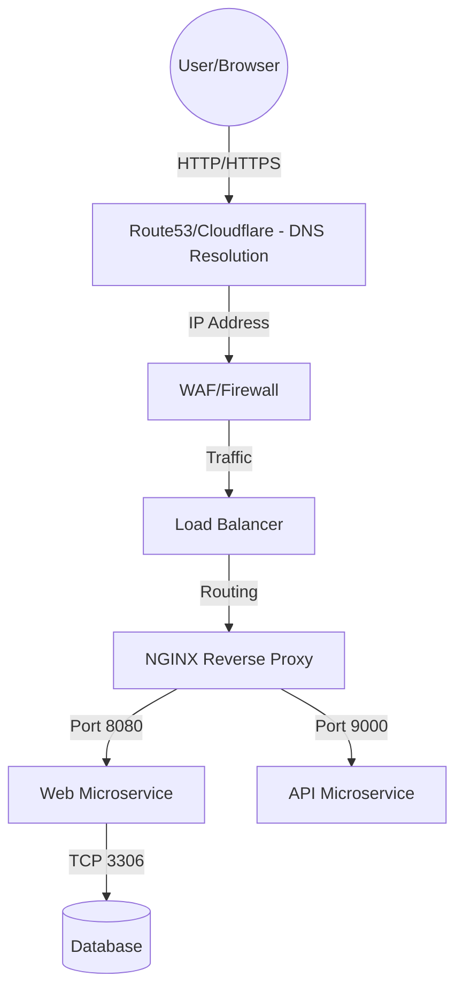
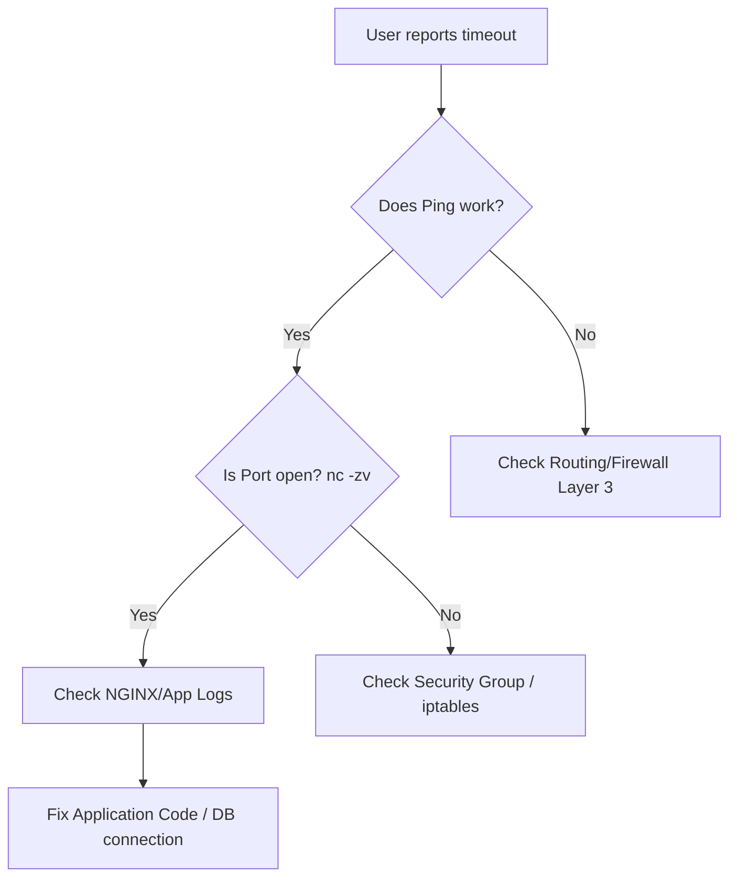

# LX-05 Networking for DevOps

> [!abstract]
> "It's always DNS." Networking DevOps ki foundation hai. Chaahe AWS VPC configure karna ho, Kubernetes mein Ingress setup karna ho, ya microservice communication troubleshoot karna ho, TCP/IP, DNS, TLS, aur routing ka deep knowledge hona bahut zaroori hai.

# Overview
**Ye kya hai?**
DevOps networking mainly Application aur Transport layers (OSI Layers 4-7) par focus karti hai. Ye decide karti hai ki data user ke browser se load balancer aur firewalls ke through container tak kaise travel karega. 

**Kyu use hota hai?**
Modern infrastructure highly distributed hoti hai. Ek single web request DNS, CDN, Load Balancer, aur reverse proxy ko cross karti hai. Jab issue aata hai, toh exactly pata hona chahiye ki kaunsi layer fail hui hai.

**Real life example:**
Jaise ek restaurant mein waiter (network) customer (client) ka order kitchen (server) tak le jata hai. Agar order delay hua, toh fault waiter ka ho sakta hai (network latency), raste mein koi rukaavat (firewall), ya kitchen ka (server down).

**Industry kaha use karti hai?**
Cloud security groups configure karne, NGINX/HAProxy setup karne, Route53 DNS manage karne, aur Kubernetes CNI debug karne ke liye.

**Architecture (OSI Layer 4-7 Focus):**


# Working
**Internal Working & Data Flow:**
DevOps environment mein jab ek request aati hai, wo TCP/IP protocol suite ka use karti hai. 
- **Layer 3 (Network):** IP routing hoti hai. Packets ek subnet se dusre subnet me jate hain.
- **Layer 4 (Transport):** TCP (reliable, 3-way handshake) ya UDP (fast, connectionless) ports assign hote hain (e.g., Port 443 for HTTPS, 3306 for MySQL).
- **Layer 7 (Application):** HTTP/HTTPS, DNS protocols kaam karte hain. TLS handshake hota hai security ke liye.

**Request Flow:**
1. Browser DNS se IP resolve karta hai.
2. TCP 3-way handshake (SYN, SYN-ACK, ACK) initiate hota hai.
3. TLS Handshake se connection secure hota hai.
4. HTTP GET/POST request send hoti hai.
5. Server response bhejta hai.

# Installation
Network tools aam taur par pre-installed aate hain ya package manager se easily install kiye ja sakte hain.
**Prerequisites:** Ubuntu/RHEL server, sudo privileges.

**Installation (Ubuntu):**
```bash
sudo apt update
sudo apt install net-tools iproute2 dnsutils tcpdump iptables ufw curl nmap openssl -y
```

**Verification:**
```bash
dig -v
tcpdump --version
```

# Practical Lab
**Step-by-step implementation: Investigating a network issue & securing it**

**Step 1: Check DNS Resolution**
Check karo ki website ka IP properly resolve ho raha hai ya nahi.
```bash
dig +short A google.com
```

**Step 2: Port Connectivity Test (CLI Method)**
Telnet ya Netcat se check karo ki port open hai ya firewall block kar raha hai.
```bash
nc -zv 8.8.8.8 53
# Expected Output: Connection to 8.8.8.8 53 port [tcp/domain] succeeded!
```

**Step 3: Packet Sniffing**
Live traffic ko capture karke dekho. Background mein kya chal raha hai.
```bash
sudo tcpdump -i eth0 port 80 -n
```

**Step 4: Block Malicious IP with Iptables**
Ek specific IP ko firewall level par block karna.
```bash
sudo iptables -A INPUT -s 103.45.67.89 -j DROP
```
Verify karo:
```bash
sudo iptables -L INPUT -v -n
```

# Daily Engineer Tasks
- **L1 Engineer:** Basic ping aur telnet checks karna, DNS records verify karna.
- **L2 Engineer:** Firewall rules (Iptables/UFW) manage karna, Load balancer endpoints check karna.
- **L3/Senior Engineer:** Complex routing issues solve karna, VPC peering, Kubernetes CNI debugging, TLS certificates renew/troubleshoot karna.
- **DevOps Engineer:** Infrastructure as Code (Terraform) se Security Groups aur Route53 manage karna.

# Real Industry Tasks
- **Real Ticket:** "Developers ko production DB (RDS) access nahi mil raha." -> Check Security Groups, Subnet routing tables, Bastion host SSH tunneling.
- **Change Request:** NGINX load balancer pe naya SSL certificate deploy karna bina downtime ke.
- **Migration:** On-premise DNS (BIND) ko AWS Route53 mein migrate karna.

# Troubleshooting
- **Symptom:** App server DB se connect nahi ho pa raha.
  - **Possible Cause:** Security Group port 3306 allow nahi kar raha.
  - **Investigation:** `nc -zv db-ip 3306` chalao. Agar timeout aaya, matlab firewall drop kar raha hai.
  - **Resolution:** AWS console ya Terraform mein jakar SG rule update karo.
- **Symptom:** Website 502 Bad Gateway de rahi hai.
  - **Possible Cause:** NGINX reverse proxy backend service se connect nahi kar pa raha. Backend down hai.
  - **Investigation:** Check backend service logs `systemctl status backend-app`.
  - **Resolution:** Backend application ko restart karo.

# Interview Preparation
**Basic:**
- **Q:** TCP aur UDP mein kya difference hai?
  - **A:** TCP reliable hai, 3-way handshake karta hai (HTTP, DBs). UDP connectionless hai, fast hai (DNS, Video streaming).

**Intermediate:**
- **Q:** A Record aur CNAME mein kya farq hai?
  - **A:** A Record domain ko direct IP (IPv4) se map karta hai. CNAME ek domain ko dusre domain (alias) pe point karta hai.

**Advanced / FAANG:**
- **Q:** Jab aap browser mein google.com type karte ho, tab network layer par practically kya hota hai? Explain step-by-step.
  - **A:** 
    1. Browser cache -> OS cache -> `/etc/hosts` -> DNS query.
    2. DNS server IP return karta hai.
    3. Browser port 443 par TCP 3-way handshake karta hai.
    4. TLS handshake hota hai (Client Hello, Server Hello, Key exchange).
    5. HTTP GET request encrypted tunnel ke through jati hai.
    6. Web server HTTP 200 OK aur HTML page return karta hai.

**Scenario Based:**
- **Q:** Ek private subnet me database hai jiska public IP nahi hai. Tum apne laptop se usme queries kaise chalaoge?
  - **A:** Main ek Bastion Host (Jump server) jo public subnet me hai, uske through SSH Tunneling (`ssh -L`) ya ProxyJump (`ssh -J user@bastion user@db`) ka use karunga.

# Production Scenarios
**Scenario: Website Down - 504 Gateway Timeout**
- **How to think:** Request NGINX tak pahunch rahi hai, but backend response aane mein bahut time le raha hai ya drop ho gaya.
- **Where to check:** NGINX error logs, Backend App server CPU/Memory, Database slow queries.
- **Commands:** 
  `tail -f /var/log/nginx/error.log`
  `top` (on app server)
- **Root Cause:** Database deadlock ya heavy query ki wajah se backend hang ho gaya, aur NGINX ka timeout trigger ho gaya.
- **Resolution:** Kill heavy query in DB, optimize code, increase timeout slightly as a temporary fix.

# Commands
| Command | Purpose | Syntax/Example | When to use | Danger Level |
|---|---|---|---|---|
| `ping` | Layer 3 connection check | `ping 8.8.8.8` | Is server reachable? | Low |
| `nc` | Layer 4 port check | `nc -zv 10.0.0.5 3306` | Is DB port open? | Low |
| `dig` | DNS lookup | `dig +short google.com` | DNS resolution check | Low |
| `curl` | HTTP/Layer 7 check | `curl -Iv https://api.com` | Check HTTP headers & SSL | Low |
| `netstat` | Check listening ports | `netstat -tulpn` | Which app is using port 80? | Low |
| `tcpdump` | Network packet capture | `tcpdump -i any port 443` | Deep network debug | Medium |
| `iptables`| Manage Linux firewall | `iptables -F` | Block/allow IPs | High (Can lock you out) |

# Cheat Sheet
- **TCP Handshake:** SYN -> SYN-ACK -> ACK
- **Important Ports:** 22 (SSH), 53 (DNS), 80 (HTTP), 443 (HTTPS), 3306 (MySQL), 5432 (Postgres), 6379 (Redis).
- **Files to know:** `/etc/hosts` (local DNS override), `/etc/resolv.conf` (DNS servers list).

# SOP & Runbook & KB Article
**SOP: Renewing Expired TLS Certificate**
- **Purpose:** Ensure secure HTTPS communication.
- **Procedure:** 
  1. Check expiry: `echo | openssl s_client -servername domain.com -connect domain.com:443 2>/dev/null | openssl x509 -noout -dates`
  2. Renew cert via certbot: `certbot renew`
  3. Reload reverse proxy: `systemctl reload nginx`
- **Validation:** Run the openssl command again to verify the new `notAfter` date.

# Best Practices & Beginner Mistakes
- **Best Practice:** Default deny all inbound traffic. Only allow specific IPs/Ports. (Zero Trust Network).
- **Best Practice:** Keep databases in private subnets. Use Bastion hosts.
- **Beginner Mistake:** Exposing database port (3306) to the internet (`0.0.0.0/0`) in Security Groups.
- **Impact:** Hackers brute-force DB password and drop tables or install ransomware.

# Advanced Concepts
**SSH Tunneling (Local Port Forwarding):**
Bina public IP ke secure service ko local pe access karna.
```bash
ssh -L 8080:localhost:80 user@bastion-server
# Ab browser mein localhost:8080 kholne se remote server ka web page dikhega.
```
**BGP & Anycast:** Cloudflare aur Route53 global load balancing ke liye Anycast DNS use karte hain jisse user ko nearest server se response mile.

# Related Topics & Flashcards & Revision
**Related:** 
- [[LX-04 OS Concepts for DevOps]]
- [[Master Index]]
- [[AWS VPC Basics]]

**Flashcards:**
- *Q: 3-way handshake ke 3 steps?* A: SYN, SYN-ACK, ACK.
- *Q: DNS port konsa use karta hai?* A: UDP 53 (aur kabhi kabhi TCP 53 zone transfers ke liye).

# Real Production Logs & Commands & Decision Tree
**Sample NGINX Access Log:**
```log
192.168.1.5 - - [27/Jun/2026:15:20:00 +0000] "GET /api/v1/users HTTP/1.1" 200 456 "-" "Mozilla/5.0"
```
- `192.168.1.5`: Client IP
- `GET`: HTTP Method
- `200`: HTTP Status (Success)

**Troubleshooting Decision Tree:**

