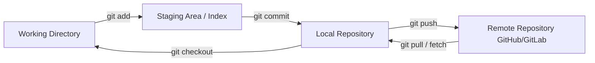

# Git Fundamentals

> [!abstract] 
> Git is the distributed version control system that underpins every modern DevOps workflow. From source code and Kubernetes manifests to Terraform states, everything starts with Git. This note covers Git internally, practically, and at a production level suitable for FAANG interviews and real-world DevOps tasks.

# Overview

**Ye kya hai?**
Git ek Distributed Version Control System (DVCS) hai. Ye aapke project files ka history track karta hai. Har change ka snapshot banta hai. Distributed ka matlab hai ki har developer ke laptop pe poore code history ki ek full local copy hoti hai. 

**Kyu use hota hai?**
Multi-developer collaboration ke liye. Agar code fat gaya ya galat deploy ho gaya, toh aap easily purane working version pe rollback (revert) kar sakte ho.

**Real life example:**
Samjho aap ek book likh rahe ho. Aapne Chapter 1 likha aur "Save" kiya. Phir kal Chapter 2 add kiya aur phir "Save" kiya. Git aapki book ke har save (commit) ki photo le leta hai, taaki agar Chapter 2 bekar lage, toh aap wapas Chapter 1 pe bina kisi loss ke jaa sako.

**Industry kaha use karti hai?**
- Application Code versioning (Java, Node.js, Python).
- Infrastructure as Code (Terraform, Ansible) tracking.
- GitOps (Kubernetes manifests manage karne ke liye, e.g., ArgoCD).

**Mermaid Diagram: Git Data Flow**


---

# Working

Git internally **diffs** save nahi karta, balki **snapshots** save karta hai. 

**Core Areas (Three Trees):**
1. **Working Directory:** Tumhara current workspace jaha tum code edit karte ho. (Kitchen)
2. **Staging Area (Index):** Woh jagah jaha tum changes ko "prep" karte ho commit ke liye. (Serving plate)
3. **Local Repo (.git folder):** Jaha Git permanently tumhare snapshots store karta hai. (Fridge)

**Git Internals (4 Objects):**
Git is essentially a Key-Value data store. Data is hashed using SHA-1 (40 character string).
- **Blob:** File ka actual data (no filename).
- **Tree:** Directory structure aur file names (pointers to blobs).
- **Commit:** Ek snapshot ka metadata (author, timestamp, pointer to Tree, pointer to parent commit).
- **Tag:** Ek human-readable pointer ek specific commit par (e.g., `v1.0`).

---

# Installation

**Prerequisites:**
Bas terminal access chahiye.

**Installation:**
- **Ubuntu/Debian:** `sudo apt install git`
- **RHEL/CentOS:** `sudo yum install git`
- **macOS:** `brew install git`
- **Windows:** Download Git Bash installer from git-scm.com.

**Configuration (One-time setup):**
```bash
git config --global user.name "Aapka Naam"
git config --global user.email "aapka@email.com"
git config --global init.defaultBranch main
git config --global core.editor vim
```
*Tip: `--global` settings `~/.gitconfig` mein save hoti hain, aur repo-level `.git/config` mein.*

**Verification:**
```bash
git --version
```

---

# Practical Lab

*Bina practice ke Git aayega nahi, chalo lab karte hain!*

**Pre-requisite: Lab Templates**
Aapke environment ko clean rakhne ke liye, main vault ke examples folder mein ready-made templates diye gaye hain:
- Standard `.gitignore`: [examples/02-Git/.gitignore](file:///C:/Users/SPTL/Documents/devops/devops/examples/02-Git/.gitignore)
- AWS Key Leak Prevention: [examples/02-Git/pre-commit](file:///C:/Users/SPTL/Documents/devops/devops/examples/02-Git/pre-commit)

**Step 1: Init & Add**
```bash
mkdir my-devops-project && cd my-devops-project
git init
# Ek .git hidden folder ban gaya hoga

# Standard practice: Pehle din hi .gitignore add karo
cp ../../examples/02-Git/.gitignore ./.gitignore

echo "# My Project" > README.md
git status # Dikhega ki README.md aur .gitignore untracked hain
git add .
# Ab files Staging area mein aa gayi
```

**Step 2: Commit & Hook Setup**
```bash
# Set up pre-commit hook to block AWS keys
cp ../../examples/02-Git/pre-commit .git/hooks/pre-commit
chmod +x .git/hooks/pre-commit

git commit -m "feat: initial commit with readme and gitignore"
# Ab local repo me save ho gaya
git log --oneline
```

**Step 3: Branching & Merging**
```bash
git checkout -b feature/auth
echo "def login(): pass" > auth.py
git add auth.py
git commit -m "feat: add login function"

git checkout main
git merge feature/auth
```

**Step 4: Remote Push**
```bash
git remote add origin https://github.com/user/my-devops-project.git
git push -u origin main
```

---

# Daily Engineer Tasks

- **L1/L2 Engineer:** Code clone karna, naya branch banana, code commit karke Pull Request (PR) raise karna. Basic merge conflicts resolve karna.
- **Senior/DevOps Engineer:** Branch protection rules set karna, `.gitignore` maintain karna, CI/CD triggers setup karna, git hooks (pre-commit) likhna, rebase aur complex history rewrites handle karna.

---

# Real Industry Tasks

**Task 1: Hotfix in Production**
Production me bug mila. Aap `main` branch se `hotfix/bug-123` branch banate ho. Fix karte ho, commit karke PR merge karte ho. Phir `git tag v1.0.1` lagake release trigger karte ho.

**Task 2: Cherry-Picking**
Aapne `develop` branch me ek feature banaya, but boss ne bola "Sirf woh specific commit `main` me dalo abhi". Aap us commit ki SHA id lete ho aur `main` branch me jaake `git cherry-pick <commit-hash>` run karte ho.

---

# Troubleshooting

**1. Merge Conflicts**
- **Symptoms:** `CONFLICT (content): Merge conflict in file.txt`
- **Root Cause:** Do alag logo ne same file ki same line ko edit kiya.
- **Resolution:**
  1. File open karo, conflict markers (`<<<<<<<`, `=======`, `>>>>>>>`) dhundo.
  2. Decide karo kiska code rakhna hai, markers delete karo.
  3. `git add file.txt`
  4. `git commit`

**2. Detached HEAD State**
- **Symptoms:** You are in 'detached HEAD' state.
- **Root Cause:** Aapne kisi branch ke badle ek specific commit id ya tag ko `git checkout` kar liya. HEAD direct commit point kar raha hai.
- **Resolution:** Agar us state me koi kaam kiya hai toh naya branch bana lo: `git checkout -b new-recovery-branch`. Agar galti se aaye the, toh wapas jao: `git checkout main`.

---

# Interview Preparation

### Top Interview Questions (Basic to FAANG Level)

**Basic (L1):**
1. **`git pull` aur `git fetch` me kya difference hai?**
   *Expected Answer:* `git fetch` sirf remote changes download karta hai (safe). `git pull` fetch karke aapke current branch ke sath automatically merge bhi kar deta hai (`pull = fetch + merge`).
2. **`git clone` vs `git fork`?**
   *Expected Answer:* `clone` ek git operation hai jo remote repo ko local machine pe copy karta hai. `fork` GitHub/GitLab ka concept hai jo server par ek repo ki copy aapke account me banata hai (cross-organization contributions ke liye).

**Intermediate (L2/L3):**
3. **`git merge` aur `git rebase` kab use kare?**
   *Expected Answer:* `merge` history preserve karta hai (creates merge commit). `rebase` history ko linear aur clean banata hai. *Golden rule: Kabhi bhi public/shared branch ko rebase mat karo, hamesha local branch ko main par rebase karke push karo.*
4. **Agar galti se wrong branch pe commit kar diya, toh kaise theek karoge?**
   *Expected Answer:* `git log` se commit hash lunga. Apni current branch se commit hatane ke liye `git reset --hard HEAD~1` (agar push nahi kiya hai). Phir sahi branch par jaunga `git checkout correct-branch` aur `git cherry-pick <commit-hash>` karunga.
5. **Dangling commit kya hota hai?**
   *Expected Answer:* Ek commit jiska koi reference (branch ya tag) nahi hai. Ye tab banta hai jab aap branch delete karte ho ya rebase/amend karte ho. Inhe `git gc` clean karta hai.

**Advanced/FAANG Scenario:**
6. **How does Git detect file changes internally? Does it check timestamps?**
   *Expected Answer:* Git file timestamps use karta hai as a heuristic in the `index` (staging area) speed ke liye, but exactly changes detect karne ke liye woh file ke content ka SHA-1 hash calculate karke purane blob hash se compare karta hai.
7. **What is the DAG in Git?**
   *Expected Answer:* Git history is a Directed Acyclic Graph (DAG) of commits. Commits hamesha apne parents point karte hain, backward. Branches are just lightweight movable pointers to these commits.
8. **Git-ops workflow mein, ArgoCD sync fail ho raha hai due to "diverged branches". Iska root cause kya ho sakta hai?**
   *Expected Answer:* Kisi ne remote repo pe `git push --force` kiya hai (sha badal gaya), jabki ArgoCD ki local cache purani history point kar rahi hai. ArgoCD ko hard refresh/sync karna padega.

**Top Production Issues:**
- **Leaked Secrets:** Galti se `.env` file push hona. Requires `git filter-repo` to rewrite history.
- **Merge Hell:** Do lambe-lived branches (e.g., `feature-A` aur `main`) jo mahino baad merge ho rahe hain. Solution: Frequent rebasing and Trunk Based Development.
- **Large Files Bloating Repo:** Kisi ne 500MB ki log file push kar di. Repository size itna badh gaya ki Jenkins clone timeout ho raha hai. Solution: `git-lfs` (Large File Storage) and BFG Repo-Cleaner.

---

# Production Scenarios

> [!CAUTION] Scenario: AWS Keys Leaked to GitHub
> **Situation:** Junior engineer ne galti se `.env` file push kar di jisme `AWS_ACCESS_KEY_ID` tha.
> **How to think:** GitHub delete kar dene se commit history se key nahi jati.
> **Action Plan:**
> 1. **Immediate:** AWS Console me jao aur us IAM user ki Access Key ko turant Inactivate/Delete karo. (Always kill the key first).
> 2. `.env` ko `.gitignore` me daalo.
> 3. Repo history se key delete karne ke liye `git filter-repo` ya `BFG Repo-Cleaner` use karo.
>    `java -jar bfg.jar --delete-files .env`
> 4. Repo ko force push karo: `git push origin --force --all`.
> 5. Security incident raise karo aur team ko bolo naya fresh clone lene.

---

# Commands

| Command | Purpose | Danger Level | Example |
|---|---|---|---|
| `git diff` | Working dir aur staging ke beech ka diff dikhata hai | Low | `git diff` |
| `git reset --soft` | Commit undo karta hai, changes Staging me rakhta hai | Medium | `git reset --soft HEAD~1` |
| `git reset --hard` | Commit undo karta hai + working dir ke changes UDA deta hai! | **High** | `git reset --hard HEAD~1` |
| `git revert` | Ek naya commit banata hai jo purane commit ko negate karta hai | Low | `git revert <commit-hash>` |
| `git stash` | Uncommitted kaam ko temporarily chhupa/save kar deta hai | Low | `git stash` aur baad me `git stash pop` |
| `git log --graph` | Visual representation of branches and commits | Low | `git log --oneline --graph --all` |

---

# Cheat Sheet

- **Stage all changes:** `git add .`
- **Commit with message:** `git commit -m "msg"`
- **Amend last commit:** `git commit --amend -m "new msg"` (Agar last commit me file add karna bhul gaye the).
- **Check commit history:** `git reflog` (Tumhara Git ka rescue plan. Har action track hota hai, git reset --hard bhi undo kar sakte ho yaha se).
- **Remove file from git tracking but keep locally:** `git rm --cached <file>`

---

# SOP & Runbook & KB Article

**SOP: Creating a Hotfix**
- **Purpose:** Resolve critical prod bug.
- **Procedure:**
  1. `git checkout main && git pull`
  2. `git checkout -b hotfix/issue-description`
  3. Fix bug & `git commit -m "fix: resolve issue"`
  4. Push and create PR to `main`.
- **Validation:** CI pipeline must pass tests.

**KB Article: Un-committing a mistake**
- **Problem:** Committed to wrong branch locally.
- **Resolution:**
  1. `git log` to verify.
  2. `git reset --soft HEAD~1` (Brings changes back to staging).
  3. `git stash`
  4. `git checkout correct-branch`
  5. `git stash pop`
  6. `git commit -m "correct msg"`

---

# Best Practices & Beginner Mistakes

**Best Practices:**
- Commits chhote aur logical (atomic) hone chahiye.
- Commit messages clear likho (Conventional Commits: `feat:`, `fix:`, `docs:`, `chore:`).
- Kabhi bhi secrets commit mat karo (Use Git-secrets pre-commit hooks or Trivy scanner).
- `.gitignore` day 1 par banalo (`node_modules`, `.env`, `.tfstate` must be ignored).

**Beginner Mistakes:**
- ❌ Direct `main` branch me push karna (Avoid this, always use PRs).
- ❌ Bade changes ek sath ek `git add .` aur `git commit -m "updates"` me daal dena.
- ❌ Merge conflicts darr ke repo ko delete karke dobara clone karna! (Instead, learn to use VSCode merge tool).

---

# Advanced Concepts

**Git Reflog:**
Time machine of Git. Normal `git log` aapko current branch ki history dikhata hai. But `git reflog` HEAD ke saare movements track karta hai. Agar aapne `git reset --hard` maar diya by mistake, reflog check karo, waha purana commit hash mil jayega, us hash pe dobara checkout kar lo. 

**Garbage Collection (`git gc`):**
Jab aap loose objects banate ho (detached states, deleted branches), Git unhe turant delete nahi karta. Time ke sath repo size badh sakta hai. `git gc` compress karta hai file objects ko into "packfiles" aur orphan objects ko delete karta hai (optimization).

---

# Related Topics & Flashcards & Revision

**Wiki Links:**
- [[00 DevOps Master Index]]
- [[GIT-02 Branching Strategies]]
- [[GIT-03 GitHub Advanced]]
- [[CI-01 Continuous Integration Concepts]]

**Flashcards:**
- *Q: What is the command to undo the last commit without losing changes?*
- *A: `git reset --soft HEAD~1`*
- *Q: Difference between git rm and git rm --cached?*
- *A: `git rm` deletes from disk and git tracking. `--cached` removes from tracking but keeps on disk.*

**Revision Schedule:**
- **5 Min:** Review Architecture and 3 Working areas.
- **15 Min:** Review `git revert` vs `git reset`, `merge` vs `rebase`.
- **Interview Prep:** Read the "Production Scenarios" and "Advanced Concepts" right before the DevOps interview.
