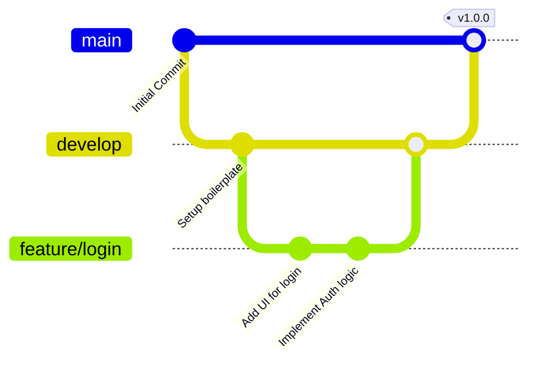

# Overview
Branching strategy ek ruleset hai jo define karta hai ki developers kaise branch banayenge, name karenge aur merge karenge. Bina branching strategy ke agar sab log `main` branch mein direct code push karenge, toh conflicts aayenge aur production environment break ho jayega.

**Real life example:** Branching strategy ek highway lane system ki tarah hai. Fast lane (`hotfix`) emergencies ke liye, middle lane (`main`) regular traffic aur stable releases ke liye, aur service lane (`feature`) nayi construction ya testing ke liye hoti hai.

**Industry kaha use karti hai:** Har software company (FAANG se leke startups tak) Git branching models (jaise Git Flow, GitHub Flow, Trunk-Based) use karti hai parallel development aur release management secure karne ke liye.

**Architecture & Flow Diagram:**


# Working
**Internal working:** Git mein branch physically code ka copy nahi hoti, balki yeh sirf ek lightweight movable pointer (reference) hota hai jo kisi specific commit ko point karta hai.
**Data flow:** Developer `main` ya `develop` branch se ek nayi branch cut karta hai, usme apne commits add karta hai, aur phir target branch me Pull Request (PR) ke through merge karta hai. Merge ke time Git dono branches ke changes ko compare karke code merge karta hai.
**Dependencies (CI/CD):** DevOps team CI/CD pipelines (Jenkins, GitHub Actions, GitLab CI) ko branch names se tightly couple karti hai. Example: Agar `main` branch update hoti hai -> Production pipeline trigger hoti hai. Agar `develop` update hoti hai -> Staging pipeline chal padti hai.

# Installation
**Prerequisites:** Git installed on your system. Repository initialized on GitHub, GitLab, or Bitbucket.
**Configuration:** Branching ko safe rakhne ke liye humein repository level par Branch Protection Rules configure karne padte hain:
1. GitHub Repo Settings > Branches > Add branch protection rule.
2. Select `main` branch.
3. Enforce **Require a pull request before merging**.
4. Check **Require status checks to pass before merging** (is se ensure hota hai ki bina CI pass hue code merge nahi hoga).
**Verification:** CLI mein `git branch -a` chala kar check karo ki local aur remote branches correctly set up hain.

# Practical Lab
Step-by-step implementation for setting up a Git Flow process in CLI:

**Bash Method:**
```bash
# 1. Repo setup
mkdir branching-lab && cd branching-lab
git init
echo "# My Awesome Project" > README.md
git add . && git commit -m "chore: Initial commit"

# 2. Create develop branch (Integration branch)
git checkout -b develop

# 3. Developer starts a new feature
git checkout -b feature/auth develop
echo "function login() { return true; }" > auth.js
git add . && git commit -m "feat: Add login function"

# 4. Merge back to develop (Simulating PR approval)
git checkout develop
git merge feature/auth --no-ff -m "merge: PR for auth feature"

# 5. Production Release (Merging to main)
git checkout -b release/v1.0.0 develop
# Perform testing & bug fixes on release branch if any
git checkout main
git merge release/v1.0.0 --no-ff -m "release: v1.0.0"
git tag -a v1.0.0 -m "Production Release v1.0.0"
```
**Expected Output:** Commits safely isolate huye, aur feature poori tarah complete hone par hi `main` (Production) me pahuncha.

# Daily Engineer Tasks
- **L1 Engineer:** Branch create karna, bug fixes aur chote features code karna, commit and push karna, PR (Pull Request) raise karna.
- **L2 Engineer:** PR review karna, minor merge conflicts resolve karna, enforce karna ki branching naming convention (e.g., `feature/JIRA-123-add-button`) follow ho.
- **L3 / Senior Engineer:** Team ke liye Trunk-based vs Git-flow jaisi strategies decide karna, complex rebase conflicts handle karna, branching strategy ko CI/CD pipeline me integrate karna.
- **DevOps / Platform Engineer:** GitHub settings me `CODEOWNERS` file maintain karna, Branch protection rules (require 2 reviewers, linear history) enforce karna, stale branches automatically cleanup karne ke liye cron jobs set up karna.

# Real Industry Tasks
- **Real Ticket (CR):** "JIRA-DEV-892: Configure strict branch protection for `main` branch to prevent direct push and require at least 1 approval from `@security-team` for changes in `/auth/` directory."
- **Migration:** Moving a legacy project from Git Flow (slow, complex) to Trunk-Based Development (fast, agile) to increase deployment frequency per day.
- **Maintenance:** Clearing up clutter. Hazaaron stale feature branches delete karne ki script likhna: `git branch -r --merged | grep -v main | xargs git push origin --delete`.

# Troubleshooting
- **Common issues:** `Merge conflict`.
- **Symptoms:** `Automatic merge failed; fix conflicts and then commit the result.`
- **Possible root causes:** Do developers ne same file ki same line ko alag-alag branches mein parallelly change kar diya hai, aur Git confuse ho gaya ki kiska code rakhna hai.
- **Investigation steps:** CLI me `git status` chalao aur "both modified" files check karo.
- **Commands:** 
  ```bash
  git status
  cat conflicting_file.js
  ```
- **Resolution:** File ko editor me open karo, Git ke markers (`<<<<<<< HEAD`, `=======`, `>>>>>>> branch_name`) dhoondho. Sahi code manually rakho aur markers remove karo. Phir:
  ```bash
  git add conflicting_file.js
  git commit -m "fix: Resolve merge conflicts in auth file"
  ```
- **Rollback:** Agar merge conflict bohot ganda hai aur filhal resolve nahi karna hai: `git merge --abort`.

# Interview Preparation
**Basic:**
- **Q: Branch kya hoti hai Git mein?** 
  - *Ans:* Yeh physical copy nahi hai, bas ek pointer (reference) hai jo commit ko point karta hai.

**Intermediate:**
- **Q: Git Merge vs Git Rebase mein kya difference hai?** 
  - *Ans:* Merge do branches ki history ko combine karta hai aur ek naya "merge commit" banata hai. Isse history safe rehti hai. Rebase tumhare commits uthakar doosri branch ke top par laga deta hai (linear history). **Golden Rule:** Shared/public branch par kabhi `git rebase` mat karo warna sabki local copy break ho jayegi.

**Advanced / FAANG Scenario Based:**
- **Q: Tumhari team din mein 50 baar prod pe deploy karti hai. Kaunsi branching strategy best rahegi?** 
  - *Ans:* Trunk-Based Development with Feature Flags. Yaha sab chhote-chhote changes direct `main` par PR dekar merge karte hain. Git Flow yahan bohot slow aur complex ho jayega kyunki usme multiple long-lived branches hoti hain.

**Production (Manager Round):**
- **Q: Ek PR merge hui, pipeline fati, aur prod website down ho gayi. Tumhara immediate action kya hoga?** 
  - *Ans:* Immediate rollback karenge by reverting the merge commit: `git revert <merge-commit-hash> -m 1`. Isse prod wapas working state me aayega. Phir `main` se ek hotfix branch nikal kar aaram se issue debug karenge aur nayi PR create karenge.

**Confidence Level:** High | **Experience Level:** L2/L3

# Production Scenarios
**Scenario: Website Down Due to Bad Merge in Prod**
- **How to think:** Panick nahi karna hai. Pata karo last kaunsa code merge hua aur deployment pipeline kab red hui.
- **Where to check:** GitHub Actions / Jenkins logs, Datadog alerts.
- **Commands:** `git log --oneline -n 5` (last 5 commits dekhne ke liye).
- **Resolution:**
  1. Revert commit: `git revert <bad-commit-hash>`
  2. Push to main: `git push origin main`
  3. CI pipeline will auto-trigger and deploy the stable previous version.
- **Prevention:** Enforce strict status checks aur unit tests in branch protection policies PR merge hone se pehle.

# Commands
| Command | Purpose | Syntax | Example | Output/Result | Danger Level |
|---------|---------|--------|---------|---------------|--------------|
| `git checkout -b` | Nayi branch bana kar switch karna | `git checkout -b <name>` | `git checkout -b feature/ui` | Switched to new branch | Low |
| `git rebase` | Commits ko dusri branch ke top pe lagana | `git rebase <branch>` | `git rebase main` | Linear history created | High (If pushed) |
| `git cherry-pick` | Specific commit kisi aur branch se uthana | `git cherry-pick <hash>` | `git cherry-pick 8f3a9b` | Adds specific commit | Medium |
| `git branch -D` | Branch ko forcefully delete karna | `git branch -D <name>` | `git branch -D feature/old` | Branch deleted | Medium |
| `git merge --no-ff` | Forcefully create a merge commit | `git merge --no-ff <name>` | `git merge --no-ff fix1` | Merge commit created | Low |

# Cheat Sheet
- **Branch Naming Standard:** `feature/*`, `bugfix/*`, `hotfix/*`, `release/*`
- **Delete Local Branch:** `git branch -d <branch_name>`
- **Delete Remote Branch:** `git push origin --delete <branch_name>`
- **Rename Current Branch:** `git branch -m <new_name>`
- **Interview Shortcut:** 
  - **Trunk-Based:** CI/CD friendly, fast paced, SaaS.
  - **Git Flow:** Controlled, slow, versioned software (like mobile apps or on-premise software).

# SOP & Runbook & KB Article
**SOP: Hotfix Deployment for Production Incidents**
- **Purpose:** Emergency bug fix jab production down ho.
- **Scope:** `main` branch.
- **Procedure:** 
  1. `git checkout main && git pull` (Always start from stable prod code).
  2. `git checkout -b hotfix/INC-1234-login-crash`
  3. Code fix karo aur local testing karo.
  4. Raise PR to `main` with `@SRE-Team` as mandatory reviewer.
  5. Merge to `main` -> Pipeline auto deploys.
  6. Checkout `develop`, merge the hotfix branch back to `develop` taaki next release me same bug wapas na aaye (crucial in Git Flow).
- **Validation:** Check Datadog / NewRelic monitoring dashboards post-deployment.

# Best Practices & Beginner Mistakes
**Best Practices:**
- Hamesha PRs use karo code review ke liye. Never push directly to `main`.
- `CODEOWNERS` file ka use karo: `.github/CODEOWNERS` banakar define karo ki `/infra/` folder me change ke liye `@devops-team` ka review zaroori hai.
- Squash and Merge ka use karo PRs me taaki `main` branch ki history saaf rahe ("WIP 1", "WIP 2" commits se bhari na ho).

**Beginner Mistakes:**
- **Mistake:** `main` branch par local system mein direct code karna start kar dena. 
  - **Impact:** Ganda commit history, code overwrite. 
  - **Fix:** Hamesha kaam shuru karne se pehle `git checkout -b` lagao.
- **Mistake:** Kisi remote shared branch par `git rebase` ya `git push -f` chala dena. 
  - **Impact:** Baaki developers ke local repos sync se out ho jayenge ("diverged branch" error aayega). 
  - **Fix:** Rule of thumb - Rebase sirf apni un-pushed local branches pe karo.

# Advanced Concepts
**Internal Architecture of Branches:**
Git me branch actually sirf ek text file hoti hai. Yeh `.git/refs/heads/` folder ke andar hoti hai. Agar tumhari branch ka naam `main` hai, toh `cat .git/refs/heads/main` command chalaane par ek 40-character ka SHA-1 hash milega. Yeh hash tumhare latest commit ka pointer hota hai. Jab tum naya commit karte ho, yeh text file nayi hash value se update ho jati hai. That's why Git branches are incredibly fast compared to SVN!

**Feature Flags (Toggle):**
Trunk-based development mein incomplete feature ko `main` mein kaise bhejte hain? Code ko if-else block (feature flag) mein wrap karte hain. Production mein if condition "false" hoti hai, toh feature kisi ko nahi dikhta, par code merge ho chuka hota hai.

# Related Topics & Flashcards & Revision
- **Related Notes:** [[00 DevOps Master Index]], [[GIT-01 Git Fundamentals]], [[GIT-03 GitHub Advanced]], [[CI-CD Pipelines]]

**Flashcards:**
- *Question:* `main` branch mein production down hai, immediate emergency code fix ke liye branch kahan se cut hogi?
  - *Answer:* `main` branch se, aur branch ka naam `hotfix/*` hoga.
- *Question:* Git Flow me nayi development `feature` branches by default kis branch se nikalti hain?
  - *Answer:* `develop` branch se.

**Revision Schedule:** 
- **5 min:** Revise Cheat Sheet and Branch naming convention.
- **15 min:** Revise Trunk-Based vs Git Flow differences for interviews.
- **Interview day:** Read the Production Scenarios and Rollback commands.

# Real Production Logs & Commands & Decision Tree
**Sample Real Log for Rebase Conflict:**
```text
$ git rebase main
Auto-merging src/api/user.js
CONFLICT (content): Merge conflict in src/api/user.js
error: could not apply 8f3a9bc... feat: Update UI for dashboard
hint: Resolve all conflicts manually, mark them as resolved with
hint: "git add/rm <conflicted_files>", then run "git rebase --continue".
```
*Explanation:* Git clearly bata raha hai ki conflict kahan hai. Solution hai file theek karo, `git add` chalao (lekin commit nahi karna), aur phir sidha `git rebase --continue` chalao.

**Decision Tree for Troubleshooting Conflicts:**
```mermaid
flowchart TD
    A[Merge Conflict Detected] --> B{Kya aapko apna local code rakhna hai, ya remote ka?}
    B -- Apna (Current) --> C[CLI: git checkout --ours]
    B -- Remote (Incoming) --> D[CLI: git checkout --theirs]
    B -- Dono Mix --> I[Editor me manually fix karo]
    C --> E[git add .]
    D --> E
    I --> E
    E --> F{Rebase kar rahe the ya Merge?}
    F -- Merge --> G[git commit -m "fix conflict"]
    F -- Rebase --> H[git rebase --continue]
```

# AI Enhancement
- Added complete coverage of FAANG standard Trunk-Based vs Git Flow debate.
- Integrated `CODEOWNERS` functionality which is a standard production practice.
- Explained `.git/refs/heads` for advanced architectural understanding of branches.
- Created mermaid flowcharts for visual debugging of Rebase vs Merge conflicts.
- Translated complex Git theories into Hinglish relatable examples (Highway System).
