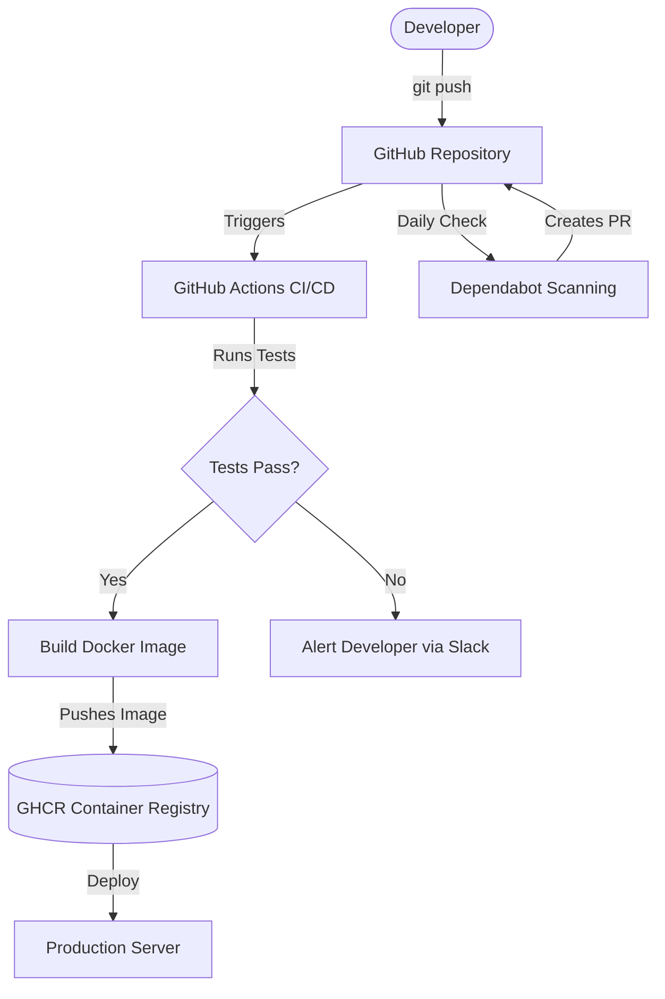

# Overview
**Ye kya hai?** GitHub sirf ek code repository nahi hai. Ye ek pura DevOps ecosystem hai. Isme CI/CD (GitHub Actions), Container Registry (GHCR), Security Scanning, aur Project Management sab in-built aata hai.
**Kyu use hota hai?** Taaki external tools jaise Jenkins, CircleCI ya SonarQube pe depend na hona pade. Code likhne se lekar deploy karne tak ka saara kaam ek hi platform par ho jaye.
**Real life example:** Socho aapko ek pizza delivery app banani hai. Code GitHub pe rakha. Jaise hi developer naya code push karta hai, GitHub ka "robot" (GitHub Actions) automatically usko test karta hai, container image banata hai, aur server pe bhej deta hai.
**Industry kaha use karti hai?** Microsoft, Netflix, aur almost har modern startup apna pura SDLC (Software Development Life Cycle) GitHub ke andar manage karte hain.



# Working
**Internal working & Data Flow:**
1. **GitHub Actions:** Jab bhi koi event hota hai (jaise push, PR create hona), GitHub `.github/workflows/` folder mein rakhi YAML files padhta hai. Iske baad ek VM (Runner) provision hota hai (jaise ubuntu-latest) aur steps sequentially execute hote hain.
2. **GHCR (GitHub Container Registry):** Docker images store karne ke liye registry. Ye standard OCI images support karti hai.
3. **Dependabot:** Ye automatically aapke `package.json` ya `requirements.txt` ko read karta hai. Agar koi dependency purani hai ya usme security issue hai (CVE), to ye automatically ek PR raise kar deta hai.

# Installation
GitHub cloud-based (SaaS) hai, to installation ki zarurat nahi hoti. Lekin local development ke liye `gh` CLI install karna padta hai.
**Prerequisites:** Git installed hona chahiye aur ek GitHub account.
**Installation (GitHub CLI - `gh`):**
- Windows (PowerShell): `winget install --id GitHub.cli`
- Linux (Ubuntu): `sudo apt install gh`
- Mac (Homebrew): `brew install gh`

**Configuration & Verification:**
```bash
# Login to GitHub via CLI
gh auth login

# Check status
gh auth status
```

# Practical Lab
**Scenario:** Ek Node.js app setup karna aur uske liye GitHub Actions workflow banana.

**Step 1: Setup Repository**
```bash
# Naya repo banaye
mkdir my-devops-app && cd my-devops-app
git init
echo "console.log('Hello GitHub Actions');" > app.js
git add app.js
git commit -m "Initial commit"
gh repo create my-devops-app --public --source=. --push
```

**Step 2: Create GitHub Actions Workflow**
```bash
mkdir -p .github/workflows
cat << 'EOF' > .github/workflows/ci.yml
name: Node.js CI
on:
  push:
    branches: [ "main" ]
  pull_request:
    branches: [ "main" ]

jobs:
  build:
    runs-on: ubuntu-latest
    steps:
    - uses: actions/checkout@v4
    - name: Use Node.js
      uses: actions/setup-node@v4
      with:
        node-version: '20.x'
    - run: npm install
    - run: npm test
EOF
git add .github/workflows/ci.yml
git commit -m "Add CI pipeline"
git push origin main
```

**Expected Output:** GitHub portal pe Actions tab mein jayenge to "Node.js CI" run hota hua dikhega.

# Daily Engineer Tasks
- **L1 Engineer:** PR review karna, failed workflows ke logs check karna.
- **L2 Engineer:** GitHub CLI use karke repo manage karna, issues aur projects boards update karna.
- **L3/Senior Engineer:** Complex CI/CD YAML likhna, matrix builds configure karna, caching lagana pipeline fast karne ke liye.
- **Production Engineer/DevOps:** Custom Runners (Self-hosted runners) deploy karna, enterprise-level security aur branch protection policies enforce karna.

# Real Industry Tasks
- **Migration:** GitLab CI ya Jenkins se pipelines ko GitHub Actions YAML mein convert karna.
- **Maintenance Work:** Purane workflow actions (e.g., `actions/checkout@v2` se `v4`) ko upgrade karna taaki deprecation warnings hat jaye.
- **Security:** Secrets ko GitHub Secrets ya HashiCorp Vault mein secure karna taaki code mein expose na ho.
- **Patch Management:** Dependabot enable karna taaki Node.js aur Python packages auto-update hote rahein.

# Troubleshooting
- **Issue:** Workflow fail ho raha hai `Error: Resource not accessible by integration`.
  - **Symptoms:** Action GITHUB_TOKEN ka use karke PR create ya package publish karne ki koshish kar raha hai.
  - **Root Cause:** Token ke paas `write` permission nahi hai.
  - **Resolution:** Workflow file mein `permissions:` block add karo.
    ```yaml
    permissions:
      contents: write
      pull-requests: write
    ```
- **Issue:** Self-hosted runner offline dikha raha hai.
  - **Investigation Steps:** Runner VM pe SSH karo aur `journalctl -u actions.runner.*` logs check karo. Service daemon check karo `systemctl status actions.runner`.

# Interview Preparation
- **Basic:** GitHub Actions kya hai aur ye Jenkins se kaise different hai?
  - *Ans:* Actions natively GitHub mein integrated hai, isme YAML use hoti hai aur repo level events (issues, PRs) pe trigger ho sakta hai.
- **Intermediate:** Matrix build strategy kya hoti hai Actions mein?
  - *Ans:* Agar mujhe apna code multiple Node.js versions (16, 18, 20) aur multiple OS (Ubuntu, Windows) pe ek sath test karna ho, to matrix use karte hain taaki parallel jobs run ho sakein.
- **Advanced / Scenario Based:** Aapka CI pipeline 20 minutes le raha hai. Ise fast kaise karoge?
  - *Ans:* 1) Dependencies ko cache karunga (`actions/cache`). 2) Heavy jobs ko parallel run karunga matrix/strategy lagake. 3) Sirf modified files pe tests run karunga. 4) Lightweight base image use karunga Docker ke liye.

# Production Scenarios
- **Scenario: Production Deploy Fail & Rollback**
  - **How to think:** Ghabrana nahi hai. Sabse pehle production environment revert karna hai, uske baad root cause check karna hai.
  - **Actions:** GitHub pe `gh run list` check karo. Pata lagao konsa commit deploy hua tha. Previous stable commit pe jaake hotfix branch banao ya previous workflow run ko re-run (rollback) karo.
  - **Root Cause:** Naye commit mein DB connection string missing thi.

# Commands
| Command | Purpose | Syntax/Example | Danger Level |
|---------|---------|----------------|--------------|
| `gh auth login` | Authenticate CLI | `gh auth login` | Low |
| `gh pr create` | Terminal se direct PR banana | `gh pr create --title "Fix bug" --body "Details"` | Low |
| `gh run list` | Workflow runs dekhna | `gh run list --workflow=ci.yml` | Low |
| `gh run view` | Failed workflow logs check karna | `gh run view 123456 --log-failed` | Low |
| `gh secret set` | Secret add karna | `gh secret set MY_KEY -b "value"` | Medium |

# Cheat Sheet
- **Workflows Path:** `.github/workflows/*.yml`
- **Dependabot Path:** `.github/dependabot.yml`
- **Context Variables:** `${{ github.actor }}`, `${{ secrets.MY_SECRET }}`, `${{ env.VAR_NAME }}`
- **Common Triggers:** `on: [push, pull_request, schedule, workflow_dispatch]`

# SOP & Runbook & KB Article
**SOP: Adding a New Secret to GitHub Repo**
- **Purpose:** Securely store API keys.
- **Procedure:** Repo Settings -> Secrets and variables -> Actions -> New repository secret. Name the secret in UPPERCASE (e.g., `AWS_ACCESS_KEY_ID`). Paste the value.
- **Validation:** Run a test workflow that uses the secret (ensure it echoes as `***`).

**Runbook: Pipeline is stuck in "Queued" state**
- **Detection:** Developer complains PR is not merging because checks are pending.
- **Investigation:** Check if it's a GitHub-hosted runner outage (githubstatus.com) or if self-hosted runners are full/offline.
- **Resolution:** If self-hosted, spin up more runners or restart the runner service.

# Best Practices & Beginner Mistakes
- **Best Practice:** Hamesha pinned versions (e.g., `@v4`) ya specific commit SHA use karo third-party actions ke liye taaki unpected changes se break na ho.
- **Beginner Mistake:** `GITHUB_TOKEN` aur Personal Access Token (PAT) mein confuse hona. Hamesha workflow ke andar default `GITHUB_TOKEN` use karo jab tak external cross-repo access ki zarurat na ho.
- **Security:** Dependabot aur branch protection rules (require passing status checks) hamesha on rakhein.

# Advanced Concepts
- **Reusable Workflows:** Ek central repo banake usme standard CI YAML rakhna jise baki saari microservices apni workflow se `uses: my-org/central-repo/.github/workflows/ci.yml@main` karke call kar sakein.
- **OIDC (OpenID Connect):** AWS ya Azure authenticate karne ke liye lambe time tak chalne wale secrets store karne ki jagah, OIDC identity token use karna. Isse short-lived temporary credentials generate hote hain jo zyada secure hain.

# Related Topics & Flashcards & Revision
- **Related Topics:** [[GIT-01 Git Fundamentals]], [[Jenkins Basics]], [[Docker Advanced]]
- **Flashcard:** 
  - Q: Manual workflow trigger karne ke liye kya use hota hai?
  - A: `workflow_dispatch` trigger.
