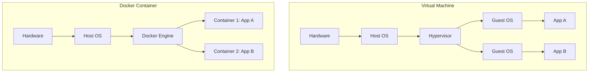
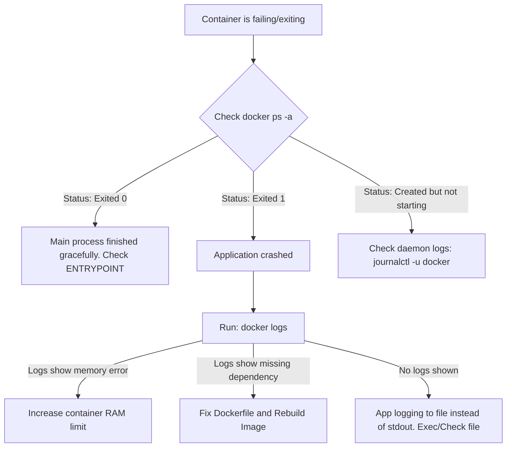

# DOC-01 Docker Fundamentals

> [!important]
> **God Mode Vault**: This is a premium, production-ready guide to Docker fundamentals. It covers everything from beginner concepts to FAANG-level interview questions, troubleshooting, and daily operations.

## # Overview

**Ye kya hai?**
Docker ek open-source platform hai jo applications ko "containers" ke andar package karta hai. Container ke andar application ka code, libraries, dependencies aur configuration sab kuch ek single unit mein lock ho jata hai. 

**Kyu use hota hai?**
DevOps mein ek universal problem hoti thi: *"It works on my machine, but not in production"*. Developer apne laptop pe code banata hai jahan Python 3.9 installed hai. Server par Python 3.6 hai, toh code wahan fat (crash) jata hai. Docker is problem ko completely khatam kar deta hai kyunki application apni khud ki environment (container) ke sath travel karti hai.

**Real life example / Simple Analogy:**
Socho ki goods (samaan) ship se bhejna hai. Pehle log alag-alag type ka samaan (cars, grains, clothes) alag-alag tarah se pack karte the. Phir **Shipping Container** invent hua. Ab sab kuch ek standard steel box (container) mein jata hai. Chahe andar car ho ya kapde, ship ko, crane ko, aur truck ko farq nahi padta. Woh bas us container ko utha kar rakh dete hain.
Docker exactly yahi karta hai software ke liye. Chahe Java app ho ya Node.js, server bas us 'Docker Container' ko run karta hai.

**Industry kaha use karti hai? / Real production use-case:**
- **Microservices Deployment:** Har service (User API, Payment API) apne separate container mein run hoti hai.
- **CI/CD Pipelines:** Jenkins ya GitHub Actions me code test karne ke liye temporary containers spin up hote hain.
- **Kubernetes Base:** Kubernetes (K8s) internally mostly Docker/containerd containers ko hi orchestrate (manage) karta hai.

**Architecture Diagram (VM vs Container):**


---

## # Working

**Internal working:**
Docker VM (Virtual Machine) nahi hai. VM pura ek naya Operating System (Guest OS) boot karta hai (jo heavily resource consume karta hai). Docker bas Linux kernel ke 2 features use karta hai:
1. **Namespaces:** Isolation provide karta hai (Process, Network, Mount). Ek container ko lagta hai uske paas apna private OS hai.
2. **Cgroups (Control Groups):** Resources limit karta hai. (Taki ek container 100% CPU ya RAM na kha jaye).

**Architecture Components:**
- **Docker Client:** Command line (`docker run`, `docker pull`). Ye Docker Daemon se baat karta hai.
- **Docker Daemon (`dockerd`):** Host machine par background process. Yahi actual mein containers banata aur run karta hai.
- **Docker Registry:** Jaha Docker Images store hoti hain (e.g., Docker Hub, AWS ECR, Azure ACR).

**Data flow & Request flow:**
Jab aap `docker run nginx` type karte ho:
1. Client Daemon ko API call bhejta hai.
2. Daemon check karta hai: "Kya nginx image local mein hai?"
3. Agar nahi, toh wo Registry (Docker Hub) se pull karta hai.
4. Daemon image se ek read-write layer add karke process start kar deta hai (Container).

**Ports & Protocols:**
- Docker Daemon API default Unix socket pe listen karta hai: `/var/run/docker.sock`
- Agar remote access enable kiya, toh TCP Port: `2375` (HTTP) ya `2376` (HTTPS).

---

## # Installation

**Prerequisites:** 
Linux Host (Ubuntu/CentOS), Internet connection, Root ya Sudo access.

**Installation (Ubuntu):**
```bash
# Update repo and install dependencies
sudo apt-get update
sudo apt-get install ca-certificates curl gnupg

# Add Docker's official GPG key
sudo install -m 0755 -d /etc/apt/keyrings
curl -fsSL https://download.docker.com/linux/ubuntu/gpg | sudo gpg --dearmor -o /etc/apt/keyrings/docker.gpg
sudo chmod a+r /etc/apt/keyrings/docker.gpg

# Setup the repository
echo \
  "deb [arch="$(dpkg --print-architecture)" signed-by=/etc/apt/keyrings/docker.gpg] https://download.docker.com/linux/ubuntu \
  "$(. /etc/os-release && echo "$VERSION_CODENAME")" stable" | \
  sudo tee /etc/apt/sources.list.d/docker.list > /dev/null

# Install Docker Engine
sudo apt-get update
sudo apt-get install docker-ce docker-ce-cli containerd.io docker-buildx-plugin docker-compose-plugin
```

**Configuration:**
User ko docker group mein add karo taaki har baar `sudo` na lagana pade:
```bash
sudo usermod -aG docker $USER
newgrp docker
```

**Verification:**
```bash
docker version
docker run hello-world
```

---

## # Practical Lab

**Step-by-step implementation (Deploying a Web Server):**

**CLI Method (Bash):**
1. Nginx web server run karna background me (`-d`), port 80 ko 8080 par map karte hue:
```bash
docker run -d --name my-website -p 8080:80 nginx:latest
```
*Expected Output:* Ek long hash ID print hogi (e.g., `e4b8...`).

2. Check running containers:
```bash
docker ps
```
*Expected Output:* Nginx container UP state me dikhega with port mapping `0.0.0.0:8080->80/tcp`.

3. Container ke andar enter karna (Exec):
```bash
docker exec -it my-website /bin/bash
```
*Andar jane ke baad index.html change karna:*
```bash
echo "<h1>Welcome to God Mode DevOps Vault</h1>" > /usr/share/nginx/html/index.html
exit
```

**Verification:** Browser me `http://localhost:8080` kholo, customized webpage dikhega.

---

## # Daily Engineer Tasks

- **L1 Engineer:** `docker ps` run karna, crashed containers start karna, `docker logs` check karke developers ko bhejna.
- **L2 Engineer:** Dockerfiles likhna, volumes mount karna, port conflicts solve karna, basic compose files manage karna.
- **L3 Engineer / Senior Engineer:** Custom internal base images banana, CI/CD pipeline me Docker build integrate karna, Image vulnerability scanning (Trivy) fix karna.
- **Production/Cloud/SRE:** Docker daemon performance tune karna, cgroup CPU/Memory limits define karna, AWS ECR lifecycle policies banana, container orchestrators (K8s) me transition manage karna.

---

## # Real Industry Tasks

- **Real tickets:** "Developer says unka code local chal raha hai par staging me crash ho raha hai." (Resolution: Rebuild image caching clear karke).
- **Real maintenance work:** Disk space full ho gayi `/var/lib/docker` pe. Purane unused images ko safely prune karna.
- **Patch management:** Host OS pe Docker engine version ko `24.0.x` se `26.0.x` par upgrade karna with minimal container downtime.
- **Production validation:** High-traffic container me `docker stats` monitor karna memory leaks ke liye.

---

## # Troubleshooting

**Common Issue 1: `port is already allocated`**
- **Symptoms:** Container start fail ho jata hai.
- **Possible root causes:** Host par port 8080 koi aur process (shayad dusra container ya local service) use kar raha hai.
- **Investigation steps / Commands:**
  ```bash
  sudo netstat -tulpn | grep 8080
  # Ya fir
  lsof -i :8080
  ```
- **Resolution:** Purane process ko kill karo, ya apne naye container ki mapping change karo: `docker run -p 8081:80`.

**Common Issue 2: Container Starts and Immediately Exits (Status: Exited (0))**
- **Symptoms:** `docker ps` me nahi dikhta, `docker ps -a` me Exited dikhta hai.
- **Possible root causes:** Docker container tabhi tak zinda rehta hai jab tak uska PID 1 (main foreground process) zinda ho. Agar wo script ek second me khatam ho jaye, toh container band ho jata hai.
- **Resolution:** Agar Ubuntu/Alpine image run kar rahe ho just to keep it alive, usme `-itd` flags use karo, ya long running command daalo (`tail -f /dev/null`).

---

## # Production Scenarios

### Scenario: Disk Full on Docker Host
**How to think:** Docker bahut aggressively disk space consume karta hai (dangling images, exited containers, huge log files). Server down jaa sakta hai.
**Where to check:** Check disk space: `df -h /var/lib/docker`
**Commands:**
```bash
# Check Docker disk usage breakdown
docker system df

# Clean up unused dangling images, exited containers, and networks
docker system prune -a --volumes -f
```
**Logs/Root Cause:** Container JSON logs (`/var/lib/docker/containers/*/*.log`) Gigabytes ke ho gaye hain kyunki log rotation setup nahi tha.
**Prevention:** `daemon.json` me log-driver aur max-size configure karo.

---

## # Commands

| Command | Purpose | Syntax/Example | Output / When to use | Danger Level |
|---------|---------|----------------|----------------------|--------------|
| `docker run` | Create and start container | `docker run -d -p 80:80 nginx` | Use to deploy new app | Low |
| `docker ps -a` | List all containers | `docker ps -a` | Debugging stopped containers | Low |
| `docker exec` | Run command in running container | `docker exec -it my-app bash` | For live debugging inside container | Medium (Don't change code directly) |
| `docker logs -f` | Tail container logs | `docker logs -f my-app` | When app is throwing 500 errors | Low |
| `docker system prune` | Clean up Docker | `docker system prune -a --volumes` | Disk space alert | **HIGH** (Can delete needed stopped containers) |
| `docker inspect` | Deep dive into container config | `docker inspect <container_id>` | To find container IP, volume mounts, env vars | Low |

---

## # Cheat Sheet

- **Most Important Logs Location:** `/var/lib/docker/containers/<id>/<id>-json.log` (Host machine par).
- **Docker Daemon Config:** `/etc/docker/daemon.json`
- **Docker Service Logs (Systemd):** `journalctl -fu docker.service` (Jab docker start hi na ho raha ho).
- **Default Registry:** Docker Hub (`docker.io`).
- **Restart Policy:** `--restart always` (Production me use karo taaki host restart pe container wapas aa jaye).

---

## # SOP (Standard Operating Procedure)

**Purpose:** Safe deployment of a new Docker container.
**Procedure:**
1. Pull the latest image: `docker pull company/app:v1.2`
2. Stop old container: `docker stop app-v1.1`
3. Rename old for rollback: `docker rename app-v1.1 app-v1.1-backup`
4. Run new container: `docker run -d --name app-v1.2 -p 80:80 company/app:v1.2`
**Validation:** Check logs `docker logs app-v1.2` and hit health check endpoint.
**Rollback:** `docker stop app-v1.2 && docker rm app-v1.2 && docker rename app-v1.1-backup app-v1.1 && docker start app-v1.1`

---

## # Runbook

**Detection:** Alert triggered - `HighMemoryUsage` on container `api-backend`.
**Investigation:** 
- Run `docker stats api-backend`.
- Identify if memory is constantly growing (Memory Leak).
**Resolution:** 
- Temporary: `docker restart api-backend`.
- Permanent: Developer se code fix karwao.
**Validation:** Monitor `docker stats` for 2 hours post-restart.

---

## # KB Article

**Problem:** `Cannot connect to the Docker daemon at unix:///var/run/docker.sock. Is the docker daemon running?`
**Environment:** Linux / Ubuntu
**Symptoms:** Koi bhi docker command run nahi ho rahi.
**Cause:** 1. Docker service stop ho gayi hai. 2. User ke paas socket access permissions nahi hain.
**Resolution:**
1. `sudo systemctl status docker` run karo.
2. Agar stopped hai: `sudo systemctl start docker`
3. Agar permission issue hai: `sudo usermod -aG docker $USER`, logout karke login karo.

---

## # Best Practices

- **Security:** Container ko kabhi `root` user se run mat karo. Dockerfile me `USER appuser` define karo.
- **Immutability:** Chalte hue container me ghus (exec) kar packages install (e.g. `apt-get install vim`) mat karo. Hamesha image rebuild karo.
- **Performance:** Small base images use karo like `alpine` ya `distroless` to reduce size and attack surface.
- **Data Persistence:** Database containers me hamesha Docker Volumes use karo (`-v /my/data:/var/lib/mysql`), warna container delete hone par data udd jayega.

---

## # Beginner Mistakes

- **Mistake:** Treating containers like VMs. (Log containers me SSH server dal dete hain).
- **Impact:** Anti-pattern. Heavy image size, security risk, aur container exit hone pe data loss.
- **Correct approach:** Container ko sirf ek process run karne ke liye banao (Single Responsibility Principle). Agar logs dekhne hain toh `docker logs` use karo, SSH nahi.

---

## # Advanced Concepts

- **Namespaces & Cgroups Deep Dive:** 
  - `PID Namespace`: Container ko lagta hai uski process ki ID 1 hai, jabki host pe wo 14502 ho sakti hai.
  - `Network Namespace`: Container ka apna virtual `eth0` banta hai.
- **Storage Drivers (OverlayFS/overlay2):** Docker layers me data save karta hai. `overlay2` host machine pe in layers ko stack karta hai. Read operations fast hote hain, write operations Copy-on-Write (CoW) use karte hain.
- **Docker Engine Architecture:** High-level Docker CLI -> Docker Engine API -> `dockerd` -> `containerd` -> `runc`. (Kubernetes ab direct `containerd` use karta hai, beech ka `dockerd` hata diya gaya hai).

---

## # Related Topics

- Prerequisites: [[01-Linux-Foundation/LX-04 OS Concepts for DevOps|Linux OS Concepts (Namespaces)]]
- Next Steps: [[03-Containerization/DOC-02 Dockerfile and Image Optimization|Dockerfile Creation & Optimization]]
- Next Steps: [[03-Containerization/DOC-04 Docker Networking and Volumes|Docker Networking and Storage Volumes]]
- Container Orchestration: [[04-Orchestration/K8S-01 Kubernetes Architecture|Kubernetes Architecture]]

---

## # Flashcards

**Question:** What is a dangling image?
**Answer:** An image layer without a name/tag (`<none>:<none>`). It usually happens when you rebuild an image with the same name. Safe to delete using `docker image prune`.

**Question:** How does Docker isolate resources?
**Answer:** By using Linux Namespaces (for process, network isolation) and Cgroups (for CPU, memory limits).

---

## # Revision

- **5 min revision:** Docker packages app + deps. Images are templates, containers are running instances. Avoid SSH, use `exec`. Use volumes for persistent data.
- **15 min revision:** Client-Server architecture. Know `run`, `ps`, `logs`, `exec`, `inspect`. Understand difference between VM (Heavy, Guest OS) vs Container (Lightweight, Shared Kernel).
- **Interview revision:** Focus on troubleshooting (port conflicts, exited containers), dangling images, container immutability, and security (non-root).

---

## # Real Production Logs

**Log snippet from `dockerd` (`/var/log/syslog` or `journalctl -u docker`):**
```text
Apr 10 14:02:11 ip-10-0-1-55 dockerd[1234]: time="2025-04-10T14:02:11Z" level=error msg="failed to start container" error="port is already allocated"
```
**Explanation:** Docker daemon error throw kar raha hai kyunki aap jis port par container start karna chahte ho, host OS par wo port already occupied hai.

---

## # Decision Tree



---

## # INTERVIEW PREPARATION (HIGH PRIORITY)

### Top 20 Interview Questions

**Basic Questions:**
1. What is Docker and why is it used?
2. What is the difference between a Docker Image and a Docker Container?
3. How is Docker different from a Virtual Machine?
4. What is Docker Hub?
5. Command to list all running and stopped containers?

**Intermediate Questions:**
6. What is the difference between `COPY` and `ADD` in a Dockerfile?
7. Explain the Docker Architecture. What does the Docker Daemon do?
8. How do you persist data in a Docker container?
9. What are dangling images and how do you clean them?
10. How do you pass environment variables to a container?

**Advanced Questions:**
11. Deep dive: Explain Linux Namespaces and Cgroups in the context of Docker.
12. Explain the Docker Storage Drivers (e.g., Overlay2) and Copy-on-Write mechanism.
13. What happens if the Docker Daemon dies? Do running containers stop? *(Ans: Depends on `live-restore` config. By default, yes they might lose connection).*
14. What is `containerd` and how does it relate to Docker?
15. How do you secure a Docker container in production?

**Scenario Based Questions:**
16. Your CI pipeline is taking 20 minutes to build a Docker image. How do you optimize the build time? *(Ans: Multi-stage builds, caching, minimizing layers, `.dockerignore`).*
17. A container crashes immediately on startup so you can't `exec` into it. How do you debug? *(Ans: Override entrypoint `docker run -it --entrypoint sh image`).*
18. You see "No space left on device" error on your Docker host. What are your immediate actions?
19. Developer says app works on their local Docker Desktop but fails on AWS EC2 Docker. What could be the issue? *(Ans: Architecture differences like ARM Mac vs x86 Linux, or missing Env vars).*
20. How would you limit a container to only use 512MB of RAM and 1 CPU core?

**Top 10 Production Issues (FAANG/SRE Level):**
1. Docker daemon socket exhaustion/leak.
2. Overlay2 disk space completely filled by dead containers.
3. Out Of Memory (OOM) Killer killing containers silently.
4. Port exhaustion on the Docker host bridge network.
5. Insecure registries blocking image pulls.
6. DNS resolution failing exclusively inside containers.
7. Zombie processes building up inside a container (Missing init/tini).
8. Race conditions in volume mounting across multiple containers.
9. Clock drift issues causing SSL/TLS failures inside the container.
10. Container escapes (Security vulnerabilities in runc).

**FAANG Style Questions:**
- *Amazon (AWS):* If you run a Docker container on EC2, and EC2 stops, what happens to your container data? How do you architect a stateless, highly available containerized app?
- *Microsoft (Azure):* Explain how you would integrate Docker container deployments into an Azure DevOps pipeline ensuring zero-downtime deployments.

**TCS / Infosys / Accenture Style Questions:**
- What are the basic commands of Docker?
- How to write a basic Dockerfile?
- Difference between `docker stop` and `docker kill`?

**Common Interview Mistakes:**
- Saying "Docker is a lightweight VM". (Never say this. Docker is a process wrapper, not a VM).
- Using SSH to enter a container. (Always say `docker exec`).
- Not knowing how to check container logs (`docker logs`).

---
