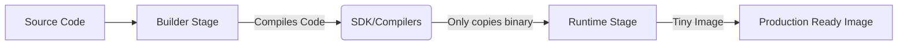

# DOC-02 Dockerfile and Image Optimization

# Overview
**Ye kya hai?**
Dockerfile ek plain text document hai jisme wo saari commands hoti hain jo ek container image banati hain. Optimization ka matlab hai image ka size kam karna (reduce bloat) aur build process ko fast karna (layer caching ka sahi use karna). 

**Kyu use hota hai?**
Agar aapki image 1GB+ ki hai, toh download slow hoga, storage cost badhegi, aur security attack surface zyada hoga. Optimized image (e.g., 15MB) fast scale karti hai aur secure hoti hai.

**Real life example & Analogy:**
Maan lo aap ek cake (image) banate ho. Agar aap delivery box (container) mein cake ke sath pura oven aur mixer (build tools) bhi daal doge, toh box heavy ho jayega. Multi-stage build ka matlab hai: kitchen mein cake banao (builder stage), aur sirf final cake ko delivery box mein daalo (runtime stage).

**Industry kaha use karti hai?**
DevOps pipelines mein har naya code push hone par image banti hai. Agar Dockerfile optimized nahi hai, toh CI/CD pipeline ko bohot time lagta hai. Optimized Dockerfile se ye time kaafi kam ho jata hai.

**Architecture (Multi-Stage Build)**


# Working
**Internal working (Layer Caching):**
Dockerfile ki har line (instruction) ek "layer" banati hai. Docker in layers ko cache karta hai. Jab aap dobara image build karte ho, toh Docker check karta hai ki kya layer change hui hai. Agar upar wali layer change hoti hai, toh uske neeche wali saari layers invalidate ho jati hain aur dobara build hoti hain.

**Flow:**
- `FROM` -> Base OS layer
- `COPY package.json` -> Caches dependencies manifest
- `RUN npm install` -> Installs packages (Cache reused if manifest is unchanged)
- `COPY . .` -> Code changes frequently, so this layer updates often.

# Installation
**Prerequisites:** Docker installed hona chahiye (`docker info` se check karo).
*Dockerfile likhne ke liye koi alag installation ki zarurat nahi hoti, sirf ek text editor aur Docker engine chahiye.*

# Practical Lab
**Step-by-Step Implementation:**

Bajaaye theory padhne ke, aap vault ke `examples/` folder se ready-made, optimized files dekh sakte hain:
- Multi-stage Dockerfile: [examples/03-Docker/Dockerfile](file:///C:/Users/SPTL/Documents/devops/devops/examples/03-Docker/Dockerfile)
- .dockerignore file: [examples/03-Docker/.dockerignore](file:///C:/Users/SPTL/Documents/devops/devops/examples/03-Docker/.dockerignore)

**Scenario:** Ek Node.js app ko build aur optimize karna hai.

**1. Bad Dockerfile (Size: 1.1GB, Slow Build):**
```dockerfile
FROM node:18
COPY . .
RUN npm install
CMD ["node", "index.js"]
```
*Issue:* Har code change par `npm install` wapas chalega. Image size bohot bada hoga aur root user se run ho raha hai.

**2. Optimized Multi-Stage Dockerfile (Size: 185MB, Fast Build):**
(Review the real file at `examples/03-Docker/Dockerfile`)
```dockerfile
# Stage 1: Build environment
FROM node:18-alpine AS builder
WORKDIR /app
COPY package*.json ./
RUN npm ci
COPY . .

# Stage 2: Production environment
FROM node:18-alpine
WORKDIR /app
USER node
COPY --from=builder --chown=node:node /app/node_modules ./node_modules
COPY --from=builder --chown=node:node /app/index.js ./
CMD ["node", "index.js"]
```
*Benefits:* 
1. Cache optimization (package.json pehle copy kiya).
2. Alpine base image se size kam ho gaya.
3. Non-root user se security badh gayi.

**3. .dockerignore File:**
`node_modules/`, `.git/`, aur secrets ko build context se bahar rakhne ke liye ek `.dockerignore` file banao. Ye build fast karega. (See example file).

# Daily Engineer Tasks
- **L1 Engineer:** Basic Dockerfile likhna (`FROM`, `COPY`, `RUN`, `CMD`). Image build karna aur run karna.
- **L2 Engineer:** `.dockerignore` set karna, dependencies cache karna, aur basic multi-stage build setup karna.
- **L3/Senior Engineer:** Distroless images use karna, CI pipeline me Trivy se container scanning integrate karna, non-root execution enforce karna, image size ko KB/MB me laana aur build times optimize karna.

# Real Industry Tasks
- **Real Ticket:** "CI pipeline for Payment Service is taking 15 minutes." -> **Action:** Dockerfile me caching fix ki, package.json ko code se pehle copy kiya aur builder stage use kiya, build time 2 minute ho gaya.
- **Vulnerability Patching:** Trivy scan me 40 Critical bugs aaye kyunki base image purani thi. **Action:** `ubuntu:18.04` ko `ubuntu:22.04` se replace kiya, or even better, `distroless` pe shift kiya.

# Troubleshooting
- **Symptom:** Build har baar naye sirre se start ho raha hai, cache kaam nahi kar raha.
  **Root Cause:** `COPY . .` command ko `RUN npm install` ya `pip install` se pehle likh diya gaya hai.
  **Resolution:** Hamesha dependencies file (`requirements.txt` ya `package.json`) pehle copy karo, phir install karo, aur end me baaki code copy karo.
- **Symptom:** Container start hote hi "Permission Denied" de raha hai.
  **Root Cause:** `USER nonroot` set kiya hai par files `root` user ke paas hain.
  **Resolution:** `COPY --chown=nonroot:nonroot /src /dest` use karo taaki non-root user ke paas un files ko read/write karne ki permissions ho.
- **Symptom:** Alpine image use karne ke baad bhi size zyada hai.
  **Root Cause:** Multiple `RUN` commands lagakar alag-alag layers create kiye hain jisme cache clear nahi kiya.
  **Resolution:** `RUN apt-get update && apt-get install -y pkg && rm -rf /var/lib/apt/lists/*` aise command chaining karo.

# Interview Preparation
- **Basic (L1):** `COPY` aur `ADD` mein kya difference hai? 
  *Expected Answer:* Dono file copy karte hain par `ADD` .tar extract kar sakta hai aur URL se files download kar sakta hai.
- **Intermediate (L2):** Layer Caching kaise kaam karti hai?
  *Expected Answer:* Har instruction ek layer banati hai. Change hone par neeche ki saari layers invalidate hoti hain. Isiliye rarely changing files (jaise dependencies) pehle aur frequently changing code files ko end me copy karna chahiye.
- **Advanced (L3/Production):** `CMD` aur `ENTRYPOINT` mein kya farak hai?
  *Expected Answer:* `ENTRYPOINT` main executable hota hai jo easily override nahi hota. `CMD` default arguments deta hai jise user `docker run` ke baad asani se override kar sakta hai. Best practice: Dono mila ke use karo `ENTRYPOINT ["aws"]` aur `CMD ["s3", "ls"]`.
- **Hands-on Question/Scenario Based:** Tumhare paas 1.5GB ka Java application image hai. Size kam kaise karoge?
  *Expected Answer:* Multi-stage build use karunga. Maven/JDK image ko as builder stage use karke `jar` compile karunga, aur runtime stage me sirf lightweight JRE base image (ya Alpine/Distroless) use karke us `jar` ko copy aur run karunga.

# Production Scenarios
**Scenario:** "Security team ne aapki Go API ki image reject kardi kyunki 40 critical vulnerabilities mili hain. Image size 1.2GB hai."
**How to think:** Go compiled language hai. Production me compiler, git aur source code ki zaroorat nahi hai. Hum tools kyu ship kar rahe hain?
**Commands & Action:** 
1. Stage 1 me `golang:1.20` image use karke code compile karo. (`go build -o api`)
2. Stage 2 me Google ka `distroless/static` image (sirf 2MB) use karo.
3. Binary ko Stage 1 se Stage 2 me `COPY --from=builder` karke lao.
**Resolution & Verification:** Trivy se scan karo. 0 vulnerabilities aayengi kyunki distroless image me OS tools jaise shell ya apt hote hi nahi jinhe hack kiya ja sake.

# Commands
| Command | Purpose | Syntax | When to use | Danger Level |
|---|---|---|---|---|
| `FROM` | Base image define karta hai | `FROM python:3.9-alpine` | File ki 1st line | Low |
| `WORKDIR` | Default directory set karta hai | `WORKDIR /app` | Files copy ya commands run karne se pehle | Low |
| `COPY` | Host se container me file bhejna | `COPY req.txt ./` | Dependencies aur code bhejne ke liye | Low |
| `RUN` | Build time pe command chalata hai | `RUN apt-get install curl` | Packages install karne ke liye | Medium (Cache bloating possible) |
| `ENV` | Environment variable set karta hai | `ENV PORT=8080` | Runtime config dene ke liye | Low (Don't store secrets) |
| `USER` | Container execution user badalta hai | `USER appuser` | Security (non-root) ke liye | High (Impacts permissions) |
| `CMD` | Container start hote hi chalne wali default command | `CMD ["node", "app.js"]` | Default behavior define karne ke liye | Low |
| `ENTRYPOINT` | Container start hone pe chalne wali primary command | `ENTRYPOINT ["python", "app.py"]` | Fixed execution entry define karne ke liye | Low |

# Cheat Sheet
- **Pin your images:** Hamesha specific image tag use karo (e.g., `ubuntu:22.04` instead of `ubuntu:latest`).
- **Chain your RUNs:** `RUN apt-get update && apt-get install -y vim && rm -rf /var/lib/apt/lists/*` (Layer count aur size kam karne ke liye).
- **.dockerignore:** Isme `.git/`, `.env`, aur `node_modules/` zaroor daalo.
- **Root access:** Hamesha `USER nonroot` switch use karo at the end of the Dockerfile.

# SOP & Runbook & KB Article
**SOP: Creating a Production-Ready Dockerfile**
- **Purpose:** Ensure all new Docker images are standardized, optimized, and secure.
- **Scope:** All microservices and applications being containerized.
- **Procedure:**
  1. Define multi-stage builds for compiled languages.
  2. Choose a minimal base image like Alpine or Distroless.
  3. Create a `.dockerignore` file.
  4. Ensure a non-root `USER` is created and used.
  5. Copy dependencies first, install them, then copy application code.
- **Validation:** Run `docker build` and verify layer cache usage. Run `trivy image <image_name>` to ensure 0 critical vulnerabilities.

# Best Practices & Beginner Mistakes
**Best Practices:**
- Use Multi-Stage builds to keep final images small.
- Clean up cache after `RUN apt-get install` ya `yum install`.
- Execute processes as a non-root user.

**Beginner Mistakes:**
- `RUN apt-get upgrade` chalana (is-se image bloat hota hai aur deterministic nahi rehti).
- Root user pe database/backend apps chalana.
- Password/secrets ko Dockerfile ke `ENV` me rakhna.

# Advanced Concepts
- **Buildx (Docker BuildKit):** Naya build engine jo parallel me multi-stage builds execute karta hai, secret mounting allow karta hai aur caching bohot fast hoti hai.
- **Distroless Images:** Aisi images jisme OS utilities (shell, bash, apt, curl) hoti hi nahi hain. Sirf app aur uske dependencies hoti hain, jis-se attack surface almost zero ho jata hai.

# Related Topics & Flashcards & Revision
- [[03-Containerization/DOC-01 Docker Fundamentals|Docker Fundamentals]]
- [[09-Security-DevSecOps/SEC-02 SAST DAST and Container Scanning|Container Scanning (Trivy)]]
- [[03-Containerization/DOC-03 Docker Compose|Docker Compose]]

**Flashcards:**
- **Question:** How to clean cache in an Ubuntu Docker layer to reduce size?
- **Answer:** Append `rm -rf /var/lib/apt/lists/*` in the same `RUN` command where you install packages.
- **Question:** Why do we copy `package.json` before copying the rest of the code?
- **Answer:** To leverage Docker's layer caching, so `npm install` only runs when dependencies actually change.
