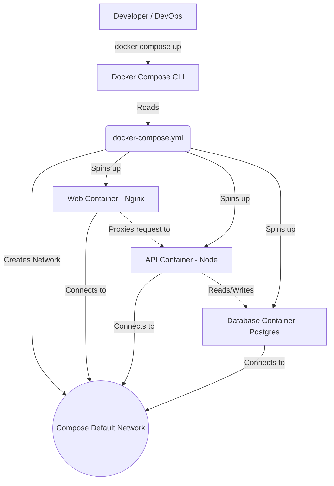
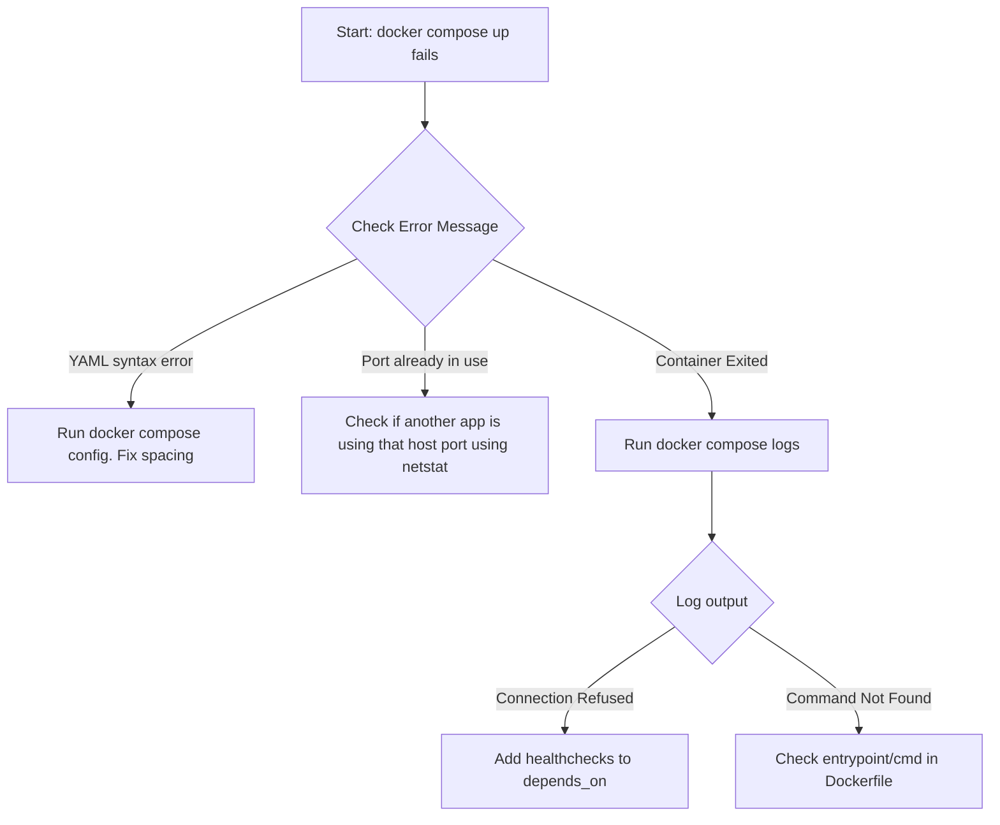

# DOC-03 Docker Compose

# Overview
**Ye kya hai?** Docker Compose ek orchestration aur management tool hai jo aapko ek declarative YAML file ke through multi-container Docker applications ko define aur run karne ki facility deta hai.
**Kyu use hota hai?** Modern applications me frontend, backend API, cache (Redis), aur database (Postgres) sab alag-alag containers me hote hain. Har container ko manually `docker run` karna aur unki networking configure karna bohot tedious hai. Compose in sabko ek sath ek simple command se up and connect kar deta hai.
**Real life example & Simple Analogy:** Agar Docker ek akela worker (container) hai jisko aap bataate ho kya karna hai, toh Docker Compose ek Project Manager hai. Is Manager ko aap ek To-Do list (YAML file) pakda dete ho ki "Mujhe ye 4 workers chahiye, inka ye department hoga (network), aur ye unka storage (volume)". Manager sab khud handle kar lega.
**Industry kaha use karti hai?** 99% cases me ye local development environments setup karne, testing environments, aur chhoti-moti single-server deployments me use hota hai. Developers ke liye DevEx (Developer Experience) improve karne ke liye ye best tool hai.

### Architecture


# Working
**Internal working & Data Flow:**
Jab aap `docker compose up` chalate ho, Compose engine aapki current directory me `docker-compose.yml` dhoondhta hai. 
1. Sabse pehle ye ek custom bridge network create karta hai.
2. Fir ye `volumes` block ko padhta hai aur persistent storage volumes banata hai.
3. Uske baad ye `services` block ko read karke containers banata hai aur unko network me attach kar deta hai.
4. **DNS Resolution:** Docker ka embedded DNS engine har service name ko uske internal IP par map kar deta hai. Iska matlab hai `api` container apne code me database ko directly `db:5432` se access kar sakta hai, IP yaad rakhne ki zaroorat nahi.

# Installation
**Prerequisites:** Docker Engine installed hona chahiye.
**Installation:**
- **Windows/Mac:** Docker Desktop ke sath automatically aata hai. Kuch alag se karne ki zaroorat nahi.
- **Linux:** 
  ```bash
  sudo apt update
  sudo apt install docker-compose-plugin
  ```
*(Note: Pehle log `docker-compose` likhte the jo v1 python script thi. Naya tareeka `docker compose` space ke sath hai jo golang based plugin hai)*
**Verification:** 
```bash
docker compose version
```

# Practical Lab
**Scenario:** Ek 3-tier application deploy karni hai jisme Nginx (Proxy), Node API, aur PostgreSQL database ho.

Aap real execution ke liye vault ke example folder se file use kar sakte hain: [examples/03-Docker/docker-compose.yml](file:///C:/Users/SPTL/Documents/devops/devops/examples/03-Docker/docker-compose.yml)

### Step 1: Directory & Variables
Hamesha project folder banaye aur hardcoded passwords avoid karne ke liye `.env` file banaye.
```bash
cd ../../examples/03-Docker/
echo "POSTGRES_PASSWORD=supersecret" > .env
echo "DB_HOST=db" >> .env
```

### Step 2: Write `docker-compose.yml`
(Refer to the actual file for the full robust configuration with networks and healthchecks).
```yaml
version: '3.8'

services:
  # 1. Reverse Proxy
  proxy:
    image: nginx:alpine
    ports:
      - "8080:80"
    depends_on:
      - api

  # 2. API Tier
  api:
    image: node:18-alpine
    command: sh -c "sleep 3600" # Dummy running process
    environment:
      - DB_HOST=${DB_HOST}
      - DB_PASS=${POSTGRES_PASSWORD}
    depends_on:
      db:
        condition: service_healthy # Wait untill DB is completely ready

  # 3. Database Tier
  db:
    image: postgres:14-alpine
    env_file:
      - .env # Load variables from .env file
    volumes:
      - pgdata:/var/lib/postgresql/data
    healthcheck:
      test: ["CMD-SHELL", "pg_isready -U postgres"]
      interval: 5s
      timeout: 5s
      retries: 5

volumes:
  pgdata: # Persistent storage
```

### Step 3: Run & Verify
```bash
# Background me chalaye
docker compose up -d

# Status check kare
docker compose ps

# Sabhi containers ke combined logs dekhein
docker compose logs -f
```

### Step 4: Cleanup
```bash
# Containers and network delete (Volumes bache rahenge data save rakhne ke liye)
docker compose down

# Pura kachra saaf karna ho (Volumes and Data bhi delete hoga)
docker compose down -v
```

# Daily Engineer Tasks
- **L1 Engineer:** `docker compose ps` se services check karna aur `docker compose logs -f <service_name>` se error dhundhna.
- **L2 Engineer:** Existing `docker-compose.yml` me naye environment variables add karna, volumes configure karna, and images upgrade karna.
- **L3/Senior Engineer:** `docker-compose.override.yml` likhna developers ke local testing ke liye, healthchecks setup karna taaki containers crash loop me na jaaye, aur compose profiles banana.

# Real Industry Tasks
**Real tickets:**
- **Ticket:** "Developers complain local dev is slow and DB keeps crashing on start."
- **Action:** Senior engineer inspect karega. Pata chalega ki `depends_on` use kiya hai par `healthcheck` nahi. DB initialize hone se pehle Backend request bhej deta hai. Engineer `docker-compose.yml` me `pg_isready` ka healthcheck dalega aur frontend/backend dependencies ko `condition: service_healthy` update karega. Developer setup abb stable ho gaya!

# Troubleshooting
- **Issue:** Containers ek dusre se localhost pe baat nahi kar pa rahe hain.
  - **Root Cause:** Har container ka apna localhost (loopback) hota hai. 
  - **Resolution:** Connection string me service ka naam use kare. Example: `http://localhost:5432` ki jagah `http://db:5432` use kare.
- **Issue:** Code changes container me update nahi ho rahe.
  - **Root Cause:** Image cache ho chuki hai.
  - **Resolution:** `docker compose up -d --build` chalaye to force rebuild.
- **Issue:** `variable is not set. Defaulting to a blank string.`
  - **Root Cause:** YAML me env variable use hua hai par `.env` file missing hai ya source nahi hui.

# Interview Preparation
**Q1 (Basic): Difference between `docker-compose up` and `docker-compose start`?**
*Answer:* `up` pura stack (network, volume, containers) naye sire se banata aur chalata hai. `start` sirf un containers ko start karta hai jo pehle se bane the par stopped state me the.
*Confidence Level:* Beginner

**Q2 (Intermediate): How to keep secrets out of `docker-compose.yml`?**
*Answer:* `env_file: .env` directive use karke environment variables inject karte hain. `.env` file ko `.gitignore` me dalte hain taaki passwords github me expose na ho.
*Confidence Level:* Intermediate

**Q3 (Scenario Based): API container fails initially because database takes 10 seconds to setup. How to fix?**
*Answer:* `depends_on` by default sirf check karta hai ki container start hua ya nahi. Proper fix ke liye db service me `healthcheck` block dalenge (e.g., `pg_isready`). Phir API service me `depends_on: db: condition: service_healthy` set karenge.
*Experience Level:* Production / L2

**Q4 (Advanced): Kya Docker Compose production-grade container orchestrator hai?**
*Answer:* No. Docker Compose auto-scaling aur self-healing across multiple nodes (servers) handle nahi kar sakta. Ye local dev aur single-server deployments ke liye accha hai. Production scale ke liye Kubernetes (K8s) ya Docker Swarm chahiye.
*Experience Level:* Senior / Architect

# Production Scenarios
**Scenario: Website Down in Local Environment**
- **How to think:** Sabse pehle check karo ki saare containers running hain ya restarting loop me hain.
- **Commands:** `docker compose ps` -> `docker compose logs -f api`
- **Root Cause Analysis:** Pata chala DB connection refused aa raha hai.
- **Resolution:** Developer ne shayad naya DB password `.env` me update nahi kiya ya data volume corrupt hai. `docker compose down -v` karke clean start karke verify karenge.

# Commands
| Command | Purpose | When to use | Danger Level |
|---------|---------|-------------|--------------|
| `docker compose up -d` | Background me stack start karta hai | Daily local dev ke time | Low |
| `docker compose down` | Stack rok kar delete karta hai | Jab kaam khatam ho jaye | Low |
| `docker compose down -v` | Stack + Volumes (Data) sab delete | Jab DB/data reset karna ho | **HIGH** |
| `docker compose logs -f` | Realtime combined logs dikhata hai | Debugging errors | Low |
| `docker compose exec db sh` | Running container ke andar shell deta hai | Manual database queries chalane ke liye | Medium |
| `docker compose config` | Pura final parsed YAML validate and dikhata hai | Syntax errors verify karne ke liye | Low |

# Cheat Sheet
- **Scale containers:** `docker compose up --scale worker=3 -d`
- **Build without cache:** `docker compose build --no-cache`
- **Check config errors:** `docker compose config`
- **Run specific profile:** `docker compose --profile debug up -d`

# SOP & Runbook & KB Article
### Runbook: Application Services crashing on startup
- **Detection:** `docker compose ps` shows containers in "Exited" state.
- **Investigation:** `docker compose logs <service_name> --tail=50`.
- **Cause:** Usually DB dependency missing ya environment variables not loaded.
- **Resolution:** Check `.env` file presence. Ensure healthcheck is configured for dependent services.
- **Verification:** Run `docker compose up -d` and check `docker compose ps` for "Up" status.

# Best Practices & Beginner Mistakes
**Best Practices:**
- Hamesha container ka image tag fix karein (e.g., `node:18-alpine` instead of `node:latest`). Latest tag unpredictable hota hai.
- Hamesha `.env` file ka use karein.
- Named volumes create karein data persist karne ke liye.

**Beginner Mistakes:**
- `ports` ko hamesha host port bind kar dena. Agar `80:80` bind kiya toh aap us service ke 2 container nahi chala sakte (Port Conflict). Use `80` (only container port) ya `8080-8085:80` for scaling.
- Production environment me Compose par rely karna bina failover server ke.

# Advanced Concepts
**1. Docker Compose Overrides**
Aapke paas `docker-compose.yml` hai. Ab local dev ke liye aapko kuch extra ports kholne hain jo production me hide rahenge. Aap ek file banayenge `docker-compose.override.yml`. Compose automatically dono ko merge kar dega jab aap `docker compose up` chalayenge. Dev overrides ko version control me dalne ki zaroorat nahi padti kai baar.

**2. Compose Profiles**
Agar project me 10 services hain par ek developer ko sirf frontend pe kaam karna hai aur heavy monitoring tools (Prometheus, Grafana) nahi chahiye. Hum heavy services ko `profiles: ["monitoring"]` de sakte hain. Ye tab tak start nahi honge jab tak `docker compose --profile monitoring up` na bola jaye.

# Related Topics & Flashcards & Revision
- **Prerequisites:** [[DOC-01 Docker Fundamentals]]
- **Next Topic:** [[DOC-04 Docker Networking and Volumes]], [[Kubernetes Architecture]]

**Flashcards:**
- *Q: Docker Compose me volume kaise banate hain?* -> A: Root level `volumes:` block define karke.
- *Q: Default Compose network ka naam kya hota hai?* -> A: `<folder-name>_default`

# Real Production Logs & Commands & Decision Tree
**Logs Example when Healthcheck works:**
```text
Network 3-tier-app_default  Creating...
Volume "3-tier-app_pgdata"  Creating...
Container db-1  Starting...
Container db-1  Healthy    <-- (healthcheck passed)
Container api-1  Starting...
```

**Decision Tree - App Not Starting:**

