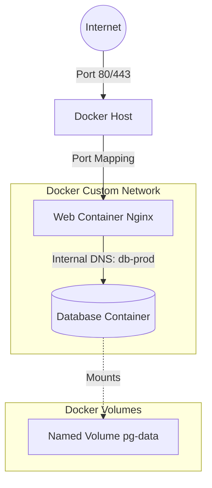
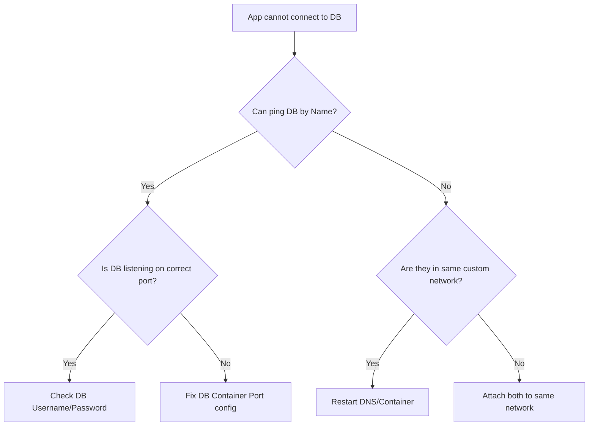

# DOC-04 Docker Networking and Volumes

## Overview
**Ye kya hai?** Docker containers by default isolated hote hain. Networking unhe aapas me aur internet se connect karta hai (jaise mobile network). Volumes containers ka data permanently store karte hain (jaise external hard drive), taaki agar container delete bhi ho jaye, data safe rahe.

**Kyu use hota hai?** Stateless apps (jaise Nginx web server) bina data ke chal sakte hain, par Stateful apps (jaise MySQL, PostgreSQL) ka data save hona zaruri hai. Custom networks se hum DB aur Web server ko securely connect kar sakte hain, bina internet pe expose kiye.

**Real life example:**
- Networking: Jaise ek office ka intercom (custom bridge network) jisme bahar se call nahi aa sakti, par andar ke log aapas me baat kar sakte hain.
- Volumes: Jaise pen drive. Agar laptop (container) kharab ho jaye, toh pen drive nikal kar dusre laptop me lagao, data wahi milega.

**Industry kaha use karti hai?**
Har production environment me! Database persistence ke liye volumes aur Microservices communication ke liye custom bridge networks standard hain.

**Architecture (Mermaid Diagram)**


## Working
**Internal Working:**
- **Networking:** Docker Linux ke `namespaces`, `cgroups`, aur `iptables` use karta hai isolation aur traffic routing ke liye. Jab hum custom bridge network banate hain, Docker har container me ek embedded DNS server (127.0.0.11) inject karta hai, jisse containers ek dusre ko naam se resolve kar pate hain.
- **Volumes:** Docker `/var/lib/docker/volumes/` path me host filesystem pe data store karta hai, bypassing the container's copy-on-write (CoW) filesystem. Isse performance fast hoti hai (Native I/O speed).

**Data Flow / Request Flow:** User -> Host IP:Port -> Docker iptables NAT -> Container Network Interface -> Application.

## Installation & Configuration
Networking aur Volumes Docker daemon ka inbuilt part hain, alag se install nahi karna padta. Bas concepts aur commands clear hone chahiye.

## Practical Lab
**Step-by-step Implementation (CLI Method)**

*Scenario: Ek web container (Nginx) aur ek database container (Postgres) deploy karna hai secure network aur persistent storage ke sath.*

**Step 1: Network & Volume Creation**
```bash
# Custom isolated network banao
docker network create my-app-net

# Database ke liye persistent volume banao
docker volume create pg-data
```
*Expected Output: Network and Volume ID return hoga.*

**Step 2: Database Container Start**
```bash
docker run -d \
  --name my-postgres \
  --network my-app-net \
  -v pg-data:/var/lib/postgresql/data \
  -e POSTGRES_PASSWORD=supersecret \
  postgres:15-alpine
```
*Note: Humne `-p` (port mapping) use nahi kiya. DB bahar se accessible nahi hai!*

**Step 3: Web Container Start (Troubleshooting/Test container)**
```bash
# Nginx chalate hain aur DB ko ping karke dekhte hain
docker run --rm -it \
  --network my-app-net \
  alpine sh -c "ping -c 3 my-postgres"
```
*Expected Output: `PING my-postgres (172.19.0.2): 56 data bytes...` (Resolution successful)*

**Step 4: Cleanup**
```bash
docker rm -f my-postgres
docker volume rm pg-data
docker network rm my-app-net
```

## Daily Engineer Tasks
- **L1 Engineer:** `docker ps` aur `docker network ls` se network issues check karna. Developer ke dev environment me bind mounts (`-v $(pwd):/app`) troubleshoot karna.
- **L2 Engineer:** Staging env me custom bridge networks create karna, orphaned volumes ko cleanup (`docker volume prune`) karna disk space bachane ke liye.
- **L3/Senior Engineer:** Production me volume backup/restore strategies design karna. Host vs Bridge vs Macvlan networks ke architecture decisions lena. Iptables ke conflicts resolve karna.
- **Production/SRE:** Ensure karna ki DB data loss na ho, zero-downtime volume migration scripts likhna, aur Docker networking overhead ki monitoring karna.

## Real Industry Tasks
- **Migration Ticket:** Old legacy MySQL container ka data naye server me move karna using volume backup and restore (Tarball method).
- **Security CR (Change Request):** Exposed DB ports (`-p 3306:3306`) ko hata kar custom network pe move karna so they are only internally accessible.
- **Maintenance Work:** `/var/lib/docker` full ho gaya hai disk space pe. `docker system prune --volumes -f` chala kar unused space recover karna.

## Troubleshooting
**Issue: Containers ek dusre ko naam se ping nahi kar pa rahe (DNS Resolution Failed)**
- **Symptoms:** `curl: (6) Could not resolve host: my-backend`
- **Root Cause:** Containers default `docker0` bridge pe chal rahe hain jisme automatic DNS nahi hota.
- **Investigation:** `docker inspect <container-id>` aur check karo `"Networks"`.
- **Resolution:** Naya custom network banao (`docker network create app-net`) aur dono ko usme attach karo (`docker network connect app-net container1`).

**Issue: Host folder bind mount kaam nahi kar raha, 'Permission Denied'**
- **Symptoms:** Container logs me application crash ho rahi hai kyunki file write nahi ho pa rahi.
- **Root Cause:** Host directory ka UID/GID aur container ke andar ke user ka UID/GID match nahi kar raha.
- **Resolution:** Host me `chown -R 1000:1000 /path/to/folder` (Agar container user ka UID 1000 hai).

## Interview Preparation
- **Basic:** What is the default network in Docker? (Answer: Bridge). What is the difference between Bind mount and Volume? (Answer: Volume Docker manage karta hai, Bind mount directly host ka path hota hai).
- **Intermediate:** Custom bridge vs default bridge me kya farq hai? (Answer: Custom bridge me internal DNS service discovery milti hai).
- **Advanced:** Docker `--network host` kab use karenge? (Answer: Jab maximum network performance chahiye ya fir network monitoring tool jaise tcpdump chalana ho, isse NAT overhead hat jata hai, port mapping ki zarurat nahi padti).
- **Scenario Based:** Agar main container delete kar du, toh uske sath attached named volume ka kya hoga? (Answer: Volume delete nahi hoga, wo `/var/lib/docker/volumes` me safe rahega).
- **HR/Manager Round:** How do you ensure DB safety in containerized environments? (Answer: By strictly using Named Volumes, daily automated snapshot backups, and restricting network access via custom networks).

## Production Scenarios
**Scenario: Production Website is Down - Database Connection Refused**
- **How to think:** Web app DB se connect nahi kar pa rahi. Network issue ya DB down?
- **Investigation Steps:**
  1. `docker ps` (Check if DB container is running).
  2. `docker logs web-app` (Check connection error).
  3. `docker network inspect my-net` (Check IP and if both containers are in the same network).
- **Root Cause:** DB container restart hua tha aur naya IP mil gaya, but web app abhi bhi purane IP pe connect karne ka try kar rahi thi kyunki DNS cache clear nahi hua, ya app DNS use nahi kar rahi IP hardcoded hai.
- **Resolution:** App configuration ko hardcoded IP se hata kar container name (`db-prod`) pe update karna taaki Docker DNS IP dynamically resolve kare. `docker restart web-app`.
- **Prevention:** Hamesha container DNS names use karein connection strings me.

## Commands
| Command | Purpose | Syntax | Example | Danger Level |
|---------|---------|--------|---------|--------------|
| `docker network create` | Naya network banana | `docker network create <name>` | `docker network create app-tier` | Low |
| `docker network ls` | Saare networks dekhna | `docker network ls` | `docker network ls` | Low |
| `docker network inspect`| Network/IP details dekhna| `docker network inspect <name>`| `docker network inspect app-tier`| Low |
| `docker volume create` | Naya volume banana | `docker volume create <name>` | `docker volume create pgdata` | Low |
| `docker volume ls` | Saare volumes dekhna | `docker volume ls` | `docker volume ls` | Low |
| `docker volume prune` | Unused volumes delete karna| `docker volume prune -f` | `docker volume prune -f` | **High** (Data loss risk if not careful) |
| `docker run -v` | Volume attach karna | `docker run -v <vol>:<path> ...`| `docker run -v pgdata:/var/lib/postgresql/data postgres` | Medium |
| `docker run --network` | Container ko network me dalna| `docker run --network <net>` | `docker run --network host nginx` | Medium |

## Cheat Sheet
- **Default Bridge:** `docker0` (No DNS).
- **Custom Bridge:** Created by user (Provides DNS).
- **Host Network:** `host` (No isolation, direct host IP/ports).
- **Volumes Path (Linux):** `/var/lib/docker/volumes/`
- **Volume Type 1:** Named Volume (Docker managed, best for DB).
- **Volume Type 2:** Bind Mount (User managed, host path, best for dev).
- **Volume Type 3:** tmpfs (RAM storage, lost on restart, good for secrets).

## SOP & Runbook & KB Article
**SOP: Backing up a Docker Volume**
- **Purpose:** To create a tarball backup of a named volume.
- **Procedure:**
  1. `docker run --rm -v my_volume:/volume -v $(pwd):/backup alpine tar -czf /backup/my_volume_backup.tar.gz -C /volume .`
- **Validation:** Check `ls -l` in current directory for `.tar.gz` file.
- **Rollback:** `docker run --rm -v my_volume:/volume -v $(pwd):/backup alpine sh -c "rm -rf /volume/* && tar -xzf /backup/my_volume_backup.tar.gz -C /volume"`

**Runbook: Unused Disk Space Alert**
- **Detection:** Zabbix/Prometheus alert for Host Disk Space > 85%.
- **Commands:** `docker system df` (check disk usage).
- **Resolution:** `docker volume prune -a -f` (delete unused volumes). *CAUTION: Verify no critical stopped containers exist.*

**KB Article: Iptables Bypass Issue**
- **Problem:** UFW rules are being ignored by Docker.
- **Cause:** Docker manages iptables rules directly and inserts them before UFW.
- **Resolution:** Use internal networking. If you must expose ports, bind to localhost: `-p 127.0.0.1:8080:80`.

## Best Practices & Beginner Mistakes
**Best Practices:**
- Always use Named Volumes for production database persistence.
- Create distinct custom networks for frontend and backend tiers for better security (Zero Trust).
- Define networks and volumes in `docker-compose.yml` for infrastructure as code.

**Beginner Mistakes:**
- *Mistake:* Using Bind Mounts for production database data. *Impact:* File permission issues and host-dependency. *Correction:* Use Named Volumes.
- *Mistake:* Exposing database ports (e.g., `-p 3306:3306`) to the world just to connect an app. *Impact:* Huge security risk. *Correction:* Put both containers in a custom network, don't use `-p` for DB.

## Advanced Concepts
- **Macvlan Network:** Gives the container its own MAC address, making it appear as a physical device on your company's network. Useful for legacy applications that need to sit directly on the physical LAN.
- **Overlay Network:** Used in Docker Swarm (or Kubernetes Flannel/Calico). Allows containers on *different physical servers* to communicate over a secure virtual network.
- **Iptables and Docker:** Jab aap `-p 80:80` karte ho, Docker Linux ke `nat` table me DNAT (Destination NAT) rules add kar deta hai jisse traffic direct container me chala jata hai, bypassing standard UFW blocks.

## Related Topics & Flashcards & Revision
- **Prerequisites:** [[03-Containerization/DOC-01 Docker Basics|Docker Basics]]
- **Next Topic:** [[03-Containerization/DOC-03 Docker Compose|Docker Compose]]
- **Related:** [[04-Orchestration/K8S-04 Persistent Volumes and Storage|K8S Persistent Storage]]

**Flashcards:**
- *Q: Custom bridge network ka sabse bada faida?* -> A: Automatic DNS resolution by container name.
- *Q: Docker volumes default kahan store hote hain?* -> A: `/var/lib/docker/volumes/`
- *Q: Bind mount kab use karna chahiye?* -> A: Local development me live code reload ke liye.

## Real Production Logs & Commands & Decision Tree
**Sample Error Log (Nginx container failing to start with volume):**
`nginx: [emerg] open() "/etc/nginx/nginx.conf" failed (13: Permission denied)`
*Explanation:* Nginx container user ko bind mount folder pe read access nahi mila (Host permissions issue).

**Troubleshooting Decision Tree:**


## AI Enhancement
*Self-added notes on production efficiency:*
Volumes can also use external storage drivers. In AWS, you can use the RexRay or AWS EBS volume plugin so a container running on EC2 can mount an EBS volume dynamically. This brings cloud-native persistence to raw Docker environments, acting as a precursor to Kubernetes PersistentVolumes.
