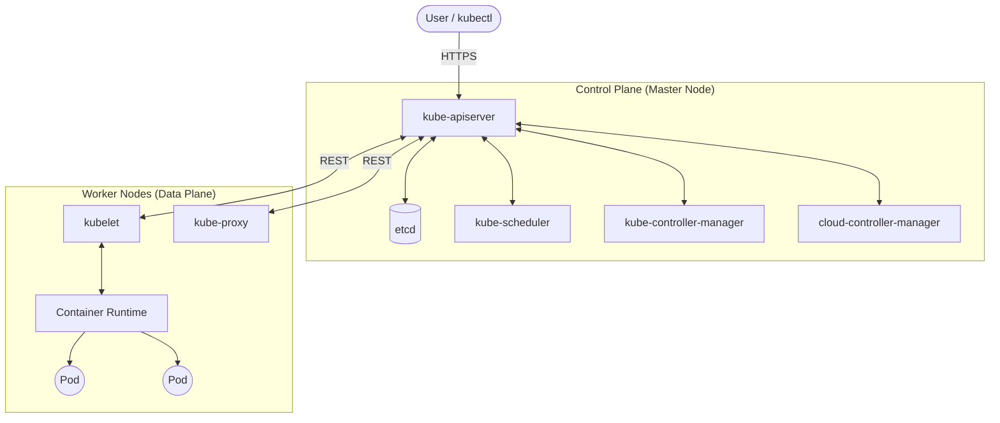
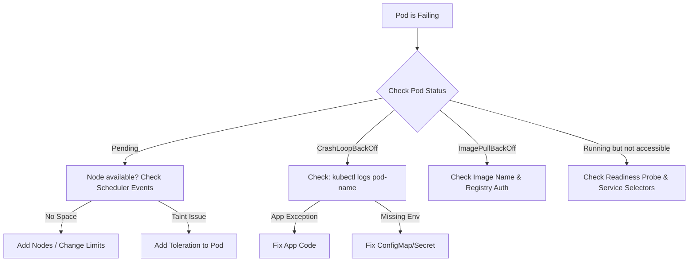

# K8S-01 Kubernetes Architecture

> [!important]
> **God Mode Vault**: This note covers the entire K8s architecture. Master this, and you can troubleshoot 90% of K8s cluster issues in production and easily crack any FAANG Kubernetes interview.

## # Overview

**Ye kya hai?**
Kubernetes (K8s) ek open-source container orchestration platform hai. Ye automatically containers ko deploy, scale, aur manage karta hai across multiple servers (cluster).

**Kyu use hota hai?**
Docker akela ek ya do containers chala sakta hai. Par production me jab aapko 1000 containers chalane hon, crash hone par auto-restart karna ho, traffic load balance karna ho, aur zero-downtime updates dene hon — wahan Kubernetes life saver ban jata hai.

**Real life example / Simple Analogy:**
Kubernetes ek Orchestra ka **Conductor (Music Director)** hai. Har musician ek container (Pod) hai jo apna kaam kar raha hai. Conductor (K8s Master Node) decide karta hai ki kaun kab bajayega, kaun thak gaya hai aur uski jagah naya musician (Self-healing) kab aayega, aur volume kab badhana hai (Auto-scaling).

**Industry kaha use karti hai? / Real production use-case:**
- Global companies (Netflix, Spotify, Zomato) jahan traffic seconds me 10x ho jata hai. K8s turant naye pods spin up kar deta hai (HPA - Horizontal Pod Autoscaler).
- Complex microservices ko ek sath connect aur secure karne ke liye.

**Architecture Diagram:**


---

## # Working

Kubernetes ka internal working Master (Control Plane) aur Worker nodes me divided hai.

### Control Plane Components (The Brain)
1. **kube-apiserver:** 
   - Cluster ka "Front Door" aur "Receptionist". Koi bhi (kubectl, user, ya internal components) direct baat nahi karta, sab API server ke through baat karte hain. Ye request ko authenticate aur validate karta hai.
2. **etcd:** 
   - Cluster ka "Memory / Database". Ye ek highly available key-value store hai. K8s ka saara state (Kitne pods hain? Kaunse node par hain? Secrets kya hain?) sirf yahan save hota hai. Agar etcd ud gaya, toh K8s ki memory chali gayi.
3. **kube-scheduler:** 
   - Cluster ka "Hostel Warden". Jab naya Pod banta hai toh wo homeless hota hai. Scheduler CPU/RAM aur rules (Taints, Affinities) dekh kar decide karta hai ki pod kis Worker Node par jayega.
4. **kube-controller-manager:** 
   - Cluster ka "Supervisor". Ye consistently check karta hai ki *Desired State* (jo aapne manga) aur *Actual State* (jo chal raha hai) match ho rahi hai ya nahi. (e.g., agar aapne 3 pods mange aur 1 crash ho gaya, ye turant 1 naya bana dega).
5. **cloud-controller-manager:** 
   - AWS, Azure, GCP ke specific resources (jaise Cloud Load Balancers, EBS volumes) ko manage karta hai.

### Worker Node Components (The Muscle)
1. **kubelet:** 
   - Har node par "Captain". Ye API server se instructions leta hai aur Pods/Containers ko start karta hai. Ye continuously API server ko node ki health batata rehta hai.
2. **kube-proxy:** 
   - Network "Traffic Police". Ye IPTables/IPVS rules banata hai taaki cluster ke andar (Pod to Pod) aur bahar ka network traffic theek se route ho sake.
3. **Container Runtime (CRI):** 
   - Software jo actually container chalata hai (e.g., `containerd`, `CRI-O`). (Note: Docker as runtime K8s 1.24+ me hata diya gaya hai).

**Request flow (Jab aap `kubectl run` karte ho):**
1. User -> `kube-apiserver` (Validate & Auth)
2. `kube-apiserver` -> `etcd` (Save as Pending)
3. `kube-scheduler` notices Pending pod -> Decides Node -> Tells `kube-apiserver`
4. `kube-apiserver` -> `etcd` (Update Node info)
5. `kubelet` on Worker Node notices new assignment -> Tells `containerd` to run it
6. `kubelet` -> `kube-apiserver` (Pod is Running) -> `etcd` (State updated).

---

## # Installation

**Prerequisites:** Ubuntu Linux, Minimum 2 CPUs, 2GB RAM.

**Installation (Minikube CLI Method for Lab):**
```bash
# Update and install Docker first
sudo apt-get update && sudo apt-get install docker.io -y
sudo usermod -aG docker $USER && newgrp docker

# Install kubectl
curl -LO "https://dl.k8s.io/release/$(curl -L -s https://dl.k8s.io/release/stable.txt)/bin/linux/amd64/kubectl"
sudo install -o root -g root -m 0755 kubectl /usr/local/bin/kubectl

# Install Minikube
curl -LO https://storage.googleapis.com/minikube/releases/latest/minikube-linux-amd64
sudo install minikube-linux-amd64 /usr/local/bin/minikube

# Start Cluster
minikube start --driver=docker
```

**Verification:**
```bash
kubectl get nodes
kubectl get pods -A
```

---

## # Practical Lab

**Step-by-step implementation (Creating your first Nginx Pod):**

**CLI Method:**
```bash
# Imperative way to run a pod
kubectl run my-nginx --image=nginx:latest --port=80

# Expected Output: pod/my-nginx created

# Verify it's running
kubectl get pods

# Check detailed internal state
kubectl describe pod my-nginx
```

**Testing the Networking (kube-proxy at work):**
```bash
# Expose the pod as a service (NodePort)
kubectl expose pod my-nginx --type=NodePort --name=nginx-service

# Get the URL in Minikube
minikube service nginx-service --url

# Run a curl to the URL
curl http://<minikube-ip>:<node-port>
```
*Expected Output: HTML page of Nginx.*

---

## # Daily Engineer Tasks

- **L1 Engineer:** Checking pod status (`kubectl get pods`), getting logs (`kubectl logs pod-name`), restarting pods by deleting them (`kubectl delete pod pod-name`).
- **L2 Engineer:** Writing YAML manifests, managing ConfigMaps/Secrets, applying Node labels for scheduling, debugging `CrashLoopBackOff`.
- **L3 / Senior Engineer:** Writing Helm charts, setting up RBAC policies, analyzing OOMKilled issues, designing Network Policies for security.
- **Production Engineer / SRE:** Upgrading K8s cluster versions without downtime, ETCD backup and restoration, configuring cluster autoscaler, debugging CNI (Calico/Cilium) network drops.

---

## # Real Industry Tasks

- **Real tickets:** "Jenkins CI job is failing to deploy due to `ImagePullBackOff`." (Action: Check ECR/ACR registry credentials in K8s Secrets).
- **Migration:** Moving from self-hosted K8s (kubeadm) to managed cloud (AWS EKS or Azure AKS).
- **Patch management:** Upgrading worker nodes OS. (Action: `kubectl cordon`, `kubectl drain`, patch OS, reboot, `kubectl uncordon`).
- **Production validation:** Checking API server latency via Prometheus metrics during high load.

---

## # Troubleshooting

**Common Issue: Pod is in `CrashLoopBackOff`**
- **Symptoms:** Pod starts, crashes, K8s restarts it, it crashes again.
- **Possible root causes:** Wrong entrypoint command, missing environment variables, application code throwing fatal error, missing database connection.
- **Investigation steps:**
  ```bash
  # Check logs of the previous crashed container instance
  kubectl logs <pod-name> --previous
  
  # Check events
  kubectl describe pod <pod-name>
  ```
- **Resolution:** Fix the underlying app issue in the container image or provide correct ConfigMap/EnvVars.

**Common Issue: Pod is in `Pending` state forever**
- **Symptoms:** Pod never moves to Running.
- **Root causes:** Scheduler can't find a node. Cluster might be out of CPU/RAM, or strict nodeSelector/taints are blocking it.
- **Investigation:** `kubectl describe pod <pod-name>`. Check the "Events" section for "FailedScheduling".
- **Resolution:** Add more nodes, adjust requested CPU/RAM limits, or fix tolerations in YAML.

---

## # Production Scenarios

### Scenario: Kubernetes API Server is Unresponsive
**How to think:** If API server is down, nobody can talk to the cluster. But running pods on worker nodes will *continue to run and serve traffic*.
**Where to check:** Master node logs. `journalctl -u kubelet` on master, or check `/var/log/pods/kube-system_kube-apiserver...`.
**Root Cause:** ETCD database corruption, out of memory on Master node, or expired TLS certificates (very common after 1 year).
**Commands to verify certs:**
```bash
kubeadm certs check-expiration
```
**Resolution:** Renew certificates (`kubeadm certs renew all`), restart kubelet, or restore ETCD from backup.

---

## # Commands

| Command | Purpose | Syntax | Danger Level |
|---------|---------|--------|--------------|
| `kubectl get pods -A` | List pods in all namespaces | `kubectl get pods -A` | Low |
| `kubectl describe pod <name>`| Deep dive into pod events | `kubectl describe pod nginx` | Low |
| `kubectl logs <name>` | See application logs | `kubectl logs nginx` | Low |
| `kubectl exec -it <name> -- sh`| Go inside the pod | `kubectl exec -it nginx -- /bin/sh`| Medium |
| `kubectl drain <node>` | Safely evict all pods for maintenance | `kubectl drain node-1 --ignore-daemonsets`| High |
| `kubectl delete namespace <ns>`| Deletes namespace AND everything inside | `kubectl delete ns prod` | **VERY HIGH** |

---

## # Cheat Sheet

- **Master Components Namespace:** `kube-system`
- **Default Kubeconfig Location:** `~/.kube/config`
- **ETCD Default Port:** 2379
- **API Server Default Port:** 6443
- **Get all resources at once:** `kubectl get all -n <namespace>`
- **Check node resource usage:** `kubectl top nodes` (requires metrics-server)

---

## # SOP & Runbook

**SOP: Node Maintenance (OS Patching)**
**Purpose:** Patch worker node without application downtime.
**Procedure:**
1. Block new pods: `kubectl cordon worker-node-1`
2. Evict existing pods: `kubectl drain worker-node-1 --ignore-daemonsets --delete-emptydir-data --force`
3. SSH into node, run `apt-get upgrade`, reboot.
4. Allow pods again: `kubectl uncordon worker-node-1`
**Validation:** `kubectl get nodes` should show `Ready`.

**Runbook: Debugging Network Drops**
**Detection:** Datadog alerts that 504 Gateway Timeouts are occurring.
**Investigation:** 
- Check if CoreDNS is running: `kubectl get pods -n kube-system -l k8s-app=kube-dns`
- Exec into a pod and run `nslookup kubernetes.default`
- Check `kube-proxy` logs.
**Resolution:** Restart CoreDNS deployment if stuck.

---

## # KB Article

**Problem:** `error: You must be logged in to the server (Unauthorized)`
**Environment:** Client terminal trying to connect to EKS/AKS.
**Symptoms:** No kubectl commands work.
**Cause:** Your `kubeconfig` token has expired, or IAM role mapping in `aws-auth` ConfigMap is incorrect.
**Resolution:** 
AWS: Run `aws eks update-kubeconfig --name cluster_name --region us-east-1`
Azure: Run `az aks get-credentials --resource-group myRG --name myAKS`

---

## # Best Practices

- **Resource Limits:** Hamesha YAML me `resources.requests` aur `resources.limits` define karo. Warna ek pod poore node ka RAM kha jayega aur node crash (OOM) ho jayega.
- **Probes:** `livenessProbe` aur `readinessProbe` zaroor lagao. Iske bina K8s ko pata nahi chalega ki aapka app actually traffic serve karne ke liye ready hai ya nahi.
- **Labels & Selectors:** Proper naming convention use karo (e.g., `app: frontend`, `env: prod`).
- **Security:** Containers ko `root` user se mat chalao. Use `securityContext.runAsUser`.

---

## # Beginner Mistakes

- **Mistake:** Editing pods directly using `kubectl edit pod`.
- **Impact:** Agar pod crash hua, naya pod purani state par aayega.
- **Correct approach:** Hamesha `Deployment` ko edit karo. Pods ephemeral (temporary) hote hain, unko manually manage nahi karte.

---

## # Advanced Concepts

- **Raft Consensus Algorithm:** ETCD ye algorithm use karta hai taaki multiple master nodes ke beech data sync rahe. ETCD ko odd numbers (3, 5, 7) me hi deploy karna chahiye taaki Split-Brain problem (vote tie) na ho.
- **CNI (Container Network Interface):** K8s by default network provide nahi karta. Flannel, Calico, ya Cilium (eBPF based) dalna padta hai jo actual IP assign karte hain pods ko.
- **CSI (Container Storage Interface):** Cloud volumes (AWS EBS) ko pods se attach karne ka standard interface.

---

## # Related Topics

- Next Step: [[04-Orchestration/K8S-02 Pods Deployments Services|Pods, Deployments, and Services]]
- Networking: [[04-Orchestration/K8S-05 Ingress and Networking|Ingress and CNI Networking]]
- Storage: [[04-Orchestration/K8S-04 Persistent Volumes and Storage|Persistent Volumes]]
- Troubleshooting: [[04-Orchestration/K8S-06 RBAC and Security|RBAC & Security]]

---

## # Flashcards

**Q:** API Server ke alawa ETCD se kaun direct baat kar sakta hai?
**A:** Koyi nahi. Sirf API Server ETCD se direct connect hota hai.

**Q:** kube-proxy ka main kaam kya hai?
**A:** Ye IPTables rules maintain karta hai taaki Services ka traffic correct Pod tak pahunch sake.

---

## # Revision

- **5 min revision:** Master Node = Brain (API, ETCD, Scheduler, Controller). Worker Node = Muscle (Kubelet, Kube-proxy, Runtime). API Server is the only gateway. ETCD is the memory.
- **Interview revision:** Focus on the flow of `kubectl run`. Know what happens if ETCD goes down. Understand `cordon` vs `drain`. Know `Pending` vs `CrashLoopBackOff`.

---

## # Decision Tree



---

## # INTERVIEW PREPARATION (HIGH PRIORITY)

### Top 20 Interview Questions

**Basic:**
1. What is Kubernetes and why do we need it?
2. What are the main components of the Master Node?
3. What is the role of `kubelet`?
4. What is the difference between a Pod and a Container?
5. Which component is the datastore of Kubernetes?

**Intermediate:**
6. Explain the exact flow of what happens when you execute `kubectl create deployment`.
7. What is `kube-proxy` and how does it work?
8. What happens if the API Server goes down? Will the running pods crash?
9. Explain the difference between `cordon` and `drain`.
10. Why does ETCD need an odd number of nodes (3, 5)? (Ans: Quorum and split-brain prevention).

**Advanced / FAANG:**
11. You have a pod that is in a `Pending` state for 30 minutes. Walk me through your entire debugging process.
12. How does the Kube-Scheduler actually score and select a node?
13. What is the difference between IPTables mode and IPVS mode in kube-proxy?
14. Explain how a mutating admission webhook works in the API server pipeline.
15. How would you backup and restore an ETCD cluster in a production disaster scenario?

**Scenario Based:**
16. A developer accidentally deleted a namespace containing production databases. How do you recover? *(Ans: ETCD restore, or GitOps/ArgoCD redeployment if stateless).*
17. Your worker node is showing `NotReady`. How do you investigate? *(Ans: SSH into node, check `systemctl status kubelet`, check disk space, check certificates).*
18. You need to upgrade your K8s cluster from 1.28 to 1.29. What is the correct upgrade order? *(Ans: Upgrade kubeadm -> upgrade master node components -> upgrade worker nodes one by one).*
19. We are getting `OOMKilled` on our Java backend pod. How do we fix it? *(Ans: Increase memory limit in K8s, AND increase JVM max heap size `-Xmx` inside the container).*
20. A pod can reach the internet, but cannot resolve DNS names like `google.com`. Where is the issue? *(Ans: CoreDNS pods might be crashing or blocked by network policies).*

**Top 10 Production Issues (FAANG/SRE Level):**
1. ETCD database out of space (2GB quota exceeded by default).
2. Expired cluster certificates (kubelet cannot talk to API server).
3. Pod IP exhaustion (AWS EKS VPC CNI limits reached).
4. CoreDNS bottlenecks during high traffic (Fix: NodeLocal DNSCache).
5. Zombie pods stuck in `Terminating` state forever (Fix: `kubectl delete pod --force`).
6. Kubelet CPU throttling causing performance drops.
7. Node `DiskPressure` evicting critical pods.
8. Unmatched Labels between Service and Pod causing 503 errors.
9. Secrets exposed in environment variables instead of mounted files.
10. HPA (Autoscaler) failing because Metrics Server is down.

**Microsoft / Azure AKS Style Questions:**
- How do you integrate Azure Active Directory (Entra ID) with K8s RBAC?
- Explain the role of the Azure CNI vs Kubenet.

**TCS / Infosys / Accenture Style Questions:**
- What is a namespace?
- How to list all nodes?
- What is the difference between ReplicaSet and Deployment?

**Common Interview Mistakes:**
- Saying "ETCD talks to kubelet". (Only API server talks to ETCD).
- Not knowing the difference between `livenessProbe` and `readinessProbe`. (Liveness = restarts pod, Readiness = stops sending traffic to pod).
- Thinking Kubernetes builds Docker images. (It only pulls and runs them).

---
