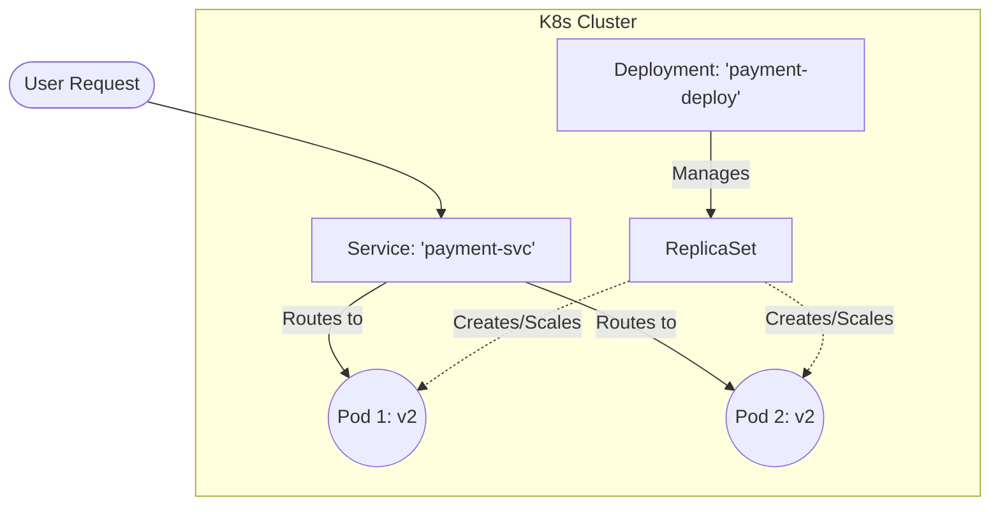
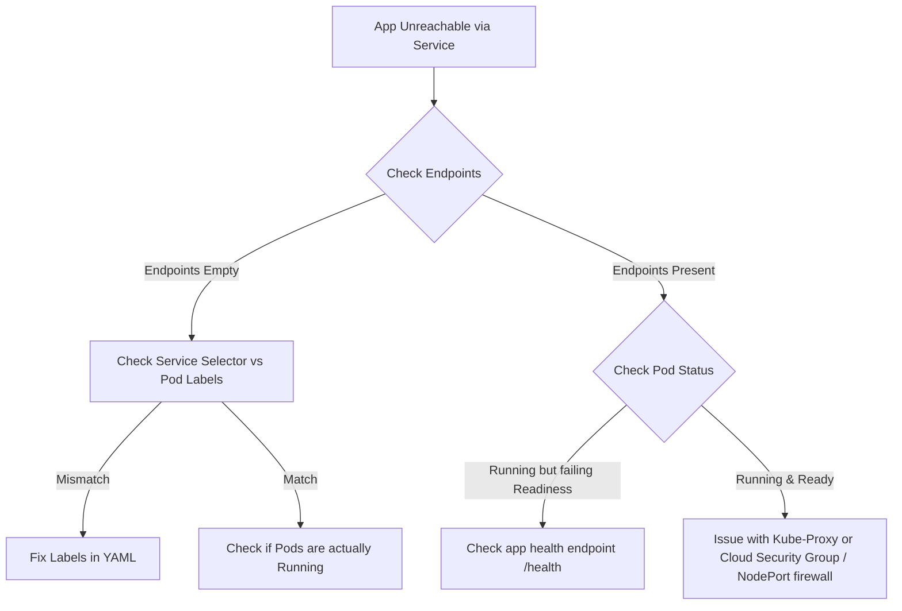

# K8S-02 Pods, Deployments, and Services

> [!important]
> **God Mode Vault**: Theory is good, but this is where the actual DevOps work happens. 90% of your daily job as a K8s engineer involves writing YAMLs for Pods, managing Deployments for zero-downtime rollouts, and configuring Services to route traffic.

## # Overview

**Ye kya hai?**
Kubernetes ke 3 sabse fundamental building blocks:
1. **Pod:** Sabse chota unit. Iske andar aapka container chalta hai.
2. **Deployment:** Pods ka manager. Ye ensure karta hai ki hamesha utne pods chalte rahein jitne aapne maange hain, aur updates ko smoothly handle karta hai.
3. **Service:** Network receptionist. Pods ke IP change hote rehte hain, Service unhe ek stable IP aur DNS name deta hai.

**Kyu use hota hai?**
Agar aap directly ek Docker container run karte ho aur wo crash ho jaye, toh wo band hi rahega. Par agar aap K8s Deployment use karte ho, toh K8s automatically ek naya Pod bana dega (Self-healing). Service ensure karti hai ki frontend hamesha backend se connect kar sake bina naye Pod ka IP jane.

**Real life example / Simple Analogy:**
- **Pod:** Ek worker/employee hai. Jo beemar pad sakta hai ya mar sakta hai (crash).
- **Deployment:** Ek Shift Manager hai. Agar usne decide kiya hai ki 5 workers duty pe hone chahiye, toh agar ek beemar ho jaye, wo turant naye worker ko hire (create) kar lega.
- **Service:** Ek Receptionist hai. Customers (users) direct workers ke paas nahi jate. Wo receptionist ko kaam dete hain, aur receptionist aage kisi bhi *free aur healthy* worker ko kaam bhej deti hai.

**Industry kaha use karti hai? / Real production use-case:**
Har ek microservice (e.g., Payment Service, Login Service) apna ek alag Deployment aur Service rakhti hai. Jab developer naya code push karta hai, toh Deployment "Rolling Update" ke through purane pods ko naye pods se dheere-dheere replace karta hai. Zero downtime!

**Architecture / Relationship Diagram:**


---

## # Working

**Internal working:**

### 1. Pods (The Workers)
- Pods "ephemeral" (temporary) hote hain. K8s inko pets ki tarah treat nahi karta, cattle (bhed-bakri) ki tarah treat karta hai. Mar gaye toh naye aayenge.
- Ek Pod me multiple containers ho sakte hain jo same localhost aur IP share karte hain (e.g., App container + Logging sidecar).
- K8s ko kaise pata pod theek hai? **Probes** ke through:
  - **Liveness Probe:** "Kya app zinda hai?" (Fail = Pod restart).
  - **Readiness Probe:** "Kya app traffic lene ke liye ready hai?" (Fail = Pod zinda rahega, par Service usko traffic nahi bhejegi).

### 2. Deployments & ReplicaSets (The Managers)
- **ReplicaSet:** Iska ek hi kaam hai — "N" number of pods maintain karna. 
- **Deployment:** ReplicaSets ko manage karta hai. Jab aap image update karte ho (`v1` se `v2`), Deployment naya ReplicaSet banata hai, usme pods badhata hai, aur purane ReplicaSet me pods kam karta hai (Rolling Update).

### 3. Services (The Network)
- Pods ka IP unke marne ke sath change ho jata hai.
- Service label selectors use karti hai (e.g., `app: payment`). Jis bhi pod par ye label hoga, Service usko traffic bhej degi.
- **Types of Services:**
  - **ClusterIP (Default):** Sirf cluster ke ANDAR baat karne ke liye. (e.g., Backend talking to DB).
  - **NodePort:** Har Worker node ki ek static port (30000-32767) khol deta hai. Bahar se access ke liye.
  - **LoadBalancer:** Cloud providers (AWS, Azure) me external LB banata hai jo NodePorts pe traffic bhejta hai.

---

## # Practical Lab

**Step-by-step implementation (Creating a Web App):**

Bajaaye basic YAML likhne ke, aap vault ke `examples/` folder se production-ready templates use kar sakte hain:
- Deployment YAML: [examples/04-Kubernetes/deployment.yaml](file:///C:/Users/SPTL/Documents/devops/devops/examples/04-Kubernetes/deployment.yaml)
- Service YAML: [examples/04-Kubernetes/service.yaml](file:///C:/Users/SPTL/Documents/devops/devops/examples/04-Kubernetes/service.yaml)

**Step 1: Write Deployment YAML (`deployment.yaml`)**
*Review the actual file for advanced settings like `resources` and `rollingUpdate` strategies.*
```yaml
apiVersion: apps/v1
kind: Deployment
metadata:
  name: frontend-deploy
spec:
  replicas: 3
  selector:
    matchLabels:
      app: frontend
  template: # This is the Pod template
    metadata:
      labels:
        app: frontend
    spec:
      containers:
      - name: nginx
        image: nginx:1.24
        ports:
        - containerPort: 80
        readinessProbe:
          httpGet:
            path: /
            port: 80
```

**Step 2: Write Service YAML (`service.yaml`)**
```yaml
apiVersion: v1
kind: Service
metadata:
  name: frontend-svc
spec:
  type: NodePort
  selector:
    app: frontend # Must match the Pod labels exactly!
  ports:
    - port: 80
      targetPort: 80
      nodePort: 30080
```

**CLI Method:**
```bash
cd ../../examples/04-Kubernetes/

# Apply both files
kubectl apply -f deployment.yaml
kubectl apply -f service.yaml

# Verify
kubectl get deploy,rs,pods,svc


# Access the app (if on minikube)
curl http://$(minikube ip):30080
```

---

## # Daily Engineer Tasks

- **L1 Engineer:** `kubectl scale deployment <name> --replicas=5` (scale up during load). `kubectl logs <pod>` to send error stack traces to devs.
- **L2 Engineer:** Writing the YAML files. Setting up proper `requests` and `limits` for CPU/RAM. Configuring Health Probes.
- **L3 / Senior Engineer:** Setting up advanced deployment strategies (Canary, Blue-Green using ArgoRollouts). Troubleshooting missing Endpoints.
- **Production Engineer / SRE:** Fine-tuning pod topology spread constraints so all 3 pods don't land on the same physical rack/zone in AWS.

---

## # Real Industry Tasks

- **Real tickets:** "Users are reporting 502 errors for 30 seconds every time we deploy." (Fix: Add readinessProbe so K8s waits for Java app to warm up).
- **Rollback:** Developer pushed bad code. `kubectl rollout undo deployment/frontend-deploy` karke instantly purane version pe wapas aana.
- **Health check:** Database credentials change hue aur app crash ho rahi hai. CrashLoopBackOff investigate karna.

---

## # Troubleshooting

**Common Issue 1: `CrashLoopBackOff`**
- **Symptoms:** Pod restart loop me fasa hai.
- **Root causes:** Missing Env variables, code syntax error, missing database connection.
- **Investigation:**
  ```bash
  kubectl logs <pod-name> --previous # Check logs before it crashed
  kubectl describe pod <pod-name> # Check events
  ```

**Common Issue 2: `ImagePullBackOff` / `ErrImagePull`**
- **Symptoms:** Pod start hi nahi ho raha.
- **Root causes:** Image ka naam/tag galat hai, ya private ECR/ACR registry ka password (imagePullSecret) missing hai.
- **Investigation:** `kubectl describe pod` -> Events me "Failed to pull image" dikhega.

**Common Issue 3: Service is not routing traffic**
- **Symptoms:** `curl` timeout ya Connection Refused.
- **Investigation:** `kubectl get endpoints frontend-svc`. Agar list empty hai, iska matlab Service ka `selector` (e.g., `app: frontend`) aur Pod ke `labels` match NAHI kar rahe. Spelling check karo!

---

## # Production Scenarios

### Scenario: Zero-Downtime Rollout fails and causes outage
**How to think:** A junior engineer updated a Deployment image to `v2`. The Java app takes 40 seconds to start. K8s killed `v1` pods and started `v2` pods, and immediately sent traffic to `v2`. But `v2` was still initializing. All users got 502 Bad Gateway.
**Where to check:** Deployment YAML configuration.
**Root Cause:** Missing `readinessProbe`. K8s thought the pod was ready the millisecond the container process started.
**Resolution:**
```yaml
        readinessProbe:
          httpGet:
            path: /health
            port: 8080
          initialDelaySeconds: 15
```
**Verification:** Run `kubectl rollout status deployment/my-app` and watch K8s wait for the pod to become "Ready" before killing the old pods.

---

## # Commands

| Command | Purpose | Syntax | Danger Level |
|---------|---------|--------|--------------|
| `kubectl run` | Create single unmanaged pod | `kubectl run test --image=nginx` | Low (Testing only) |
| `kubectl get deploy,pods`| View workloads | `kubectl get deploy,pods -n web` | Low |
| `kubectl edit deploy` | Live edit YAML in cluster | `kubectl edit deploy frontend` | Medium |
| `kubectl scale` | Manual scaling | `kubectl scale deploy frontend --replicas=10`| Medium |
| `kubectl set image` | Trigger rolling update | `kubectl set image deploy/api api=api:v2`| Medium |
| `kubectl rollout status` | Watch deployment progress | `kubectl rollout status deploy/api` | Low |
| `kubectl rollout undo` | Revert to previous version | `kubectl rollout undo deploy/api` | Medium |
| `kubectl port-forward` | Access internal pod/svc locally| `kubectl port-forward svc/db 5432:5432` | Low |

---

## # Cheat Sheet

- **Deployment vs Pod:** Never deploy naked Pods. Always use Deployments so they auto-restart.
- **Service Port mapping:** 
  - `port`: The port the Service listens on.
  - `targetPort`: The port the Container/Pod is listening on.
  - `nodePort`: The port on the physical Worker Node.
- **Labels:** K8s me har cheez Labels se connect hoti hai. Service -> Pods (via selectors).

---

## # SOP & Runbook

**SOP: Safe Production Deployment Rollout**
**Purpose:** Update application image without downtime.
1. `kubectl set image deploy/my-app my-app=my-repo/my-app:v2.0.0`
2. Monitor: `kubectl rollout status deploy/my-app`
3. Validate: Run smoke tests against the public URL.
4. If smoke tests fail: `kubectl rollout undo deploy/my-app`

**Runbook: Pods Stuck in Pending**
**Detection:** Alert: `PodsPendingFor5Mins`
**Investigation:**
1. `kubectl get pods` -> See Pending state.
2. `kubectl describe pod <name>` -> Look at `FailedScheduling` event.
3. Look for "Insufficient cpu" or "Insufficient memory" or "node(s) had taint".
**Resolution:** Add a new worker node, or decrease the `resources.requests` in the deployment YAML.

---

## # KB Article

**Problem:** `Service Endpoints are empty`
**Environment:** Kubernetes, any CNI.
**Symptoms:** `kubectl get svc` shows ClusterIP, but `kubectl get endpoints <svc>` returns nothing. App cannot be reached.
**Cause:** Mismatch between Service `selector` and Deployment `template.metadata.labels`.
**Resolution:**
Check `kubectl get svc my-svc -o yaml` and note the selector. Check `kubectl get pods --show-labels`. Ensure they match exactly (case-sensitive).

---

## # Best Practices

- **Never use `latest` tag:** Hamesha specific tags use karo (e.g., `v1.2.3`). `latest` use karne par K8s ko pata nahi chalta ki image update hui hai.
- **Requests & Limits:** Har pod me CPU/Memory requests aur limits lagao, warna OOMKilled issues aayenge.
- **Graceful Shutdown:** Application code ko `SIGTERM` signal handle karna aana chahiye, taaki pod delete hote time app database transactions ko theek se close kar sake (0-downtime).

---

## # Beginner Mistakes

- **Mistake:** Deploying a Pod using `kubectl run` in production.
- **Impact:** Agar wo worker node mar gaya, toh pod hamesha ke liye gayab. K8s usko wapas nahi layega.
- **Correct approach:** Hamesha `Deployment` (ya StatefulSet/DaemonSet) use karo.

---

## # Advanced Concepts

- **Headless Service:** Jab aapko ClusterIP nahi chahiye, aur aap direct har Pod ka IP DNS se resolve karna chahte ho. (Set `clusterIP: None` in Service). Database clusters (StatefulSets) me use hota hai.
- **EndpointSlices:** Jab 1000+ pods hote hain, purana Endpoints object bahut bada ho jata tha. K8s ne `EndpointSlices` banaye jo network updates ko chote chunks me bhejte hain, saving API server CPU.
- **Pod Topology Spread Constraints:** Ensure karna ki aapke 3 pods ek hi Availability Zone me na chale jayein, taaki zone fail hone par app down na ho.

---

## # Related Topics

- Prerequisites: [[04-Orchestration/K8S-01 Kubernetes Architecture|Kubernetes Architecture]]
- Configuration: [[04-Orchestration/K8S-03 ConfigMaps and Secrets|ConfigMaps and Secrets]]
- External Access: [[04-Orchestration/K8S-05 Ingress and Networking|Ingress Controllers]]
- Advanced Scheduling: [[04-Orchestration/K8S-10 Kubernetes Autoscaling|HPA and VPA]]

---

## # Flashcards

**Q:** Liveness aur Readiness probe me kya difference hai?
**A:** Liveness pod ko **Restart** karta hai agar app dead ho. Readiness pod ko Service Endpoints se **Remove** karta hai agar app busy ho (no restart).

**Q:** Deployment me RollingUpdate ka kya matlab hai?
**A:** Naye pods ko ek-ek karke create karna aur purano ko ek-ek karke delete karna, bina application ko down kiye.

---

## # Revision

- **5 min revision:** Pod runs container. Deployment manages replica sets & rolling updates. Service provides stable IP via label selectors. Fix Pending = Resources. Fix CrashLoop = App Code/Env. Fix ImagePull = Registry Auth/Spelling.
- **Interview revision:** Must know probes. Must know `kubectl rollout undo`. Understand how service selectors map to pod labels.

---

## # Real Production Logs

**OOMKilled Log Investigation:**
```bash
# kubectl describe pod memory-leak-app

State:          Terminated
  Reason:       OOMKilled
  Exit Code:    137
```
**Explanation:** Exit Code 137 ka matlab hai Linux OOM Killer ne container ko SIGKILL bheja kyunki usne apne RAM limit se zyada memory (e.g. 512MB) use kar li thi. Fix: App ka memory leak theek karo ya limit badhao.

---

## # Decision Tree



---

## # INTERVIEW PREPARATION (HIGH PRIORITY)

### Top 20 Interview Questions

**Basic:**
1. What is a Pod?
2. What is the difference between a Pod and a Deployment?
3. What is a ReplicaSet? Do we create it manually?
4. What are the types of Services in Kubernetes?
5. How do you expose a Kubernetes application to the outside world?

**Intermediate:**
6. Explain the difference between Liveness and Readiness probes.
7. What happens if a Readiness probe fails? Does the pod restart?
8. How does a Rolling Update work in a Deployment?
9. Explain how Services find the Pods they need to route traffic to.
10. What is a NodePort service and what is its default port range?

**Advanced / FAANG:**
11. A deployment is configured with 3 replicas. A node goes down. Explain exactly how Kubernetes recovers the pod on a different node.
12. What is a Headless Service? When and why would you use it?
13. You noticed your Pods are continually being OOMKilled. How do you troubleshoot and fix this in a Java-based application?
14. Explain `maxSurge` and `maxUnavailable` in Deployment strategies.
15. What are Init Containers? How do they differ from regular containers in a pod?

**Scenario Based:**
16. You applied a new Deployment, but users are immediately seeing 502 Bad Gateway errors for 10 seconds during the update. How do you fix this? *(Ans: Add Readiness probes).*
17. Your pod status is `CrashLoopBackOff`. You run `kubectl logs` but see nothing. What could be the issue? *(Ans: The app might be logging to a file instead of stdout, or it's a structural error like a missing entrypoint script).*
18. You created a Service, but `kubectl get endpoints` shows nothing. What is your first step? *(Ans: Verify Service `selector` matches Pod `labels` exactly).*
19. Developer pushed a bad image tag and production is down. What is the fastest command to restore service? *(Ans: `kubectl rollout undo deployment/<name>`).*
20. A pod needs to initialize a database schema before the main application container starts. How do you achieve this? *(Ans: Use an `initContainer`).*

**Top 10 Production Issues (FAANG/SRE Level):**
1. `OOMKilled` (Exit Code 137) due to incorrect JVM heap limits inside the K8s limit constraints.
2. 502 Errors during Rolling Updates due to missing graceful shutdown (`preStop` hooks) and readiness probes.
3. NodePort exhaustion when deploying hundreds of services.
4. ImagePullBackOff due to Docker Hub rate limits in CI/CD environments.
5. Asymmetric routing drops in cloud provider LoadBalancers.
6. CPU Throttling even when CPU is available, due to tight `limits` causing Linux CFS quota enforcement.
7. Pods stuck in `Terminating` state because a Finalizer is blocking deletion.
8. Connection timeouts because a Service endpoint is routing to a Pod that is technically running but internally deadlocked (missing Liveness probe).
9. Accidental scaling of Deployments down to 0 via buggy CI/CD scripts.
10. `CrashLoopBackOff` loop consuming excessive API Server resources and creating massive log bloat on worker nodes.

**Microsoft / Azure AKS Style Questions:**
- How does an Azure Standard LoadBalancer integrate with a K8s `type: LoadBalancer` Service?
- Can multiple K8s Services share the same Azure Public IP address? *(Ans: Yes, via Ingress Controller).*

**TCS / Infosys / Accenture Style Questions:**
- Give the exact command to scale a deployment.
- What is the default update strategy of a Deployment? (Ans: RollingUpdate).
- Can a pod have multiple containers?

**Common Interview Mistakes:**
- Saying "Liveness probe removes pod from service". (False, Readiness does that. Liveness restarts it).
- Confusing NodePort (port on host) with TargetPort (port on container).
- Saying "Deployment manages pods directly". (False, Deployment manages ReplicaSets, which manage Pods).

---
