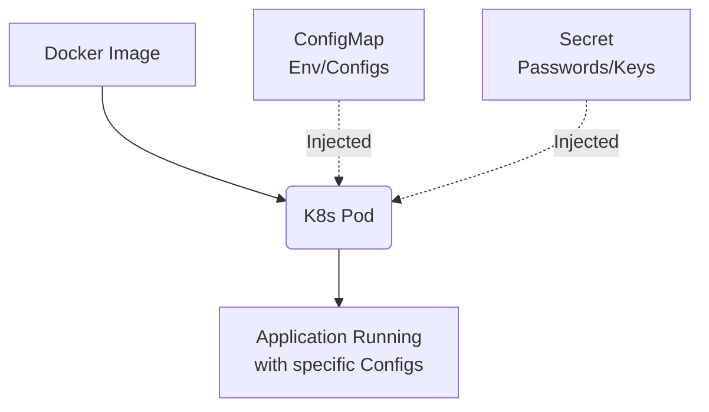
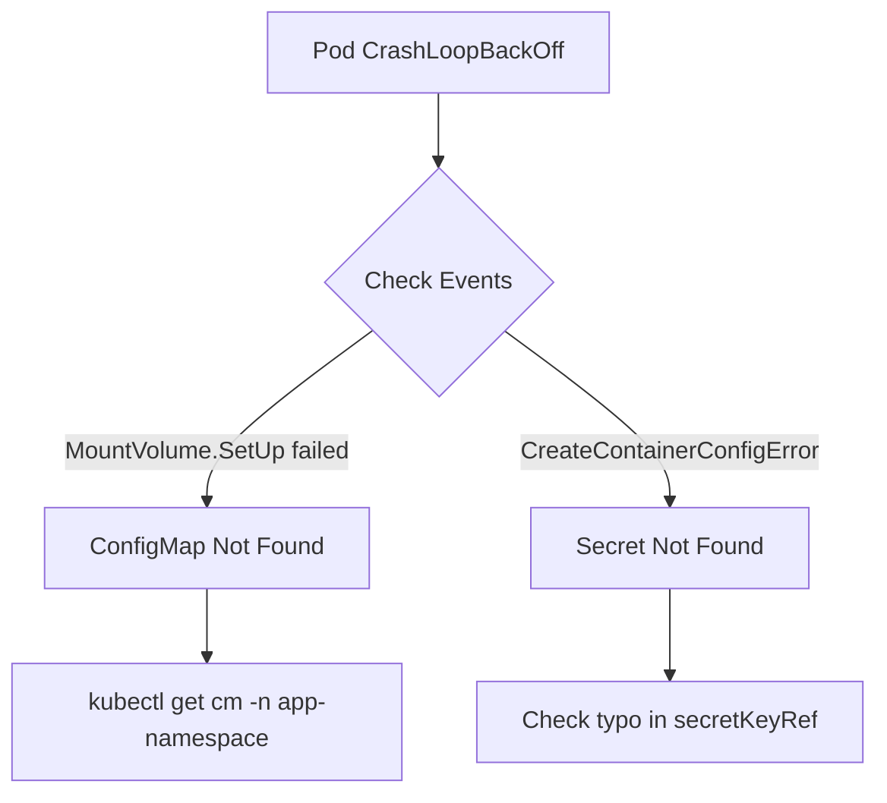

# K8S-03 ConfigMaps and Secrets

# Overview
Kubernetes me applications ko run karne ke liye hume configuration aur passwords chahiye hote hain. Agar hum inko container image ke andar hardcode kar de (bake karein), toh har environment (dev, qa, prod) ke liye alag image banani padegi, jo ki galat hai. ConfigMaps aur Secrets is problem ko solve karte hain. Ye K8s ke objects hain jo configuration (ConfigMaps) aur sensitive data (Secrets) ko store karte hain, taaki hum ek hi container image ko har jagah reuse kar sakein.

Real life example: Container ek worker (Pod) hai. ConfigMap ek instruction manual hai ki kaam kaise karna hai. Secret ek locker ki chabhi (password) hai. Aap worker ko bina manual ya chabhi ke hire karte ho (image), aur jab usko kaam pe lagate ho, tab aap usko manual aur chabhi pakda dete ho taaki code me koi changing na aaye.



# Working
Internal working K8s me in objects ki kaafi simple hai. ConfigMaps aur Secrets dono `etcd` me store hote hain (Kubernetes ka brain/database). Jab aap ek Pod banate ho aur usme in objects ko reference karte ho, `kubelet` inko etcd se fetch karta hai aur container ke andar inject karta hai.

Ye injection mainly do tarah se hota hai:
1. **Environment Variables:** Data as key-value pair env variables me pass ho jata hai. (Fast, par CM update hone par pod ko restart required hota hai updates lene ke liye).
2. **Volume Mounts:** Data as physical files container ke file system me mount ho jata hai. (Kubelet apne aap mounted file ko update kar deta hai bina pod restart kiye).

Secrets bas Base64 encoded hote hain K8s me by default, ye encrypted nahi hote hain. Pura cluster ka `etcd` encryption at rest on karna padta hai true security ke liye.

# Installation
K8s me ConfigMaps aur Secrets built-in (naturally) available hote hain. Inka koi alag se "installation" nahi hota. 

Par modern DevOps me advanced tools use hote hain jinke installation required hai:
- **Sealed Secrets (Bitnami):** Helm chart ke through cluster me controller dalkar and `kubeseal` CLI use karke install karte hain.
- **External Secrets Operator (ESO):** Helm chart se cluster me install hota hai aur AWS/GCP/Vault se API ke through connect karke fetch karta hai.

# Practical Lab
Step-by-step implementation of ConfigMaps & Secrets.

Bajaaye CLI me manually commands type karne ke, aap vault ke `examples/` folder se ready-made declarative YAML use kar sakte hain:
- Template: [examples/04-Kubernetes/configmap-secret.yaml](file:///C:/Users/SPTL/Documents/devops/devops/examples/04-Kubernetes/configmap-secret.yaml)

### Step 1: Navigate and Deploy
```bash
cd ../../examples/04-Kubernetes/
kubectl apply -f configmap-secret.yaml
```

### Step 2: Verify Injection
```bash
# Check if the environment variables are injected into the Pod
kubectl exec env-test-pod -- env | grep -E "APP_COLOR|password"
```

# Daily Engineer Tasks
- **L1/L2 Engineer:** Basic ConfigMaps create karna, YAML me typos dhoondhna, troubleshoot karna ki mount huye ya nahi. Pod ko env var mil raha hai ya nahi `kubectl exec` karke check karna.
- **L3/Senior Engineer:** GitOps practices setup karna. Sealed Secrets ya ESO setup karna Vault ya AWS Secrets Manager ke sath integration ke liye, production deployments rollouts verify karna.
- **Security/DevSecOps Engineer:** Ensure karna ki RBAC se developers sirf apne namespace ke secrets access kar sakein. Check karna ki default K8s Secrets kaha plaintext ya github me push to nahi ho rahe.

# Real Industry Tasks
- **App Config Change On-the-fly:** Production logs bhari ho gaye toh application ka log level INFO se DEBUG/WARN karna ConfigMap update karke.
- **TLS Certificate Renewal:** TLS Secrets (`kubernetes.io/tls`) ko replace/update karna jab Ingress ke SSL certificates expire ho rahe ho.
- **GitOps Secrets Migration:** Purane plain-text Secrets ko migrate karke AWS Secrets Manager me dalna aur K8s me External Secrets implement karna security audit fail hone ke baad.

# Troubleshooting
**Problem:** Pod stuck in `CreateContainerConfigError`.
**Symptoms:** Pod status error dikhata hai. 
**Root Cause:** ConfigMap ya Secret jisko Pod refer kar raha hai, wo us namespace me exist hi nahi karta ya uske naam me typo hai.
**Resolution:** `kubectl get cm` ya `kubectl get secret` karke verify karo. K8s case-sensitive hai, check spelling.

**Problem:** Env var me unexpected space/newline aa rahi hai aur DB auth fail ho raha hai.
**Root Cause:** Jab manually base64 encode kiya `echo "pass" | base64` use karke, toh `echo` ne extra newline `\n` daal di.
**Resolution:** Hamesha `echo -n "password" | base64` use karo (`-n` prevents trailing newline).

**Problem:** Naya app-config update K8s me apply kia, par application behavior change nahi hua.
**Root Cause:** Agar configuration env variables ke through mili thi, K8s running Pods ko dynamically update nahi karta. 
**Resolution:** Pod restart zaroori hai. `kubectl rollout restart deploy/my-app` use karke nayi value pass karo.

# Interview Preparation
**Basic:** What is the difference between ConfigMap and Secret?
*Answer:* ConfigMap non-sensitive configs (URLs, file paths, parameters) ke liye use hota hai. Secret sensitive data (DB passwords, API keys) ke liye hota hai aur data ko Base64 me encode karke rakhta hai.

**Intermediate:** Are Kubernetes Secrets fully encrypted?
*Answer:* Nahi, by default wo encrypted at rest nahi hote, sirf Base64 encoded hote hain jo easily decode ho jate hain. Real encryption ke liye Cluster Admin ko etcd encryption enable karni padti hai ya External Secrets use karna chahiye.

**Scenario Based:** You need to mount `config.json` inside `/app/settings/` without overwriting the existing files in that folder. How?
*Answer:* Main volume mount toh use karunga but saath me `subPath: config.json` flag use karunga volumeMount definition ke andar taaki exact single file push ho, pura directory overwrite na ho.

**Advanced:** Can a Pod in `Namespace-A` read a ConfigMap in `Namespace-B`?
*Answer:* Nahi, ConfigMaps and Secrets strictly namespace-scoped hote hain. Cross-namespace reading allowed nahi hai. Alag se tools like Kyverno ya Reflector use karke unhe replicate karna padta hai.

# Production Scenarios
**Scenario:** Production deployment crash ho raha hai nayi version push ke baad "Invalid Database Credentials" dikhake.
- **How to think:** Application DB ke pass le kaha se raha hai? ConfigMap se, Secret se ya hardcoded? 
- **Investigation:** Check Secret value manually first: `kubectl get secret db-credentials -o yaml`, decode karke verify karo ki naya pass updated hai. Phir pod env check karo `kubectl exec my-app -- env`.
- **Root Cause:** SRE team ne AWS me pass rotate kia, K8s ka secret update ho gaya, par pod restart nahi hone se purana pwd RAM me fas gaya hai.
- **Resolution:** Hamesha config changes ke baad `kubectl rollout restart deploy/<app>` karein, ya `Reloader` tool deploy karein jo change detect karte hi automatic rollout kare.

# Commands
| Command | Purpose | Danger Level |
|---------|---------|--------------|
| `kubectl create configmap <name> --from-literal=k=v` | CM banane ke liye. | Low |
| `kubectl get secret <name> -o yaml` | Secret base64 values nikalne ke liye. | High (Prod me leak) |
| `echo -n "pass" \| base64` | String ko secure format me K8s yaml ke liye convert karna. | Low |
| `echo "cGFzcw==" \| base64 -d` | Secret ki value padhne ke liye base64 decode. | Low |
| `kubectl rollout restart deploy/<name>` | Deployment ko zero-downtime refresh karke nayi env variables inject karna. | Medium |

# Cheat Sheet
- **Injection methods:** 
  - `envFrom:` (poora ConfigMap ya Secret utha lo).
  - `valueFrom.configMapKeyRef:` (sirf ek key specific uthao).
  - `volumes:` (as files inside directory mount karo).
- **Secret types:** `Opaque` (generic data), `kubernetes.io/tls` (SSL certs), `kubernetes.io/dockerconfigjson` (Private registry image pull).
- **GitOps Hack:** GitHub me Secrets yaml commit nahi kar sakte. Use SealedSecrets or SOPS.

# SOP & Runbook & KB Article
**KB Article: Pod stuck in ImagePullBackOff due to Private Registry Auth**
- **Problem:** Pod AWS ECR ya private Docker hub se image pull nahi kar paa raha.
- **Cause:** K8s worker node ke paas credentials nahi hai auth karne ke.
- **Resolution:**
  1. `docker-registry` type secret banayein: `kubectl create secret docker-registry my-registry --docker-server=... --docker-username=...`
  2. Deployment spec me add karein:
     ```yaml
     spec:
       imagePullSecrets:
         - name: my-registry
     ```
- **Verification:** `kubectl describe pod` chalayein, event section me `Successfully pulled image` aana chahiye.

# Best Practices & Beginner Mistakes
**Best Practices:**
- Production me configuration files ko `immutable: true` set karo YAML me. Isse accidental overrides roke jayenge, aur kubelet in files ko continuously track karna band kar dega, improving performance of API server drastically.
- Never write credentials inside dockerfile (`ENV PASS=xyz`). 

**Beginner Mistakes:**
- `mountPath: /etc/nginx/` declare kar diya `subPath` ke bina. Impact: K8s pura `/etc/nginx/` khali kar dega aur sirf apka ek file mount karega, jisse container crash ho jayega kyuki baki jaruri config ud gaye.
- Base64 encode karte samay newline escape karna bhul jana.

# Advanced Concepts
**External Secrets Operator (Architecture):** 
Enterprise me ESO heavily use hota hai. Instead of K8s, developers password ko AWS Secrets Manager me dalkar ESO ka K8s custom resource `ExternalSecret` deploy karte hain. ESO K8s me ek pod ki tarah chalta hai, AWS API call karta hai, credentials lata hai aur cluster me automatically native `Secret` bana deta hai. App us secret ko normally consume karti hai. Result = 100% Secure GitOps pipeline.

**Reloader Controller:** 
Stakater Reloader ek famous utility hai. Jab ap apne Deployment annotations me `reloader.stakater.com/auto: "true"` dalte ho, aur ap CM/Secret change karte ho, toh ye controller use automatically detect karke zero-downtime Pod rollout restart trigger kar deta hai. 

# Related Topics & Flashcards & Revision
- [[04-Orchestration/K8S-02 Pods Deployments Services|Pods and Deployments]]
- [[09-Security-DevSecOps/SEC-03 Secrets Management|Secrets Management]]
- [[00-MOC/Master-Index|Master Index]]

**Flashcard:** Do you need to restart a pod if a ConfigMap mounted as a Volume is updated?
*Answer:* No, Kubelet eventually updates the file on the mount path automatically. Par app reload support karti ho, warna pod restart karna padta hai.

# Real Production Logs & Commands & Decision Tree


```bash
# Debugging Log Example
$ kubectl describe pod my-web-pod
Warning  FailedMount  4m  kubelet  MountVolume.SetUp failed for volume "nginx-conf" : configmap "my-nginx-config" not found
# Meaning: Apne Pod ke manifest me nginx-conf volume banaya hai, but K8s cluster me my-nginx-config name ka ConfigMap apke namespace me hai hi nahi. Make sure aapne use pehle deploy kiya ho.
```

# AI Enhancement
*Automatically injected production knowledge:*
- **RBAC Strict Controls:** Developers should only have `get`, `list` for ConfigMaps. For Secrets, they shouldn't even have `get` permissions in production namespaces to avoid base64 leakage. Secrets should be handled fully via CI/CD.
- **Encryption at rest:** Hamesha check karein KubeAPI server configurations, `--encryption-provider-config` flag on hona chahiye etcd db secure karne ke liye.
