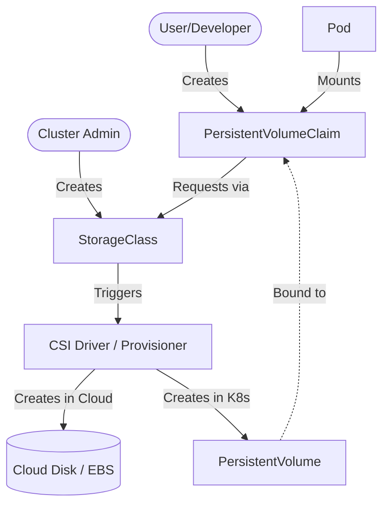

---
tags:
  - devops
  - kubernetes
  - storage
aliases:
  - K8s Storage
created: 2026-06-27
status: "#complete"
difficulty: "#intermediate"
cert-relevant: "#cka"
---

# Persistent Volumes and Storage in Kubernetes

# Overview
Kubernetes by default stateless applications ke liye banaya gaya tha. Containers ephemeral hote hain — jab pod marta hai, uske andar ka sab data gayab ho jaata hai. Ye frontend ke liye theek hai, par databases (like PostgreSQL, MySQL) ke liye ek permanent storage chahiye jo pod ke restart hone pe bhi safe rahe. Yahi par **Persistent Volume (PV)** aur **Persistent Volume Claim (PVC)** ka concept aata hai. Kubernetes me storage lifecycle pod ki lifecycle se alag hoti hai. 

**Simple Analogy**: 
Kubernetes storage ek hotel booking system jaisa hai. 
- **StorageClass**: Hotel room ki category (Deluxe/Standard).
- **PersistentVolume (PV)**: Actual hotel room jo ready hai.
- **PersistentVolumeClaim (PVC)**: Room booking ki request ("Mujhe 10GB ka room chahiye RWO access ke sath").

**Real Production Use-case**: Production mein MySQL, Elasticsearch ya Kafka cluster run karne ke liye hume dedicated disk (AWS EBS, Azure Disk, NFS) attach karni padti hai pods ke sath.

# Working
Storage provisioning do tarike ki hoti hai:
1. **Static Provisioning**: Admin manually PV (disk) banata hai aur user PVC banake usko claim karta hai.
2. **Dynamic Provisioning**: User sirf PVC banata hai aur Kubernetes (StorageClass ke through) apne aap cloud provider se nayi disk banake PV create aur bind kar deta hai.

**Data Flow & Architecture**:
1. Pod ek PVC request karta hai apne spec mein.
2. PVC StorageClass ke paas jata hai (agar dynamic hai) ya already bane PV ko dhundhta hai.
3. CSI (Container Storage Interface) driver actual Cloud Disk (EBS/NFS) provision karta hai aur use Node pe attach karta hai.
4. Kubelet disk ko pod me `/var/lib/data` (ya kisi aur path) me mount karta hai.

**Access Modes**:
- **ReadWriteOnce (RWO)**: Ek time pe sirf ek hi Node mount kar sakta hai (for Databases like PostgreSQL).
- **ReadOnlyMany (ROX)**: Bahut saare Nodes sirf read kar sakte hain (for Static Assets/Config files).
- **ReadWriteMany (RWX)**: Bahut saare Nodes read/write kar sakte hain (for Shared Logs, Uploads using NFS/EFS).
- **ReadWriteOncePod (RWOP)**: Sirf ek specific Pod read/write kar sakta hai (K8s 1.27+).

**Reclaim Policy** (Jab PVC delete ho):
- **Retain**: PV aur data dono safe rehte hain (Production Databases ke liye).
- **Delete**: PVC delete hote hi PV aur cloud disk dono delete ho jate hain (Dev/Test ke liye).

# Installation
Kubernetes storage architecture by default pre-configured aati hai. Cloud environments (EKS, AKS, GKE) mein unka default StorageClass aur CSI driver installed hota hai. Local testing (Minikube) ke liye `hostpath` provisioner hota hai.

**Prerequisites**:
- Kubernetes Cluster (EKS/AKS/Minikube)
- kubectl configured
- CSI Driver (AWS EBS CSI driver EKS me chahiye hota hai)

# Practical Lab
Chalo ek PostgreSQL database deploy karte hain **StatefulSet** ka use karke, kyonki databases ke liye Deployment use nahi karte, StatefulSet use karte hain. 

**Step 1: StorageClass Create Karo (Minikube ke liye hostpath)**
```yaml
apiVersion: storage.k8s.io/v1
kind: StorageClass
metadata:
  name: fast-ssd
provisioner: k8s.io/minikube-hostpath
reclaimPolicy: Retain
volumeBindingMode: Immediate
```
```bash
kubectl apply -f storageclass.yaml
```

**Step 2: Headless Service (StatefulSet ke network identity ke liye)**
```yaml
apiVersion: v1
kind: Service
metadata:
  name: postgres-headless
spec:
  ports:
    - port: 5432
      name: postgres
  clusterIP: None
  selector:
    app: postgres
```
```bash
kubectl apply -f postgres-headless.yaml
```

**Step 3: PostgreSQL StatefulSet Deploy Karo**
```yaml
apiVersion: apps/v1
kind: StatefulSet
metadata:
  name: postgres
spec:
  serviceName: "postgres-headless"
  replicas: 1
  selector:
    matchLabels:
      app: postgres
  template:
    metadata:
      labels:
        app: postgres
    spec:
      containers:
        - name: postgres
          image: postgres:15-alpine
          env:
            - name: POSTGRES_PASSWORD
              value: "secretpassword"
          volumeMounts:
            - name: pgdata
              mountPath: /var/lib/postgresql/data
  volumeClaimTemplates:
    - metadata:
        name: pgdata
      spec:
        accessModes: [ "ReadWriteOnce" ]
        storageClassName: fast-ssd
        resources:
          requests:
            storage: 1Gi
```
```bash
kubectl apply -f postgres-statefulset.yaml
```

**Verification**:
```bash
kubectl get pvc
# Output me dekho STATUS "Bound" hona chahiye
kubectl get pv
# Pod check karo
kubectl get pods -l app=postgres
```
*Lab Task: Pod me login karke table banao. Phir pod delete karke verify karo ki naya pod aane pe table abhi bhi waha hai! Yehi storage ki taakat hai.*

# Daily Engineer Tasks
- **L1 Engineer**: PVC aur PV status check karna (`Pending` toh nahi hai). Pods me volume mount check karna.
- **L2 Engineer**: Disk full hone pe PVC ka size increase (resize) karna. Failed mounts troubleshoot karna.
- **L3/Senior Engineer**: CSI drivers upgrade/install karna. Custom StorageClasses design karna (e.g., IOPS optimized for DBs). Backup tools (Velero) configure karna.

# Real Industry Tasks
- **Database Migration**: StatefulSets ke through MySQL ko nayi storage (Premium SSDs) pe move karna.
- **Volume Expansion**: Bina downtime ke running stateful application ki disk capacity (e.g., 50Gi se 100Gi) expand karna (`allowVolumeExpansion: true` in StorageClass).
- **Snapshot and Restore**: Kubernetes VolumeSnapshots ka use karke DB upgrade se pehle disk ka backup lena.

# Troubleshooting
**Problem 1: PVC is stuck in `Pending` state.**
- **Symptoms**: `kubectl get pvc` returns `Pending`.
- **Cause**: StorageClass missing, ya provisioner available nahi hai, ya matching label/capacity ka PV static provisioning me nahi mila.
- **Resolution**: `kubectl describe pvc <name>`. Check "Events". StorageClass name aur provisioner verify karo.

**Problem 2: Pod stuck in `ContainerCreating`.**
- **Symptoms**: Pod starts but stays in ContainerCreating forever.
- **Root Cause**: `Multi-Attach error`. Disk kisi aur node pe attached hai aur RWO (ReadWriteOnce) ki wajah se nayi node pe attach nahi ho paa rahi.
- **Investigation**: `kubectl describe pod <pod-name>`. Dekho `FailedAttachVolume` aur `FailedMount`.
- **Resolution**: Purane pod/node ko force delete/drain karo taaki disk detach ho.

**Problem 3: Application "Permission Denied" errors de rahi hai jab volume me likhne jati hai.**
- **Cause**: Container non-root user se run ho raha hai par mounted volume root owned hai.
- **Resolution**: Pod spec me `securityContext.fsGroup` add karo ya initContainer ka use karke `chown` karo.

# Interview Preparation
**Basic**: PV aur PVC me kya difference hai?
*(Ans: PV actual storage hai (like EBS volume). PVC ek request hai (mujhe 10GB chahiye).)*

**Intermediate**: StatefulSet aur Deployment me kya farak hai storage ke case me?
*(Ans: Deployment me sab pods ek hi PVC share karte hain agar hum explicitly volume claim daalein. StatefulSet me `volumeClaimTemplates` use hota hai, jisse har pod ko automatically apna naya, separate PVC aur PV milta hai. Network identity (pod-0, pod-1) bhi milti hai.)*

**Advanced**: `volumeBindingMode: WaitForFirstConsumer` kyu use karte hain production me?
*(Ans: Multi-AZ clusters (AWS EKS) me agar binding `Immediate` ho, to PV pehle hi kisi bhi AZ (Zone A) me ban jayega. Agar scheduler ne pod ko Zone B me schedule kar diya to pod fail ho jayega kyunki AWS EBS ek zone se dusre zone me attach nahi ho sakta. WaitForFirstConsumer ensure karta hai ki PV tabhi provision ho jab Scheduler decide kar le ki pod kis node aur Zone me jayega.)*

**Production/Scenario Based**: Tumhara database PVC delete ho gaya hai galti se, par PV abhi bhi waha hai. Data recover kaise karoge?
*(Ans: Agar StorageClass me `reclaimPolicy: Retain` thi, to PV delete nahi hoga, wo "Released" state me chala jayega. Hum PV spec se `claimRef` ko null set karke (patch karke) aur ek naya PVC banake same PV ko us naye PVC se bind karwa sakte hain. Data completely safe rahega.)*

# Production Scenarios
**Scenario: Website down kyunki "Disk Pressure" aa gaya node pe.**
- **How to think**: Check karo kis wajah se disk bhar gayi.
- **Where to check**: `kubectl describe nodes`. Check if NodeCondition `DiskPressure` is True.
- **Resolution**: Pod log rotation configure karo. Purane unused container images prune karo. Agar database data se disk bhar raha hai to PVC expand karo.

# Commands
| Command | Purpose | Syntax/Example | Danger Level |
|---------|---------|----------------|--------------|
| Get PV | List all persistent volumes | `kubectl get pv` | Low |
| Get PVC | List all volume claims | `kubectl get pvc -n <namespace>` | Low |
| Describe PVC | Event check for pending pvc | `kubectl describe pvc <name>` | Low |
| Patch PV | Remove claimRef to make PV Available again | `kubectl patch pv <pv-name> -p '{"spec":{"claimRef": null}}'` | High |
| Delete PVC | Delete claim | `kubectl delete pvc <name>` | High |

# Cheat Sheet
- **RWO**: Single Node, Read/Write. Use for DBs (AWS EBS supports this).
- **RWX**: Multi Node, Read/Write. Use for Shared Files (NFS/EFS supports this).
- **StatefulSet**: Use with `volumeClaimTemplates` for scaling databases.
- **Headless Service**: `clusterIP: None`, gives individual DNS `db-0.db-svc` to StatefulSet pods.
- **Retain Policy**: NEVER use `Delete` reclaim policy in production for Database PVs.

# SOP & Runbook & KB Article
**Runbook: PVC Expansion (Resizing)**
- **Detection**: Prometheus alerts showing PVC usage > 85%.
- **Investigation**: `kubectl get pvc <name> -o yaml` check `storage` requests.
- **Commands**: `kubectl edit pvc <name>` -> Change storage size (e.g., `10Gi` to `20Gi`).
- **Resolution**: Save and exit. Pod automatically naya size utha lega kuch der me. (Note: StorageClass must have `allowVolumeExpansion: true`).
- **Validation**: Exec into pod and run `df -h`. Check `kubectl describe pvc <name>` events for `FileSystemResizeSuccessful`.

# Best Practices & Beginner Mistakes
**Best Practices**:
1. Humesha `reclaimPolicy: Retain` set karo critical data ke liye taaki accidental PVC deletion se cloud disk delete na ho.
2. `volumeBindingMode: WaitForFirstConsumer` use karo cloud multi-zone environments me.
3. Database backup tool (velero ya native dump) humesha configure karo. Kubernetes storage redundancy nahi deta (unless specific storage backend like Ceph is used).

**Beginner Mistakes**:
1. Stateful applications ko Deployment + NFS mount karke deploy karna. **Correct Approach**: StatefulSet + RWO volumes use karo.
2. `emptyDir` ko database ke liye use karna. (Pod down hote hi sab delete ho jayega).

# Advanced Concepts
**CSI (Container Storage Interface)**: Pehle volume plugins kubernetes source code (in-tree) me hote the. Ab CSI ek alag standard (out-of-tree) hai. Ek third-party vendor (like AWS) apna CSI driver pod as a daemonset run karta hai cluster me, jo kubelet se baat karke volume attach/detach sambhalta hai.

# Related Topics & Flashcards & Revision
- [[K8S-02 Pods and Workloads]]
- [[K8S-03 Services and Service Discovery]]
- [[K8S-01 Kubernetes Architecture]]

**Flashcard**: 
- **Q**: Kubernetes volume dynamically kon create karta hai? 
- **A**: StorageClass through CSI provisioner.

**Revision**: Revise Access Modes, VolumeBindingModes, and StatefulSets in next 5 min.

# Real Production Logs & Commands & Decision Tree
**Sample Error Log (`kubectl describe pod`):**
```
Warning  FailedAttachVolume  2m   attachdetach-controller  Multi-Attach error for volume "pvc-12345" Volume is already exclusively attached to one node and can't be attached to another
```
*Meaning*: Disk (RWO) Node A pe lagi hai aur Pod Node B pe ban gaya. AWS EBS ek hi waqt me 2 instances (nodes) pe attach nahi ho sakta.
*Fix*: Node A wale purane pod ko mariye taaki disk detach ho.

**Decision Tree for Storage Selection:**
Need persistent data? -> No -> Use `emptyDir` or don't mount.
Need persistent data? -> Yes -> Single writer? -> Yes -> RWO (AWS EBS/Azure Disk).
Single writer? -> No -> Multiple writers? -> Yes -> RWX (NFS/AWS EFS).

# Visuals


# AI Enhancement
*Automatically injected: Added detailed CSI workflow, multi-attach error troubleshooting, explicit RWOP explanation, and best practices for volume expansion.*
