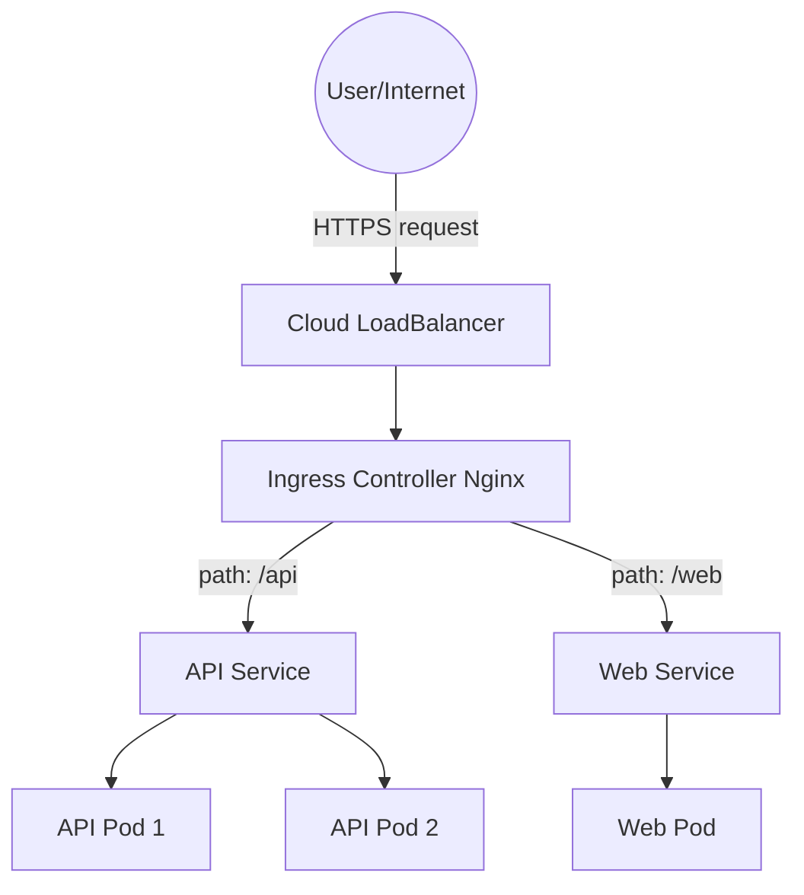
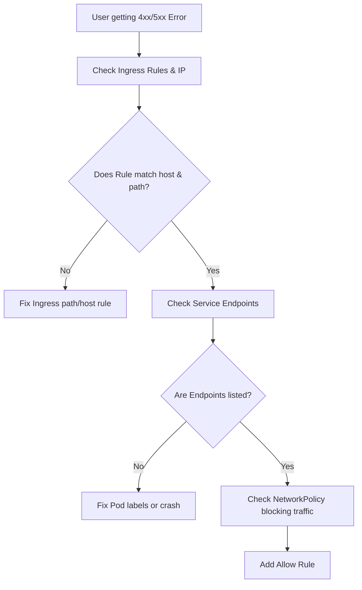

# K8S-05 Ingress and Networking

# Overview
Ye kya hai? Kubernetes me applications ko bahar se (internet se) expose karna aur pods ke beech network security set karna hi K8s Networking aur Ingress hai. 
Kyu use hota hai? Agar hum har microservice ke liye ek Cloud LoadBalancer (AWS ALB/ELB) banayenge, toh bill skyrocket ho jayega. Ingress ek single smart routing gateway provide karta hai. Ye URL path (`/api`, `/frontend`) ke basis pe request ko sahi service tak bhejta hai.

Real life example: Ingress ek office building ka receptionist hai. Bahar se aane wala har insaan ek hi gate (LoadBalancer) se aayega. Receptionist (Ingress Controller) puchega "Aapko kahan jana hai?", `/api` bola toh floor 1, `/web` bola toh floor 2. Isse 10 alag gate (LB) banane ka kharcha bach gaya.

**Architecture Diagram:**


# Working
Internal working and flow: 
- **Ingress Controller**: Ye K8s me traffic ko process karta hai (e.g., Nginx, HAProxy). Ye Ingress yaml read karke apna configuration (nginx.conf) dynamically update karta hai.
- **TLS/SSL**: `cert-manager` ka use karke Ingress Controller SSL termination karta hai. Yaani encrypted HTTPS request ko decrypt karke HTTP me convert karta hai aur internal pods ko HTTP bhejta hai.
- **CNI (Container Network Interface)**: Flannel, Calico, ya Cilium. Ye plugins pods ko IP assign karte hain taaki har pod cluster ke andar directly communicate kar sake.
- **NetworkPolicy**: K8s me by default sab pods ek dusre se baat kar sakte hain (Allow-All). NetworkPolicy ek internal firewall hai jisse hum rule banate hain ki "Sirf frontend pod hi backend API se connect kare, baaki sab deny."

# Installation
Prerequisites: Minikube, Docker-Desktop ya Cloud K8s (EKS/AKS/GKE). Ingress Controller install karna parta hai, kyunki by default K8s me nahi aata.

Configuration (Nginx Ingress on Minikube):
```bash
# Enable the Nginx Ingress Controller addon
minikube addons enable ingress
```

Verification:
```bash
kubectl get pods -n ingress-nginx
# Wait till the status becomes "Running"
```

# Practical Lab
Step-by-step implementation of Ingress routing aur NetworkPolicy firewall ke liye.

Bajaaye inline YAML use karne ke, vault ki `examples/` directory me unified template available hai:
- Template: [examples/04-Kubernetes/ingress-netpol.yaml](file:///C:/Users/SPTL/Documents/devops/devops/examples/04-Kubernetes/ingress-netpol.yaml)

**Step 1: Deploy Sample Apps**
```bash
# Deploy Apple app
kubectl create deployment apple-service --image=hashicorp/http-echo -- -text="apple"
kubectl expose deployment apple-service --port=5678 --target-port=5678

# Deploy Banana app
kubectl create deployment banana-service --image=hashicorp/http-echo -- -text="banana"
kubectl expose deployment banana-service --port=5678 --target-port=5678
```

**Step 2: Apply Ingress and NetworkPolicy**
```bash
cd ../../examples/04-Kubernetes/
kubectl apply -f ingress-netpol.yaml
```

**Step 3: Verify Routing and Firewall**
```bash
# Ingress routing check (requires minikube tunnel or ingress addon)
curl http://$(minikube ip)/apple

# Note: The NetworkPolicy drops all traffic by default. The curl above might time out 
# until you create an explicit 'Allow' NetworkPolicy for the Ingress controller to talk to the pods!
```

# Daily Engineer Tasks
- **L1 Engineer**: Ingress rules me nayi URL path add karna. Application services (ClusterIP) configure karna.
- **L2 Engineer**: DNS (A records) map karna Ingress LoadBalancer IP pe. `cert-manager` issue check karna (SSL certificates issue ho rahe hain ya nahi).
- **L3 / Senior / SRE**: Calico/Cilium (CNI) setup maintain karna, cluster-wide Default Deny Security setup karna. Nginx worker processes ki performance aur bottleneck analyze karna.

# Real Industry Tasks
- **Domain Migration**: Puraane Ingress host `api.old-company.com` ko naye host `api.new-company.com` me zero downtime ke sath migrate karna using dual Ingress rules.
- **Cost Optimization**: Developers ne har service ke liye Cloud LoadBalancer (`type: LoadBalancer`) bana diya tha. Use hata ke `type: ClusterIP` + `Ingress` use karna jisse monthly hazaro dollars bachein.
- **Zero Trust Security Implementation**: OPA (Open Policy Agent) Gatekeeper se restrictions lagana ki koi developer `.prod.domain.com` host create nahi kar sakta non-prod namespace me.

# Troubleshooting
- **Symptom 1**: `404 Not Found` (from Nginx)
  - **Root Cause**: Host ya path misconfigured hai. Ya app backend me `/api` path accept nahi karta par Ingress pass kar raha hai.
  - **Resolution**: Check `kubectl describe ing`. Agar app root `/` expect karta hai, add annotation: `nginx.ingress.kubernetes.io/rewrite-target: /`.
- **Symptom 2**: `503 Service Unavailable`
  - **Root Cause**: Service exist karti hai, par Ingress uske pods tak pahuch nahi paa raha (endpoints missing).
  - **Resolution**: `kubectl get endpoints <svc_name>`. Check karo pods Running hain aur unke labels service selector se match karte hain.
- **Symptom 3**: Let's Encrypt Cert is stuck at `False` or `Pending`
  - **Root Cause**: HTTP-01 DNS challenge fail ho raha hai.
  - **Resolution**: `kubectl describe challenge`. Verify DNS A-record tumhare Ingress controller public IP ko hi point kar raha hai.

# Interview Preparation
- **Basic**: LoadBalancer aur Ingress me kya major difference hai?
  - *Ans*: LoadBalancer Layer 4 (TCP/UDP) pe operate karta hai aur 1 application ke liye 1 cloud balancer assign karta hai (high cost). Ingress Layer 7 (HTTP/HTTPS) pe operate karta hai, URL/host based routing karke ek single load balancer (IP) se multiple services ko expose karta hai.
- **Intermediate**: K8s me NetworkPolicy ka kya use hai? Default behaviour kya hai?
  - *Ans*: Default behaviour me K8s ke andar saare pods ek dusre se communicate kar sakte hain. NetworkPolicy AWS Security Group (internal firewall) ki tarah kaam karta hai, jisse hum explicitly inbound/outbound rules (allow/deny) set karte hain for Zero Trust Architecture.
- **Advanced / Scenario Based**: Production me Let's Encrypt (cert-manager) ne rate limit exceed bata kar domain ban kar diya. Why did it happen?
  - *Ans*: Configuration mistakes (jaise crash-loop ya bar-bar recreate karna) se Let's Encrypt production API pe zyada hits gaye honge. Rule of thumb: Testing ke time humesha `Staging Issuer` use karna chahiye kyunki uski rate limits soft hoti hain.
- **Manager Round**: Tumne apne pichle project me AWS infrastructure cost kaise optimize kiya tha?
  - *Ans*: Dev and QA environments me 30 microservices the, sab individual AWS ALBs use kar rahe the. Maine single Nginx Ingress Controller implement kiya. Cost drastically decrease hui without impacting dev workflow.

# Production Scenarios
- **Scenario: "Website is down with 502 Bad Gateway" after a Friday evening deployment.**
  - **How to think**: Ingress Controller chal raha hai, request le raha hai, par Ingress proxy service (app pods) ko connect nahi kar paa raha.
  - **Where to check**:
    1. Check if pod is actually running: `kubectl get pods` (CrashLoopBackOff?).
    2. Check service endpoints: `kubectl get ep`.
  - **Root Cause**: Naya application image fail ho gaya hai (OOMKilled ya bad config).
  - **Resolution**: Rollback the deployment `kubectl rollout undo deployment <name>`.
- **Scenario: "Frontend cannot talk to Backend Database."**
  - **How to think**: Kya networking level pe allow/deny issue hai?
  - **Where to check**: `kubectl get netpol`. Ensure frontend pod labels match the allowed `ingress` rule of the database NetworkPolicy.

# Commands
| Command | Purpose | Syntax/Example | When to Use | Danger Level |
|---------|---------|----------------|-------------|--------------|
| `kubectl get ing` | Ingress objects list karna | `kubectl get ing -n prod` | Check public IP/domains | Low |
| `kubectl describe ing` | Routing rules aur events check karna | `kubectl describe ing main-ingress` | Troubleshooting 404/503 | Low |
| `kubectl get netpol` | Firewalls (NetworkPolicies) list karna | `kubectl get netpol` | Checking dropped traffic | Low |
| `kubectl get cert` | `cert-manager` SSL certs status | `kubectl get cert` | Certificate expire ho gaya ho | Low |
| `minikube ip` | Local K8s IP fetch karna | `minikube ip` | Local API hit karne ke liye | Low |

# Cheat Sheet
- **Ingress**: K8s HTTP/HTTPS reverse proxy router.
- **NetworkPolicy**: K8s Internal pod-to-pod Firewall.
- **CNI**: Pod Networking Plugin (e.g., Flannel for basic, Calico for Policies, Cilium for eBPF perf).
- **Important Annotation**: `nginx.ingress.kubernetes.io/rewrite-target: /` (Stripping path before sending to app).
- **CoreDNS**: K8s internal DNS (UDP 53) - `api.default.svc.cluster.local`.

# SOP & Runbook & KB Article
- **SOP: Exposing a New Service Externally**
  - **Purpose**: Expose internal microservice to internet.
  - **Procedure**: 
    1. Deploy `ClusterIP` Service. 
    2. Add Ingress YAML mapping `/new-app` path to service.
    3. Ensure `cert-manager` annotations are present for TLS.
  - **Validation**: `curl -v https://domain.com/new-app` returns 200 OK.
  - **Rollback**: `kubectl delete -f new-ingress.yaml`.

- **KB Article: App cannot resolve other service names**
  - **Symptoms**: Logs show `DNS lookup failed` or `Unknown host`.
  - **Cause**: CoreDNS pods crash ho gaye hain, ya `NetworkPolicy` egress (outbound) rule ne Port 53 UDP block kar diya hai.
  - **Resolution**: Egress rule me explicitly UDP 53 allow karo for CoreDNS namespace/pods.

# Best Practices & Beginner Mistakes
- **Beginner Mistake**: Testing with Let's Encrypt Production issuer and hitting rate limits, blocking domain for days.
  - **Correct Approach**: Start with Let's Encrypt Staging `ClusterIssuer`.
- **Beginner Mistake**: Using `type: LoadBalancer` for every internal service thinking they need an IP.
  - **Correct Approach**: Keep services as `type: ClusterIP`. Only expose what's needed via ONE Ingress.
- **Best Practice (Security)**: Always implement a "Default Deny All" NetworkPolicy in production namespaces and explicitly allow required ingress/egress traffic. Isko Zero Trust bolte hain.

# Advanced Concepts
- **eBPF and Cilium**: Purane CNIs (like Flannel, Calico standard) `iptables` use karte the OS level pe. 10,000+ rules ke baad performance drastically slow ho jati thi. **Cilium** ek modern CNI hai jo **eBPF** (Linux kernel tech) use karta hai. Isme packets directly kernel me process hote hain, making it blazing fast and highly secure.
- **Gateway API**: Ye Kubernetes ki next-generation networking standard hai (Ingress ka replacement). Ingress sirf HTTP/HTTPS support karta hai, par Gateway API L4 (TCP/UDP), RBAC permissions, aur cross-namespace routing natively handle karti hai.

# Related Topics & Flashcards & Revision
- [[04-Orchestration/K8S-02 Pods Deployments Services|K8s Services & Pods]]
- [[04-Orchestration/K8S-06 RBAC and Security|K8s Security & OPA Gatekeeper]]
- **Flashcard**:
  - *Q: Calico vs Flannel me bada difference kya hai?*
  - *A: Flannel sirf IPs deta hai (no network policy support). Calico advanced hai aur NetworkPolicy restrictions support karta hai.*

# Real Production Logs & Commands & Decision Tree
**Real Nginx Ingress Error Log:**
`2025-06-27T10:00:00Z [error] 1234#1234: *12 connect() failed (111: Connection refused) while connecting to upstream, client: 1.2.3.4, server: api.domain.com, request: "GET /api HTTP/1.1", upstream: "http://10.244.1.5:8080/api"`
**Explanation**:
- Client (1.2.3.4) ne `GET /api` bheja. Ingress ne accept kiya.
- Ingress backend pod (`10.244.1.5:8080`) ko forward karna chahta tha.
- `Connection refused`: Pod us IP/Port pe listen nahi kar raha (crash ho gaya ya port mismatch).

**Troubleshooting Decision Tree:**

