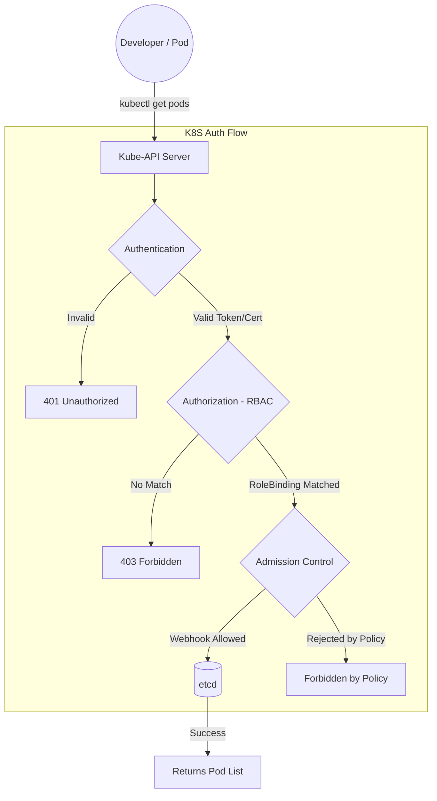
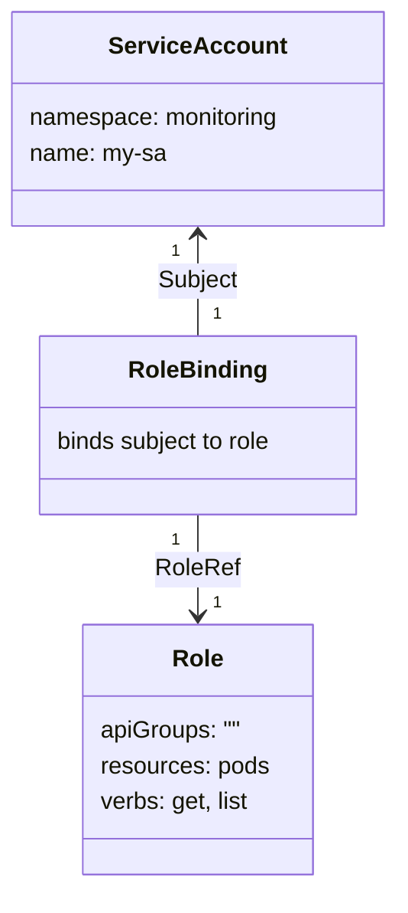

---
tags:
  - devops
  - kubernetes
  - security
  - rbac
aliases:
  - K8s Security
  - Kubernetes RBAC
created: 2026-06-27
status: "#complete"
difficulty: "#advanced"
cert-relevant: "#cka #ckad #cks"
---

# Overview

**Ye kya hai?** Kubernetes clusters mission-critical workloads run karte hain, jahan security ek non-negotiable requirement hai. RBAC (Role-Based Access Control) ye govern karta hai ki **kaun** (User/ServiceAccount) **kya actions** (verbs like get, list, create) perform kar sakta hai **kis resource** (pods, deployments) par. Beyond RBAC, hum Pod Security Standards (PSS), Security Contexts aur external tools (jaise kube-bench) use karke cluster lock down karte hain.

**Kyu use hota hai?** Taaki least privilege principle follow ho. Agar koi developer `dev` namespace mein kaam kar raha hai, toh galti se `prod` namespace ke pods delete na kar de.

**Real life example:** K8s security ko ek badi office building ki tarah socho:
- **Authentication:** Main gate par tumhara ID card scan karna ("Tum kaun ho?").
- **Authorization (RBAC):** Tumhara access card check karna ki "Tum 3rd floor (namespace) par ja sakte ho ya nahi?" aur "Kya tum server room (kube-system) khol sakte ho?".

**Industry kaha use karti hai?** Har enterprise aur production cluster (EKS, AKS, GKE, On-Prem) mein jahan multi-tenancy aur proper team isolation required hai.

# Working

**Internal working & Request flow:**
Jab koi `kubectl` command (e.g., `kubectl get pods`) Kube-API Server par hit karti hai, toh ye 3 phases se guzarti hai:

1. **Authentication (AuthN):** API Server check karta hai ki user valid hai ya nahi (via X.509 certs, OIDC, Bearer tokens). K8s ke paas apna user database nahi hota. Lekin K8s ServiceAccounts (SA) khud manage karta hai.
2. **Authorization (AuthZ):** Yahan RBAC action mein aata hai. API server dekhta hai ki authenticated identity ke paas maangi gayi request ke liye Role/ClusterRole allowed hai ya nahi. Agar koi explicitly `allow` rule nahi hai, toh default `deny` ho jata hai.
3. **Admission Control:** Agar authZ pass ho jaye, toh Mutating ya Validating webhooks (jaise Pod Security Standards, OPA Gatekeeper) request ko modify ya reject kar sakte hain.

**Dependencies:** Kube-API server me `--authorization-mode=RBAC` enabled hona zaroori hai.

# Installation

**Prerequisites:** Kubernetes cluster up and running (kubeadm, Minikube, Managed K8s).

**Configuration:**
By default, RBAC enabled hota hai aajkal ke sabhi modern K8s clusters mein. 
API Server flag check karne ke liye:
`cat /etc/kubernetes/manifests/kube-apiserver.yaml | grep authorization-mode`
Output must include `RBAC`.

**Verification:**
```bash
kubectl auth can-i create pods --all-namespaces
```

# Practical Lab

**Step-by-step implementation: Read-Only Access to a specific Namespace**

**Scenario:** Hame `monitoring` namespace banana hai aur ek aisa ServiceAccount banana hai jo sirf pods ko "read" (get, list, watch) kar sake `monitoring` namespace mein.

**CLI Method & YAML:**
1. Namespace & ServiceAccount banao:
```bash
kubectl create namespace monitoring
kubectl create serviceaccount monitoring-sa -n monitoring
```

2. Role banao (Sif read access denge):
```yaml
# role.yaml
apiVersion: rbac.authorization.k8s.io/v1
kind: Role
metadata:
  name: pod-reader
  namespace: monitoring
rules:
- apiGroups: [""]
  resources: ["pods", "pods/log"]
  verbs: ["get", "list", "watch"]
```
```bash
kubectl apply -f role.yaml
```

3. RoleBinding banao (Role ko SA ke sath map karo):
```yaml
# rolebinding.yaml
apiVersion: rbac.authorization.k8s.io/v1
kind: RoleBinding
metadata:
  name: read-pods-binding
  namespace: monitoring
subjects:
- kind: ServiceAccount
  name: monitoring-sa
  namespace: monitoring
roleRef:
  kind: Role
  name: pod-reader
  apiGroup: rbac.authorization.k8s.io
```
```bash
kubectl apply -f rolebinding.yaml
```

4. Verification:
```bash
# Check if it can list pods in monitoring NS -> output: yes
kubectl auth can-i list pods --as=system:serviceaccount:monitoring:monitoring-sa -n monitoring

# Check if it can delete pods -> output: no
kubectl auth can-i delete pods --as=system:serviceaccount:monitoring:monitoring-sa -n monitoring
```

# Daily Engineer Tasks

- **L1/L2 Engineer:** `kubectl auth can-i` command use karke developers ke access issues troubleshoot karna. Naye applications ke liye basic ServiceAccounts aur Roles banana.
- **L3/Senior Engineer:** Cross-namespace ClusterRoles design karna. `automountServiceAccountToken: false` enforce karna default SAs par. K8s Security context define karna (runAsUser, fsGroup).
- **Security/Cloud Engineer:** CIS benchmarks ke liye `kube-bench` run karna, PSS (Pod Security Standards) policies enforce karna cluster level pe. IAM Roles for Service Accounts (IRSA on AWS EKS) setup karna.

# Real Industry Tasks

- **Real tickets:** "Developer `Alex` unable to view logs of staging-api pod. Getting 403 Forbidden."
- **Real change requests:** CI/CD pipeline GitOps (ArgoCD/Flux) tool ko cluster me helm charts install karne ka access dena by creating custom ClusterRole.
- **Migration:** Deprecated `PodSecurityPolicy` (PSP) ko naye `Pod Security Standards` (PSS) labels (restricted/baseline) me migrate karna namespace level par.

# Troubleshooting

**Issue:** Pod cannot access Kubernetes API, throwing 403 Forbidden.
- **Symptoms:** Logs me `User "system:serviceaccount:namespace:default" cannot get resource...`
- **Root Cause:** App pod API se baat karne ki koshish kar raha hai lekin RBAC policy (Role/RoleBinding) missing hai, ya default ServiceAccount pe bind kiya hua hai jiske paas access nahi hai.
- **Investigation Steps:**
  1. `kubectl get pod <pod-name> -o yaml | grep serviceAccount` (Check karo kaunsa SA use ho raha hai).
  2. `kubectl auth can-i get pods --as=system:serviceaccount:<ns>:<sa> -n <ns>`
  3. `kubectl describe rolebinding -n <ns>` check karo ki SA attach hai ya nahi.
- **Resolution:** Dedicated SA banao, required API groups/verbs ke sath Role banao, aur RoleBinding karke Pod spec mein `serviceAccountName` mention karo.

# Interview Preparation

- **Basic:** Role aur ClusterRole mein kya difference hai?
  - *Ans:* Role namespace-scoped hota hai (ek hi floor ka access). ClusterRole cluster-wide hota hai (poori building ka access) ya cluster-level resources jaise Nodes/PVs ko access karne ke liye use hota hai.
- **Intermediate:** ServiceAccount (SA) kya hota hai? 
  - *Ans:* Jab pod API server se baat karta hai toh wo human user nahi hai. Machine-to-machine auth ke liye K8s SA use karta hai. Har namespace me ek `default` SA hota hai.
- **Advanced / Scenario Based:** Tumhare cluster mein `default` ServiceAccount ke paas `cluster-admin` rights the aur ek malicious pod chal gaya. Tum aage se isko kaise prevent karoge?
  - *Ans:* Principle of Least Privilege follow karenge. `automountServiceAccountToken: false` set karenge default SAs me. Har app ke liye apna specific SA banayenge. `Pod Security Standards` restricted mode me chalayenge taaki pod as `root` run na ho sake aur privilege escalation prevent ho jaye.
- **Production (FAANG):** K8s authentication me API server users ko kaise pehchanta hai, given K8s ka apna user db nahi hai?
  - *Ans:* API server external Identity Providers (OIDC, AWS IAM, Azure AD), X.509 client certificates ya webhook token authenticators rely karta hai.

# Production Scenarios

**Scenario: Multi-Tenant Cluster Outage**
- **Problem:** Ek developer ne debugging ke waqt galti se `kubectl delete deployment --all` chala diya aur doosri team ki services bhi delete ho gayi.
- **How to think:** Ye clear case hai weak RBAC aur lack of isolation ka. Developer ko `cluster-admin` ya broad namespace permissions diye gaye the.
- **Where to check:** API audit logs dekho ki kisne request trigger ki. `kubectl get clusterrolebindings` check karo ki kis user ko galti se admin mila hua hai.
- **Resolution:** Namespace isolation implement karo. Developers ko sirf unke apne namespaces ke upar specific `Role` bindings do, na ki `ClusterRoleBinding`.

# Commands

| Command | Purpose | Danger Level |
|---------|---------|--------------|
| `kubectl create sa dev-sa -n dev` | Creates Service Account | Low |
| `kubectl create role dev-role --verb=get,list --resource=pods -n dev` | Imperative way to create Role | Low |
| `kubectl create rolebinding dev-rb --role=dev-role --serviceaccount=dev:dev-sa -n dev` | Binds role to SA | Medium |
| `kubectl auth can-i create secrets --as=system:serviceaccount:dev:dev-sa -n dev` | Validates access | Low |
| `kube-bench run` | CIS compliance scan | Low (Read Only) |

# Cheat Sheet

- **Role vs ClusterRole:** Role = 1 Namespace. ClusterRole = All Namespaces / Cluster-wide resources (Nodes, PVs).
- **RoleBinding vs ClusterRoleBinding:** RoleBinding = Applied in 1 namespace. ClusterRoleBinding = Applied everywhere. *(Trick: You can use RoleBinding with ClusterRole to give cluster-wide predefined rules to just ONE namespace).*
- **Pod Security Standards (PSS):** 
  - `Privileged`: Sab allowed (System/CNI agents)
  - `Baseline`: Basic restriction (Default workloads)
  - `Restricted`: Fully locked down, non-root (Strict prod). Applied via labels: `pod-security.kubernetes.io/enforce: restricted`.

# SOP & Runbook & KB Article

**SOP: Creating Read-Only Access for Dev Team**
- **Purpose:** Onboard new developer without giving them edit rights.
- **Procedure:** 
  1. Create User Identity in Identity Provider (AWS IAM/Azure AD).
  2. Map Identity to a K8s Group (e.g., `dev-readers`).
  3. Create a K8s `ClusterRole` with `verbs: ["get", "list", "watch"]`.
  4. Create a `RoleBinding` in specific namespace targeting the group `dev-readers`.
- **Validation:** Dev runs `kubectl get pods`, and it passes. Dev runs `kubectl delete pod`, gets 403 Forbidden.

# Best Practices & Beginner Mistakes

**Beginner Mistakes:**
- ❌ **Mistake:** Wildcard (`*`) de dena `verbs` ya `resources` mein time bachane ke liye.
- ❌ **Mistake:** Default ServiceAccount use karte rehna aur usko admin powers dena. 
- **Impact:** Agar pod hack hua, toh pura cluster compromise ho jayega.

**Best Practices:**
- ✅ **Least Privilege:** Sif zaroori verbs aur resources ka access do.
- ✅ Disable Auto-Mount: Agar pod K8s API se baat nahi kar raha (e.g., simple Nginx pod), toh `automountServiceAccountToken: false` pod spec mein add karo. 
- ✅ Use Security Context: Pod ko non-root chalao (`runAsNonRoot: true`), aur Linux capabilities drop karo (`capabilities: drop: ["ALL"]`).

# Advanced Concepts

- **Security Contexts:** Pod/Container level pe kernel/OS security controls define karna. Jaise ki filesystem ko read-only set karna `readOnlyRootFilesystem: true`. Isse malware agar pod ke andar aa bhi jaye toh kuch naya script write aur execute nahi kar payega.
- **Admission Controllers (OPA Gatekeeper / Kyverno):** RBAC se aage badhkar fine-grained policy control (e.g., "Image sirf internal private registry se hi pull honi chahiye").

# Related Topics & Flashcards & Revision

- **Prerequisites:** [[K8S-01 Architecture & Components]] (API Server auth logic).
- **Next Topics:** [[K8S-03 Networking]] (NetworkPolicies), OPA Gatekeeper.
- **Flashcard:** `Q: Does K8s have a user database? A: No, only manages ServiceAccounts.`

# Real Production Logs & Commands & Decision Tree

**Sample Log - Unauthorized Access:**
```json
{
  "kind": "Status",
  "apiVersion": "v1",
  "metadata": {},
  "status": "Failure",
  "message": "pods \"my-pod\" is forbidden: User \"system:serviceaccount:default:my-sa\" cannot delete resource \"pods\" in API group \"\" in the namespace \"default\"",
  "reason": "Forbidden",
  "code": 403
}
```
*Meaning:* Iska matlab `my-sa` ServiceAccount ne pod delete karne ki koshish ki namespace `default` mein, par uske paas uski `RoleBinding` me `delete` verb missing hai.

**Troubleshooting Decision Tree:**
1. Is it a 401 Unauthorized? -> Authentication issue (Check tokens, Kubeconfig, OIDC integration).
2. Is it a 403 Forbidden? -> Authorization issue.
   - Run `kubectl auth can-i`.
   - Check ServiceAccount mapped to Pod.
   - Check Role/ClusterRole associated with SA.
   - Verify `apiGroups`, `resources`, and `verbs` perfectly match the attempted operation.

# Visuals




