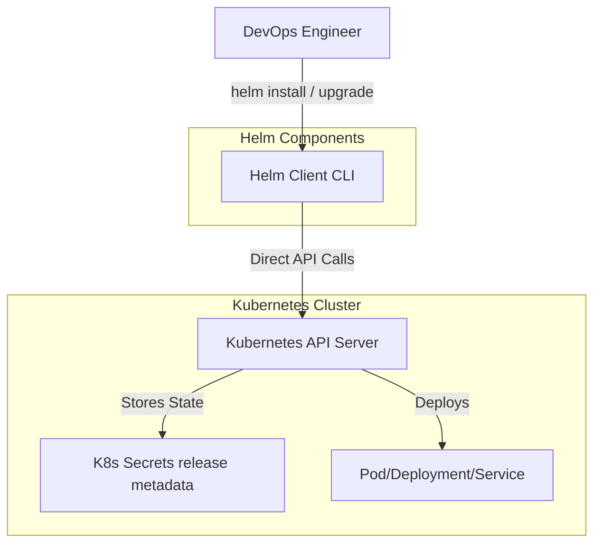

---
tags:
  - devops
  - kubernetes
  - helm
aliases:
  - Helm
created: 2025-06-27
status: "#complete"
difficulty: "#intermediate"
cert-relevant: "#cka"
---

# Overview
Helm is the Package Manager for Kubernetes. 

**Analogy:**
*Helm को ऐसे समझो जैसे Zomato पर ready-made meal order करना — तुम्हें खुद सब ingredients (Deployment, Service, ConfigMap, Ingress YAML files) नहीं जोड़ने पड़ते, बस order दो (`helm install`) और पूरा setup तैयार हो जाता है। अगर खाना पसंद नहीं आया तो return (`helm rollback`) भी कर सकते हो!*

**Kyu use hota hai?**
Imagine ek web app deploy karna hai K8s me. Tumhe 8+ YAML files chahiye. Agar 3 environments (dev, staging, prod) hain, toh 24+ files ho jayengi jisme minor differences honge. Ye manual copy-paste bahut error-prone hota hai.
Helm YAMLs ko templatize karta hai, environment-specific values parameterize karta hai, aur sab kuch ek package (Chart) me combine karke version aur rollback support deta hai.

**Real production use-case:**
FAANG companies aur badi orgs me jab 100+ microservices hoti hain, har team K8s ke core YAML likhne नहीं बैठती। Ek central platform team ek base Helm chart बना देती है, aur baki teams bas apna `values.yaml` pass karke app deploy kar deti hain.

**Architecture:**


# Working
**Helm Core Concepts:**
- **Chart:** A package containing templated K8s manifests (Recipe / पकाने की विधि).
- **Release:** A running instance of a chart in a cluster (Cooked dish / बना हुआ खाना).
- **Repository:** A server hosting charts (Cookbook library / रेसिपी की दुकान).
- **Revision:** A version of a release created on every install/upgrade (Dish version).

**Internal Working:**
1. **Template Rendering:** Helm uses Go template syntax to substitute variables from `values.yaml` into K8s manifest files (like `deployment.yaml`).
2. **K8s API Communication:** Helm client reads local `kubeconfig` to authenticate and send REST requests directly to the K8s API server. (Helm v2 me ek in-cluster "Tiller" component hota tha jo ab v3 se hta diya gaya hai security reasons ke wajah se).
3. **State Management:** Helm track rakhta hai ki kya deploy hua hai. Release metadata, K8s native `Secrets` (pehle ConfigMaps me) me save hota hai usi namespace me jaha deployment hui hai.
4. **Rollback:** Agar rollback invoke hota hai, toh Helm purane revision ki Secret padhta hai aur unhi K8s YAMLs ko waapis apply kar deta hai.

# Installation
**Prerequisites:**
- Kubeconfig configured (Kubernetes cluster access).

**Installation:**
```bash
# Windows (Chocolatey)
choco install kubernetes-helm

# Linux (Ubuntu)
curl -fsSL -o get_helm.sh https://raw.githubusercontent.com/helm/helm/main/scripts/get-helm-3
chmod 700 get_helm.sh
./get_helm.sh
```

**Verification:**
```bash
helm version
```

# Practical Lab
**Goal:** NGINX web server deploy karenge Helm ka use karke, fir use upgrade aur rollback karenge.

**Step 1: Add a Repository**
Bitnami ek popular repo hai charts ke liye.
```bash
helm repo add bitnami https://charts.bitnami.com/bitnami
helm repo update
```

**Step 2: Inspect Default Values**
Dekho ki kya kya customize kar sakte ho.
```bash
helm show values bitnami/nginx > custom-values.yaml
```

**Step 3: Modify `custom-values.yaml`**
Thode changes karo, like NodePort expose karna aur replica count badhana.
```yaml
# custom-values.yaml
replicaCount: 3
service:
  type: NodePort
  nodePorts:
    http: 30080
```

**Step 4: Install the Chart**
```bash
helm install my-web-app bitnami/nginx -f custom-values.yaml --namespace dev --create-namespace
```

**Step 5: Verify Deployment**
```bash
helm list -n dev
kubectl get pods,svc -n dev
```

**Step 6: Upgrade Release**
Naya version dalna ya config change karna (e.g. `replicaCount: 5`).
```bash
helm upgrade my-web-app bitnami/nginx --set replicaCount=5 -n dev
helm history my-web-app -n dev
```

**Step 7: Rollback**
Agar latest release bekaar nikle, rollback to revision 1.
```bash
helm rollback my-web-app 1 -n dev
```

**Step 8: Cleanup**
```bash
helm uninstall my-web-app -n dev
```

# Daily Engineer Tasks
- **L1/L2 Engineer:** `helm list` se checking karna. Failed releases ka status check karna. Simple app versions upgrade karna `helm upgrade` command se.
- **L3/DevOps Engineer:** Naye custom charts (`helm create`) likhna, templates aur `_helpers.tpl` files manage karna. CI/CD pipelines (Jenkins/GitLab CI) me Helm integrate karna.
- **Senior/Platform Engineer:** Standardize karna using parent charts/library charts. Helmfile use karke multiple releases ko as-code manage karna. Secret management (Helm Secrets, SOPS) implement karna.

# Real Industry Tasks
- **Ticket 1:** "Need to deploy Prometheus Stack on new Prod cluster."
  - **Action:** Add `prometheus-community` repo, prepare environment specific `values.yaml` (storage class, retention period) and run `helm upgrade --install`.
- **Ticket 2:** "Ingress controller version upgrade for security patch."
  - **Action:** Read chart changelog for breaking changes (CRDs updates). Update chart dependency, run `helm diff` to see what will change, then `helm upgrade`.
- **Ticket 3:** "App crashing after deployment, revert to old image."
  - **Action:** Run `helm history` then `helm rollback <release_name> <revision_number>`.

# Troubleshooting
- **Issue 1:** `Error: INSTALLATION FAILED: cannot re-use a name that is still in use`
  - **Cause:** Us naam ka release pehle se hai.
  - **Solution:** `helm upgrade --install` use karo bajaye sirf `helm install` ke.
- **Issue 2:** `Error: UPGRADE FAILED: "release" has no deployed releases`
  - **Cause:** Tum upgrade command chala rahe ho par release exist nahi karta.
  - **Solution:** Humesha `helm upgrade --install <release>` use karne ki aadat dalo. Idempotent hota hai.
- **Issue 3:** Application `values.yaml` pass kiya, par apply nahi hua.
  - **Cause:** Galat syntax ya indentation. YAML strict hota hai.
  - **Solution:** Check rendered output `helm template my-release <chart> -f values.yaml`. Isse apply karne se pehle YAML kaisa generate hoga wo dikh jayega.
- **Issue 4:** Pods pending ya error me hai par Helm dikha raha hai "Deployed".
  - **Cause:** Helm bas Kubernetes API ko manifests bhejta hai. Agar yaml theek hai, Helm is done. Wo pods ke ready hone ka wait nahi karta by default.
  - **Solution:** `--wait` aur `--timeout` flags use karo jab `helm install` ya `helm upgrade` karo. CI/CD me ye zaruri hai.

# Interview Preparation
**Basic:**
**Q: Helm me Chart aur Release me kya fark hai?**
**A:** Chart is the blueprint/package containing templates and defaults. Release is a specific deployed instance of that Chart running in the cluster.

**Intermediate:**
**Q: Helm v2 aur v3 me sabse bada security architecture change kya tha?**
**A:** Helm v2 me ek in-cluster component 'Tiller' hota tha jiske paas poore cluster ke admin rights hote the, jo security risk tha. Helm v3 ne Tiller ko hata diya aur client-only ban gaya, direct kubeconfig user ke RBAC permissions use karke API server se baat karta hai.

**Advanced / Scenario Based:**
**Q: Ek developer ne galti se `kubectl delete deployment my-app` karke Helm release ke deployment ko delete kar diya. Next time jab tum `helm upgrade` chalaoge, toh Helm deployment dubara banayega ya error dega?**
**A:** Helm 3 me "3-way merge patch" hota hai. Wo compare karega: purana release state (jo secret me hai), live state (jaha deployment missing hai), aur naya chart state. Kyunki naye chart me deployment expected hai, wo missing hone par naya deployment create kar dega. (Helm self-heals).

**Production / SRE:**
**Q: CI/CD me `--set` use karna behtar hai ya `-f values.yaml`?**
**A:** Production/GitOps me humesha `-f values.yaml` (ya multiple values files) better hai kyuki everything is code and version controlled. `--set` sirf dynamic chizo ke liye theek hai jaise image tag (`--set image.tag=$BUILD_ID`), otherwise `--set` commands padhna and track karna bahut mushkil hota hai.

# Production Scenarios
**Scenario: Website down immediately after a helm upgrade.**
- **How to think:** Immediate restore service. Debug later. 
- **Commands:** 
  1. `helm history prod-webapp -n prod` (Find last working revision, say Rev 5).
  2. `helm rollback prod-webapp 5 -n prod` (Rollback in seconds).
  3. Verify: `kubectl get pods -n prod`.
- **Root Cause Analysis:** Baad me purane aur naye values/templates ko `helm template` karke diff check karenge. Most likely image crash loop me gaya tha ya ingress misconfigured ho gaya tha.

# Commands
- `helm repo add <name> <url>`: Naya repository add karta hai.
- `helm repo update`: Local cache update karta hai repos se.
- `helm install <release-name> <chart>`: Install a chart.
- `helm upgrade --install <release-name> <chart> -f values.yaml`: Most used in CI/CD. Installs or upgrades dynamically.
- `helm uninstall <release-name>`: Delete the release and all associated resources (Note: It does NOT delete PVCs by default).
- `helm ls -A`: Cluster me saare releases dikhata hai.
- `helm template <release-name> <chart>`: Dry-run and render YAML templates, cluster me kuch apply nahi hota. Useful for testing.
- `helm history <release-name>`: Shows revision history.
- `helm rollback <release-name> <revision>`: Rolls back to older revision.
- `helm get values <release-name>`: Jo config running release me apply hui hai, wo show karega.

# Cheat Sheet
- **Most important concept:** `values.yaml` + `templates/` = Final K8s YAMLs.
- **Best CI/CD command:** `helm upgrade --install <name> <chart> --namespace <ns> --create-namespace --wait`
- **Default metadata storage:** `Secrets` in the same namespace as release.
- **Rollback limitations:** Helm data/PVC ko rollback nahi karta, bas K8s manifests ko rollback karta hai. DB rollbacks manually handle karne padte hain.

# SOP & Runbook & KB Article
**SOP: Creating a new Helm Chart for a Microservice**
1. **Purpose:** Standardize app deployment structure.
2. **Procedure:** 
   - Run `helm create <app-name>`
   - Clean up default template and use organization base chart structure.
   - Define all environment specific parameters in `values.yaml` (resources, ingress, image).
3. **Validation:** Run `helm lint` and `helm template` to ensure valid YAML is generated.

**KB Article: Handling Helm PVC orphaned data**
- **Problem:** When running `helm uninstall`, database volumes (PVCs) remain in the cluster.
- **Cause:** By design, Helm avoids deleting PVCs to prevent accidental data loss.
- **Resolution:** If data is no longer needed, manually delete the PVC: `kubectl delete pvc <pvc-name>`.

# Best Practices & Beginner Mistakes
**Best Practices:**
- Never hardcode values like namespace, domain names, or secrets directly in template files (`templates/`). Humesha `.Values` use karo.
- Use `helm lint` in your pipelines to catch syntax errors early.
- Keep `Chart.yaml` versioning strict (SemVer). Bump version properly.
- Humesha Liveness and Readiness probes configure karo chart me.

**Beginner Mistakes:**
- **Mistake:** Manual `kubectl edit` in a resource deployed by Helm. 
  - **Impact:** Drift. Agli baar jab `helm upgrade` chalega toh Helm manually kiye hue changes overwrite kar dega (3-way merge logic).
  - **Correct Approach:** Make change in `values.yaml` and run `helm upgrade`.
- **Mistake:** Forgetting to use `--wait`.
  - **Impact:** Pipeline pass ho jayegi par pods crash loop me honge, false positive deployment result.

# Advanced Concepts
**Template Functions:**
Helm Go's text/template syntax aur Sprig functions use karta hai.
- `{{ .Values.image.repository }}` : Variable injection.
- `{{- if .Values.ingress.enabled }}` : Conditional blocks (agar ingress chahiye tabhi yaml generate hoga).
- `{{- range .Values.ingress.hosts }}` : Loops array iterating (list of domain names).
- `{{ default "latest" .Values.image.tag }}`: Fallback default value.

**Helmfile:**
Bahut saare helm releases ko ek sath declarative way me manage karne ke liye tool. (Terraform for Helm). Jaise 50 microservices deploy karna ho toh ek `helmfile.yaml` me sab declare kar dete hai aur single command `helmfile apply` chalaate hain.

# Related Topics & Flashcards & Revision
**Related Topics:**
- [[K8S-01 Architecture & Components]]
- [[K8S-02 Pods & Workloads]]
- [[K8S-05 ConfigMaps & Secrets]]
- [[Docker-01 Foundations]]

**Flashcards:**
- **Q:** How to dry-run a chart? | **A:** `helm template <release> <chart>` ya `helm install --dry-run`.
- **Q:** What happens to PVC on helm uninstall? | **A:** It stays in the cluster to prevent data loss.
