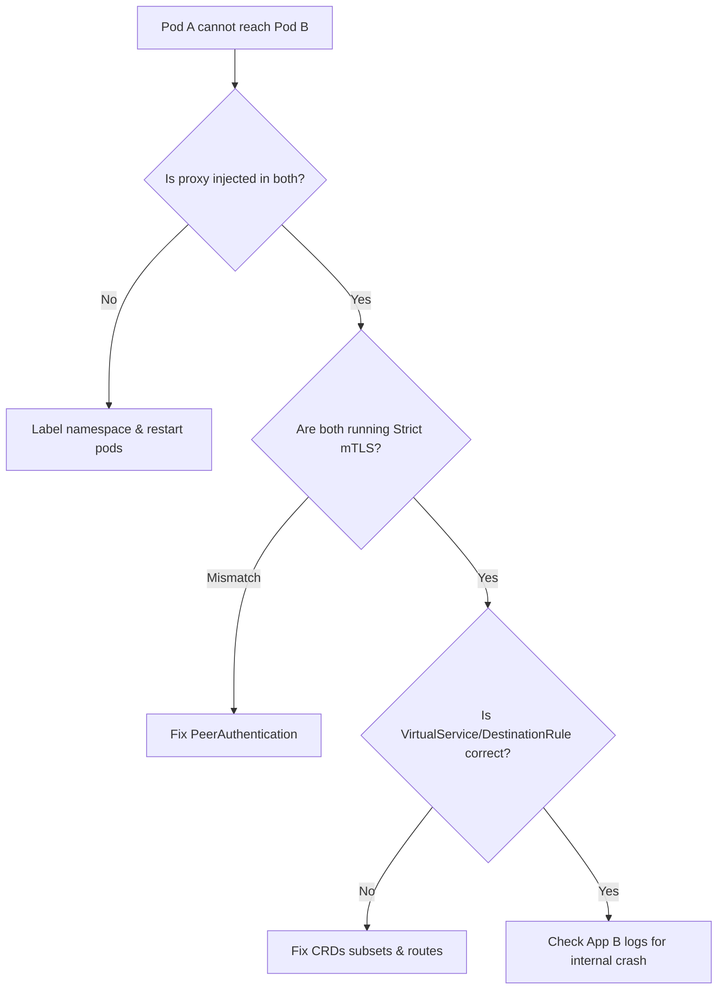

# Kubernetes Service Mesh

> [!abstract] 
> This note dives into the concept of a Service Mesh in Kubernetes, focusing on Istio and Linkerd. It covers everything from architecture and mTLS to traffic routing (Canary/Blue-Green), observability, and production troubleshooting.

# Overview

**Ye kya hai?**
Service Mesh ek dedicated infrastructure layer hai jo K8s mein microservices ke beech communication (service-to-service ya pod-to-pod) ko secure, fast, aur reliable banati hai. Normal K8s mein, developer ko retry, timeout, security, aur tracing ka code app ke andar likhna padta tha. Service Mesh yeh sab network level pe handle karta hai bina app code ko modify kiye.

**Kyu use hota hai?**
Jaise-jaise microservices badhti hain (monolith to 100s of microservices), track karna mushkil ho jata hai ki kaunsi service kis-se baat kar rahi hai, kahan latency aa rahi hai, aur traffic secure hai ya nahi. Service Mesh mTLS, observability, aur complex routing (canary) out-of-the-box deta hai.

**Real life example:**
City Traffic System. Bina Service Mesh ke, services direct baat karti hain (bina traffic rules ya police ke). Service Mesh har ghar (pod) ke bahar ek smart security guard (Sidecar Proxy) bitha deta hai. Ab sab communication in guards ke through hota hai. Guards IDs check karte hain (mTLS), traffic divert kar sakte hain (Canary), aur control room (Control Plane) ko update dete hain ki traffic kaisa chal raha hai.

**Mermaid Architecture:**


# Working

Service Mesh do main components mein divided hota hai:
1. **Data Plane:** Har pod ke andar ek lightweight proxy (jaise **Envoy**) inject kiya jata hai (ise Sidecar kehte hain). App ki sari inbound aur outbound traffic yeh proxy intercept karta hai.
2. **Control Plane:** Yeh proxies ko manage aur configure karta hai (jaise Istio mein **Istiod**). Yeh certificates issue karta hai (CA), routing rules push karta hai, aur telemetry data collect karta hai.

**Request Flow:**
User -> Ingress Gateway -> Pod A (Envoy Proxy) -> [mTLS Encryption] -> Pod B (Envoy Proxy) -> [mTLS Decryption] -> Pod B (App).

# Installation

**Prerequisites:** Kubernetes cluster (Minikube/EKS/AKS), `kubectl`, minimum 4GB RAM for Istio.

**Istio Installation (CLI Method):**
```bash
# 1. Download Istio
curl -L https://istio.io/downloadIstio | sh -
cd istio-*
export PATH=$PWD/bin:$PATH

# 2. Install using demo profile
istioctl install --set profile=demo -y

# 3. Label namespace for automatic sidecar injection
kubectl label namespace default istio-injection=enabled
```

**Verification:**
```bash
kubectl get pods -n istio-system
```

**Rollback/Uninstall:**
```bash
istioctl uninstall --purge -y
kubectl delete namespace istio-system
```

# Practical Lab

**Scenario:** Install Bookinfo app, setup Kiali dashboard, and configure 70/30 Canary deployment.

**Step-by-Step Implementation:**
1. **Deploy App:**
   ```bash
   kubectl apply -f samples/bookinfo/platform/kube/bookinfo.yaml
   kubectl get pods # Check if READY is 2/2 (App + Envoy)
   ```
2. **Install Addons (Kiali, Prometheus):**
   ```bash
   kubectl apply -f samples/addons
   istioctl dashboard kiali & # Opens Kiali UI
   ```
3. **Configure 70/30 Canary Split for `reviews` service:**
   Create `canary.yaml`:
   ```yaml
   apiVersion: networking.istio.io/v1alpha3
   kind: DestinationRule
   metadata:
     name: reviews
   spec:
     host: reviews
     subsets:
     - name: v1
       labels:
         version: v1
     - name: v2
       labels:
         version: v2
   ---
   apiVersion: networking.istio.io/v1alpha3
   kind: VirtualService
   metadata:
     name: reviews
   spec:
     hosts:
     - reviews
     http:
     - route:
       - destination:
           host: reviews
           subset: v1
         weight: 70
       - destination:
           host: reviews
           subset: v2
         weight: 30
   ```
   ```bash
   kubectl apply -f canary.yaml
   ```
4. **Verification:** Generate traffic and check Kiali to see exactly 70% traffic going to v1 and 30% to v2.

# Daily Engineer Tasks

- **L1 Engineer:** Checking Kiali dashboard for red lines (failed requests). Verifying if pods have 2/2 containers running. Running basic `istioctl analyze`.
- **L2 Engineer:** Creating VirtualServices and DestinationRules for basic routing. Restarting pods to inject sidecars. Checking Envoy logs for 503 errors.
- **L3 Engineer:** Configuring strict mTLS policies. Debugging cross-cluster mesh communication. Tuning Envoy resources (CPU/Memory limits).
- **Senior/DevOps Engineer:** Architecting multi-cluster mesh. Writing custom WebAssembly (WASM) plugins for Envoy. Managing gateway upgrades with zero downtime.

# Real Industry Tasks

- **Real Tickets:** "Service A is getting 504 Gateway Timeout while calling Service B."
- **Change Requests:** "Enable Strict mTLS for all namespaces starting next weekend."
- **Migration:** Moving from Nginx Ingress to Istio Ingress Gateway.
- **Maintenance:** Upgrading Istio control plane using canary upgrade method (`istioctl install --set revision=1-X`).

# Troubleshooting

| Problem | Symptoms | Possible Root Causes | Resolution |
| :--- | :--- | :--- | :--- |
| **No Sidecar Inject** | Pods show `1/1` READY instead of `2/2` | Namespace lacks `istio-injection=enabled` label. | `kubectl label ns default istio-injection=enabled` and `kubectl rollout restart deploy <name>` |
| **503 Service Unavailable** | `upstream_reset_before_response_started` in Envoy logs | Destination rule missing, or mTLS policy mismatch (Strict vs Permissive). | Check `PeerAuthentication`. Use `istioctl analyze`. |
| **Canary split not working** | 100% traffic goes to v1 | DestinationRule subsets don't match pod labels. | Verify `labels` in `DestinationRule` match K8s deployment labels exactly. |
| **High Memory Usage** | Worker nodes crashing | Envoy caching all cluster endpoints. | Implement `Sidecar` CRD to restrict egress visibility (e.g., `*/*` to specific namespaces). |

**Logs Command:** `kubectl logs <pod-name> -c istio-proxy`

# Interview Preparation

**Basic:**
Q: What is a sidecar proxy?
A: A proxy container (like Envoy) deployed alongside the app container in the same pod to handle all network traffic.

**Intermediate:**
Q: Difference between VirtualService and DestinationRule?
A: VirtualService decides *HOW* to route traffic (e.g., URL path `/v2` or weight `70%`). DestinationRule decides *WHAT* happens after routing (e.g., defining subsets, circuit breaking, TLS settings).

**Advanced (Scenario Based):**
Q: Devs enabled a new service, but it can't talk to the DB outside the cluster. Why?
A: By default, Istio might block external egress traffic depending on `outboundTrafficPolicy`. Need to create a `ServiceEntry` to allow and track external traffic.

**Production:**
Q: How do you upgrade Istio in a production cluster with zero downtime?
A: Using Canary Upgrades. Install the new control plane with a new revision label alongside the old one. Label namespaces with the new revision, restart pods slowly to point them to the new control plane, and monitor before removing the old one.

# Production Scenarios

**Scenario:** Checkout service is down (502 Bad Gateway) only for 10% of users.
- **How to think:** Partial failure points to a specific pod or a canary release issue.
- **Where to check:** Open Kiali. Check the graph for the checkout service. See which specific version (subset) is returning 500s.
- **Commands:** `istioctl proxy-status`, `kubectl logs -l app=checkout -c istio-proxy`
- **Resolution:** Found that `checkout-v2` is crashing. Immediately update `VirtualService` to route 100% traffic back to `v1`. Rollback successful.

# Commands

| Command | Purpose | Syntax/Example | Danger Level |
| :--- | :--- | :--- | :--- |
| `istioctl analyze` | Find mesh misconfigurations | `istioctl analyze -n default` | Low |
| `istioctl proxy-status` | Check sidecar sync status with Istiod | `istioctl proxy-status` | Low |
| `kubectl rollout restart` | Force pods to pick up sidecar | `kubectl rollout restart deploy/api` | Medium (Causes pod restart) |
| `istioctl pc routes` | Dump Envoy routing configs for a pod | `istioctl pc routes <pod-name>` | Low |

# Cheat Sheet

- **Inject Label:** `istio-injection=enabled`
- **Revision Label:** `istio.io/rev=1-18`
- **CRDs:**
  - `VirtualService`: Routing logic (weights, match paths).
  - `DestinationRule`: Subsets, Circuit Breakers, TLS.
  - `Gateway`: Ingress/Egress configurations.
  - `ServiceEntry`: External services (APIs, DBs outside mesh).
  - `PeerAuthentication`: mTLS settings (Strict/Permissive).

# SOP & Runbook & KB Article

**SOP: Enabling mTLS in Production**
- **Purpose:** Secure cluster traffic.
- **Procedure:** 1. Set `PeerAuthentication` to `PERMISSIVE` first. 2. Monitor Kiali/Grafana for plaintext traffic. 3. Upgrade clients to use mesh. 4. Switch to `STRICT`.
- **Rollback:** Revert `PeerAuthentication` to `PERMISSIVE` or `DISABLE`.

**Runbook: Debugging 503 Upstream Reset**
- **Detection:** Alerts firing for 503 errors between App A and App B.
- **Investigation:** Run `kubectl logs <app-a-pod> -c istio-proxy | grep 503`. Look for `UF,URX` flags. Run `istioctl analyze`.
- **Resolution:** Usually caused by a missing DestinationRule or an app crashing before responding. Fix CRDs.

# Best Practices & Beginner Mistakes

**Best Practices:**
- Always use `Sidecar` CRD in production to limit Envoy memory usage.
- Start with `PERMISSIVE` mTLS before enforcing `STRICT`.
- Use a dedicated Gateway namespace, separate from `istio-system`.

**Beginner Mistakes:**
- Forgetting to label K8s Services with `app` and `version` labels. Istio relies heavily on these for telemetry and routing.
- Mixing up K8s Ingress and Istio Gateway. Prefer Istio Gateway for advanced features.

# Advanced Concepts

- **xDS APIs:** Envoy dynamically discovers resources via APIs (LDS for Listeners, RDS for Routes, CDS for Clusters, EDS for Endpoints) from Istiod without restarting.
- **WASM (WebAssembly):** Write custom plugins (in Rust/Go) to extend Envoy's capabilities (e.g., custom auth headers) directly in the data plane.
- **Ambient Mesh:** Istio's newer sidecar-less architecture using node-level `ztunnel` for L4 and Waypoint proxies for L7, reducing resource overhead.

# Related Topics & Flashcards & Revision

**Wiki Links:**
- [[04-Orchestration/K8S-01 Kubernetes Architecture]]
- [[04-Orchestration/K8S-12 Ingress Controllers]]
- [[Master Index]]

**Flashcards:**
- Q: Which Istio CRD defines traffic subsets? -> A: DestinationRule.
- Q: Default proxy used by Istio? -> A: Envoy.

**Revision:** 5 min (Cheat sheet) -> 15 min (Working & Troubleshooting) -> Interview Revision (Interview Prep section).

# Real Production Logs & Commands & Decision Tree

**Sample Envoy Access Log:**
```
[2025-06-27T10:00:00.000Z] "GET /api/v1/users HTTP/1.1" 200 - via_upstream - "-" 0 120 15 14 "-" "curl/7.68.0" "b3: 12345" "10.0.1.5:8080"
```
*Explanation:* `200` is status code. `via_upstream` means request reached the app. `15` is response time in ms. `10.0.1.5:8080` is the upstream pod IP.

**Decision Tree (Pod Communication Failure):**

