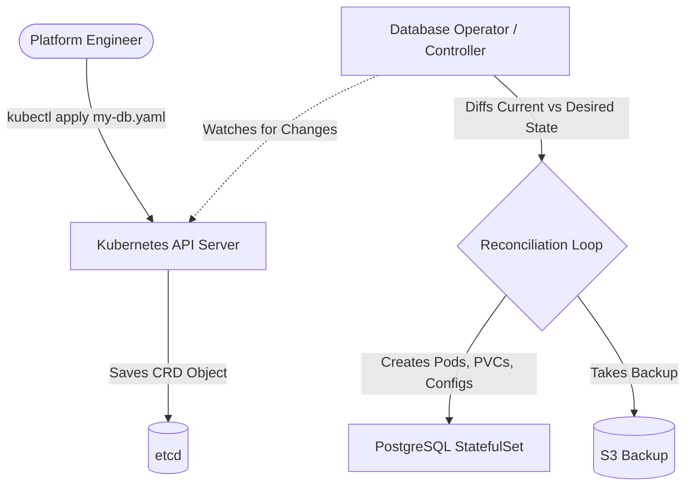

# Kubernetes Operators and CRDs

> [!abstract]
> This note covers how to extend Kubernetes capabilities using Custom Resource Definitions (CRDs) and the Operator pattern. We will explore how Operators act as automated software managers inside the cluster, replacing manual human intervention for complex stateful applications. 

## Overview
**Ye kya hai?** 
Kubernetes natively Pods, Deployments aur Services ko samajhta hai. Par agar aapko K8s se bolna ho ki ek "Database" ya "TLSCertificate" banao, toh K8s ko default me ye nahi pata hota. **CRD (Custom Resource Definition)** K8s API ko extend karta hai, jisse aap apne khud ke objects bana sako. Aur **Operator** ek smart controller hai (code) jisme human domain knowledge hoti hai, jo in CRDs ko manage karta hai (jaise database ko backup, scale, ya upgrade karna).

**Kyu use hota hai?** 
Stateless apps ke liye Deployments kaafi hain. Par stateful apps (DB, Prometheus) ke liye manual intervention (Day 2 operations) chahiye hota hai. Operators is manual human effort ko automate karte hain.

**Real life example & Simple analogy:** 
Socho K8s ek smart manager hai jise basic tasks aate hain. Agar factory me ek complex machine (PostgreSQL) chalani hai, toh aapko ek specialist (Operator) hire karna padega. Ye specialist hamesha (24x7) machine ko check karta hai (Reconciliation loop) aur ensure karta hai ki sab perfect chal raha hai.

**Industry kaha use karti hai?**
Har production grade cluster me. E.g., Prometheus Operator se monitoring manage hoti hai, cert-manager se TLS certs automate hote hain, aur database operators se databases HA (High Availability) mode me chalte hain.

### Architecture (Mermaid Diagram)


## Working
**Internal working & Data Flow:**
Operators **Reconciliation Loop** ke core principle par kaam karte hain: `Observe -> Diff -> Act`.
1. **Observe:** Operator K8s API server ko watch karta hai. Jaise hi koi naya Custom Resource (CR) create/update hota hai, operator ko event milta hai.
2. **Diff:** Operator current state (jo abhi chal raha hai) ko desired state (jo YAML me likha hai) se compare karta hai.
3. **Act:** Agar diff hai, toh Operator backend K8s resources (Pods, Secrets, Jobs) create ya update karta hai taaki desired state achieve ho.

**Operators vs Helm:**
Helm package manager hai (like `apt`). Ek baar YAML apply kar diya, uska kaam khatam. Agar pod crash hua ya DB upgrade karna hai, Helm madad nahi karega. Operator continuously run hota hai aur "Day 2" tasks handle karta hai.

## Installation
**Prerequisites:** Running K8s cluster (Minikube, EKS, AKS), `kubectl`, `helm`.

**Installation (Cert-Manager Example):**
```bash
# Add Jetstack repo
helm repo add jetstack https://charts.jetstack.io
helm repo update

# Install cert-manager aur uske CRDs
helm install cert-manager jetstack/cert-manager \
  --namespace cert-manager \
  --create-namespace \
  --set installCRDs=true
```
**Verification:**
```bash
kubectl get pods -n cert-manager
kubectl get crds | grep cert-manager
```

## Practical Lab
**Step-by-step implementation:** Deploying `cert-manager` aur ek self-signed cert generate karna.

1. **Install Operator** (Jaisa Installation me bataya).
2. **Create ClusterIssuer (CRD Instance)**
    Create `issuer.yaml`:
    ```yaml
    apiVersion: cert-manager.io/v1
    kind: ClusterIssuer
    metadata:
      name: selfsigned-issuer
    spec:
      selfSigned: {}
    ```
    ```bash
    kubectl apply -f issuer.yaml
    ```
3. **Request a TLS Certificate**
    Create `certificate.yaml`:
    ```yaml
    apiVersion: cert-manager.io/v1
    kind: Certificate
    metadata:
      name: my-app-cert
      namespace: default
    spec:
      secretName: my-app-tls-secret
      duration: 2160h # 90d
      renewBefore: 360h # 15d
      isCA: false
      dnsNames:
        - myapp.local
      issuerRef:
        name: selfsigned-issuer
        kind: ClusterIssuer
        group: cert-manager.io
    ```
    ```bash
    kubectl apply -f certificate.yaml
    ```
4. **Verification Output:**
    ```bash
    kubectl get certificate my-app-cert
    # Expected Output: READY: True, SECRET: my-app-tls-secret
    
    kubectl get secret my-app-tls-secret -o yaml
    # Yaha aapko base64 encoded tls.crt aur tls.key dikhega
    ```

## Daily Engineer Tasks
- **L1/L2 Engineer:** Check failed certificate renewals. Describe CRDs (`kubectl describe certificate`). Check operator logs.
- **L3/Senior Engineer:** Write custom CRDs, manage complex stateful app upgrades (like upgrading Prometheus Operator or DB Operator version).
- **Platform Engineer:** Write custom internal Operators using Golang (Operator SDK/Kubebuilder) to automate internal company processes.

## Real Industry Tasks
- **Real Tickets:** "SSL certificate of prod.website.com has expired" -> Engineer checks `cert-manager` logs, finds DNS challenge failing, fixes Route53 permissions for IAM role.
- **Migration/Upgrade:** Upgrading the NGINX Ingress Controller Operator aur purane CRD versions (v1beta1 to v1) ko migrate karna.

## Troubleshooting
**Common Issues & Possible Root Causes:**
1. **Error: the server doesn't have a resource type...**
   - *Cause:* CRD cluster me install hi nahi hai.
   - *Fix:* Ensure `--set installCRDs=true` was passed in Helm, ya CRD manifest manually apply karo.
2. **CRD object created, but nothing happens (Pending state)**
   - *Cause:* Operator controller pod crash ho gaya hai ya memory limit hit kar chuka hai.
   - *Fix:* `kubectl get pods -n <operator-namespace>`. Check logs.
3. **Cannot delete a custom resource (hangs indefinitely)**
   - *Cause:* Finalizer stuck hai aur Operator dead hai, toh K8s wait karta reh jayega.
   - *Fix:* `kubectl edit <crd-type> <name>`, waha se `finalizers:` block delete karke save karo. Force delete ho jayega.

**Real Production Logs:**
```log
E0627 15:10:00.123456 1 controller.go:110] Reconciler error: failed to update secret: context deadline exceeded
```
*Meaning:* Operator K8s API ko secret update karne gaya, par API server slow hai ya rate limit ho raha hai, toh timeout (deadline exceeded) ho gaya.

## Interview Preparation
**Basic:**
**Q: What is a CRD?**
A: Custom Resource Definition. K8s API ko extend karta hai apne custom objects (like `Database`, `Certificate`) define karne ke liye.

**Intermediate:**
**Q: Operator vs Helm me kya difference hai?**
A: Helm day-1 operations (template deploy) ke liye hai. Operator Day-2 operations (backup, upgrade, auto-heal) aur continuous reconciliation ke liye hai.

**Advanced / Production Scenario:**
**Q: Ek custom resource stuck ho gaya hai Terminating state me, kya karoge?**
A: *Expected Answer:* Mai `kubectl get <resource> -o yaml` karunga aur `finalizers` field check karunga. Uske baad Operator pod ke logs dekhunga ki finalizer remove hone me kya error aa raha hai. Agar operator dead hai aur mujhe forcefully clean karna hai, toh mai `kubectl edit` ya `kubectl patch` command use karke `finalizers` array ko empty kar dunga, jisse K8s use turant delete kar dega.

## Production Scenarios
**Scenario: Website down because TLS cert expired.**
- *How to think:* Check Ingress -> Check Secret -> Check Certificate CRD -> Check cert-manager Operator.
- *Where to check:* `kubectl describe certificate <cert-name>`, status dekho.
- *Resolution:* Agar Challenge stuck hai, check `kubectl describe challenge`. DNS ya HTTP-01 challenge issue fix karo (e.g., firewall blocked HTTP access). Delete old cert/secret to force renewal.

## Commands
| Command | Purpose | When to Use | Danger Level |
| :--- | :--- | :--- | :--- |
| `kubectl get crds` | List all CRDs | To check if operator CRDs exist | Low |
| `kubectl explain crd_name.spec` | Show schema of CRD | YAML likhne me doubt ho | Low |
| `kubectl patch crd_name <name> -p '{"metadata":{"finalizers":[]}}' --type=merge` | Force remove finalizer | Resource Terminating state me stuck ho | Medium |
| `kubectl logs -l app=cert-manager -n cert-manager -f` | Operator logs | Troubleshooting | Low |

## Cheat Sheet
- **Core Loop:** Observe -> Diff -> Act
- **Popular Operators:** Prometheus Operator, Cert-Manager, ECK (Elastic Cloud on K8s), Postgres Operator (Zalando/CrunchyData).
- **Frameworks to build Operators:** Operator SDK, Kubebuilder (written in Go), Kopf (Python).

## SOP & Runbook & KB Article
**SOP: Upgrading an Operator**
- **Purpose:** Securely upgrade Operator version.
- **Procedure:** 
  1. Upgrade CRDs first (always recommended).
  2. Upgrade the Operator deployment (via Helm/kubectl).
  3. Validate if existing custom resources are still running fine.
- **Rollback:** Apply old CRD manifest and Helm rollback.

## Best Practices & Beginner Mistakes
**Best Practices:**
- Always backup CRDs (`etcd` backup) before upgrading operators.
- Restrict Operator scope using Role/RoleBinding instead of ClusterRole if it only needs to manage one namespace.
**Beginner Mistakes:**
- *Mistake:* Applying Operator Deployment but forgetting to apply CRDs.
- *Impact:* K8s API will reject your custom YAML files with "resource not found".

## Advanced Concepts
- **Finalizers:** Ek pre-delete hook. K8s object tab tak delete nahi hota jab tak uske finalizers list empty nahi hoti. Operator finalizer add karta hai taaki external resources (like S3 bucket ya DB volume) delete kar sake before object disappears from K8s API.
- **Mutating & Validating Webhooks:** CRD create hote hi Operators webhooks use karte hain (Admission Controllers) yaml validate karne aur default fields inject karne ke liye.

## Related Topics & Flashcards & Revision
- **Related:** [[04-Orchestration/K8S-01 Kubernetes Architecture]], [[04-Orchestration/K8S-05 Helm Package Manager]]
- **Flashcard:** What is the Reconciliation loop? -> `Observe -> Diff -> Act`.
- **Revision:** 15 mins for practicing `cert-manager` setup and requesting a cert.
