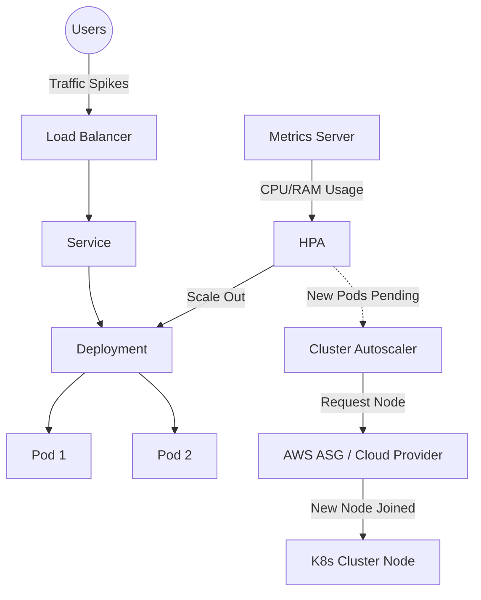
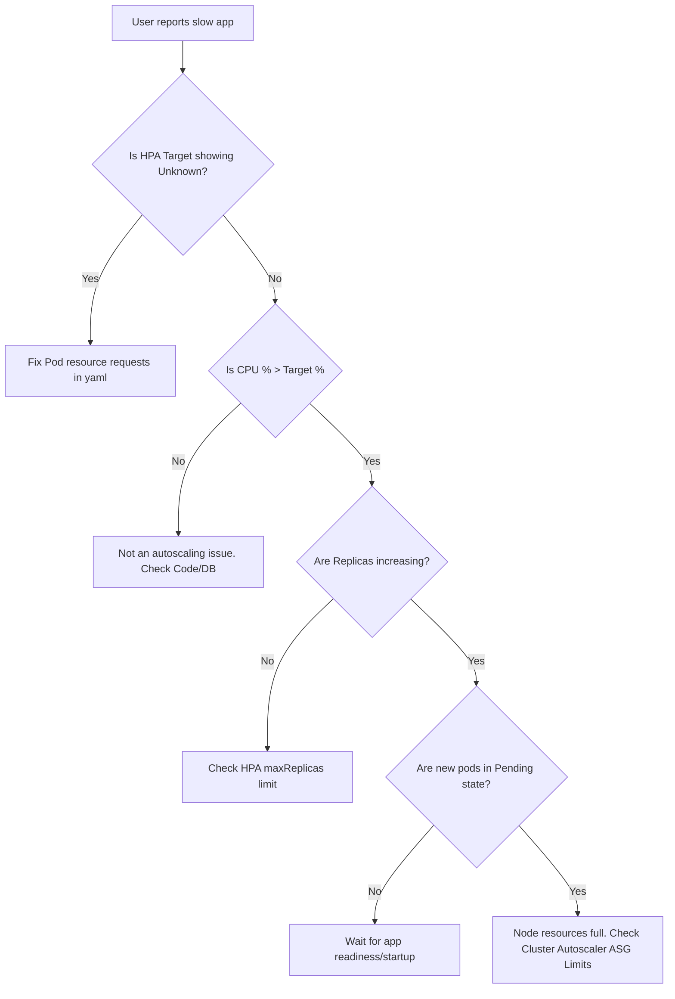

# Overview
**Kubernetes Autoscaling kya hai?** 
Real life example: Imagine ek restaurant hai. Normal din me 2 waiters (Pods) kaam karte hain. Jaise hi weekend aata hai, customer traffic badh jata hai. Agar waiters nahi badhaye, toh service slow ho jayegi. Kubernetes me HPA (Horizontal Pod Autoscaler) wahi naye waiters hire karne ka kaam karta hai. Aur agar restaurant me jagah hi khatam ho jaye, toh Cluster Autoscaler naya restaurant floor (Node) rent pe le aata hai.
Industry isko use karti hai cost save karne aur high availability ensure karne ke liye. Jab traffic aaye tab infrastructure scale up ho, jab na ho tab scale down.

### Architecture


# Working
Kubernetes autoscaling primarily in 4 layers pe kaam karta hai:
1. **Horizontal Pod Autoscaler (HPA):** Pods ke replicas badhata hai ya kam karta hai (Scaling In/Out). Metrics Server se lagatar data leta hai.
2. **Vertical Pod Autoscaler (VPA):** Exist karne wale pod ko aur zyada CPU/RAM (Requests/Limits) de deta hai (Scaling Up/Down). Ye normally pod restart karke apply karta hai.
3. **Cluster Autoscaler (CA):** Jab cluster (nodes) pe resources khatam ho jaye aur Pod `Pending` state me fas jaye, CA cloud provider (jaise AWS, Azure) se naya VM/Node le aata hai.
4. **KEDA (Event-driven):** External metrics jaise RabbitMQ/SQS me kitne messages hain, us base pe scale karta hai. (Ye Scale to Zero tak ja sakta hai).

**Data Flow:** Pod running -> Metrics Server collects data -> HPA reads data -> HPA instructs Deployment to scale -> K8s tries to schedule -> Not enough Node Capacity -> CA detects pending pods -> CA provisions new Cloud Node.

# Installation
Prerequisites: Cluster me Metrics Server installed hona chahiye. Jis Deployment ko scale karna hai, uske Pods me `resources.requests` explicitly set hona chahiye.
**Metrics Server Installation Configuration:**
```bash
# Metrics server installation yaml
kubectl apply -f https://github.com/kubernetes-sigs/metrics-server/releases/latest/download/components.yaml
```

# Practical Lab
**Scenario:** Ek PHP apache web app deploy karenge, usme HPA lagayenge (CPU base pe), aur uspar load dal ke live scaling dekhenge.

**Step 1: Application Deployment (CLI Method)**
YAML banaiye `php-apache.yaml`:
```yaml
apiVersion: apps/v1
kind: Deployment
metadata:
  name: php-apache
spec:
  selector:
    matchLabels:
      run: php-apache
  replicas: 1
  template:
    metadata:
      labels:
        run: php-apache
    spec:
      containers:
      - name: php-apache
        image: registry.k8s.io/hpa-example
        ports:
        - containerPort: 80
        resources:
          limits:
            cpu: 500m
          requests:
            cpu: 200m
---
apiVersion: v1
kind: Service
metadata:
  name: php-apache
  labels:
    run: php-apache
spec:
  ports:
  - port: 80
  selector:
    run: php-apache
```
```bash
kubectl apply -f php-apache.yaml
```

**Step 2: HPA Create karna (CLI Method)**
```bash
kubectl autoscale deployment php-apache --cpu-percent=50 --min=1 --max=10
```

**Step 3: Load Testing**
New terminal open karke busybox container chalaye aur infinite requests bheje:
```bash
kubectl run -i --tty load-generator --rm --image=busybox:1.28 --restart=Never -- /bin/sh -c "while sleep 0.01; do wget -q -O- http://php-apache; done"
```

**Step 4: Verify HPA Behavior**
```bash
kubectl get hpa -w
# Wait for target CPU to jump to >50% and replicas to dynamically scale up to 10
```

# Daily Engineer Tasks
- **L1 Engineer:** Check karna ki HPA sahi se chal raha hai ya nahi `kubectl get hpa`. Agar `<unknown>` aa raha hai, toh team ko inform karna.
- **L2 Engineer:** Naye deployments ke liye HPA yaml create/modify karna. Troubleshooting karna agar pods pending state me stuck hain (Resources shortage).
- **L3 / DevOps / Senior Engineer:** Cluster Autoscaler ka setup karna AWS/Azure environment me. KEDA configure karna microservices architecture me. Cost optimization ke strategies implement karna (scaling to zero for dev envs).

# Real Industry Tasks
- **Black Friday / Big Billion Day Sale Prep:** E-commerce companies HPA thresholds lower karti hain aur `minReplicas` badhati hain (Pre-warming) taaki sudden traffic spike aane pe pod creation aur Node spin-up ka delay architecture ko crash na kare.
- **Batch Processing Migration (Async):** Message Queues lagayi gayi, par standard HPA CPU based hone ki wajah se scaling late ho rahi thi. Engineer ko KEDA lagana padta hai taaki queue length dekh ke turant nayi pods aa jayein.
- **Cost Reduction Drive:** Raat ke 2 baje traffic na ke barabar hota hai (Non-prod environments). KEDA use karke inko zero replicas pe scale down kar diya jata hai.

# Troubleshooting
**Problem:** HPA targets column me `<unknown>/50%` dikha raha hai.
**Symptoms:** HPA deployment ko scale out nahi kar pa raha hai.
**Root Cause:** Ya toh metrics-server dead hai, ya Pod ke containers me `resources.requests.cpu` / `memory` set nahi hai. HPA calculation percentage based hai, bina base request ke math work nahi karta.
**Resolution:** Add `requests` in deployment yaml containers block.
**Verification:** Apply karke 2-3 minute wait karein aur `kubectl get hpa` karein, unknown value chali jayegi.

**Problem:** Pods stuck in `Pending` state.
**Root Cause:** Cluster me nodes pe bache hue resources nahi hai, aur Cluster Autoscaler ya toh configured nahi hai ya Cloud ASG ka max limit hit ho chuka hai.
**Resolution:** AWS Console/Azure Portal me jaa ke Auto Scaling Group (ASG) ka max size badhayein ya manually naya worker node add karein.

# Interview Preparation
**Basic:**
**Q: HPA calculate kaise karta hai scaling aur iske pre-requisite kya hain?**
A: HPA ko kaam karne ke liye Metrics Server chahiye. Aur jis pod ko scale karna hai usme `resources.requests` define hona zaroori hai. Calculation formula: TargetReplica = ceil(CurrentReplicas * (CurrentMetricValue / DesiredMetricValue)).

**Intermediate:**
**Q: Kya main ek hi application deployment pe HPA aur VPA dono laga sakta hu (same metric par)?**
A: CPU ya RAM ke same metric pe dono ek sath nahi lagana chahiye. Thrashing hogi: VPA pod restart karega resource limits badhane ke liye, aur udhar se HPA naya pod banayega load dekh ke. Result is chaos.

**Advanced / Production:**
**Q: Event-driven Autoscaling (KEDA) kyu zaroori hai jab humare paas already native HPA CPU/Memory based hai?**
A: CPU based autoscaling reactive (late response) hoti hai. Agar sudden load aaya Queue me (jaise 10,000 orders in 1 sec), tab tak K8s scale nahi karega jab tak running pods orders fetch na karein aur unka CPU load na badhe. KEDA proactive hai, wo sidha Message Queue ki length read karta hai aur pehle se hi zaroorat ke hisaab se workers deploy kar deta hai. Plus, it scales to Zero!

# Production Scenarios
**Scenario:** HPA properly scale up request bhej raha hai. HPA badhne ki wajah se cluster node capacity full ho gayi. Cluster Autoscaler (CA) ne cloud se request karke naya Node (EC2) mangwaya par Node aane me 3-4 minutes lagte hain. Is beech users ko timeout/5xx errors aa rahe hain. Isko fast kaise karein?
**How to think:** Ye boot-up latency ki problem hai. K8s fast hai but Cloud VM aane me time lagta hai. Isko "Overprovisioning" se handle karte hain.
**Resolution:** Ek low-priority deployment (dummy pods like `pause` container) banate hain cluster me. Inka kaam sirf resources gher ke (reserve karke) baithna hai. Jaise hi real application me sudden traffic aata hai, scheduler in low-priority pause pods ko immediately kill (evict) kar deta hai, real app pods ko instant jagah mil jati hai. Aur pause pods jab dubara aane ki koshish karte hain, toh CA trigger ho jata hai naya Node lane ke liye background me, user impact nahi hota.

# Commands
| Command | Purpose | Example | When NOT to use |
|---|---|---|---|
| `kubectl top pods` | Shows pod resource usage metrics | `kubectl top pods -n default` | Do not use if metrics-server is absent. |
| `kubectl autoscale` | Imperative way to create HPA | `kubectl autoscale deployment app --cpu-percent=70 --min=2 --max=10` | Use YAML for production GitOps. |
| `kubectl get hpa -w` | Live watch HPA targets and scale status | `kubectl get hpa -n myapp -w` | N/A |
| `kubectl describe hpa` | Shows recent scaling events, reasons and metric math | `kubectl describe hpa frontend` | N/A |

# Cheat Sheet
- **HPA Math:** `ceil(Current Replicas * (Current Metric / Target Metric))`
- **HPA Cooldown Default:** Scale down delay is by default 5 minutes (300s). (Matlab agar CPU low ho gaya, HPA 5 min wait karega before killing pods to prevent thrashing).
- **VPA UpdateMode Values:** 
  - `Auto`: Will restart running pods to apply new limits.
  - `Initial`: Only applies recommended limits when a NEW pod starts.
  - `Off`: Dry-run mode, sirf recommendation deta hai apply nahi karta.
- **KEDA:** CRD is named `ScaledObject`.

# SOP & Runbook & KB Article
**SOP: HPA Implementation on Production Deployments**
- **Purpose:** Ensure safe rollout of autoscaling without causing pod evictions due to tight resources.
- **Procedure:** 
  1. Verify Metrics Server health. 
  2. Baseline the app: Check last 7 days CPU/RAM peak.
  3. Define CPU `requests` accurately in Deployment. 
  4. Apply HPA with `minReplicas` exactly same as current prod scale so no immediate scale-down drops traffic. 
  5. Monitor HPA behavior over 24-48 hours.
- **Rollback:** `kubectl delete hpa <app-name>`. Manually scale deployment back to base replica size via `kubectl scale`.

# Best Practices & Beginner Mistakes
- **Beginner Mistake:** HPA bina `requests` set kiye laga diya. Output: HPA humesha `<unknown>` raheta hai aur kbhi scale nahi hota.
- **Beginner Mistake:** Target Threshold bohot tight rakh diya (e.g., 90%). Jab 90% hit hoga tab scale start hoga, aur pod boot hone me time lagega. Is delay me CPU 100% ho jayega aur running pods OOM/CrashLoopBackOff me chale jayenge.
- **Best Practice:** Keep CPU threshold conservative, around 60-70%. Isse 30-40% breathing space milta hai jab tak nayi pods start na ho jayein.
- **Best Practice:** Application ka Startup time fast hona chahiye (Proper Liveness/Readiness probe). Autoscaling is useless agar app boot hone me hi 5 minute le rahi hai.

# Advanced Concepts
**Behavior / Stabilization Window (Thrashing Prevention):**
Jab metrics continuously fluctuate karte hain (ups & downs), toh HPA lagatar pods banata aur kill karta hai. Isey *Thrashing* kehte hain.
Modern HPA yaml v2 me `behavior` flag milta hai jisme aap bata sakte ho:
```yaml
behavior:
  scaleDown:
    stabilizationWindowSeconds: 300
    policies:
    - type: Percent
      value: 100
      periodSeconds: 15
```
Iska matlab agar spike khatam ho jaye, toh 5 minutes (300s) wait karo scale down hone se pehle, kyuki kya pata aage wapis traffic spike ho.

# Related Topics & Flashcards & Revision
- [[04-Orchestration/K8S-01 Kubernetes Architecture]]
- [[04-Orchestration/K8S-11 Scheduling and Taints]]
- [[07-Cloud/AWS-01 AWS Core Services for DevOps]]
**Flashcard:** VPA kis mode me pod ko forcibly restart karta hai limits apply karne ke liye? -> `Auto` mode.

# Real Production Logs & Commands & Decision Tree
**Log Example: `kubectl describe hpa` me kya dikhta hai**
```text
Events:
  Type    Reason             Age   From                       Message
  ----    ------             ----  ----                       -------
  Normal  SuccessfulRescale  2m    horizontal-pod-autoscaler  New size: 4; reason: cpu resource utilization (percentage) above target
  Normal  SuccessfulRescale  1m    horizontal-pod-autoscaler  New size: 8; reason: cpu resource utilization (percentage) above target
  Normal  SuccessfulRescale  30s   horizontal-pod-autoscaler  New size: 10; reason: cpu resource utilization (percentage) above target
```
**Decision Tree for Scaling Failure Analysis:**

