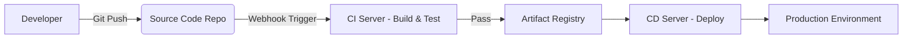
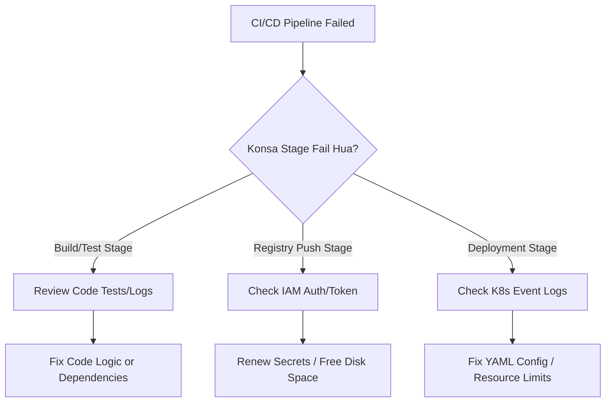

# CICD-01 CI/CD Concepts

# Overview
Ye kya hai? Kyu use hota hai? CI/CD (Continuous Integration / Continuous Delivery & Deployment) ek software delivery pipeline hai jo code push hone se lekar production tak release karne ka process automate karti hai. Iska main goal hai development teams ko fast aur reliable tareeke se software deliver karne me help karna, bina manual errors ke.

Real life example: Socho ek car manufacturing assembly line. Ek developer naya engine (code) rakhta hai. CI us engine ko automatically test karta hai ki start hota hai ya nahi. CD us engine ko car me fit karke directly showroom (production) tak automatically le jata hai. Koi manual driver (human intervention) nahi chahiye!

Industry kaha use karti hai? Har modern tech company (FAANG, start-ups, enterprises) ise use karti hai taaki din me 100+ releases ho sake, wo bhi zero downtime ke sath. Manual deployments ab purane zamane ki baat ho gayi.



# Working
Internal working aur Data flow kaise chalta hai:
1. **Continuous Integration (CI):** Jab developer code commit/push karta hai, Git ek webhook trigger karta hai CI server (like GitHub Actions, Jenkins, GitLab CI) ko. CI server code pull karke usko compile/build karta hai, linting karta hai, aur **Unit Tests** run karta hai. Agar test fail hota hai, to pipeline turant ruk jati hai (ise kehte hain *Breaking the build*).
2. **Security & Package (DevSecOps):** Source code scan (SAST) hota hai aur vulnerabilities check hoti hain. Phir application ka ek Docker image build hota hai aur use Artifact Registry (AWS ECR, Docker Hub) mein push kar diya jata hai.
3. **Continuous Delivery / Deployment (CD):** Yahan se deployment start hota hai. Naya artifact pull karke Staging/QA me deploy hota hai. 
   - Agar *Continuous Delivery* hai, to QA/Manager manually "Approve" click karega Production deploy ke liye.
   - Agar *Continuous Deployment* hai, to bina human interaction ke automated E2E tests ke baad seedha Production mein deploy ho jayega.

# Installation
Prerequisites aur architecture setup karne ke liye:
Conceptually ek CI/CD environment banane ke liye aapko 4 components chahiye:
1. **Version Control System:** (GitHub, GitLab, Bitbucket) jahan source code rakha ho.
2. **CI/CD Server / Runner:** (Jenkins Master/Worker, GitLab Runners, GitHub Actions) jo actually compute power provide karte hain automation scripts chalane ke liye.
3. **Artifact Registry:** (AWS ECR, Nexus, Artifactory) jahan final binaries ya Docker images store hongi.
4. **Compute Environment:** (AWS EC2, Kubernetes, ECS) jahan final application deploy hogi aur run karegi.

# Practical Lab
Step-by-step implementation (Mental Walkthrough & Concept):
1. **Source Code Repo:** GitHub par ek Node.js app repo create karo.
2. **Pipeline Script:** Repo me `.github/workflows/main.yml` (ya Jenkinsfile) create karo.
3. **CI Steps:** Pipeline script me commands add karo: `npm install` (dependencies), `npm run test` (testing).
4. **Build & Push:** `docker build -t myapp:${GITHUB_SHA} .` aur `docker push` ke steps add karo (Secrets ka use karke credentials safely manage karo).
5. **CD Step:** `kubectl apply -f deployment.yaml` run karke K8s cluster pe naya version deploy karo.
*Expected Output:* Jaise hi developer `main` branch me push karega, 5 minute ke andar naya code staging website pe live ho jayega bina ek bhi CLI command manually type kiye.

# Daily Engineer Tasks
- **L1/L2 Engineer:** Pipeline monitoring. Agar pipeline fail hoti hai to check karna ki network timeout issue tha ya code issue. Agar code issue hai to developer ko tag karna.
- **L3/Senior Engineer:** Pipeline optimization. Build time ko 20 mins se 5 mins tak kam karna by implementing dependency and Docker layer caching.
- **DevOps/SRE/Platform Engineer:** Naye deployment strategies (Canary, Blue-Green) design karna, automated rollback triggers set karna, aur DevSecOps (Trivy, SonarQube) implement karna across the organization.

# Real Industry Tasks
- **Migration Tickets:** Purane Jenkins server se sabhi pipelines ko GitHub Actions ya GitLab CI me migrate karna aur unhe YAML-as-code format me standardize karna.
- **Speed Optimization:** Jenkins master-slave architecture scale karna, parallel testing implement karna.
- **Release Automation:** Developer ke PR merge karte hi automatically Slack notification bhejna aur Jira ticket status update karna webhook ke through.

# Troubleshooting
Common issues, Unke Symptoms aur Resolution:
1. **Issue: Pipeline is extremely slow (Takes 30+ mins).** 
   - *Root Cause:* Har run me `npm install` ya `maven package` internet se sabhi dependencies scratch se re-download kar raha hai.
   - *Resolution:* CI tool ka caching mechanism use karo (e.g. GitHub Actions cache for `~/.npm` or `.m2`).
2. **Issue: Flaky Tests (Pipeline randomly 10% fail hoti hai).**
   - *Root Cause:* Tests network calls ya shared Database pe depend kar rahe hain jisse race condition ban rahi hai.
   - *Resolution:* External DB/APIs ko mock karo. Ensure karo ki test start hone se pehle DB environment wipe/clean hota ho.
3. **Issue: Docker Push fails with "401 Unauthorized".**
   - *Cause:* Static password ya token expire ho gaya hai.
   - *Resolution:* OIDC (OpenID Connect) configure karo taaki short-lived, dynamically generated cloud tokens ka use ho.

# Interview Preparation
- **Basic:** CI aur CD mein kya main difference hai? (Continuous Delivery me Prod deployment ke liye manual approval hota hai, Continuous Deployment me sab 100% automated hota hai bina human touch ke).
- **Intermediate:** DORA Metrics kya hoti hain? (Deployment Frequency, Lead Time for changes, MTTR, Change Failure Rate. Ye 4 metrics ek DevOps team ki performance measure karti hain).
- **Advanced / Scenario Based:** Apki CI pipeline deployment ke waqt phat gayi aur half deploy ho gaya. K8s downtime prevent karne ke liye konsi strategy best hai?
  - *Expected Answer:* Hum Kubernetes me Rolling Update deployment use karenge with properly configured Readiness Probes. Jab tak naya pod ready nahi hoga, traffic purane pod pe hi rahega, so zero downtime.
- **Production (Rapid Fire):** Secret scanning kahan lagani chahiye? -> Commit phase me (pre-commit hooks) aur CI pipeline ke start me. Secret leak hone par pipeline wahi fail honi chahiye, build image me nahi jani chahiye.

# Production Scenarios
Scenario: "Website completely down ho gayi 5 minute baad Prod deploy hone ke."
- **How to think:** Kya recent change live gaya tha? Monitoring tools kya kah rahe hain?
- **Where to check:** APM (Datadog/NewRelic), Kubernetes Pod Status (CrashLoopBackOff?), CI/CD logs.
- **Root Cause Analysis:** Say code me ek bug tha jo unit test pakad nahi paya ya DB schema update fail hua.
- **Resolution:** Immediate resolution hai "Rollback". CI/CD portal me jao aur previous successful pipeline ke artifact ko wapas deploy karo (One-click rollback).
- **Prevention:** Canary Deployment use karna chahiye tha. Naya code sirf 5% users ko diya jata, errors aate to automatically rollback ho jata bina 95% users ko impact kiye.

# Commands
| Command | Purpose | Syntax | Example | When to use | Danger Level |
|---------|---------|--------|---------|-------------|--------------|
| `npm test` | Unit tests chalana | `npm test` | `npm test` | CI test phase mein | Low |
| `docker build` | Code aur dependencies ko pack karna | `docker build -t <tag> .` | `docker build -t myapp:${GIT_COMMIT} .` | CI build phase mein | Low |
| `docker push` | Artifact registry me upload karna | `docker push <image>` | `docker push ecr.../myapp:v1` | CD phase se pehle | Medium |

# Cheat Sheet
- **CI**: Build, Test, Code Quality check. Fast feedback loop.
- **CD (Delivery)**: Code ready to deploy. Automated up to Staging. Manual approval for Prod.
- **CD (Deployment)**: 100% Automation directly to Production. Requires crazy good testing.
- **Blue-Green Deployment**: 2 identical environments. Shift 100% traffic instantly. Zero downtime, fast rollback. Costs 2x infrastructure.
- **Canary Deployment**: Slowly shift traffic (5% -> 20% -> 100%). Safest, catches bugs with minimal user impact.
- **Feature Flags**: Code production me live hai, par user se chhupa hua hai. UI se button on/off karke feature enable hota hai.

# SOP & Runbook & KB Article
- **SOP - Adding a new service to CI/CD:** Purpose: Naye microservice ke liye standard pipeline template banana. Validation: Verify image ECR me push ho gayi aur staging me deploy ho gayi.
- **Runbook - Build Queue is Full/Stuck:**
  - *Detection:* Developers complain pipeline is not starting.
  - *Investigation:* Check CI runner nodes. CPU/Memory full ho sakti hai ya scale-up fail ho gaya.
  - *Resolution:* Manually spin up temporary runner nodes ya K8s HPA (Horizontal Pod Autoscaler) limits ko badhana.
- **KB Article - "Works on my machine" Issue:** Problem: Code local me chal raha hai par CI me fail ho raha. Cause: OS/Node version mismatch. Resolution: Hamesha Docker container ke andar build steps run karo taaki local aur CI ka environment 100% identical rahe.

# Best Practices & Beginner Mistakes
- **Beginner Mistake:** Docker images ko `latest` tag se push karna. Isse immutability destroy ho jati hai aur rollback karna impossible ho jata hai kyuki aapko nahi pata ki pichla 'latest' kya tha.
- **Best Practice:** Hamesha Git Commit Hash (e.g., `myapp:a1b2c3d`) ko as a tag use karo. Ye ensure karta hai ki aap exactly track kar sako ki image kis code se bani hai.
- **Best Practice (Immutability):** "Build once, deploy everywhere." Ek baar build karke Docker image bana lo, phir Dev, Staging aur Prod sab jagah same image use karo, bas environment variables pass karo.

# Advanced Concepts
- **Trunk-Based Development (TBD):** DevOps me lambi lambi feature branches nahi banayi jati. Sab developers roz (multiple times a day) seedha `main` branch me choti-choti commits push karte hain. Adhuri chizein feature flags ke peeche chupa di jati hain.
- **GitOps:** Ye CI/CD ka next level hai (Tools: ArgoCD, FluxCD). Yahan aap external script se `kubectl apply` nahi chalate (Push model). K8s cluster khud continuously Git repo ko check karta hai (Pull model) aur apna state Git state se match karta hai. Ye zyada secure aur reliable hai.

# Related Topics & Flashcards & Revision
- [[00-MOC/Master-Index|Master Index]]
- [[02-Version-Control/GIT-02 Branching Strategies|Branching Strategies]]
- [[05-CI-CD/CICD-03 GitHub Actions|GitHub Actions (Implementation)]]
- [[07-Containers/Docker-01 Concepts|Docker Concepts]]

**Flashcards:**
- *Q: Continuous Delivery aur Deployment me kya farq hai?* -> A: Delivery me manual gate hota hai Prod ke liye, Deployment me sab auto hota hai.
- *Q: Blue-Green aur Canary me kya farq hai?* -> A: Blue-Green ek jhatke me 100% traffic shift karta hai, Canary ahista-ahista (like 10%).

**Revision Timeline:**
- 5 min: Cheat sheet aur DORA metrics revise.
- 15 min: Interview Questions aur Production Scenarios go-through karo.
- 30 min: Ek mental architecture draw karo (Git -> CI -> ECR -> CD -> K8s) on a whiteboard.

# Real Production Logs & Commands & Decision Tree
Sample Production CI Log when a pipeline fails:
```text
[INFO] Scanning for projects...
[INFO] Running tests...
[ERROR] Tests run: 45, Failures: 1, Errors: 0, Skipped: 0
[ERROR] NullPointerException at PaymentService.process(PaymentService.java:38)
[INFO] ------------------------------------------------------------------------
[INFO] BUILD FAILURE
[INFO] ------------------------------------------------------------------------
```
*Explanation:* Yahan Code test stage pe fail hua (Unit test fail). Pipeline automatically ruk gayi, image build step skip ho gaya, ensuring ki toota hua code aage push na ho.

**Troubleshooting Decision Tree:**

