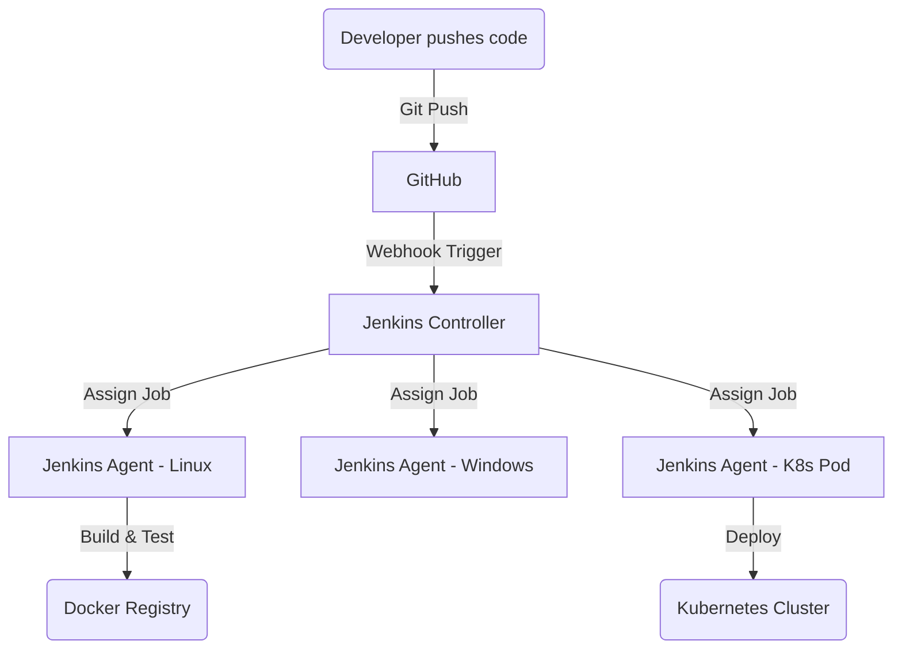

# CICD-02 Jenkins

# Overview
**Ye kya hai?** Jenkins ek open-source automation server hai, mostly Java me likha gaya hai. Ye Continuous Integration (CI) aur Continuous Delivery (CD) implement karne ke liye industry standard hai. 
**Kyu use hota hai?** Developers code likhte hain, par us code ko build, test, aur deploy karne ka kaam manual na karna pade, isliye Jenkins use hota hai. 
**Real life example:** Ek strict factory manager (Jenkins) jo khud kaam nahi karta, bas plans (Jenkinsfile) padhta hai aur apne mazdooron (Agents) ko order deta hai: "Tum code fetch karo, tum test chalao, aur tum deploy karo."
**Industry kaha use karti hai?** Har enterprise jaha complex releases, legacy systems, ya highly customized deployment pipelines hoti hain.
**Real production use-case:** Microservices ko Docker image me build karna, AWS/Kubernetes me deploy karna, aur tests run karke QA/DevOps team ko Slack pe message bhejna.

**Architecture (Mermaid Diagram):**


# Working
- **Internal working:** Controller aur Agents ke model par kaam karta hai. Controller scheduling, UI aur configs manage karta hai. Execution saara Agents pe hota hai.
- **Request flow:** Developer code push karta hai -> Webhook trigger hota hai -> Jenkins Controller request receive karta hai -> Queue me add karta hai -> Available Agent ko job assign karta hai -> Agent repository clone karta hai aur `Jenkinsfile` (Pipeline as code) ko execute karta hai.
- **Ports:** Web UI default `8080` pe chalta hai. Agents Controller se JNLP (TCP port `50000`) ke through connect karte hain.
- **Dependencies:** Java Runtime Environment (JRE) zaruri hai Jenkins Controller aur Agents ko run karne ke liye.

# Installation
**Prerequisites:** Java 11 ya 17 installed, 1 GB+ RAM, Linux server (Ubuntu/CentOS).
**Installation (Ubuntu/Debian):**
```bash
# Add Repository key
curl -fsSL https://pkg.jenkins.io/debian-stable/jenkins.io-2023.key | sudo tee \
  /usr/share/keyrings/jenkins-keyring.asc > /dev/null

# Add repository
echo deb [signed-by=/usr/share/keyrings/jenkins-keyring.asc] \
  https://pkg.jenkins.io/debian-stable binary/ | sudo tee \
  /etc/apt/sources.list.d/jenkins.list > /dev/null

sudo apt-get update
sudo apt-get install jenkins java-17-openjdk -y
```
**Configuration:** `http://<server-ip>:8080` pe jao. Initial admin password `/var/lib/jenkins/secrets/initialAdminPassword` se copy karo aur paste karo. Default plugins install karo.
**Verification:** `sudo systemctl status jenkins` check karo. 
**Rollback:** Agar installation fail ho toh `sudo apt-get remove --purge jenkins -y` karke dobara reinstall karo.

# Practical Lab
**Goal:** Ek production-grade Declarative Pipeline likhna jo parallel testing, credentials binding, aur workspace cleanup karti ho.

Bajaaye manually likhne ke, aap vault ki `examples/` directory me rakha gaya standard Jenkinsfile use kar sakte hain:
- Pipeline Template: [examples/05-CICD/Jenkinsfile](file:///C:/Users/SPTL/Documents/devops/devops/examples/05-CICD/Jenkinsfile)

**Step-by-step implementation:**
1. Open the file in `examples/05-CICD/Jenkinsfile` to review how `parallel` blocks and `cleanWs()` are structured.
2. Jenkins GUI me jao -> **New Item** -> **Pipeline** -> OK.
3. Pipeline section me **"Pipeline script from SCM"** select karo -> Apni Git repo ka URL dalo aur script path me `examples/05-CICD/Jenkinsfile` specify karo (ya content copy-paste karo for testing).
4. Save and click **Build Now**.
5. Expected Output: Jenkins code pull karega, parallel me Unit/Security tests run karega, aur end me workspace clean kar dega.

# Daily Engineer Tasks
- **L1 Engineer:** Failed pipelines ko check karna, unko re-trigger (restart) karna. Jenkins dashboard (Blue Ocean) monitor karna.
- **L2 Engineer:** Nayi pipelines (`Jenkinsfile`) likhna, Git webhooks configure karna, Jenkins Credentials add karna, naye Agent nodes configure karna.
- **L3/Senior Engineer:** Groovy Shared Libraries likhna taaki 100+ microservices ke liye code reuse ho sake. Jenkins Configuration as Code (JCasC) maintain karna.
- **SRE / Cloud Architect:** Jenkins ko Kubernetes me as a highly available pod setup karna, dynamic pod agents (scale to zero) architecture design karna.

# Real Industry Tasks
- **Real tickets:** "Developer says pipeline failing due to node_modules error".
- **Change requests (CR):** Jenkins controller ko latest LTS version pe upgrade karna (downtime plan karke).
- **Maintenance work:** Old builds aur artifacts delete karke server ka disk space clear karna.
- **Migration:** Legacy Freestyle jobs ko Declarative Pipelines (`Jenkinsfile`) me migrate karna.

# Troubleshooting
**Problem:** Build fails with `command not found: docker`.
- **Symptoms:** Pipeline error deti hai Docker commands pe.
- **Possible root causes:** Agent pe docker install nahi hai, ya `jenkins` user docker group me nahi hai.
- **Investigation steps:** Agent node pe login karo, `docker --version` run karo. Check permissions `groups jenkins`.
- **Resolution:** `sudo usermod -aG docker jenkins` run karo aur agent restart karo.
- **Prevention:** Agent provisioning ko Ansible/Terraform se automate karo.

**Problem:** Disk Space Full (Out of Workspace).
- **Symptoms:** Jenkins job fail, controller unresponsive.
- **Root Cause:** Purane artifacts aur workspace data delete nahi ho rahe.
- **Resolution:** `post { always { cleanWs() } }` use karo aur job config me "Discard old builds" enable karo.

# Interview Preparation
**Basic:** What is Jenkins and why is it used? (Automation server, CI/CD).
**Intermediate:** Declarative vs Scripted pipeline? (Declarative naya, structured, block-based hai. Scripted pura Groovy code hai, flexible but complex).
**Advanced:** How do you securely use passwords in Jenkinsfile? (By using the Credentials plugin and `withCredentials` block ya environment me `credentials('id')` bind karke. Kabhi bhi password hardcode nahi karna).
**Production/FAANG Scenario:** Your pipeline takes 45 mins to run. How do you optimize it?
**Answer:** Main stages ko analyze karunga. Agar tests sequential chal rahe hain, toh main unhe `parallel` block me daal dunga. Ek hi Agent ke badle 3 agents use karke Unit, UI aur Security test ek sath chalaunga, jisse time reduce hoga.
**Experience Level (L3):** How do you manage Jenkins configuration itself as code? (Using Jenkins Configuration as Code - JCasC plugin aur Job DSL).

# Production Scenarios
**Scenario:** Jenkins Server Down!
- **How to think:** Network issue hai ya service issue? Disk full toh nahi ho gayi?
- **Where to check:** SSH into Controller server. `sudo systemctl status jenkins`. 
- **Commands:** `df -h` (disk check), `tail -f /var/log/jenkins/jenkins.log`.
- **Root Cause:** Often `/var/lib/jenkins` disk full ho jati hai logs aur old builds ki wajah se, jisse Java process crash ho jata hai.
- **Resolution:** `/var/lib/jenkins/jobs/*/builds/` se old builds delete karo ya storage volume size badao.

# Commands
| Command | Purpose | Syntax | Example | Danger Level |
|---------|---------|--------|---------|--------------|
| `sh` | Linux shell command in pipeline | `sh 'cmd'` | `sh 'npm install'` | Low |
| `bat` | Windows batch command | `bat 'cmd'` | `bat 'msbuild.exe'` | Low |
| `cleanWs()` | Workspace delete karne ke liye | `cleanWs()` | `always { cleanWs() }` | Low (Good practice) |
| `parallel` | Tasks ek sath chalane ke liye | `parallel { stage('a') {} }` | `parallel { stage('T1'){} stage('T2'){} }` | Low |
| `input` | Manual approval wait (Pause pipeline) | `input 'msg'` | `input 'Deploy to Prod?'` | Low |

# Cheat Sheet
- **Default Port:** `8080` (HTTP), `50000` (JNLP for agents).
- **Logs:** `/var/log/jenkins/jenkins.log`.
- **Home Dir:** `/var/lib/jenkins` (Sab configurations, jobs yaha hote hain).
- **Jenkinsfile Structure:** `pipeline` -> `agent` -> `environment` -> `stages` -> `stage` -> `steps`.
- **Most important concept:** Pipeline-as-Code (Declarative pipeline).

# SOP & Runbook & KB Article
**SOP: Jenkins Upgrades**
- **Purpose:** Safely upgrade Jenkins LTS version.
- **Procedure:** Take VM snapshot/EBS backup -> Put Jenkins in "Prepare for Shutdown" mode (no new jobs) -> Run `apt-get upgrade jenkins` -> Verify UI is back.
- **Rollback:** Restore snapshot.

**Runbook: Agent Offline**
- **Detection:** Slack alert "Node Linux-Agent-01 is offline".
- **Investigation:** Check if agent VM is running in AWS/Azure. Check SSH connectivity.
- **Resolution:** Re-launch agent from Jenkins GUI (Nodes section) or reboot the agent VM.

**KB Article: Credentials Masked as asterisks**
- **Symptoms:** Log shows `******` instead of a command.
- **Cause:** Jenkins tries to hide passwords. If your variable matches a common word, it gets masked.
- **Resolution:** Ensure passwords/secrets are unique strings, not something like "admin" or "password".

# Best Practices & Beginner Mistakes
**Best Practices:**
- Never run builds on the Controller node. Always use external Agents.
- Keep Jenkinsfile inside the source code repository (Pipeline as Code).
- Always use `cleanWs()` post-build to save storage.
- Automate Jenkins backup using plugins or EFS/NFS for `/var/lib/jenkins`.
- Integrate with Active Directory/LDAP for user management.

**Beginner Mistakes:**
- Using Freestyle jobs (clicking buttons) instead of Pipelines. *Impact:* Difficult to maintain and track changes.
- Hardcoding AWS keys in `Jenkinsfile`. *Impact:* Security breach. Use Jenkins Credentials manager!
- Making a monolithic pipeline that runs sequentially for 2 hours instead of parallelizing tests.

# Advanced Concepts
- **Jenkins Shared Libraries:** Reusable Groovy code blocks. Example: Ek common `buildDocker()` function likho, aur saari projects usko call karengi. Code duplication avoid hota hai.
- **Dynamic Kubernetes Agents:** Static VM agents cost money. K8s plugin ke through, Jenkins automatically Pods banata hai job run karne ke liye, aur job khatam hone par Pod delete kar deta hai. Isse cost bachti hai aur infinite scale milta hai.
- **Jenkins Configuration as Code (JCasC):** Jenkins GUI pe click karke configure karna manual aur un-trackable hai. JCasC se YAML file me saari settings likhte hain.

# Related Topics & Flashcards & Revision
- **Prerequisites:** [[05-CI-CD/CICD-01 CI-CD Concepts]]
- **Next Topics:** [[05-CI-CD/CICD-03 GitHub Actions]] (Modern alternative to Jenkins)
- **Related:** [[04-Docker/Docker-01 Containerization Basics]], [[06-Kubernetes/K8s-01 Architecture]]

**Flashcards:**
- *Q: What block is used for parallel execution?* -> A: `parallel {}`
- *Q: Where do you store Jenkins secrets?* -> A: Credentials Manager -> bind using `credentials('id')`.
- *Q: Default port of Jenkins?* -> A: `8080`.
