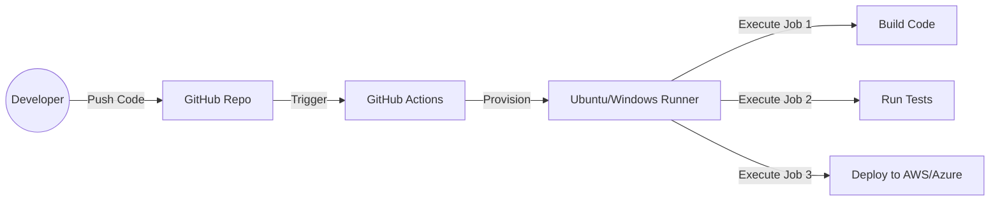

# CICD-03 GitHub Actions

# Overview
Ye kya hai? GitHub Actions (GHA) GitHub ka apna native CI/CD aur automation platform hai.
Kyu use hota hai? Pehle hum code GitHub mein rakhte the aur Jenkins ko bolte the "jaake le aa". Ab GitHub ke paas apna hi internal automation engine hai. Aap bas ek YAML file mein bata do kya karna hai, aur GitHub PR (Pull Request) aate hi sab apne aap test, build aur deploy kar dega.
Real life example: Jaise ek restaurant mein waiter (GHA) automatically kitchen (build) se khana leke table (production) pe serve kar deta hai bina chef (developer) ko baar baar bole.
Industry kaha use karti hai? Automating NPM package publishing, linting Python code on every PR, building Docker images aur unhe GHCR (GitHub Container Registry) mein push karne mein.
Architecture: GitHub repo mein `.github/workflows/` directory hoti hai jahan YAML files rehti hain. GitHub in YAML ko padhta hai, Ubuntu/Windows/Mac VMs (Runners) spin up karta hai, jobs execute karta hai, aur VM ko destroy kar deta hai.



# Working
Internal working: GitHub Actions event-driven hai. Ek event (e.g., code push) workflow trigger karta hai. Workflow ke andar ek ya ek se zyada `jobs` hoti hain jo parallel ya sequentially `runners` (VMs) par chalti hain. Har job ke andar multiple `steps` hote hain jo ya toh shell scripts run karte hain ya pre-built `actions` (Marketplace se).
Data flow: Push -> Webhook trigger internal to GitHub -> Workflow YAML read -> Runner allocate -> Checkout code -> Run steps -> Output artifacts/logs.
Authentication flow: External cloud providers (AWS/GCP/Azure) se connect karne ke liye OIDC (OpenID Connect) ka use hota hai. GitHub dynamically temporary tokens exchange karta hai, no need to store long-lived credentials.

# Installation
Prerequisites: GitHub account aur ek repository.
Installation: Isko install nahi karna padta, ye GitHub mein inbuilt hai. Agar aapko apne on-prem servers use karne hain, toh aapko **Self-hosted Runners** install karne padte hain.
Configuration: Bas repo ki root mein `.github/workflows/main.yml` file banani hoti hai.
Verification: Repo ke "Actions" tab mein jake pipeline execution dekh sakte hain.

# Practical Lab
Step-by-step implementation to build a Node.js App.

Bajaaye ek basic YAML likhne ke, aap vault ke `examples/` folder se FAANG-level, production-ready workflow dekh sakte hain: 
[examples/05-CICD/github-actions-ci.yml](file:///C:/Users/SPTL/Documents/devops/devops/examples/05-CICD/github-actions-ci.yml)

1. Apne repo mein `.github/workflows/` folder create karo.
2. Us folder mein `ci.yml` file create karo aur example YAML paste karo.
   *Note: Ye production YAML OIDC, Matrix Strategy, Caching, aur Multi-job (`needs`) architecture cover karti hai.*
3. Commit and push.
4. Expected Output: GitHub repo ke "Actions" tab mein ek workflow trigger hoga jisme pehle `test-and-build` chalega multiple Node versions par (matrix), aur pass hone ke baad `deploy` job trigger hogi.

# Daily Engineer Tasks
L1 Engineer: Existing YAML mein chhote changes karna, marketplace actions search karke add karna.
L2 Engineer: Secrets configure karna, failed pipelines ko troubleshoot karna, build matrix setup karna.
L3/Senior Engineer: Reusable workflows banana for multiple repos, OIDC integration with AWS/Azure, self-hosted runners setup karna aur unki maintenance.

# Real Industry Tasks
Real tickets: "Implement CI/CD for our new Go microservice".
Real change requests: "Update Node.js version from 16 to 20 in all GitHub Action workflows".
Migration: Jenkins se GitHub Actions migrate karna.
Optimization: Caching implement karke pipeline time ko 15 mins se 3 mins pe lana.

# Troubleshooting
Common issues:
- **Pipeline trigger nahi ho rahi**: Branch name YAML ke `on:` section se match nahi kar raha.
- **Resource not accessible by integration**: `GITHUB_TOKEN` ke paas permissions nahi hain. `permissions:` block YAML mein add karna padega.
- **Secrets not found**: Secret ko Environment level pe add kiya hai par workflow mein environment specify nahi kiya, ya typo in variable name.
Investigation steps:
1. Actions tab mein jao, failed job pe click karo.
2. Logs expand karke red error dekho.
3. Agar authentication error hai, verify secrets in repo settings.
Resolution: Update YAML or add missing secrets and click "Re-run all jobs".

# Interview Preparation

### Top 20 Interview Questions (Basic to FAANG Level)

**Basic (L1):**
1. **GitHub Actions mein `Runner` kya hota hai?**
   *Expected Answer:* Runner ek virtual machine ya server hai jo aapke workflow ko execute karta hai. GitHub apne hosted runners (Ubuntu/Windows/Mac) deta hai, ya aap apne khud ke "Self-hosted" runners bhi laga sakte ho.
2. **`workflow_dispatch` ka kya kaam hai?**
   *Expected Answer:* Ye trigger event aapko permission deta hai ki aap workflow ko manually GitHub UI (Actions tab) se button click karke run kar sako.

**Intermediate (L2/L3):**
3. **Job aur Step mein kya difference hai?**
   *Expected Answer:* Ek workflow mein multiple Jobs ho sakti hain. Har Job ek alag naye Runner (VM) par parallel mein chalti hai (unless `needs` use kiya ho). Ek Job ke andar multiple Steps hote hain jo ek hi VM par sequentially (ek ke baad ek) chalte hain.
4. **Agar do Jobs alag VM par chal rahi hain, toh unke beech file/data kaise share karoge?**
   *Expected Answer:* Jobs strongly isolated hoti hain. Data share karne ke liye main `actions/upload-artifact` use karke first job se data save karunga, aur second job mein `actions/download-artifact` se usko pull karunga.
5. **Caching kaise implement karte hain CI pipeline mein?**
   *Expected Answer:* `actions/cache` use karke. Agar Node.js hai toh directly `setup-node` action mein `cache: 'npm'` specify karne se automatically `~/.npm` cache ho jata hai, jis-se pipeline bohot fast ho jati hai.

**Advanced / FAANG Scenario:**
6. **10 microservices ke liye same deployment logic likhna hai, kya har repo mein 500 line ka YAML copy paste karoge?**
   *Expected Answer:* Nahi. Main ek "Reusable Workflow" (template) banaunga ek centralized repo mein using `on: workflow_call`. Baaki saari 10 repos us template ko call karengi `uses: org/repo/.github/workflows/deploy-template.yml@main`. Isse maintainability aasan ho jayegi.
7. **Production environment mein GitHub Actions se AWS deploy karna hai par Security team ne mana kiya hai ki AWS Access Keys GitHub Secrets mein save nahi hongi. Kaise karoge?**
   *Expected Answer:* Main **OIDC (OpenID Connect)** use karunga. GHA provider ban jayega AWS IAM mein. Workflow runtime par AWS se ek temporary short-lived token request karega. Koi static keys store karne ki zarurat nahi padegi.
8. **Ek script hai jo Mac, Windows aur Linux teeno par test karni hai. Kya 3 alag workflows likhne padenge?**
   *Expected Answer:* Nahi, main **Matrix Strategy** use karunga. `strategy: matrix: os: [ubuntu-latest, windows-latest, macos-latest]` define karke ek hi job likhunga. GitHub automatically 3 alag VMs trigger kar dega backend par.

**Top Production Issues (SRE Level):**
- **Action Rate Limits:** Docker Hub `Too Many Requests` error deraha hai kyuki har GHA run anonymously docker pull kar rahi hai. Solution: Authenticate to GHCR or use internal proxy.
- **Dangling Secrets:** Log injection ya `echo ${{ secrets.AWS_KEY }}` se secret expose na ho jaye, uske liye masking (***) zaroori hai, but advanced hackers base64 encode karke print kar dete hain. Ensure least-privilege IAM roles via OIDC.
- **Runner Starvation:** Self-hosted runners queue mein wait kar rahe hain kyuki multiple teams heavily build kar rahi hain. Solution: Action Runner Controller (ARC) in K8s for auto-scaling ephemeral pods based on webhook queues.

# Production Scenarios
Scenario "Workflow taking too long to build":
How to think: Har PR pe saari dependencies download ho rahi hain, jo slow hai.
Resolution: `actions/cache` use karo ya `setup-node` / `setup-python` mein caching enable karo.
Scenario "Need to test on Mac, Windows, Linux simultaneously":
Resolution: Use **Matrix Strategy**. Ek hi job likho, `strategy: matrix: os: [ubuntu-latest, macos-latest, windows-latest]` do aur runner `runs-on: ${{ matrix.os }}` rakho. GitHub apne aap 3 VMs spin karega.

# Commands
Yahan YAML syntax hi main command hoti hai:
- `on: push` - Trigger on push.
- `needs: jobA` - Makes current job wait for jobA to finish.
- `if: always()` - Runs even if previous steps fail. (Great for notifications/cleanup).
- `${{ secrets.MY_TOKEN }}` - Access repository secret.

# Cheat Sheet
Quick revision:
- Directory: `.github/workflows/`
- Triggers: `push`, `pull_request`, `schedule`, `workflow_dispatch` (Manual button).
- Contexts: `${{ github.sha }}` for commit hash, `${{ github.actor }}` for user.
- Caching: `actions/cache`
- Check out code: `actions/checkout@v4`

# SOP & Runbook & KB Article
SOP for adding a Secret:
1. Go to Repo Settings -> Secrets and variables -> Actions.
2. Click "New repository secret".
3. Enter Name (e.g., `AWS_ACCESS_KEY_ID`) and Value.
4. Reference in YAML as `${{ secrets.AWS_ACCESS_KEY_ID }}`.

KB Article: Secret not found error
Problem: Pipeline fails with unauthorized error.
Cause: Secret is missing or named incorrectly.
Resolution: Check Repo settings, ensure it's a Repository secret (not Environment, unless using environments). Re-run workflow.

# Best Practices & Beginner Mistakes
Best Practices:
- OIDC use karo for cloud auth. Long lived static keys mat rakho.
- Action versions ko pin karo (e.g., `@v4`). `@master` mat use karo kyunki breaking changes pipeline tod sakte hain.
- `workflow_dispatch` humesha add karke rakho for manual testing.
Beginner Mistakes:
- Har step ko alag alag copy paste karna bajaye Matrix ya Reusable workflows use karne ke.
- Code repo pull karna bhool jana. Agar `uses: actions/checkout@v4` nahi likha, toh runner ke paas source code hi nahi aayega!

# Advanced Concepts
Internal architecture: Self-hosted runners use karte time aapko dhyan rakhna padta hai ki VM scale kaise kare. Enterprises ARC (Actions Runner Controller) on Kubernetes use karte hain for auto-scaling ephemeral runners.
Security: Dependency Review actions use karke secure kar sakte hain ki koi compromised NPM package PR mein merge na ho jaye.

# Related Topics & Flashcards & Revision
Related: [[05-CI-CD/CICD-01 CI-CD Concepts]], [[05-CI-CD/CICD-02 Jenkins]], [[Docker]], [[Kubernetes]]
Flashcard:
Q: What allows a job to run on multiple OS simultaneously in GHA?
A: Matrix Strategy.
Revision: 5 min, 15 min, 30 min, Interview revision.

# Real Production Logs & Commands & Decision Tree
Log Sample:
```
Run actions/checkout@v4
Syncing repository: my-org/my-repo
Getting Git version info
Initializing the repository
...
Error: Input required and not supplied: token
```
Explanation: Checkout action ko token nahi mila (maybe private submodule pull kar raha tha bina token pass kiye).
Decision Tree for Failure:
Did job fail at Checkout? -> Fix GITHUB_TOKEN or SSH keys.
Did job fail at Build? -> Check dependency cache or typos.
Did job fail at Deploy? -> Check OIDC, IAM Roles or cloud credentials.
