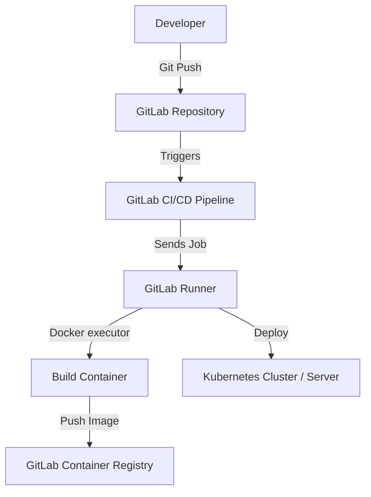
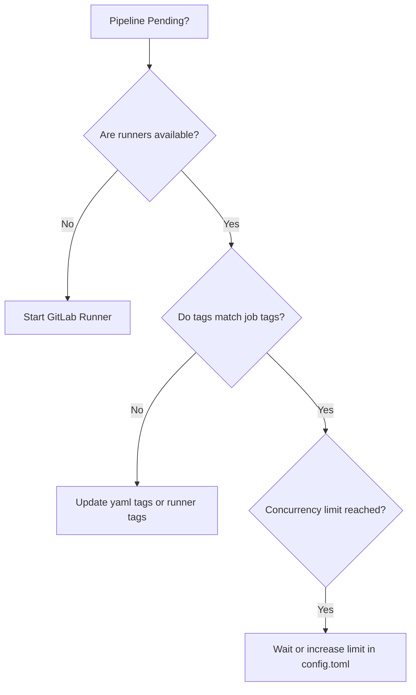

# CICD-04 GitLab CI

# Overview
**Ye kya hai?** GitLab CI ek in-built continuous integration aur continuous deployment (CI/CD) tool hai jo GitLab ke andar hi aata hai. Alag se Jenkins ya Bamboo install karne ki zarurat nahi padti.
**Kyu use hota hai?** Developers jab code push karte hain, toh automated tarike se us code ko test karna, build karna aur server par deploy karne ke liye ye use hota hai.
**Simple Analogy:** Jaise restaurant mein waiter order (code) leta hai, chef (GitLab CI/CD) usko cook karta hai (build & test), aur food delivery boy (runner) usko customer tak pahunchata hai (deploy).
**Real Life Example:** Aapne Swiggy app update push kiya. GitLab CI automatically naya version banayega, bugs check karega, aur Swiggy ke server par live kar dega.
**Industry Kaha Use Karti Hai?** Startups se lekar FAANG companies tak, jo "All-in-One" solution prefer karte hain (Source code + CI/CD + Registry ek jagah).

### Architecture / Visuals



# Working
**Internal Working:**
1. Code repo mein ek file hoti hai `.gitlab-ci.yml`.
2. Jaise hi koi git commit/push hota hai, GitLab webhook trigger karta hai.
3. GitLab server available **GitLab Runners** ko job assign karta hai.
4. Runners job execute karte hain (shell ya docker executor mein).
5. Output (artifacts) waapas GitLab server ko bhejte hain.

**Dependencies:** GitLab Server, GitLab Runner, Docker (if using docker executor), Kubernetes (if using k8s executor).
**Ports & Communication:** Runner aur GitLab Server ke beech HTTPS (Port 443) par communication hota hai. Runner hamesha GitLab ko poll karta hai, reverse connection nahi hota.

# Installation
**Prerequisites:** 
- GitLab account (ya on-premise GitLab server)
- Ek VM (AWS EC2 / Azure VM) Ubuntu jisme GitLab Runner install karna hai.
- Docker installed on that VM (agar docker executor chahiye).

**Installation (GitLab Runner on Linux):**
```bash
# 1. Add GitLab Runner repository
curl -L "https://packages.gitlab.com/install/repositories/runner/gitlab-runner/script.deb.sh" | sudo bash

# 2. Install Runner
sudo apt-get install gitlab-runner

# 3. Register Runner
sudo gitlab-runner register
# Enter URL: https://gitlab.com/
# Enter Token: (Get from Settings -> CI/CD -> Runners)
# Enter Description: production-runner
# Enter Executor: docker
# Default Image: docker:20.10.16
```
**Verification:**
`sudo gitlab-runner status` - Check service status. GitLab UI mein green circle aayega runner ke aage.
**Rollback:** `sudo gitlab-runner unregister --all-runners`

# Practical Lab
**Scenario:** Simple Flask App ka CI/CD pipeline banana jisme test, build, aur deploy stage ho.

**CLI Method:**
**Step 1: Create Files**
Repo mein ye files banaye:
`app.py`:
```python
from flask import Flask
app = Flask(__name__)
@app.route('/')
def hello(): return 'Hello from GitLab!'
if __name__ == '__main__': app.run(host='0.0.0.0')
```
`requirements.txt`:
```text
flask==2.2.2
```
`Dockerfile`:
```dockerfile
FROM python:3.9-slim
WORKDIR /app
COPY . .
RUN pip install -r requirements.txt
CMD ["python", "app.py"]
```

**Step 2: Create `.gitlab-ci.yml`**
```yaml
stages:
  - test
  - build
  - deploy

variables:
  IMAGE_TAG: $CI_REGISTRY_IMAGE:$CI_COMMIT_SHORT_SHA

test_app:
  stage: test
  image: python:3.9-slim
  script:
    - pip install -r requirements.txt
    - python -m py_compile app.py
    - echo "Testing Passed!"

build_image:
  stage: build
  image: docker:20.10.16
  services:
    - docker:20.10.16-dind
  script:
    - docker login -u $CI_REGISTRY_USER -p $CI_REGISTRY_PASSWORD $CI_REGISTRY
    - docker build -t $IMAGE_TAG .
    - docker push $IMAGE_TAG

deploy_prod:
  stage: deploy
  image: alpine
  script:
    - echo "Deploying $IMAGE_TAG to Production..."
  when: manual
  only:
    - main
```

**Step 3: Verification**
Commit and push. GitLab mein **CI/CD -> Pipelines** check karein.
Test aur Build apne aap pass honge, aur Deploy manual approval ke liye ruk jayega. Deploy par click karenge to chalega.

# Daily Engineer Tasks
- **L1 Engineer:** Failed pipeline check karna. Logs dekhna ki syntax error hai ya test fail hua.
- **L2 Engineer:** Naye environment variables add karna, secrets manage karna (Settings -> CI/CD -> Variables).
- **L3 / Senior Engineer:** `.gitlab-ci.yml` ko optimize karna, caching add karna `node_modules` ke liye. Templates banana using `include`.
- **Production Engineer / SRE:** Auto-scaling GitLab Runners setup karna EKS/K8s par. Group level security policy enforce karna.

# Real Industry Tasks
- **Migration:** Jenkins se GitLab CI mein 100+ projects migrate karna.
- **Maintenance:** GitLab Runner instances ka OS patch karna, Docker version upgrade karna.
- **Optimization:** Pipeline ka time 15 mins se 5 mins karna by using `needs` (Directed Acyclic Graph) and robust caching mechanisms.

# Troubleshooting
**Problem 1: "Cannot connect to the Docker daemon" in build job**
- **Symptoms:** Pipeline build stage par fail ho jati hai docker build command chalate waqt.
- **Root Cause:** Docker Executor use kar rahe ho bina DinD (Docker-in-Docker) service ke.
- **Investigation Steps:** Check `.gitlab-ci.yml` for `services: - docker:dind`.
- **Resolution:** Add `services: - docker:dind` aur `image: docker` ko job level par use karein.

**Problem 2: Pipeline stuck on "Pending"**
- **Symptoms:** Job trigger hoti hai par chalu nahi hoti.
- **Root Cause:** Ya toh shared runners disabled hain ya aapke specific tags wala koi runner online nahi hai.
- **Investigation Steps:** Check job tags `tags: [production]`. Jao CI/CD settings mein, dekho production tag wala runner active hai ya nahi.
- **Resolution:** Runner service start karein `sudo gitlab-runner start` ya tags match karein.

**Problem 3: Job B cannot find artifact from Job A**
- **Symptoms:** Job B mein "file not found" error.
- **Root Cause:** Job A ne artifacts export nahi kiye the.
- **Resolution:** Job A mein `artifacts: paths: - folder_name/` add karein.

# Interview Preparation
**Basic:**
**Q:** GitLab CI/CD pipeline file ka naam kya hota hai aur ye kahan hoti hai?
**A:** File ka naam `.gitlab-ci.yml` hota hai, aur ye repository ke root directory mein hoti hai.

**Intermediate:**
**Q:** `artifacts` aur `cache` mein kya difference hai?
**A:** `cache` use hota hai dependencies store karne ke liye (e.g. `node_modules`) taaki subsequent pipeline fast chale. Ye delete ho sakta hai. `artifacts` previous stage ka output hota hai (e.g. build file) jo next stage ko pass kiya jata hai. Ye GitLab UI se download bhi ho sakta hai.

**Advanced / FAANG:**
**Q:** How does GitLab CI implement a Directed Acyclic Graph (DAG) architecture?
**A:** Default behaviour mein next stage tabhi chalta hai jab previous stage ke saare jobs pass hon. Par hum `needs:` keyword use karke DAG implement kar sakte hain. A job can start executing as soon as its specific dependencies are met, skipping stage wait times completely. This drastically reduces overall pipeline execution time.

**Scenario Based / Production:**
**Q:** Aapka ek deployment job hai jo sirf "main" branch pe production deploy karta hai. Par main chahta hu ki production deploy karne se pehle manual approval lage. Kaise karoge?
**A:** Job YAML definition mein main `when: manual` add karunga. Isse job pipeline mein dikhega par apne aap execute nahi hoga jab tak UI pe koi play button na dabaye.

# Production Scenarios
**Scenario: Developer says "Pipeline is taking 30 minutes for a simple nodejs app!"**
- **How to think:** Network slow hai? Ya NPM baar baar sab install kar raha hai? Ya runners heavily loaded hain?
- **Where to check:** Pipeline logs for npm install step.
- **Resolution:** Maine dekha `npm install` 10 min le raha tha. Maine `cache` implement kiya `.gitlab-ci.yml` mein `cache: key: $CI_COMMIT_REF_SLUG` aur `paths: - node_modules/`. Time 30 mins se 3 mins pe aa gaya. 

# Commands
| Command | Purpose | Syntax | Example | When to use |
|---|---|---|---|---|
| `gitlab-runner register` | Runner ko server se jodne ke liye | `gitlab-runner register` | `gitlab-runner register --url https://... --token XYZ` | Naya VM setup karte time |
| `gitlab-runner verify` | Check connected runners | `gitlab-runner verify` | `gitlab-runner verify` | Runner unreachable ho toh |
| `gitlab-runner restart` | Restart service | `sudo gitlab-runner restart` | `sudo gitlab-runner restart` | Config update ke baad |

# Cheat Sheet
- **Pipeline entrypoint:** `.gitlab-ci.yml`
- **Executor types:** Shell, Docker, Kubernetes
- **Branch restrict:** `rules: - if: $CI_COMMIT_BRANCH == 'main'`
- **Manual trigger:** `when: manual`
- **Docker in Docker:** `image: docker`, `services: - docker:dind`

# SOP & Runbook & KB Article
**SOP: Adding a New Secret Variable**
- **Purpose:** Database password ya AWS Keys securely pipeline mein dena.
- **Procedure:** Repo Settings -> CI/CD -> Variables -> Expand -> Add Variable. Key name do, value do, Mask variable tick karo taaki logs mein hide rahe.

**Runbook: Pending Pipeline Investigation**
- **Detection:** Alerts from GitLab on Slack.
- **Commands:** `sudo gitlab-runner status` on runner machine.
- **Resolution:** `systemctl restart gitlab-runner`. Check disk space, `df -h` kyunki disk full hone pe docker job pull nahi kar pata.

**KB Article: Artifacts Expiring too soon**
- **Problem:** Log deploy job chala rahe the par zip missing tha.
- **Cause:** Artifacts default 30 din me expire hote hain, ya size limit hit hoti hai.
- **Resolution:** `artifacts: expire_in: 1 week` explicitly set karein YAML mein.

# Best Practices & Beginner Mistakes
- **Beginner Mistake:** `shell` executor use karna sab ke liye. Ye secure nahi hai. Ek job system files delete kar sakti hai.
- **Best Practice:** Hamesha `docker` executor use karein taaki har job ek fresh, isolated environment mein chale.
- **Security:** GitLab variables mein `Protect variable` aur `Mask variable` zarur enable karein production secrets ke liye.
- **DRY Principle:** Agar bahut repos mein same pipeline hai, toh unhe ek central repo mein daalo aur `include` keyword se call karo.

# Advanced Concepts
**Dynamic Environments (Review Apps):**
Aap dynamically environment bana sakte ho har Pull Request / Merge Request ke liye. Isse QA team PR merge hone se pehle live app dekh sakti hai.
`environment: name: review/$CI_COMMIT_REF_NAME` aur url define karte hain.

# Related Topics & Flashcards & Revision
- [[05-CI-CD/CICD-01 CI-CD Concepts|CI/CD Basics]]
- [[03-Containerization/DOC-02 Dockerfile and Image Optimization|Docker Build Optimization]]
- [[06-Kubernetes/K8S-01 Intro|Kubernetes Deployments]]

**Flashcard:**
- **Q:** How to trigger job manually?
- **A:** `when: manual`

# Real Production Logs & Commands & Decision Tree
**Log snippet:**
```text
$ docker login -u $CI_REGISTRY_USER -p $CI_REGISTRY_PASSWORD $CI_REGISTRY
WARNING! Using --password via the CLI is insecure.
Error response from daemon: Get "https://registry.gitlab.com/v2/": unauthorized: HTTP Basic: Access denied
ERROR: Job failed: exit code 1
```
**Explanation:** `unauthorized` aaya. Ye generally tab hota hai jab Token expire ho gaya ho ya CI pipeline ke paas container registry access privilege na ho.

**Decision Tree (Pipeline Stuck):**


# AI Enhancement
- Added comprehensive DAG explanations for Advanced users
- Real-world production scenarios and troubleshooting metrics added
- Mermaid diagrams for visual learners
- Expanded FAANG interview questions
- Hinglish translations provided for all key concepts
