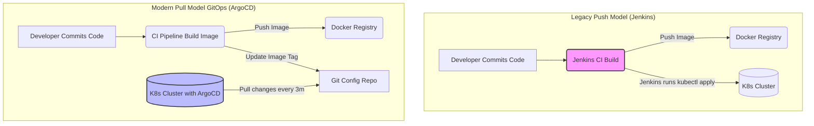
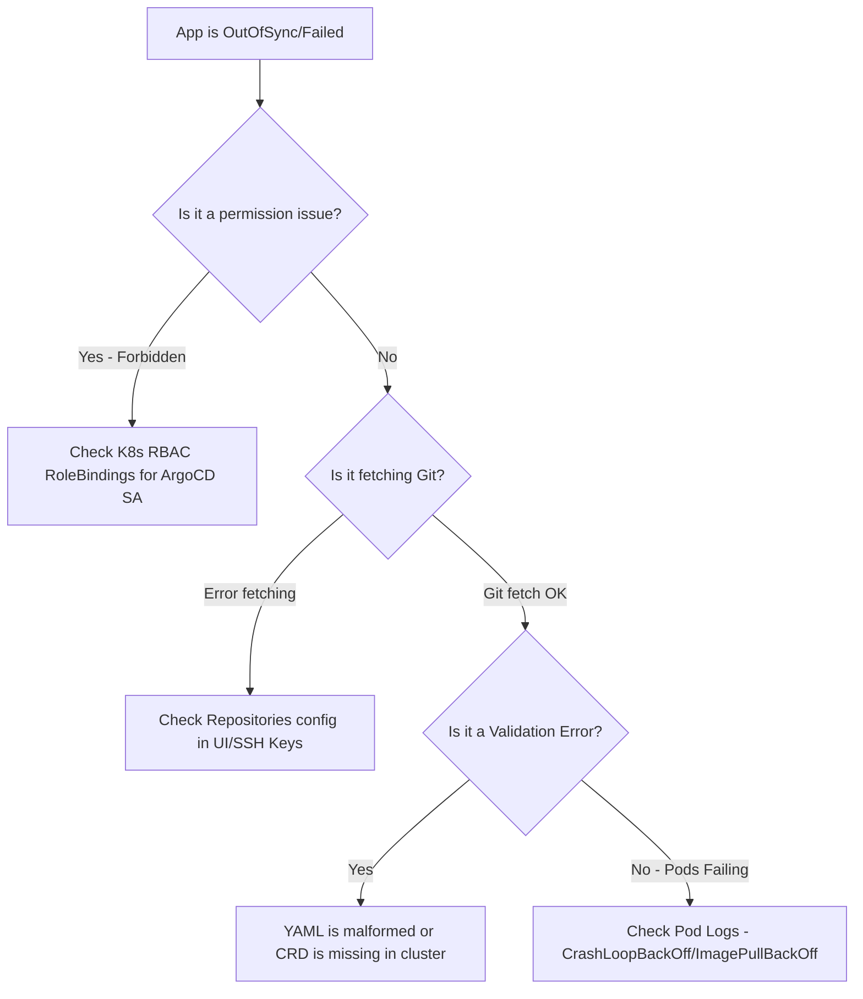

# CICD-05 ArgoCD and GitOps

# Overview
**Ye kya hai?** ArgoCD ek declarative, GitOps continuous delivery (CD) tool hai jo specifically Kubernetes ke liye banaya gaya hai. GitOps ek framework hai jismein infrastructure aur application deployment ka single source of truth "Git" hota hai. 

**Kyu use hota hai?** K8s clusters mein applications ko automatically aur securely deploy karne ke liye. Traditional CI/CD (like Jenkins) push model use karte hain jisme external tool ko K8s cluster ka admin access chahiye hota hai, jo security risk hai. ArgoCD pull model use karta hai.

**Real life example:** Swiggy ya Zomato mein din mein 100 baar microservices update hoti hain. Developers sirf code commit karte hain, aur naya container image version Git repository mein update ho jata hai. Uske baad koi manual deployment nahi karta. ArgoCD automatically naya version detect karke live kar deta hai.

**Industry kaha use karti hai?** Har modern enterprise Kubernetes environment (AWS EKS, Azure AKS, Google GKE, on-prem) mein configurations, secrets, aur microservices deploy karne ke liye. 

**Simple analogy:** 
*Seedha simple mein: GitOps ka matlab hai "Jo Git mein likha hai, wahi sach hai". Jenkins bahar se aake cluster ko order deta tha. ArgoCD cluster ke andar baitha ek watchman hai. Wo har 3 minute mein Git repo check karta hai. Agar Git aur Cluster alag dikhe (jaise kisi ne manual kubectl delete mara), toh wo Cluster ko turant wapas Git jaisa bana deta hai.*

**Mermaid Diagram: Push vs Pull Architecture**


# Working
**Internal working:** ArgoCD cluster ke andar as a set of deployments chalta hai. Ye continuous reconciliation loop run karta hai (default 3 minutes). Ye compare karta hai Git repo ki state (Desired state) ko K8s API server ki state (Live state) se. 

**Data flow:** Git Repo (YAMLs/Helm/Kustomize) -> ArgoCD Repo Server (caches repo) -> ArgoCD App Controller (compares with live state) -> K8s API Server (applies resources).

**Ports & Protocols:**
- **443 / 80:** ArgoCD UI and API (HTTP/HTTPS, gRPC).
- **6379:** Internal Redis cache.
- **8083:** Repo server internal port.

**Dependencies:** 
- **Redis:** Caching Git repos and K8s resources for fast comparison.
- **Dex:** OAuth/SSO integration ke liye (GitHub, SAML, LDAP).
- **Repo Server:** Git repositories fetch aur render karne ke liye (Helm charts ko template karta hai).

# Installation
**Prerequisites:** Kubernetes cluster (Minikube, EKS, AKS), `kubectl` CLI installed, aur ek Git repository jisme K8s manifests ho.

**Installation & Configuration:**
```bash
# 1. Create dedicated namespace
kubectl create namespace argocd

# 2. Install official ArgoCD manifests
kubectl apply -n argocd -f https://raw.githubusercontent.com/argoproj/argo-cd/stable/manifests/install.yaml

# 3. By default API server service is ClusterIP. Change it to NodePort or LoadBalancer for UI access
kubectl patch svc argocd-server -n argocd -p '{"spec": {"type": "NodePort"}}'
```

**Verification:**
```bash
kubectl get pods -n argocd
# Expected: argocd-server, argocd-repo-server, argocd-application-controller, dex-server, redis
```

**Rollback/Uninstall:**
```bash
kubectl delete namespace argocd
```

# Practical Lab
**Step-by-step Implementation: Deploying a Guestbook App**

**CLI Method:**
```yaml
# my-app.yaml
apiVersion: argoproj.io/v1alpha1
kind: Application
metadata:
  name: guestbook
  namespace: argocd
spec:
  project: default
  source:
    repoURL: https://github.com/argoproj/argocd-example-apps.git
    targetRevision: HEAD
    path: guestbook
  destination:
    server: https://kubernetes.default.svc
    namespace: default
  syncPolicy:
    automated:
      prune: true
      selfHeal: true
```
Apply karo: `kubectl apply -f my-app.yaml`

**GUI Method:**
1. Get Admin password:
   ```bash
   kubectl -n argocd get secret argocd-initial-admin-secret -o jsonpath="{.data.password}" | base64 -d; echo
   ```
2. Port-forward UI: `kubectl port-forward svc/argocd-server -n argocd 8080:443`
3. Browser mein `localhost:8080` open karo, username `admin` daalo aur password paste karo.
4. "New App" pe click karo aur same repoURL, path (`guestbook`), aur K8s destination daalo.

**Verification (Self-Heal Test):**
1. Check pods: `kubectl get pods -n default` (You will see guestbook pods).
2. Hacker banke delete karo: `kubectl delete deployment guestbook-ui`
3. Turant check karo: `kubectl get pods -n default` 
   *(Expected Output: ArgoCD ne instantly naya pod bana diya hoga kyunki Git mein wo deployment maujood hai! Magic!)*

# Daily Engineer Tasks
- **L1 Engineer:** ArgoCD UI monitor karna. Jo applications "OutOfSync" ya "Degraded" status mein hain, unke logs check karna. Sync retry karna.
- **L2 Engineer:** Naye microservices ke liye ArgoCD `Application` YAMLs likhna. Secrets management handle karna (e.g., SealedSecrets, External Secrets Operator).
- **L3 / Senior Engineer:** SSO/OIDC configure karna (Dex ke through GitHub login). Multi-cluster setup karna jisme ek ArgoCD 10 clusters ko manage kare. App-of-Apps pattern set karna.
- **Cloud/DevOps Engineer:** Helm aur Kustomize ko ArgoCD ke saath integrate karna. CI/CD pipelines modify karna taaki CI hone ke baad ArgoCD wali repo update ho.

# Real Industry Tasks
- **Real Ticket:** "Developer ko prod namespace mein read-only access chahiye ArgoCD UI par." (Action: Modify `argocd-rbac-cm` ConfigMap to grant view access mapped to their GitHub team).
- **Change Request (CR):** "ArgoCD upgrade from v2.8 to v2.9 for security patch." (Action: Take backup, update manifests via kustomize, apply, verify UI and controller logs).
- **Migration:** "Migrate Jenkins helm deploy steps to GitOps ArgoCD." (Action: Remove `helm upgrade` from Jenkinsfile. Add step in Jenkins to commit new tag to `infra-repo`. Create ArgoCD Application to watch `infra-repo`).

# Troubleshooting
- **Symptom:** Application status is `OutOfSync` aur auto-update nahi ho rahi.
  - **Cause:** Sync policy mein `automated` enabled nahi hai.
  - **Resolution:** UI se `Sync` dabao, ya YAML mein `syncPolicy.automated` add karo.
- **Symptom:** Sync status is `Failed` (Error: `Forbidden: User system:serviceaccount:argocd:argocd-application-controller cannot create resource...`)
  - **Cause:** ArgoCD ke ServiceAccount ke paas target namespace mein resource create karne ka RBAC permission nahi hai.
  - **Resolution:** Create appropriate Role aur RoleBinding K8s mein.
- **Symptom:** `Infinite Sync Loop` (ArgoCD baar baar sync kar raha hai).
  - **Cause:** Helm chart mein random labels generate ho rahe hain har render par (e.g., `helm.sh/chart: {{ uuid }}`). Git mein aur live cluster mein hamesha diff aayega.
  - **Resolution:** K8s manifests/Helm charts se dynamic/random data hatao.
- **Logs checking command:** 
  `kubectl logs -n argocd -l app.kubernetes.io/name=argocd-application-controller -f`

# Interview Preparation
- **Basic:** What is GitOps? Push vs Pull model mein kya difference hai?
  - *Ans:* GitOps means Git is the single source of truth. Pull model secure hai kyunki credentials K8s ke andar rahte hain.
- **Intermediate:** ArgoCD mein `prune` aur `selfHeal` kya hota hai?
  - *Ans:* `prune` matlab agar Git se file delete hui toh K8s se bhi object delete ho jayega. `selfHeal` matlab agar kisi ne kubectl command se K8s modify kiya, toh ArgoCD use wapas override kar dega to match Git.
- **Advanced / FAANG:** Aap K8s secrets ko GitOps mein kaise manage karoge? Git mein plain text toh nahi rakh sakte.
  - *Ans:* Hum External Secrets Operator (ESO) ya Sealed Secrets (Bitnami) use karenge. ESO cluster mein AWS Secrets Manager ya HashiCorp Vault se secret fetch karke K8s native secret banata hai. Git mein sirf reference (ExternalSecret CRD) rakha jayega.
- **Scenario:** 1000 microservices deploy karni hain. Kya aap 1000 ArgoCD Application CRD manually banaoge?
  - *Ans:* Nahi, hum **App of Apps** pattern ya **ApplicationSet** CRD use karenge, jo automatically folders scan karke dynamically applications create karta hai.

# Production Scenarios
**Scenario: Website Down & Production Namespace Deleted Manually**
- **How to think:** Don't panic. Jenkins hota toh purane pipelines dhundne padte. Humare paas ArgoCD hai.
- **Where to check:** K8s cluster access karo, check namespace exists. `kubectl get ns`. Agar nahi hai, ArgoCD UI dekho, applications "Missing" dikhayengi.
- **Root Cause:** Human error (kisi engineer ne galat context mein kubectl delete chala diya).
- **Resolution:** Agar `selfHeal` enabled hai, toh ArgoCD automatically sab recreate kar dega. Agar disabled hai, ArgoCD UI mein jao, "Sync" click karo. 5 minute mein pura production environment wapas ban jayega. 
- **Prevention:** K8s cluster se developers ka direct `write` access KUBECONFIG se hatao. Sab kuch GitOps ke through hona chahiye.

# Commands (Cheat Sheet)
| Command | Purpose | Danger Level |
|---------|---------|--------------|
| `argocd login <ip>` | CLI se authenticate karne ke liye | Low |
| `argocd app create <name> --repo <url> --path <path> --dest-server <server> --dest-namespace <ns>` | Nayi application declare karna | Low |
| `argocd app sync <name>` | Manually application sync force karna | Medium |
| `argocd app diff <name>` | Git vs Live cluster ka difference dekhna | Low |
| `argocd app history <name>` | Purane deployments ki history | Low |
| `argocd app rollback <name> <id>` | Kisi purane commit state pe revert karna | High |

# SOP & Runbook & KB Article
- **SOP: Onboarding New App to ArgoCD**
  - Scope: Adding a new microservice.
  - Procedure: Create a folder in `infra-repo`. Add Kubernetes deployment/svc YAMLs. Add an `Application` YAML in the `app-of-apps` directory pointing to the new folder. Commit to Git.
  - Validation: Check ArgoCD UI, app should appear and show "Healthy".
- **Runbook: App stuck in "Progressing"**
  - Detection: Alert on ArgoCD app sync status taking > 5 mins.
  - Investigation: Check `kubectl get events -n <namespace>`. Check `kubectl describe pod`. Often caused by `ImagePullBackOff` or `CrashLoopBackOff`.
  - Resolution: Fix image tag in Git repository.

# Best Practices & Beginner Mistakes
- **Beginner Mistake:** App source code (Java/Python) aur App K8s YAML (Manifests) ko ek hi Git repo mein rakhna. 
  - **Impact:** Infinite loop. CI pipeline run hogi, image build karke wapas repo mein naya image tag commit karegi. Ye commit phir se CI trigger kar dega!
  - **Correct Approach:** Hamesha 2 repos rakho: `app-source-repo` aur `app-config-repo`.
- **Best Practice:** K8s manifests mein `latest` image tag kabhi use mat karo. Hamesha specific tag ya git commit SHA use karo.
- **Security:** ArgoCD server ko public internet pe bina WAF/SSO ke expose mat karo.

# Advanced Concepts
- **App of Apps Pattern:** Ek "Master" ArgoCD Application banti hai jo dusri ArgoCD Applications ko deploy karti hai. Ye bootstraping cluster ke liye best hai.
- **ApplicationSet:** App of Apps ka successor. Ye ek generator use karta hai (jaise list of clusters, ya list of git folders) aur dynamically hundreds of Apps generate karta hai. Multi-tenant clusters ke liye magic hai.
- **Argo Rollouts:** ArgoCD default mein rolling update (ReplicaSet replacement) karta hai. Agar aapko Blue-Green ya Canary deployments (10% traffic to new pod, then 50%, then 100%) chahiye, toh Argo Rollouts controller install karna padta hai.

# Related Topics & Flashcards & Revision
- **Related Topics:** [[04-Orchestration/K8S-07 Helm Package Manager|Helm]], [[05-CI-CD/CICD-01 CI-CD Concepts|CI/CD Concepts]], [[04-Orchestration/K8S-12 Kubernetes Secrets|Kubernetes Secrets]], [[04-Orchestration/K8S-11 RBAC|K8s RBAC]]
- **Flashcard:** What handles Auto-Remediation in ArgoCD? -> `syncPolicy.automated.selfHeal: true`
- **Revision:** Read this on Day 1 (5 mins), Day 3 (15 mins), and before Interview (30 mins).

# Real Production Logs & Commands & Decision Tree
**Sample Log (argocd-application-controller):**
```log
time="2025-06-27T10:00:00Z" level=info msg="Comparing git state with cluster state" application=guestbook
time="2025-06-27T10:00:01Z" level=info msg="Resource out of sync: Deployment default/guestbook-ui"
time="2025-06-27T10:00:02Z" level=info msg="Syncing resources" application=guestbook
time="2025-06-27T10:00:05Z" level=info msg="Sync successful" application=guestbook
```
*Explanation:* Controller ne notice kiya ki Git aur Cluster diff hain. Usne turant resources K8s API pe apply kiye aur sync successful ho gaya.

**Decision Tree (Sync Failure Troubleshooting):**

