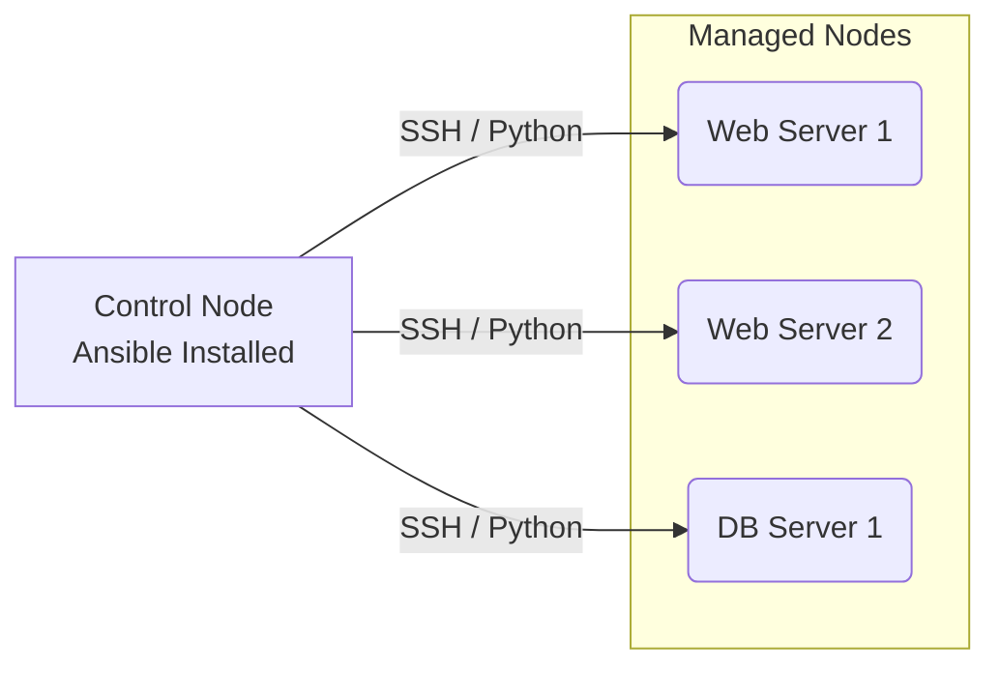

# ANS-01 Ansible Fundamentals

# Overview
Ansible ek open-source IT automation tool hai jo configuration management, application deployment, aur task automation ke liye use hota hai. 
Socho aapke paas 500 Linux servers hain aur sabhi pe Nginx install karna hai aur ek naya user create karna hai. Manually SSH karke ek-ek server pe jaana impossible hai. Yahan Ansible ka jadoo kaam aata hai. Aap ek jagah code (YAML) mein likhte ho ki kya karna hai, aur Ansible ek command mein un saare 500 servers pe wo kaam kar deta hai. Industry isko "Infrastructure as Code" (IaC) aur Configuration Management ke liye use karti hai.

**Real life analogy:** Jaise TV ka remote control. Agar 10 TV ek sath on karne hain, toh ek universal remote use karlo bajaye sabke paas physical jane ke.

**Real production use-case:** Zero-day vulnerability (jaise Log4j) aane pe hazaaron servers ko ek minute ke andar patch karna.

**Architecture:**


# Working
Ansible **Push Model** pe kaam karta hai aur **Agentless** hai. Matlab target servers pe koi special software (agent) install karne ki zarurat nahi hai.
1. **Control Node:** Jis server ya laptop pe Ansible install hota hai. (Must be Linux/macOS/WSL).
2. **Managed Nodes:** Jin servers ko configure karna hai. Inpe sirf `Python` aur `SSH` chahiye.
3. **Inventory:** Ek simple text file jisme target servers ke IP addresses likhe hote hain, logically grouped (e.g., `[webservers]`, `[dbservers]`).
4. **Modules:** Ansible raw bash commands use nahi karta, balki Python modules (jaise `apt`, `user`, `file`) use karta hai jo **Idempotency** ensure karte hain. (Idempotency matlab, agar server pe desired state pehle se hai, toh Ansible kuch change nahi karega, just 'OK' bol dega).

# Installation
## Prerequisites
- Ek Control Node (Linux/Mac/WSL)
- Target nodes pe SSH access aur Python installed.

## Installation (Ubuntu/Debian)
```bash
sudo apt update
sudo apt install software-properties-common
sudo add-apt-repository --yes --update ppa:ansible/ansible
sudo apt install ansible -y
```

## Verification
```bash
ansible --version
```
## Rollback
```bash
sudo apt remove --purge ansible
```

# Practical Lab
**Scenario:** Connect to 2 Web servers and verify uptime using Ad-Hoc commands.

Bajaaye configuration files ko manually likhne ke, aap vault ke `examples/` folder se ready-made template copy kar sakte hain:
- Config File: [examples/07-Ansible/ansible.cfg](file:///C:/Users/SPTL/Documents/devops/devops/examples/07-Ansible/ansible.cfg)
- Inventory File: [examples/07-Ansible/inventory.ini](file:///C:/Users/SPTL/Documents/devops/devops/examples/07-Ansible/inventory.ini)
- Sample Playbook: [examples/07-Ansible/ping-playbook.yml](file:///C:/Users/SPTL/Documents/devops/devops/examples/07-Ansible/ping-playbook.yml)

### Step 1: Navigate to the Examples Directory
```bash
cd ../../examples/07-Ansible/
```

### Step 2: Review `inventory.ini` and `ansible.cfg`
* (Open the real files in the directory to see advanced group nesting and privilege escalation configurations).

### Step 3: Run Ad-Hoc Ping Module
```bash
ansible all -m ping
```
*Expected Output:*
```json
192.168.1.10 | SUCCESS => {
    "ansible_facts": {
        "discovered_interpreter_python": "/usr/bin/python3"
    },
    "changed": false,
    "ping": "pong"
}
```

### Step 4: Idempotency Test (Create User)
```bash
# Run first time
ansible webservers -m user -a "name=devops state=present" -b
# Output: CHANGED (Yellow)

# Run second time
ansible webservers -m user -a "name=devops state=present" -b
# Output: SUCCESS (Green). Ansible knew the user existed and did nothing!
```

# Daily Engineer Tasks
- **L1 Engineer:** Run simple Ad-Hoc commands (e.g., `ansible all -m ping`), check server status, restart services using predefined scripts.
- **L2 Engineer:** Manage inventory files, add new servers, execute playbooks for application deployment, basic troubleshooting.
- **L3/Senior Engineer:** Write Idempotent playbooks, set up Dynamic Inventories (AWS/Azure API), write custom roles.
- **DevOps/SRE:** Ansible Tower / AWX setup, CI/CD pipeline integration, custom Python module development, Immutable infrastructure with Packer + Ansible.

# Real Industry Tasks
- **Patch Management:** Running OS updates on 1000+ EC2 instances on Patching Sunday using `ansible all -m yum -a "name=* state=latest" -b`.
- **Application Deployment:** Pulling latest Git code and restarting Tomcat/Nginx.
- **User Management:** Onboarding/Offboarding SSH keys for developers across all environments.
- **Security Compliance:** Enforcing CIS benchmarks on Linux servers automatically.

# Troubleshooting
| Symptom | Possible Root Cause | Investigation & Resolution |
|---------|---------------------|----------------------------|
| `UNREACHABLE! => "Failed to connect via ssh"` | SSH Key, Port issue, or Firewall blocking | Check manual SSH `ssh -i key.pem user@IP`. Ensure Security Groups/Firewall allows Port 22. Check `remote_user` in `ansible.cfg`. |
| `MODULE FAILURE: /usr/bin/python: not found` | Python missing on Managed Node | Run raw command to install python: `ansible all -m raw -a "apt install -y python3" -b` |
| `Missing sudo password` | Passwordless sudo not set | Pass `-K` (or `--ask-become-pass`) during ansible run. |
| `Permission denied` | Forgot Privilege Escalation | Add `-b` (become) flag to run as root. |

*Sample SSH Error Log:*
```text
192.168.1.10 | UNREACHABLE! => {
    "changed": false,
    "msg": "Failed to connect to the host via ssh: Permission denied (publickey).",
    "unreachable": true
}
```
*Action:* Key galat hai ya target server ke `authorized_keys` mein tumhari public key nahi hai.

# Interview Preparation
- **Basic (L1/L2):** Ansible kya hai? Agentless ka kya matlab hai? Push vs Pull model kya hota hai?
  *Expected Answer:* Ansible agentless hai, SSH use karta hai. Yeh push model pe chalta hai, server pe bina agent dale config push karte hain.
- **Intermediate (L2/L3):** Idempotency kya hoti hai? `shell` vs `command` module mein kya difference hai?
  *Expected Answer:* Idempotency matlab multiple runs pe same state maintain karna bina duplicate action ke. `shell` pipes aur redirects (`|`, `>`) allow karta hai, `command` bypasses shell (more secure).
- **Advanced (Senior/SRE):** Ansible facts kya hote hain? Dynamic Inventory kaise kaam karti hai AWS ke sath?
  *Expected Answer:* Facts target OS ki info hain gathered by `setup` module. Dynamic inventory API query karke real-time list of IPs fetch karti hai bajaye static file ke.
- **FAANG Scenario Based:** 500 servers me se 50 unresponsive hain SSH pe, ansible run karte time wo delay (timeout) laa rahe hain, pipeline slow ho rahi hai. Kaise fix karoge?
  *Expected Answer:* Ansible me `timeout` adjust kar sakte hain `ansible.cfg` mein, ya `async` aur `poll` tasks use karenge, and forks ko increase karenge (`-f 50` or `100`). Baki unreachable hosts ko ignore karne ke liye `--limit` or `meta: clear_host_errors` use karenge.

# Production Scenarios
**Scenario: Website down due to misconfiguration pushed by Ansible.**
- **How to think:** Kounsa playbook chala? Kya change hua?
- **Where to check:** AWX/Tower logs ya local terminal history. Check Nginx/Apache config using Ansible Ad-Hoc: `ansible web -m command -a "nginx -t" -b`
- **Resolution:** Agar syntax error hai template me, purana git commit revert karo aur playbook wapas chalao (Rollback).
- **Prevention:** CI/CD me ansible-lint aur `--check` (dry run) flag chalana mandatory karo production me deploy karne se pehle.

# Commands
| Command | Purpose | Syntax/Example | Danger Level |
|---------|---------|----------------|--------------|
| `ansible all -m ping` | Connectivity check | `ansible all -m ping` | Low |
| `ansible -m command` | Run raw command (no pipe) | `ansible web -m command -a "uptime"` | Low |
| `ansible -m shell` | Run shell command (supports `\|`) | `ansible db -m shell -a "cat /etc/passwd \| grep root"` | Medium |
| `ansible -m setup` | Gather Facts | `ansible all -m setup` | Low |
| `ansible-doc <module>` | Read module docs | `ansible-doc yum` | Low |
| `ansible-inventory` | Dump inventory | `ansible-inventory --list` | Low |
| `ansible -b` | Run as root (become) | `ansible all -m apt -a "name=nginx state=latest" -b` | High |

# Cheat Sheet
- **Default config location:** `/etc/ansible/ansible.cfg`
- **Default inventory:** `/etc/ansible/hosts`
- **SSH Key Ignore:** `export ANSIBLE_HOST_KEY_CHECKING=False`
- **Dry Run:** Add `--check` to command.
- **Verbose mode:** `-v`, `-vv`, `-vvv`, `-vvvv` (max debug).

# SOP & Runbook & KB Article
**SOP: Adding a new server to Ansible Management**
1. **Scope:** New Linux instances.
2. **Procedure:** 
   - Add SSH public key of Control Node to target's `~/.ssh/authorized_keys`.
   - Update `hosts` file with new IP.
   - Run `ansible <new-ip> -m ping` to validate.
3. **Rollback:** Remove IP from `hosts` and delete SSH key from target.

**Runbook: Log4j Zero-Day Mitigation (Emergency Service Stop)**
- **Detection:** CISO alert for log4j.
- **Commands:** `ansible all -m service -a "name=java-app state=stopped" -b -f 50`
- **Validation:** `ansible all -m shell -a "ps aux | grep java"`

# Best Practices & Beginner Mistakes
**Best Practices:**
- Hamesha Ansible modules (jaise `user`, `file`, `service`) use karo bajaye `shell` module ke (for Idempotency).
- Production me kabhi `host_key_checking = False` hamesha ke liye set mat chhodna. Use SSH certificate authority ya proper known_hosts management.
- Hardcoded secrets mat use karo, hamesha `Ansible Vault` use karo.

**Beginner Mistakes:**
- `shell` module me `mkdir` ya `apt install` chalana jo fail ho jata hai second run me (Breaks idempotency). Correct approach: Use `file` and `apt` modules.
- Privilege escalation (`-b`) lagana lagana bhool jana system tasks ke liye (jaise package install ya service restart).

# Advanced Concepts
- **Forks:** Default Ansible 5 servers se parallel connect karta hai. `--forks 50` or `-f 50` lagane se wo 50 servers parallelly process karega (Speed optimization).
- **Ansible Vault:** Encrypting sensitive data (like passwords, API keys) inside YAML files so they can be safely stored in Git.
- **Dynamic Inventory:** Cloud (AWS/Azure) se API call karke real-time me servers uthana. Agar Auto-scaling se naye servers aye toh ansible ko automatically pata chal jata hai.

# Related Topics & Flashcards & Revision
- [[06-IaC/ANS-02 Ansible Playbooks|Ansible Playbooks - Next Step]]
- [[01-Linux-Foundation/LX-01 Linux for DevOps|Linux SSH Basics]]
- [[Terraform vs Ansible]]

**Flashcards:**
Q: Does Ansible require an agent on managed nodes?
A: No, it is agentless. Uses SSH and Python.
Q: Command to test Ansible connectivity?
A: `ansible all -m ping`

**Revision:**
- 5 min: Read Overview, Architecture Diagram, and Cheat Sheet.
- Interview revision: Read Interview Questions, Troubleshooting, and Production Scenarios.
