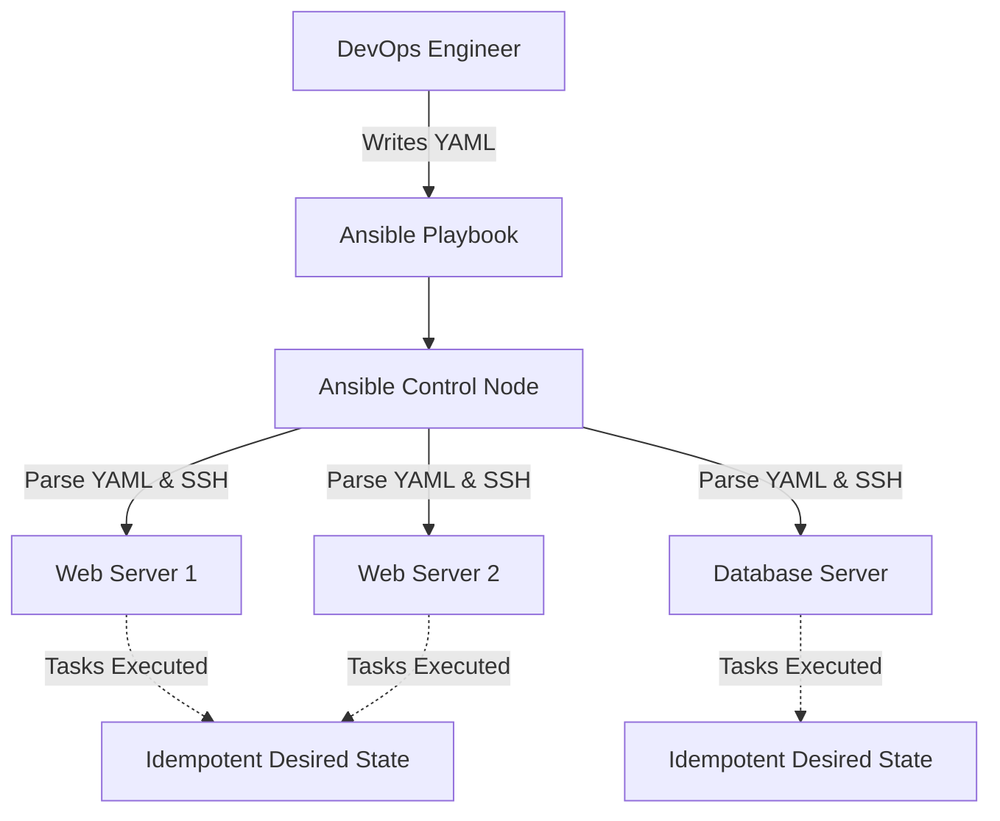

# ANS-02 Ansible Playbooks

# Overview
**Ansible Playbooks** ek YAML-based configuration, deployment aur orchestration language hai jisme hum apne remote servers ka desired state define karte hain. Agar Ad-Hoc commands "ek cup chai banane" ki tarah hain, toh Playbook ek proper "Recipe" hai jisme sequence me likha hota hai: paani ubalo, patti dalo, doodh dalo, aur usko low flame par 5 min rakho.

**Kyu use hota hai?**
Kyunki Ad-Hoc commands repeatable nahi hote aur version control (Git) mein store karne ke liye suitable nahi hote. Playbooks Infrastructure as Code (IaC) ka core concept implement karti hain, jisse configuration drift khatam ho jata hai. Ek Playbook aap kitni baar bhi run karo, result same hota hai (Idempotency).

**Real life example / Simple analogy:**
Jaise ek restaurant ka head Chef ek standard recipe book follow karke har baar same taste ka khana banata hai, waise hi Playbook ensure karti hai ki aap 1 ya 1000 servers provision karo, sabka configuration exact same hoga.

**Industry kaha use karti hai / Real production use-case:**
- LAMP/LEMP stack ya Kubernetes clusters automatically deploy karne ke liye.
- Zero-downtime rolling updates perform karne ke liye (Load balancer se node nikalo, patch karo, wapas dalo).
- CI/CD pipelines mein infrastructure provision aur configure karne ke liye.

**Architecture / Mermaid diagram:**


# Working
Playbooks sequentially tasks ko execute karti hain.
1. **Parsing:** Ansible Control node aapki YAML playbook ko parse karta hai.
2. **Fact Gathering (Setup):** Target servers se information (OS, IP, memory) gather karta hai (`setup` module ke through). Yeh data Jinja2 templates mein use hota hai.
3. **Task Execution:** Tasks top-to-bottom execute hote hain. Har task kisi particular module (e.g., `apt`, `yum`, `copy`, `service`) ko background mein invoke karta hai (Ansible Python scripts push karke run karta hai).
4. **State Check (Idempotency):** Modules check karte hain ki required state pehle se achieve ho chuki hai ya nahi. Agar pehle se hi package installed hai, toh kuch nahi karega (status: `ok`), agar install karta hai toh (status: `changed`).
5. **Handlers:** Agar kisi task mein change hua (`changed`), toh wo Handler ko trigger kar sakta hai. Handlers end mein execute hote hain, aur duplicates automatically ignore ho jate hain.

# Installation
Playbooks ke liye alag se kuch install nahi karna padta. Bas Ansible set up hona chahiye.
**Prerequisites:**
- Control node par Ansible installed hona chahiye (`pip install ansible` or `apt install ansible`).
- Target hosts inventory file (`hosts` ya `inventory.ini`) mein declared hone chahiye.
- Target nodes par SSH passwordless (Key-based) authentication or WinRM setup hona chahiye.

# Practical Lab
**Scenario:** Ek dynamic Nginx Web Server deploy karna.

**Step 1: Jinja2 Template Create karein (`index.html.j2`)**
*Jinja2 use hota hai HTML/Config files ko dynamic banane ke liye. Variables inject hote hain execution time par.*
```jinja2
<html>
<head><title>Ansible Deployed App</title></head>
<body>
    <h1>Welcome to {{ company_name }}</h1>
    <p>Deployed on OS: {{ ansible_distribution }} {{ ansible_distribution_version }}</p>
    <p>Server Internal IP: {{ ansible_default_ipv4.address }}</p>
</body>
</html>
```

**Step 2: Ansible Playbook Likhein (`setup-web.yml`)**
```yaml
---
- name: Deploy Nginx Web Server
  hosts: webservers # Target group defined in inventory
  become: yes       # Privilege escalation (sudo/root)

  # Playbook level variables
  vars:
    company_name: "God Mode DevOps Vault"

  tasks:
    - name: Install Nginx on Ubuntu/Debian
      apt:
        name: nginx
        state: present
        update_cache: yes
      when: ansible_os_family == "Debian"

    - name: Deploy dynamic HTML template
      template:
        src: index.html.j2
        dest: /var/www/html/index.html
        owner: www-data
        group: www-data
        mode: '0644'
      # Notify triggers the handler ONLY if this file changed
      notify: Restart Nginx

    - name: Ensure Nginx is running and enabled on boot
      service:
        name: nginx
        state: started
        enabled: yes

  # Handlers are executed at the end of the play
  handlers:
    - name: Restart Nginx
      service:
        name: nginx
        state: restarted
```

**Step 3: Syntax Check & Dry-Run Karein**
```bash
ansible-playbook setup-web.yml --syntax-check
# Check mode shows what WOULD happen without actually making changes
ansible-playbook setup-web.yml --check -i inventory.ini
```

**Step 4: Execute Playbook**
```bash
ansible-playbook setup-web.yml -i inventory.ini
```

**Expected Output Verification:**
Ansible output mein `PLAY RECAP` dikhayega. `changed=2` dikhega pehli baar run karne par. Agar wapas turant run karoge, toh `changed=0` aur `ok=3` aayega (ye idempotency proof karta hai, Handlers wapas trigger nahi honge).

# Daily Engineer Tasks
- **L1 Engineer:** Standard runbooks dekh kar Playbooks execute karna, jaise server scaling ya standard patching, aur CLI se `--extra-vars` pass karna.
- **L2 Engineer:** Fail hue playbooks ko troubleshoot karna (kisi node par disk space issues ya unreachable node). Playbook mein naye tasks add karna.
- **L3 / Senior Engineer:** Hardcoded scripts ko refactor karke Ansible roles banana, complex conditional blocks likhna, `block/rescue` se error handling karna.
- **DevOps / Production Engineer:** AWX/Ansible Tower configure karna, CI/CD pipelines (e.g., GitHub Actions / Jenkins) ke through playbooks trigger karwana aur inventory ko AWS/Azure (Dynamic Inventory) se sync rakhna.

# Real Industry Tasks
- **Real Change Request (CR):** "We need to rotate SSH keys for the `deploy` user across 500 servers." Action: Write a playbook using the `authorized_key` module to remove the old key and add the new one.
- **Hardening and Compliance:** CIS benchmark standards meet karne ke liye playbook likhna jo `/etc/ssh/sshd_config` me root login disable karde aur password authentication false karde.
- **Migration & Backup:** DB server upgrade se pehle ek playbook run karna jo database dump le, AWS S3 bucket par send kare, aur uske baad DB engine upgrade start kare.

# Troubleshooting
- **Symptom:** `Syntax Error while loading YAML`
  - **Root Cause:** YAML indentation (spaces) bahut strict hota hai. Aapne tabs use kiye honge ya `-` (list item) sahi se align nahi hoga.
  - **Resolution:** Hamesha `ansible-playbook --syntax-check` ya IDE/VScode YAML extension use karein.
- **Symptom:** Task fails with "Destination directory /etc/myapp does not exist".
  - **Root Cause:** Aap template ya copy module run kar rahe ho ek path me jiska parent folder missing hai.
  - **Resolution:** Aisa error fix karne ke liye copy/template se thik pehle ek task add karein: `file: path=/etc/myapp state=directory`.
- **Symptom:** Changes kiye par Handler execute hi nahi hua!
  - **Root Cause:** Handlers tabhi run hote hain jab target task `changed` state return karta hai. Agar file pehle hi server pe identical hai, task `ok` hoga aur notify invoke nahi hoga.
  - **Resolution:** Testing ke liye remote server me file delete/modify karke wapas playbook chalayein, handler chalega.
- **Symptom:** "UNREACHABLE" error on execution.
  - **Root Cause:** SSH connection issue ya sudo/password authentication failure.
  - **Resolution:** Verify by running simple Ad-Hoc ping: `ansible all -m ping -i hosts`. Connection theek karein.

# Interview Preparation
- **Basic:** Playbook aur Ad-Hoc command mein kya farq hai?
  - **Answer:** Ad-Hoc ek-baar, command-line execution hai (jaise ek service restart karna). Playbooks YAML files hain jinhe hum version control mein rakhte hain complex, multi-task, repeatable configuration management ke liye.
- **Intermediate:** Handler kya hota hai? Kab execute hota hai?
  - **Answer:** Handler ek special task hai jo tabhi trigger hota hai jab use kisi doosre task se `notify` kiya jaye aur us task ne kuch "change" (modify) kiya ho. Handlers by default playbook execution ke end mein run hote hain.
- **Scenario Based:** Agar beech me service restart karni ho handler se end ka wait nahi karna, toh kya karoge?
  - **Answer:** Task level pe `meta: flush_handlers` use karenge. Yeh ensure karta hai ki pending handlers turant yahin execute ho jayen.
- **Advanced / Production:** Aap ek shell script ko idempotency kaise doge Ansible Playbook mein?
  - **Answer:** Main `shell` module ke saath `creates` ya `removes` parameter use karunga, jo script ko tabhi run hone dega jab koi specific file missing ho. Ya `register` use karke command output capture karke `changed_when` lagaunga.

# Production Scenarios
**Scenario: Website Down After Automated Config Deployment**
- **Symptom:** Playbook run hui aur 2 minute baad alerts aane lage 502 Bad Gateway ke.
- **How to think:** Zaroor playbook ne faulty nginx/haproxy conf push ki, restart kiya, aur process down ho gaya.
- **Investigation:** Ansible execution logs check karein.
- **Resolution:** `git revert` old commit (jisme config sahi thi) and run the CI pipeline again (Run playbook).
- **Prevention:** Production engineer playbook mein ek validation task add karega: Config replace hone ke baad restart karne se pehle `command: nginx -t` ya `apache2ctl configtest` chalaye. Agar config invalid hogi, task wahi `fail` ho jayega aur restart trigger hi nahi hoga.

# Commands
| Command | Purpose | Syntax/Example | Danger Level |
|---------|---------|----------------|--------------|
| `ansible-playbook` | Executes the playbook tasks. | `ansible-playbook setup.yml -i hosts` | Medium to High (depending on tasks) |
| `--syntax-check` | YAML aur logic mistakes dhundna before running. | `ansible-playbook site.yml --syntax-check` | Low (No execution happens) |
| `--check` | Dry-run mode. Predicts what will change. | `ansible-playbook site.yml --check` | Low |
| `--start-at-task` | Starts play from a specific task name. | `ansible-playbook site.yml --start-at-task="Install Git"` | Medium |
| `-e` (`--extra-vars`) | Variable pass karna CLI se (highest priority). | `ansible-playbook site.yml -e "env=production"` | High (Galat var pass kiya to issues honge) |
| `--tags` | Sirf specific tag wale tasks run karna. | `ansible-playbook site.yml --tags "web,db"` | Low |

# Cheat Sheet
- **Playbook Structure:** Top level pe `- hosts:` (Targets), `vars:` (Variables), aur `tasks:` hote hain.
- **Indentation:** Hamesha 2 spaces use karein, YAML hates Tabs!
- **Variable Precedence (Short):** Extra Vars (`-e`) overrides Playbook vars overrides Inventory vars.
- **Idempotency Rule:** Sirf `shell` aur `command` modules by default idempotent nahi hote, baaki sab modules (`yum`, `copy`, `service`) Ansible internally handle karta hai.

# SOP & Runbook & KB Article
**SOP: Zero Downtime Rolling Update using Ansible**
- **Purpose:** Ek baar mein saare web servers ko update/restart karne se downtime aayega, humein ek-ek (batch) karke update karna hai.
- **Procedure:** Playbook level par `serial: 1` ya `serial: 20%` set karein. Ek host cluster par tasks execute honge:
  1. Target node ko Load Balancer se drain karo (remove node from target group).
  2. Updates install karo / App code deploy karo.
  3. Service restart karo.
  4. Health check karo (jaise `uri` module se `HTTP 200` return check karo).
  5. Wapas Load Balancer me add karo.
- **Validation:** Application health-check endpoint browser me open karke verify karein.

# Best Practices & Beginner Mistakes
- **Best Practice:** Use Fully Qualified Collection Names (FQCN) for modules. Example: Write `ansible.builtin.apt` badle mein sirf `apt`.
- **Best Practice:** Apne variables and playbooks modularize karein (Roles use karein). Playbook file 200-300 lines se badi ho toh usko tod do.
- **Beginner Mistake:** `command` ya `shell` module ka abuse karna jab uske liye dedicated module available ho (e.g. `shell: git clone` use karna bajaye `git` module use karne ke).
- **Security Mistake:** Passwords plain text Playbooks mein likhna. Hamesha [[ANS-03 Ansible Roles and Vault|Ansible Vault]] ka use karein secrets encrypt karne ke liye.

# Advanced Concepts
- **Block, Rescue, and Always:** Playbook mein error handling ke liye Try-Catch mechanism jaisa hota hai.
  - `block`: Main tasks yahan aayenge.
  - `rescue`: Agar `block` fail hua, tabhi rescue chalega (jaise Slack pe error message bhejna).
  - `always`: Har haal mein chalega (jaise temporary generated files clean karna).
- **Strategy Plugins:** By default Ansible `linear` strategy (ek task saare servers pe karega, phir aage badhega) use karta hai. `free` strategy mein har server independent speed se task khatam karta hai bina doosre servers ka wait kiye.

# Related Topics & Flashcards & Revision
- **Prerequisites:** [[ANS-01 Ansible Fundamentals]]
- **Next Topic:** [[ANS-03 Ansible Roles and Vault]]
- **Revision Time:** 15 min focus daily.
- **Flashcard 1:**
  - *Q:* How do you bypass playbook vars dynamically while running?
  - *A:* Using the CLI flag `-e` or `--extra-vars`.
- **Flashcard 2:**
  - *Q:* Which parameter lets a non-idempotent module act conditionally if a file already exists?
  - *A:* `creates: /path/to/file` parameter in command/shell.

# Real Production Logs & Commands & Decision Tree
**Scenario Log:**
```text
TASK [Ensure apache is running] ****************************************************
fatal: [web1.example.com]: FAILED! => {"changed": false, "msg": "Unable to start service apache2: Job for apache2.service failed because the control process exited with error code."}
```
**Decision Tree for this Error:**
1. Is error due to Ansible connection or application issue? -> "exited with error code" = Application Issue.
2. Manually SSH into `web1.example.com`.
3. Check application logs via `journalctl -xeu apache2.service` and `cat /var/log/apache2/error.log`.
4. Result: `Address already in use: make_sock: could not bind to address [::]:80`. (Nginx was already running on the same port!).
5. Resolution Action: Stop Nginx (`systemctl stop nginx`) or fix the Playbook to uninstall Nginx before installing Apache. Run playbook again.
