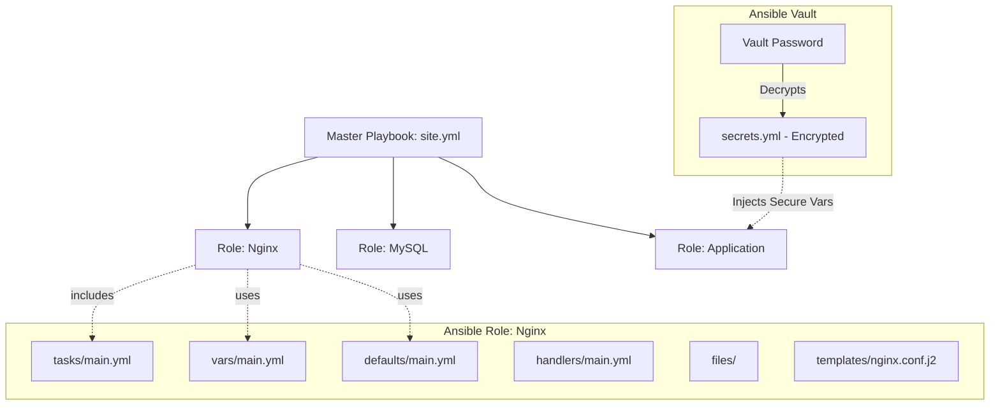
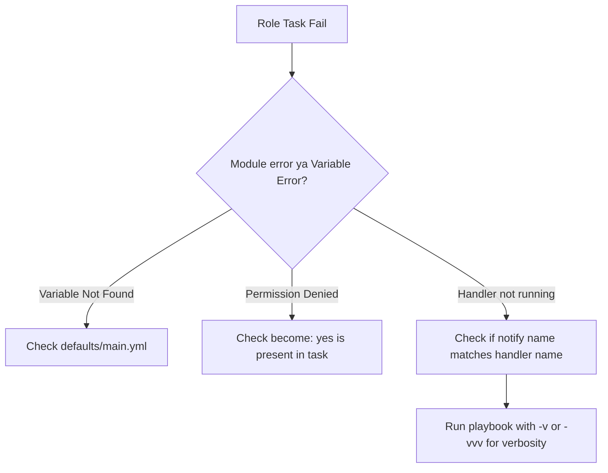

# ANS-03 Ansible Roles and Vault

## Overview
**Ansible Roles kya hai?** 
Agar aap apna sara Ansible code ek hi massive 1,000-line `playbook.yml` mein likh doge, toh usko manage karna impossible ho jayega. Jaise developers apne code ko functions aur classes mein divide karte hain, DevOps engineers Ansible code ko **Roles** mein organize karte hain. Role ek standardized directory structure hai jo tasks, variables, files, aur templates ko ek reusable package (LEGO block) mein bundle kar deta hai.

**Ansible Vault kya hai?** 
Vault Ansible ka native CLI tool hai jo sensitive data (jaise database passwords, API keys, SSL certificates) ko AES-256 encryption se secure karta hai, taaki aap apna code safely GitHub par push kar sako bina credentials leak kiye.

**Simple Analogy:**
Role ek 'LEGO block' hai (e.g., 'web-server' block). Aap is block ko kisi bhi project mein fit kar sakte ho bina code copy-paste kiye. 
Vault us block ke andar chupa hua ek tijori (locker) hai, taaki agar koi GitHub pe apka code dekhe, toh usko actual password ki jagah kachra (garbage encrypted text) dikhe.

**Industry kaha use karti hai?**
Har enterprise level infrastructure as code (IaC) setup mein. Community roles (Ansible Galaxy se) download karke PostgreSQL install karna, ya custom roles banakar alag alag environments (Dev, QA, Prod) mein deploy karna.

### Architecture & Data Flow (Mermaid Diagram)



## Working
**Internal Working:**
- **Roles:** Jab ek playbook role ko call karti hai, Ansible automatically us role ke `tasks/main.yml` ko execute karta hai. Agar usme templates use hue hain, toh Ansible automatically `templates/` folder mein dekhta hai. Ye convention over configuration approach follow karta hai.
- **Vault:** Ansible playbook chalanne se pehle memory mein files ko decrypt karta hai. Disk par files humesha encrypted rehti hain. Encryption ke liye AES256 use hota hai.

**Role Directory Structure:**
- `tasks/main.yml`: Actual automation steps (commands/modules to run).
- `handlers/main.yml`: Handlers triggered by tasks (e.g., Restart Nginx).
- `templates/`: Jinja2 `.j2` files (e.g., config files jisme variables render hote hain).
- `files/`: Static files to be copied directly.
- `vars/main.yml`: High-priority variables jo easily override nahi hone chahiye.
- `defaults/main.yml`: Low-priority variables (Users ko inko override karna expected hai).
- `meta/main.yml`: Author info aur Role dependencies (e.g., "Web role chalane se pehle Firewall role chalao").

## Installation
Ansible Roles and Vault ke liye alag se kuch install nahi karna padta, ye Ansible core (ansible-core) ka hi part hain.
**Prerequisites:**
- Ansible control node par installed hona chahiye.
- Ansible Galaxy access (internet) required hai community roles download karne ke liye.

## Practical Lab
### Step-by-Step Implementation: Creating a Role and using Vault

**Step 1: Role Initialize karna (CLI Method)**
```bash
# Workspace setup
mkdir -p ~/ansible-lab/roles
cd ~/ansible-lab/roles

# Create 'webserver' role skeleton
ansible-galaxy init webserver

# Verify the structure
tree webserver
```

**Step 2: Role ke Tasks aur Defaults likhna**
File: `~/ansible-lab/roles/webserver/defaults/main.yml`
```yaml
---
http_port: 80
```

File: `~/ansible-lab/roles/webserver/tasks/main.yml`
```yaml
---
- name: Install Nginx
  apt:
    name: nginx
    state: present
  become: yes

- name: Create custom index file
  template:
    src: index.html.j2
    dest: /var/www/html/index.html
  become: yes
  notify: Restart Nginx
```

File: `~/ansible-lab/roles/webserver/handlers/main.yml`
```yaml
---
- name: Restart Nginx
  service:
    name: nginx
    state: restarted
  become: yes
```

File: `~/ansible-lab/roles/webserver/templates/index.html.j2`
```html
<h1>Server running on port {{ http_port }}</h1>
<h2>DB Password from Vault is: {{ db_password }}</h2>
```

**Step 3: Secrets ko Vault se Encrypt karna**
```bash
cd ~/ansible-lab
# Create a secrets file
echo "db_password: SuperSecretProdPass!" > secrets.yml

# Encrypt it
ansible-vault encrypt secrets.yml
# Expected Output: New vault password prompt -> Enter a password
# Agar abhi `cat secrets.yml` karoge toh sirf $ANSIBLE_VAULT dikhega.
```

**Step 4: Master Playbook likhna**
File: `~/ansible-lab/site.yml`
```yaml
---
- name: Configure Webservers
  hosts: all
  vars_files:
    - secrets.yml
  roles:
    - role: webserver
      vars:
        http_port: 8080 # Overriding the default port
```

**Step 5: Playbook execute karna (with Vault Password)**
```bash
ansible-playbook -i localhost, -c local site.yml --ask-vault-pass
# Prompt aayega: Vault password:
```

## Daily Engineer Tasks
- **L1 Engineer:** Ansible Galaxy se existing roles download karna. Execute karte time Vault password prompt mein dalna.
- **L2 Engineer:** Existing roles mein chote mothe task updates karna. `defaults/main.yml` mein naye variables add karna.
- **L3 / Senior DevOps:** Monolithic playbooks ko roles mein refactor karna. `meta/main.yml` mein dependencies handle karna. CI/CD pipelines (Jenkins) mein Vault password securely inject karna (`--vault-password-file` use karke).

## Real Industry Tasks
- **Migration:** Purane shell scripts ko Ansible Roles mein convert karna taaki cross-team sharing possible ho.
- **Patch Management:** Ek centralized 'security-patch' role banana aur use 50 alag projects ke Ansible playbooks mein include karwana.
- **Secret Rotation:** Jab production DB ka password change ho, toh `ansible-vault rekey` command se secrets.yml ka encryption password badalna bina plain text mein store kiye.

## Troubleshooting
| Symptoms | Possible Root Causes | Investigation Steps & Commands | Resolution |
|----------|----------------------|--------------------------------|------------|
| `ERROR! Decryption failed (no vault secrets were found)` | Vault password provide nahi kiya playbook run mein. | Check CI/CD logs if `--ask-vault-pass` or `--vault-password-file` is missing. | Add `--vault-password-file .vault_pass` parameter when running `ansible-playbook`. |
| Role task fail ho gaya kyu ki module nahi mila | Wrong folder structure for tasks | Check ki tasks kahan likhe hain. | Ansible strictly `tasks/main.yml` dhoondhta hai. Agar file ka naam alag hai, toh usko include karo. |
| `ERROR! the role 'mysql' was not found` | Role path issue | Check `ansible.cfg` for `roles_path`. Default `roles/` folder is missing. | Fix `ansible.cfg` ya roles ko playbook wali directory ke `roles/` folder mein rakho. |
| Variable pass kiya (`-e`) par value change nahi hui | `vars/main.yml` use kar liya defaults ke jagah | Check karo role mein variable kaha define kiya gaya hai. | `vars/main.yml` ki precedence high hoti hai. Users se override karwane wale variables `defaults/main.yml` mein daalo. |
| Pipeline stuck (hang) ho gayi | Vault password prompt par ruka hua hai | Pipeline wait kar rahi hai input ka. | Automated environments mein `--ask-vault-pass` matt use karo. Use `--vault-password-file`. |

## Interview Preparation
**Basic:**
**Q:** Ansible Role kya hota hai aur kyu use karte hain?
**A:** Role ek structure hai jo Ansible tasks, variables, files aur templates ko ek bundle mein organize karta hai. Isse code reusability badhti hai. Ek role likh kar use multiple playbooks mein include kar sakte hain.

**Intermediate:**
**Q:** `defaults/main.yml` aur `vars/main.yml` mein kya difference hai?
**A:** `defaults/` mein wo variables hote hain jinhe override karna aasan hota hai (lowest precedence). `vars/` mein wo variables hote hain jo role ki internal logic ka hissa hain aur aasaani se override nahi hone chahiye (very high precedence).

**Advanced / Production Scenario:**
**Q:** Tumhare paas ek bahut badi `secrets.yml` file hai, aur tum sirf ek specific variable (e.g. `db_password`) ko encrypt karna chahte ho, puri file ko nahi. Kaise karoge?
**A:** Main "Vault String Encryption" use karunga. `ansible-vault encrypt_string 'MySecretPass' --name 'db_password'` run karunga. Ye mujhe ek encrypted block dega jise main seedha apni normal YAML file mein paste kar sakta hu. Isse PR review mein git diff dekhna bhi aasan ho jata hai (sirf ek variable change hota hai).

**Q:** Jenkins pipeline (CI/CD) mein Vault password kaise pass karoge bina kisi interactive prompt ke?
**A:** Main Jenkins Credentials Manager mein Vault password ko as a secret text save karunga. Pipeline script (Jenkinsfile) mein use as environment variable load karunga, ek temporary file `.vault_pass` mein echo karunga, playbook ko `--vault-password-file .vault_pass` ke sath run karunga, aur run khatam hone ke baad `rm -f .vault_pass` kar dunga secure rahne ke liye.

## Production Scenarios
**Scenario:** "Developer bol raha hai ki usne webserver role ko playbook mein add kiya par configuration change nahi ho rahi aur Nginx restart nahi ho raha."
**How to think:** Agar configuration apply nahi hui, matlab templates properly override nahi hue, ya handler trigger nahi hua.
**Where to check:**
1. Check if the task that copies the template has `notify: Restart Nginx`.
2. Check `handlers/main.yml` if the name exactly matches the `notify` string.
3. Check variables precedence. Shayad developer ne wrong level pe variable define kiya hai (e.g. `vars` inside role overriding playbook vars).
**Resolution:** Fix handler name mismatch. Ensure role defaults are used instead of hardcoding values in `vars/main.yml`.

## Commands
| Command | Purpose | Syntax | Danger Level | When to use |
|---------|---------|--------|--------------|-------------|
| `ansible-galaxy init` | Naya role structure banata hai | `ansible-galaxy init <role_name>` | Low | Naya role banana ho. |
| `ansible-galaxy install` | Galaxy se roles download karta hai | `ansible-galaxy install -r requirements.yml` | Low | Third-party roles setup karte time. |
| `ansible-vault create` | Nayi encrypted YAML file banata hai aur editor kholta hai | `ansible-vault create secrets.yml` | Low | Naye secrets banane par. |
| `ansible-vault encrypt` | Plain-text file ko encrypt karta hai | `ansible-vault encrypt file.yml` | High | Agar credentials ko Git me push karne se pehle secure karna ho. |
| `ansible-vault decrypt` | File se encryption hata kar plain text karta hai | `ansible-vault decrypt file.yml` | High (Data exposed) | Agar temporary clear-text check karna ho (Do not push this!). |
| `ansible-vault edit` | Encrypted file ko safely Vim/Nano mein kholta hai | `ansible-vault edit secrets.yml` | Medium | Secrets update karne ho bina file ko permanently decrypt kiye. |
| `ansible-vault rekey` | File ka vault password badalta hai | `ansible-vault rekey secrets.yml` | Medium | Security compliance (password rotation) ke time. |
| `ansible-vault encrypt_string`| Ek specific text string ko encrypt karta hai | `ansible-vault encrypt_string 'pass123' --name 'db_pass'` | Low | File ke ek single variable ko encrypt karne ke liye. |

## Cheat Sheet
- **Command:** `ansible-vault edit secrets.yml` (Safest way to modify existing secrets).
- **Automation Execution:** `ansible-playbook deploy.yml --vault-password-file ~/.secret_pass`
- **Role Folder Structure (Important):** `tasks/`, `handlers/`, `defaults/`, `vars/`, `files/`, `templates/`, `meta/`
- **Tip:** Agar ek task likhne par lage ki ise dusre server mein bhi use karenge, stop! Use ek role mein convert kar do.

## SOP & Runbook & KB Article
**SOP: Upgrading an Ansible Role from Galaxy**
- **Purpose:** Update a community role used in infrastructure.
- **Scope:** All playbooks using the role.
- **Procedure:**
  1. Update version tag in `requirements.yml`.
  2. Run `ansible-galaxy install -r requirements.yml --force`.
  3. Run playbook in dry-run mode (`--check`).
  4. If green, apply to staging, then production.
- **Validation:** Check the application health endpoint.
- **Rollback:** Revert `requirements.yml` to the old version and re-run installation and playbook.

## Best Practices & Beginner Mistakes
**Best Practices:**
- **Variable Precedence:** Hamesha user se lene wale variables `defaults/main.yml` me rakho, `vars/main.yml` me nahi.
- **Use String Encryption:** Pure file ko encrypt karne se accha hai sirf secret values ko `encrypt_string` se encrypt karo. Git merge conflicts kam aayenge.
- **Readme.md:** Har custom role ke andar `README.md` likho jisme explain karo ki konsi variables zaroori hain.
- **Ansible Lint:** Apne roles par hamesha `ansible-lint` chalao code quality check ke liye.

**Beginner Mistakes:**
- **Mistake:** Playbook ke andar hundreds of lines likh dena. (Monolith antipattern) -> **Correct Approach:** Use Roles.
- **Mistake:** Vault password ko GitHub repository mein commit kar dena. -> **Correct Approach:** Use secret managers (AWS Secrets Manager, Azure Key Vault) ya Jenkins credentials.
- **Mistake:** Hardcoding IP addresses in role files. -> **Correct Approach:** Hamesha dynamic inventory aur variables (`{{ ansible_default_ipv4.address }}`) ka use karo.

## Advanced Concepts
- **Role Dependencies:** `meta/main.yml` ke through. Agar apka `php-app` role hai, toh wo require kar sakta hai ki `nginx` aur `mysql` role uske pehle chalne chahiye. Ansible dependency chaining khud handle kar leta hai.
- **Ansible Vault IDs:** Aap multiple vault passwords use kar sakte ho. E.g., Dev vault, Prod vault. Inko IDs dete hain (e.g., `--vault-id dev@prompt --vault-id prod@~/.prod_pass`).

## Related Topics & Flashcards & Revision
**Related Topics:**
- [[06-IaC/ANS-02 Ansible Playbooks|Ansible Playbooks - Basics]]
- [[05-CI-CD/CICD-02 Jenkins|Jenkins - Vault Pipeline Integration]]
- [[07-Cloud/AWS-05 AWS Secrets Manager|AWS Secrets Manager vs Ansible Vault]]

**Flashcards:**
- **Q:** How to run playbook with vault without prompt? **A:** `--vault-password-file <file_path>`
- **Q:** What folder has lowest variable precedence in a Role? **A:** `defaults/main.yml`

**Revision:**
- 5 Min: Revise Role structure and Vault commands cheat sheet.
- Interview: Focus on string encryption, variable precedence (defaults vs vars), and CI/CD vault integration.

## Real Production Logs & Commands & Decision Tree
**Vault Decryption Error Log:**
```
ERROR! Attempting to decrypt but no vault secrets found
```
**Explanation:** Ansible ne playbook par run kiya but file vault encrypted nikli aur tumne password nahi diya. Command mein `--ask-vault-pass` add karo ya `ansible.cfg` mein vault password file ka path set karo.

**Decision Tree (Task Fail in Role):**

