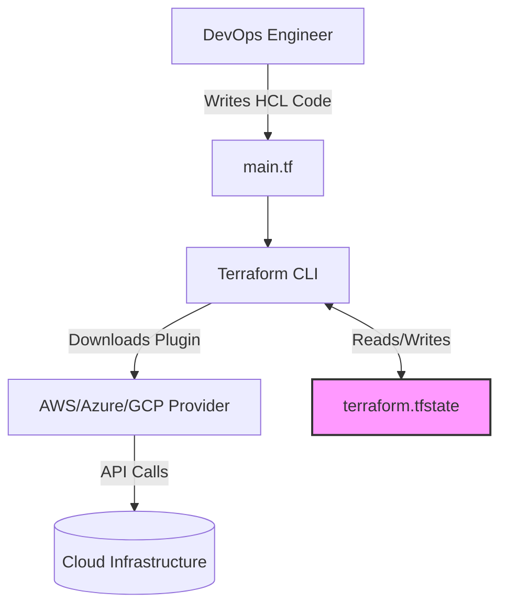
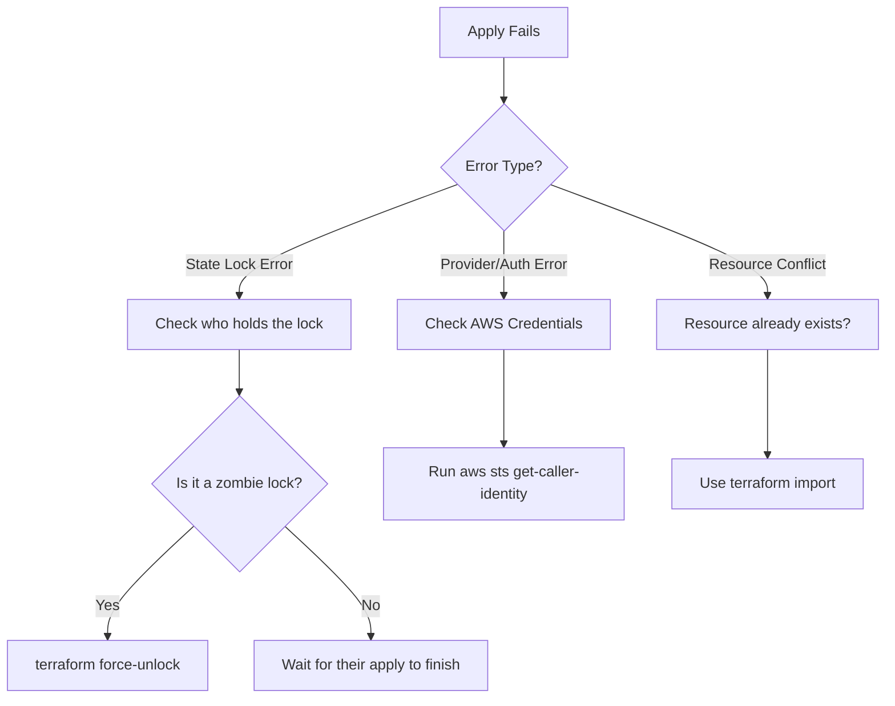

# TF-01 Terraform Fundamentals

## Overview
**Ye kya hai?** Terraform ek open-source Infrastructure as Code (IaC) tool hai by HashiCorp. Yeh HCL (HashiCorp Configuration Language) use karke cloud infrastructure (AWS, Azure, GCP) ko code ke format me define karta hai.

**Kyu use hota hai?** Enterprise me manual console clicking ek disaster hai. Agar aap manually servers banate ho, toh environment ko duplicate karna (e.g. Prod jaisa same QA env) almost impossible hai, aur errors aane ke chances 100% hain. Terraform se sab kuch version-controlled, repeatable, aur reliable hota hai.

**Real life example:** Ghar banwane ke liye aap mistri ko manually ek-ek eent rakhne ka instruction nahi dete. Aap ek naksha (blueprint) dete ho. Terraform wahi naksha hai aapke cloud infra ka. Aap isko blueprint dete ho aur ye khud jaake poora infra khada kar deta hai. Agar naksha update karoge, ghar bina tode modify ho jayega.

**Industry use-case:** FAANG aur large enterprises saara infrastructure Terraform se provision karte hain. EKS clusters, VPCs, RDS instances—sab Terraform modules ke through automated hota hai via CI/CD pipelines (GitOps).

### Architecture Mermaid Diagram


## Working
**Internal working:** Terraform *declarative* hai. Iska matlab aap isko ye nahi batate ki "kaise" karna hai (imperative), balki "kya" chahiye wo batate ho. Aapne code me bola "Mujhe 2 EC2 chahiye". Terraform current state file read karega, real AWS check karega, aur dekhega ki kya difference hai. Us difference (delta) ko resolve karne ke liye wo Cloud APIs call karega.

**Data Flow:**
1. Code `.tf` likha gaya.
2. `terraform init` -> Plugin download hote hain `.terraform/` folder me.
3. `terraform plan` -> Read `terraform.tfstate` -> Compare with real AWS -> Show execution plan (dry run).
4. `terraform apply` -> Make REST API calls via Provider -> Update infra -> Update `terraform.tfstate`.

**Authentication Flow:** Terraform ko aapke AWS credentials chahiye hote hain, usually environment variables (`AWS_ACCESS_KEY_ID`) ya `~/.aws/credentials` (via `aws configure`) ke through.

**Communication & Protocols:** Provider plugins cloud provider se REST/HTTPS APIs (port 443) ke through communicate karte hain. Dependencies resolve karne ke liye Terraform ek internal dependency graph (DAG) banata hai.

## Installation
**Prerequisites:** AWS Account, IAM User with AdministratorAccess (or required permissions), AWS CLI installed & configured.

**Installation (CLI Method):**
*Windows (PowerShell):*
```powershell
choco install terraform -y
```
*Linux (Bash):*
```bash
wget -O- https://apt.releases.hashicorp.com/gpg | sudo gpg --dearmor -o /usr/share/keyrings/hashicorp-archive-keyring.gpg
echo "deb [signed-by=/usr/share/keyrings/hashicorp-archive-keyring.gpg] https://apt.releases.hashicorp.com $(lsb_release -cs) main" | sudo tee /etc/apt/sources.list.d/hashicorp.list
sudo apt update && sudo apt install terraform
```

**Verification:**
```bash
terraform -version
```

## Practical Lab
**Objective:** Deploy a basic EC2 Web Server in AWS.

**Step-by-step implementation (CLI Method):**

Production me kabhi ek single `main.tf` file nahi banate. Hum code ko decouple karte hain. 
Aap vault ke `examples/` folder se ready-made, modular Terraform structure dekh sakte hain:
- Provider Config (Backend & Tags): [providers.tf](file:///C:/Users/SPTL/Documents/devops/devops/examples/06-IaC/terraform-aws-web/providers.tf)
- Input Variables: [variables.tf](file:///C:/Users/SPTL/Documents/devops/devops/examples/06-IaC/terraform-aws-web/variables.tf)
- Core Infrastructure (EC2 & SG): [main.tf](file:///C:/Users/SPTL/Documents/devops/devops/examples/06-IaC/terraform-aws-web/main.tf)
- Outputs: [outputs.tf](file:///C:/Users/SPTL/Documents/devops/devops/examples/06-IaC/terraform-aws-web/outputs.tf)

1. Apne terminal mein example directory open karo:
```bash
cd ../../examples/06-IaC/terraform-aws-web/
```

2. **Initialize:** `terraform init` (Provider plugins download karega).
3. **Format & Validate:** `terraform fmt` (Code neatly format karega) aur `terraform validate` (Syntax check karega).
4. **Plan:** `terraform plan` (Dekho kya create hone wala hai).
5. **Apply:** `terraform apply -auto-approve` (Provisioning start karega).
6. **Verification:** AWS Console pe EC2 dashboard me jao, "GodMode-Vault-Server" chal raha hoga. `public_ip` terminal pe print hoga.
7. **Rollback/Cleanup:** `terraform destroy -auto-approve` (Kyunki lab khatam, bill na aaye).

## Daily Engineer Tasks
- **L1 Engineer:** Chhote changes (e.g. S3 bucket me tag add karna, DNS record update karna), aur pipelines run karna.
- **L2 Engineer:** Naye services ke liye basic Terraform resources likhna (e.g. RDS instance, SQS queue). `terraform apply` fails troubleshoot karna.
- **L3 / Senior Engineer:** Reusable Terraform Modules likhna, S3 remote state aur DynamoDB locking setup karna, GitLab CI / GitHub Actions CI/CD pipeline me Terraform integrate karna.
- **Production Engineer/SRE:** Handle Terraform configuration drift at scale, migrate manual infra to TF using `terraform import`, refactor monolithic state files into smaller, decoupled state files.

## Real Industry Tasks
- **Real Tickets:** 
  - "Clone Staging environment for Load Testing". (Terraform se bas workspace switch karke apply marna hota hai).
  - "Import manually created ALB (Application Load Balancer) to Terraform state".
- **Maintenance Work:** Upgrade Terraform Provider version from v4 to v5 safely using HashiCorp change logs. Zero-downtime replacements planning.

## Troubleshooting
**Common Issues & Symptoms:**
1. **Symptom:** `Error: No valid credential sources found.`
   - **Root Cause:** Terraform cannot authenticate to AWS.
   - **Resolution:** Run `aws configure` in terminal and verify `aws sts get-caller-identity`.

2. **Symptom:** `Error acquiring the state lock.`
   - **Root Cause:** Do log ek saath `apply` kar rahe hain, ya pichla pipeline crash/kill ho gaya tha locking chhod ke.
   - **Resolution:** Check who is holding the lock. Agar safe hai, toh run `terraform force-unlock <LOCK_ID>`.

3. **Symptom:** Plan shows a resource is going to be `replaced` (destroyed and created) unexpectedly.
   - **Root Cause:** Immutable field change. For example, changing the `ami` of an EC2 instance forces recreation.
   - **Resolution:** If recreation is bad (e.g., Database), DO NOT APPLY. Revert the HCL code or use `lifecycle { prevent_destroy = true }`.

## Interview Preparation
**Basic:** 
- **Q:** Terraform vs Ansible kya hai? 
- **A:** Terraform is primarily for Provisioning (creating infrastructure), Ansible is primarily for Configuration Management (installing software on created servers). (Ansible procedural, Terraform declarative).

**Intermediate:** 
- **Q:** `.tfstate` file kya hoti hai? Kya use source control (Git) me dalna chahiye?
- **A:** State file HCL code aur actual cloud infra ki mapping store karti hai. Ise Git me **kabhi nahi** dalna chahiye kyunki isme sensitive passwords, DB credentials plain text me store hote hain. Hamesha Remote State Backend (like AWS S3) use karna chahiye.

**Advanced / Production:** 
- **Q:** Agar kisi ne directly AWS Console se ek S3 bucket delete kar di jo Terraform manage kar raha tha, toh next `terraform plan` me kya hoga?
- **A:** `terraform plan` refresh phase run karta hai. Wo AWS se pucha "bucket hai?", AWS bolega "nahi". State file update hogi. Fir Terraform compare karega apne HCL (jisme bucket likhi hai) aur bolega: "I will CREATE 1 new S3 bucket to match your desired state."

**Scenario Based:** 
- **Q:** Tumhare HCL code me VPC hardcoded hai. Isko multi-environment (Dev, QA, Prod) kaise banaoge?
- **A:** Hardcoded values ko `variables.tf` me daalunga. Phir `.tfvars` files banaunga (`dev.tfvars`, `prod.tfvars`). Pipeline run karte waqt pass karunga: `terraform apply -var-file="prod.tfvars"`.

**Trick / HR Round:**
- **Q:** Can Terraform manage infrastructure that was created manually before Terraform was used?
- **A:** Yes, hume usko manually `terraform import` command chala ke state file me lana padega, and HCL code uske barabar likhna padega.

## Production Scenarios
**Scenario:** "Website down. QA complains staging server configuration was mysteriously changed."
- **How to think:** Ye 'Configuration Drift' (code vs reality mismatch) ka classic case hai. Kisi junior dev ne console me manually changes kiye honge (e.g., Security group change kar diya).
- **Where to check & Commands:**
  Run `terraform plan`. 
- **Logs:** 
  Plan dikhayega: `~ ingress { cidr_blocks = ["10.0.0.0/8"] -> ["0.0.0.0/0"] }` (Yaani actual aws par open to world ho gaya hai).
- **Resolution:** Run `terraform apply`. Ye wapas AWS state ko HCL jaisa bana dega aur manual changes revert ho jayenge.
- **Prevention:** AWS IAM me developers ka Console Write access hata do. Sirf read-only do. Sab kuch Terraform PR se via CI/CD jana chahiye.

## Commands

| Command | Purpose | Syntax | Example | Danger Level |
|---------|---------|--------|---------|--------------|
| `init` | Initializes directory, downloads plugins | `terraform init` | `terraform init` | Low |
| `fmt` | Formats code to canonical style | `terraform fmt` | `terraform fmt --recursive` | Low |
| `validate` | Validates syntax and arguments | `terraform validate` | `terraform validate` | Low |
| `plan` | Shows execution plan (dry-run) | `terraform plan` | `terraform plan -out=tfplan` | Low |
| `apply` | Builds/alters infrastructure | `terraform apply` | `terraform apply tfplan` | **High** |
| `destroy` | Tears down infra | `terraform destroy` | `terraform destroy -auto-approve`| **Critical** |
| `import` | Imports existing infra into state | `terraform import <resource> <ID>` | `terraform import aws_instance.web i-12345` | Medium |
| `state list`| Lists resources in state file | `terraform state list` | `terraform state list` | Low |

## Cheat Sheet
- **Important Files:** `main.tf` (code), `variables.tf` (inputs), `outputs.tf` (outputs), `terraform.tfstate` (state file, KEEP SECRET), `.terraform.lock.hcl` (provider versions lock file, COMMIT TO GIT).
- **Environment Vars:** `TF_VAR_name` (used to pass variables via OS env). `TF_LOG=DEBUG` (troubleshooting output).
- **Lifecycle rules:** `create_before_destroy`, `prevent_destroy`, `ignore_changes`.

## SOP & Runbook & KB Article
**SOP: Initializing a New Terraform Project**
- **Purpose:** Standardize directory structure.
- **Procedure:** Create `main.tf`, `variables.tf`, `outputs.tf`. Create `providers.tf` with remote backend block (S3). Run `terraform init`. Commit to git (ignoring `.terraform/` and `.tfstate` via `.gitignore`).

**Runbook: Unlocking Terraform State**
- **Detection:** Jenkins pipeline fails with `Error acquiring the state lock`.
- **Investigation:** Check if any other pipeline is running. Ask in team chat.
- **Resolution:** If safe, run `terraform force-unlock <Lock_ID>`.
- **Validation:** Run `terraform plan`. It should execute normally.

**KB Article: Terraform Drift Management**
- **Problem:** Manual changes in cloud causing Terraform to overwrite or fail.
- **Cause:** Lack of strict IAM policies allowing console changes.
- **Resolution:** Periodic drift detection pipelines running `terraform plan -detailed-exitcode`. Alerts sent to Slack if drift detected.

## Best Practices & Beginner Mistakes
**Best Practices:**
1. **Remote State:** Hamesha S3/Blob storage use karo state store karne ke liye.
2. **State Locking:** DynamoDB table use karo lock ke liye taaki 2 log ek saath apply na kar dein (corruption prevent karne ke liye).
3. **Modularize:** Code ko modules me break karo (DRY principle).
4. **Secrets Management:** AWS Secrets Manager / HashiCorp Vault use karo. Passwords kabhi `.tf` file me hardcode mat karo.

**Beginner Mistakes:**
- **Mistake:** Committing `terraform.tfstate` to GitHub. -> **Impact:** Anyone can steal your DB passwords and Cloud infrastructure topology. -> **Correct Approach:** Add `*.tfstate` to `.gitignore`.
- **Mistake:** Manually editing the `terraform.tfstate` JSON file to fix an issue. -> **Impact:** State corruption, Terraform crashes. -> **Correct Approach:** Always use `terraform state` commands (`mv`, `rm`, `replace-provider`).

## Advanced Concepts
- **Idempotency:** Aap `terraform apply` 100 baar run karo, agar infra match kar raha hai code se, toh Terraform 0 changes karega. Ye idempotent nature kehlata hai.
- **Dependency Graph:** Terraform resources ke beech dependancy tree (Directed Acyclic Graph - DAG) khud banata hai. Agar EC2 ko Security Group chahiye, toh TF pehle SG banayega fir EC2. Jinme dependency nahi hai, unko parallel banayega to save time.

## Related Topics & Flashcards & Revision
- **Prerequisites:** AWS CLI basics, YAML/JSON basics.
- **Next Topics:** [[06-IaC/TF-02 Terraform Modules|Terraform Modules]], [[06-IaC/TF-03 Terraform State Management|Terraform State Management]]
- **Flashcards:**
  - *Q: Terraform kis language mein likhte hain?* -> A: HCL (HashiCorp Configuration Language).
  - *Q: Remote state backend ka sabse bada faayda?* -> A: Team collaboration, secure state storage, and state locking.

## Real Production Logs & Commands & Decision Tree
**Sample Log: `terraform plan` showing drift**
```diff
Terraform will perform the following actions:
  # aws_security_group.web_sg will be updated in-place
  ~ resource "aws_security_group" "web_sg" {
      id = "sg-0123abcd"
      ~ ingress {
          ~ cidr_blocks = [
              - "0.0.0.0/0",
              + "10.0.0.0/8",
            ]
            # (3 unchanged attributes hidden)
        }
    }
Plan: 0 to add, 1 to change, 0 to destroy.
```
*Explaination:* Ek junior ne galti se port ko `0.0.0.0/0` (internet) pe open kar diya tha. Terraform ne detect kiya ki HCL mein `10.0.0.0/8` (private network) likha hai. Terraform plan bata raha hai ki wo wapas usko secure network pe update karega.

**Decision Tree (Troubleshooting failed apply):**

