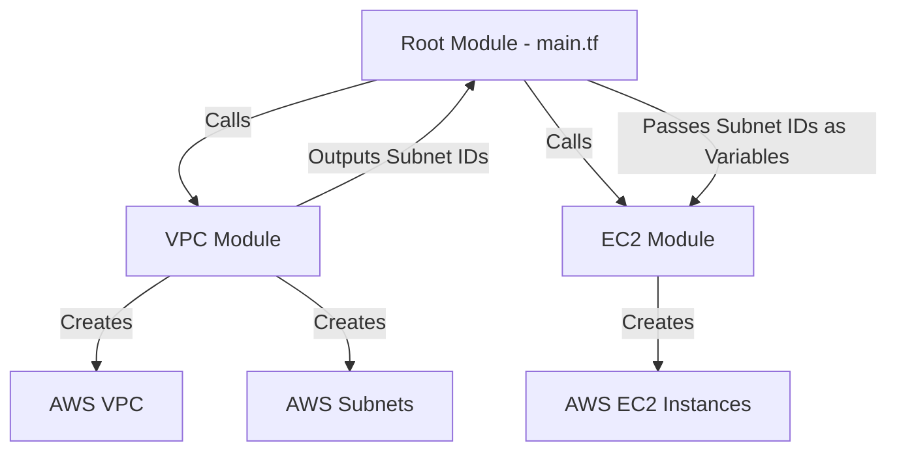
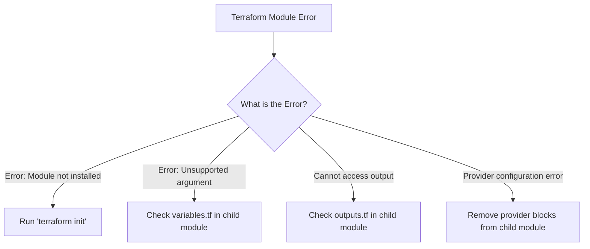

# TF-02 Terraform Modules

# Overview
Ye kya hai? Terraform modules ek collection of `.tf` files hai jo ek single directory mein hote hain. Inhe aap ek "saancha" (template) samajh sakte ho. 
Kyu use hota hai? DRY (Don't Repeat Yourself) principle ko enforce karne ke liye. Agar aapko 10 alag-alag environments mein VPC banana hai, toh aap code ko 10 baar nahi likhte. Ek VPC module bana kar use 10 baar alag-alag variables ke sath call karte ho.
Real life example: Car manufacturing factory mein ek car ka basic frame design ek template (module) hai. Usme colour aur engine (variables) change karke alag-alag car models banaye jaate hain.
Real production use-case: Ek standard, secure S3 bucket module banaya jata hai jisme encryption aur logging by default enabled hote hain, aur developers bas is module ko use karke buckets banate hain bina directly S3 resource likhe.
Architecture:



# Working
Internal working: 
Ek module ek self-contained package hota hai. Iski apni `variables.tf` (inputs) aur `outputs.tf` (returns) hoti hai. Root module jo module ko call karta hai, wo variables ke through data pass karta hai aur module se outputs fetch karke dusre modules me pass kar sakta hai.
- **Variables**: Inputs of the module (e.g., instance type, VPC CIDR).
- **Resources**: The actual infrastructure configuration (e.g., AWS EC2, AWS VPC).
- **Outputs**: Return values from the module (e.g., Instance ID, VPC ID).
Data flow: Root Module -> pass variables -> Child Module -> create resources -> generate outputs -> Root Module.
Dependencies: Modules explicitly ek dusre se data share karte hain (e.g., VPC module ka output EC2 module ka input banta hai, which creates an implicit dependency).

# Installation
Prerequisites:
- Terraform CLI installed.
- Cloud Provider CLI (e.g., AWS CLI) configured aur authenticated.
Installation: 
Modules ko externally install nahi kiya jata jaise traditional software mein. Jab aap kisi source (jaise public registry, GitHub, ya local path) se module define karte ho, tab `terraform init` run karne se Terraform automatically modules ko download karke `.terraform/modules` directory me cache kar leta hai.
Configuration:
```hcl
module "my_vpc" {
  source = "terraform-aws-modules/vpc/aws"
  version = "5.0.0"
  
  name = "production-vpc"
  cidr = "10.0.0.0/16"
}
```

# Practical Lab
Step-by-step implementation.

Bajaaye scratch se folders banane ke, aap vault ki `examples/` directory me module scaffolding script ya pre-built structure use kar sakte hain:
- Terraform Modules Structure: [examples/06-IaC/terraform-modules/](file:///C:/Users/SPTL/Documents/devops/devops/examples/06-IaC/terraform-modules)

**Execution:**
1. Navigate to the examples directory and run the scaffold script (if needed):
```bash
cd ../../examples/06-IaC/
chmod +x setup-terraform-modules.sh
./setup-terraform-modules.sh
```
2. Navigate into the root module directory:
```bash
cd terraform-modules/
```
3. Read the `main.tf` to see how the local `web_server` module is invoked.
4. **Verification:**
```bash
terraform init
terraform plan
```
Expected Output: Terraform initializes the local module and outputs a plan to create one EC2 instance using the `web_server` template.

# Daily Engineer Tasks
- **L1 Engineer**: Existing module blocks mein naye variables provide karna (e.g., naya security group ID add karna in module call).
- **L2 Engineer**: Terraform registry (public) se naye verified modules find karna, test karna, aur infrastructure as code mein unhe integrate karna.
- **L3/Senior Engineer**: Company-specific internal modules likhna (like a standard EKS cluster module with all security guardrails), module versioning (Git tags) maintain karna, aur Terratest se automated unit testing karna.

# Real Industry Tasks
- **Standardization**: Har team apna Terraform code scratch se na likhe, isliye Central DevOps (Platform) team modules banati hai. Isse security standards enforce hote hain.
- **Refactoring & Migration**: Purane, massive (monolithic) `main.tf` files ko refactor karke reusable modules mein split karna. Is process mein `moved` blocks use hote hain taaki existing production infrastructure destroy na ho.
- **Patch Management**: Centralized custom module mein AMI ID update karna aur Git par naya version tag karna. Phir saari teams apna `version` argument update karti hain to get the new AMI gracefully.

# Troubleshooting
- **Module not found (`Error: Module not installed`)**: 
  - *Symptoms*: Run `terraform plan` immediately after adding a `module {}` block. 
  - *Root cause*: `terraform init` run nahi kiya gaya hai module include karne ke baad. 
  - *Resolution*: Run `terraform init`.
- **Unsupported argument (`Error: Unsupported argument`)**: 
  - *Symptoms*: Error jab hum variable pass karte hain jo module mein nahi hai.
  - *Root cause*: Child module ki `variables.tf` mein us variable ko define nahi kiya gaya hai. 
  - *Fix*: Add variable block in child module.
- **Module output not accessible**: 
  - *Symptoms*: Root module is complaining it can't find an attribute of a resource in the module.
  - *Fix*: Root se child resource seedhe access nahi hota. Define `output "my_val" { value = aws_resource.name.id }` in child's `outputs.tf`.
- **Provider conflicts**: 
  - *Symptoms*: `Error: Multiple provider blocks` or auth issues specific to the module.
  - *Fix*: Child modules mein se `provider "aws" {}` block hamesha hata dein. Unhe root module se inherit karne dein.

# Interview Preparation
- **Basic (L1/L2)**: Root module aur child module me kya difference hai? 
  *Expected Answer*: Root module main directory hai jahan se `terraform apply` execute kiya jata hai. Child module external ya local reusable codebase hai jise root module se `module {}` construct ke through invoke kiya jata hai.
- **Intermediate (L2/L3)**: Agar aap apne `main.tf` se kisi `module {}` block ko comment out kar dein aur `terraform apply` karein, toh kya hoga? 
  *Expected Answer*: Terraform state ko check karega aur detect karega ki ab is module ki zarurat nahi hai, aur us module se bane huye saare resources ko DESTROY kar dega. Declarative system mein code hatana matlab resource delete karna.
- **Advanced (Senior/FAANG)**: Public module registry versus Private Git source mein internal modules host karne ka kya difference hai? 
  *Expected Answer*: Private module registry (like Terraform Cloud) proper semantic versioning, module discovery UI, aur granular access control provide karti hai. Git repository thoda simple approach hai par versioning maintain karne ke liye explicit Git tags (`?ref=v1.2.0`) maintain karna padta hai.
- **Scenario Based**: Aapke paas ek VPC module hai jo subnets banata hai, aur ek EC2 module jo unn subnets mein instances deploy karega. Aap subnet IDs ko VPC module se EC2 module mein kaise bhejeinge?
  *Expected Answer*: VPC module ki `outputs.tf` mein ek output variable (jaise `subnet_ids`) define karenge. EC2 module ki `variables.tf` mein ek input variable (jaise `vpc_subnet_ids`) banayenge. Root module mein, hum explicitly link karenge: `vpc_subnet_ids = module.vpc.subnet_ids` in the EC2 module call.

# Production Scenarios
Scenario: "Production Terraform apply chalne pe naya infrastructure wrong account ya region me ban raha hai, jabki code sahi lag raha hai."
- **How to think**: Kya child module hardcoded provider use kar raha hai?
- **Investigation**: Check the child module source files. Are there hardcoded `provider` blocks?
- **Root Cause**: Kabhi-kabhi engineers copy-paste karte waqt provider block child module mein chhod dete hain, jisse wo unexpected profile ya region override kar deta hai.
- **Resolution**: Child module se `provider {}` hatao. Root module hi solely provider configuration manage karega. Rollback invalid infrastructure and apply again.

# Commands
| Command | Purpose |
|---|---|
| `terraform init` | Modules ko download/update karta hai jo root me defined hain. |
| `terraform init -upgrade` | Modules aur providers ke latest allowed versions ko fetch karta hai. |
| `terraform get -update` | Explicitly update only modules without touching provider plugins. |
| `terraform apply -target=module.web` | Sirf specific module ke resources par apply karta hai (Use carefully!). |

# Cheat Sheet
- **Call a local module**: `source = "./modules/vpc"`
- **Call a git repo module**: `source = "git::https://github.com/my-org/my-repo.git?ref=v1.0.0"`
- **Call public registry module**: `source = "terraform-aws-modules/vpc/aws"`
- **Pass variables**: `module "my_module" { source = "...", environment = "prod" }`
- **Use module output**: `module.<MODULE_NAME>.<OUTPUT_NAME>`

# SOP & Runbook & KB Article
- **SOP: Safely Updating a Module Version**
  - **Purpose**: Securely update a module dependency in production.
  - **Procedure**: 
    1. Git branch banayein. Update the `version` argument in the `module` block (e.g. from `"2.0"` to `"2.1"`).
    2. Run `terraform init -upgrade` to download the new version.
    3. Run `terraform plan`.
    4. Validate carefully if resources are being destroyed and recreated unexpectedly (Danger zone).
    5. Peer review & Approve PR.
    6. Run `terraform apply`.
  - **Validation**: Check actual infrastructure if it reflects the new module changes.
  - **Rollback**: Revert code to older version string, re-run `init` and `apply`.

# Best Practices & Beginner Mistakes
- **Best Practice (Pinning)**: Hamesha external/public modules ko version pin karein (jaise `version = "5.1.1"`). Latest unstable version fetch ho gaya toh prod break ho jayega.
- **Best Practice**: Root module should be completely abstracted. Maximum code should live in modularized forms, keeping root module extremely simple and clean.
- **Beginner Mistake**: Monolithic `main.tf` banana of 1000+ lines. It becomes impossible to maintain.
- **Beginner Mistake**: Trying to access nested resource attributes. Output unhe step-by-step export karna sikhna zaroori hai.

# Advanced Concepts
- **`count` & `for_each` on Modules**: Terraform 0.13+ se aap seedhe `module {}` block pe bhi iteration laga sakte hain, enabling deployments of entire module stacks across multiple AZs dynamically.
- **Module nesting**: A module can call another module (Child -> Grandchild). While allowed, it's generally recommended to keep it shallow to avoid "spaghetti infrastructure".

# Related Topics & Flashcards & Revision
- [[06-IaC/TF-01 Terraform Fundamentals|Terraform Fundamentals]]
- [[06-IaC/TF-03 Terraform State Management|Terraform State Management]]
- [[AWS VPC Architecture]]

**Flashcards**: 
- Q: Kya Terraform modules mein explicit loops (`for_each`) use kar sakte hain? A: Haan, Terraform 0.13+ mein possible hai.
- Q: Child module ke outputs default mein kidhar visible hote hain? A: Sirf directly calling parent/root module mein. Global nahi hote.

# Real Production Logs & Commands & Decision Tree
**Log Example**:
```text
Initializing modules...
- my_vpc in modules/vpc
- my_vpc.subnets in modules/vpc/modules/subnets
```
*Explanation*: `terraform init` run hone pe console me dikh raha hai ki Terraform pehle `vpc` module resolve kar raha hai, aur phir uske andar ek nested `subnets` module cache kar raha hai.

**Decision Tree for Troubleshooting Module Error**:

