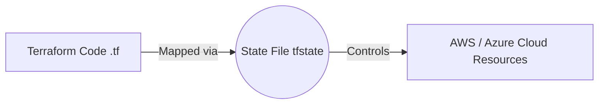
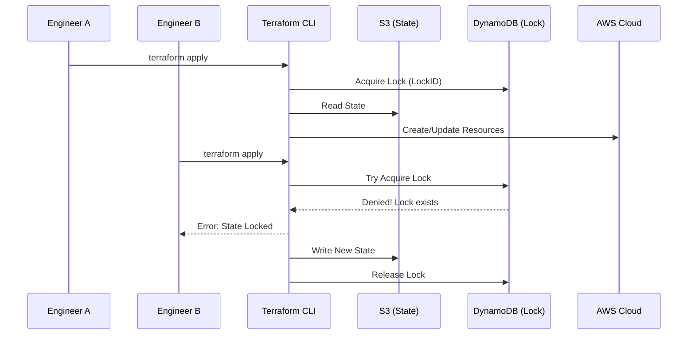

# TF-03 Terraform State Management

# Overview
Ye kya hai? Terraform state (`terraform.tfstate`) Terraform ki memory ya yaad-daasht hai. Ek JSON file jo aapke likhe hue `.tf` code (HCL) ko cloud ke real resources (jaise AWS EC2, S3) ke sath map karti hai. 
Kyu use hota hai? Bina state ke, Terraform bhool jayega ki usne pehle kya create kiya tha. Har baar `terraform apply` chalane par woh sab kuch dobara banane ki koshish karega, jisse massive duplicate resources aur downtime aayega.
Real life example: Jaise ek library ka register hota hai. Agar register ghoom jaye, toh librarian ko nahi pata chalega kisne konsi book li hai. State file wahi register hai.
Industry kaha use karti hai? Har jagah jahan Terraform use hota hai. Lekin local laptop par nahi, state ko centrally (S3 bucket me) rakha jata hai taaki puri team collaborate kar sake. Isko "Remote State" bolte hain.



# Working
Internal working: 
Jab aap `terraform apply` karte ho, Terraform AWS API ko call karta hai resources banane ke liye. Banane ke baad, woh us resource ki saari details (ID, ARN, properties, IP) ek local file `terraform.tfstate` mein save kar deta hai. 
Jab aap code mein change karte ho, Terraform state file ko read karta hai, cloud se current status check karta hai (Refresh), aur phir difference (Delta) ko apply karta hai.
Remote backend mein, ye JSON file laptop pe save hone ki bajaye AWS S3 par push ho jati hai.
State Locking: Ek hi waqt par 2 engineers `apply` na chalaye (warna state corrupt ho jayegi), isliye DynamoDB table use hota hai. Ek engineer ke `apply` chalate hi DynamoDB mein lock lag jata hai. Doosra engineer wait karta hai.



# Installation
Prerequisites: 
- AWS Account
- S3 Bucket (versioning enabled, encryption enabled)
- DynamoDB Table (Partition key `LockID` string hona zaroori hai).

Configuration:
`backend.tf` ya `main.tf` mein ye block add karte hain:

```hcl
terraform {
  backend "s3" {
    bucket         = "my-company-tf-state"
    key            = "prod/vpc/terraform.tfstate"
    region         = "ap-south-1"
    encrypt        = true
    dynamodb_table = "terraform-state-lock"
  }
}
```

Verification:
Run `terraform init`. Agar successfully configure ho gaya, toh likha aayega "Successfully configured the backend 's3'".

# Practical Lab
Step-by-step implementation. Remote state setup.

**Step 1: Create Backend Infrastructure**
(Usually done via console or a separate bootstrap TF)
1. AWS Console mein S3 bucket banao: `devops-tf-state-xyz` (Enable bucket versioning taaki previous state versions recover ho sakein).
2. DynamoDB me ek table banao: `tf-state-lock`, Partition Key ko strictly `LockID` (String) naam do.

**Step 2: Add Backend config to your project**
Tumhare current terraform code (`main.tf`) me upar dikhaya gaya backend block add karo.

**Step 3: Run Init to Migrate State**
```bash
terraform init
```
Agar tumhare paas pehle se local state file thi, output aayega: "Do you want to copy existing state to the new backend?". Type `yes`.

**Step 4: Verify Resources in State**
```bash
terraform state list
# Yeh saare resources list karega jo TF ne abhi tak deploy kiye hain

terraform state pull
# Yeh S3 se state file read karke JSON console pe dikhayega
```

# Daily Engineer Tasks
- **L1 Engineer**: `terraform state list` chala ke check karna ki kon-kon se resources bane hue hain. Koi manual modification allow nahi hai.
- **L2 Engineer**: State locking errors resolve karna (using `terraform force-unlock` cautiously). Naye projects ke liye backend configure karna.
- **L3 / Senior Engineer**: Manually create hue resources ko `terraform import` karna. State file se galat/purane resources hatana using `terraform state rm`.
- **Cloud / DevOps Engineer**: Terraform code ko refactor karte time `terraform state mv` use karke existing state migrate karna bina resources delete kiye.

# Real Industry Tasks
- **Real tickets**: "We need to rename a module in our terraform code but it wants to destroy the production database."
  - **Resolution**: Refactor code first, then run `terraform state mv module.old module.new` to tell TF ki naya module wahi purana DB point kar raha hai.
- **Migration**: Local state se Remote backend (S3/Terraform Cloud) migrate karna for CI/CD setup (Jenkins/GitLab pipelines).
- **Incident**: Pipeline stuck on "Error acquiring the state lock". Check karna kiski pipeline fail hui thi, aur cautiously lock hatana taaki operations resume ho.

# Troubleshooting
- **Symptom**: `Error acquiring the state lock`
  - **Cause**: Puraani TF command beech me fail ho gayi (like timeout ya runner crash) ya koi aur apply kar raha hai.
  - **Resolution**: Check karo koi actually run nahi kar raha. Phir error se Lock ID copy karo aur run: `terraform force-unlock <LockID>`.
- **Symptom**: `Backend configuration changed`
  - **Cause**: Backend bucket name ya key change ki gayi code me.
  - **Resolution**: Run `terraform init -reconfigure` ya `terraform init -migrate-state`.
- **Symptom**: Terraform trying to create existing resource.
  - **Cause**: Kisi ne resource console se banaya par Terraform state me nahi hai.
  - **Resolution**: Use `terraform import`.

# Interview Preparation
- **Basic**: What is a Terraform state file? 
  *Ans:* It is a JSON file mapping Terraform configuration to real-world cloud resources.
- **Intermediate**: Why shouldn't we push `terraform.tfstate` to Git?
  *Ans:* State file me passwords, tokens, aur secrets plain-text me save hote hain. Git pe push karna massive security vulnerability hai. Remote encrypted S3 me save hona chahiye.
- **Advanced / Scenario Based**: Tumhari team 3 alag-alag environments (Dev, QA, Prod) chalati hai. Tum state kaise manage karoge?
  *Ans:* Har environment ka alag state file hona chahiye. Main workspaces use kar sakta hu ya alag folders me backend config ki `key` (path) alag rakhunga jaise `dev/terraform.tfstate`, `prod/terraform.tfstate`. Industry me Terragrunt bhi kaafi use hota hai isko seamlessly manage karne ke liye.
- **Production**: Pipeline failed half-way. Now it says "Lock exists". How to fix?
  *Ans:* DynamoDB se lock release nahi hua. Main manually `terraform force-unlock <LockID>` command chalaunga after confirming ki actually koi aur pipeline ya engineer active deployment nahi kar raha hai.

# Production Scenarios
**Scenario 1: Server Down due to Accidental Deletion**
- **How to think**: Agar kisi ne AWS console se EC2 udha diya (manually delete), toh AWS me wo nahi hai, par TF state me abhi bhi hoga. TF ko lagta hai EC2 zinda hai.
- **Root Cause**: Manual intervention out of band of Terraform.
- **Investigation Steps**: Run `terraform plan`. Plan refresh karta hai aur check karega ki AWS me instance nahi hai. TF usko automatically recreate karne ka plan banayega.
- **Resolution**: Agar tum exactly wahi instance chahte the toh seedha `terraform apply` mar do. Agar tum usko completely clean karna chahte the, toh code se instance block delete karo aur `terraform apply` karo.

**Scenario 2: Need to import a manually created RDS database.**
- **Problem**: Ek developer ne production me DB manually bana diya aur ab usko Infrastructure as Code me laana hai bina delete kiye.
- **Resolution**: Write blank RDS resource block in TF. Run `terraform import aws_db_instance.my_db db-identifier`. Uske baad `terraform state show aws_db_instance.my_db` chalao properties dekhne ke liye aur apna `.tf` code fill karo taaki `plan` clean (no changes) aaye.

# Commands
- `terraform state list`: List sabhi resources in memory. Use to see what TF is tracking.
- `terraform state show <resource_address>`: Ek particular resource ki poori details (JSON). *Danger Level: Medium (Passwords and secrets dikhte hain yahan).*
- `terraform state rm <resource_address>`: Memory se resource hatana. Resource cloud pe zinda rahega, bas TF bhool jayega. Use for manual cleanup ya untangling mess.
- `terraform state mv <old_addr> <new_addr>`: Resource ko rename karna memory mein, so TF usko AWS se destroy na kare during refactoring.
- `terraform import <resource_addr> <id>`: Cloud se existing resource utha ke TF state me dalna.
- `terraform force-unlock <LOCK_ID>`: Stuck lock hatana.

# Cheat Sheet
- **Most important command to untangle mess**: `terraform state rm`.
- **Where are passwords?**: In `.tfstate` in plain text. (Always encrypt backend).
- **S3 Bucket requirement**: Enable Versioning (so if state corrupts accidentally, you can restore a previous state version).
- **DynamoDB Table requirement**: Must have a partition key exactly named `LockID` of type String.

# SOP & Runbook & KB Article
**SOP: Setting up Remote Backend**
1. **Purpose**: Move local state to S3 for team collaboration and CI/CD.
2. **Procedure**: Create S3 bucket with versioning & Dynamo table with `LockID` -> Add backend block in `terraform {}` -> run `terraform init`.

**Runbook: Fixing Locked State**
1. **Detection**: Jenkins/GitLab Pipeline fails with `Error acquiring the state lock`.
2. **Investigation**: Check AWS DynamoDB table for the LockID timestamp. Ask team in Slack if anyone is running it manually.
3. **Resolution**: Run `terraform force-unlock <ID>`.
4. **Validation**: Run `terraform plan` should succeed without lock error now.

# Best Practices & Beginner Mistakes
- **Best Practice 1**: NEVER commit `.tfstate` to Git. Add `*.tfstate` to `.gitignore` strictly.
- **Best Practice 2**: Use Remote Backend (S3 + DynamoDB / Terraform Cloud / Azure Blob Storage).
- **Best Practice 3**: Split state files. Ek hi `.tfstate` file mein poori company ka infrastructure mat rakho (Monolithic State). VPC ka alag, DB ka alag, Apps ka alag rakho taaki blast radius kam ho. Isko share karne ke liye `terraform_remote_state` data source use karo.
- **Beginner Mistake**: Editing `.tfstate` file manually in a text editor like VS Code. NEVER DO THIS. JSON ka ek bracket idhar udhar hua toh state corrupt ho jayegi. Always use `terraform state` CLI commands.

# Advanced Concepts
**`terraform_remote_state` Data Source**:
Agar tumhara VPC ek "Network" team banati hai, toh unka state file alag (e.g. `vpc.tfstate`) hai. Tumhari "App" team ko subnet IDs chahiye apne EC2 ke liye. Toh tumhare app code me ek data source lagana padega jo unki S3 bucket me padi state file se outputs safely read kare. This safely decouples infrastructure responsibilities.

**Workspaces**:
State file ka naam automatically change karna basis environment. `terraform workspace new dev` karoge toh TF nayi state maintain karega same code ke liye (`env:/dev/...`). Lekin production/large-scale me workspace se better folder structure split karna ya Terragrunt use karna zyada robust maana jata hai.

# Related Topics & Flashcards & Revision
- [[06-IaC/TF-01 Terraform Fundamentals|Terraform Fundamentals]]
- [[06-IaC/TF-02 Terraform Modules|Terraform Modules]]
- [[06-IaC/AWS-01 VPC|AWS VPC]]

**Flashcards**:
- **Q**: S3 backend ka lock mechanism kya use karta hai? 
  **A**: DynamoDB Table with partition key `LockID`.
- **Q**: Kya State file me sensitive info encrypted hoti hai locally? 
  **A**: Nahi, JSON me plain text me hoti hai. Isliye isko Git me push nahi karte aur S3 encryption zaroori hai.
