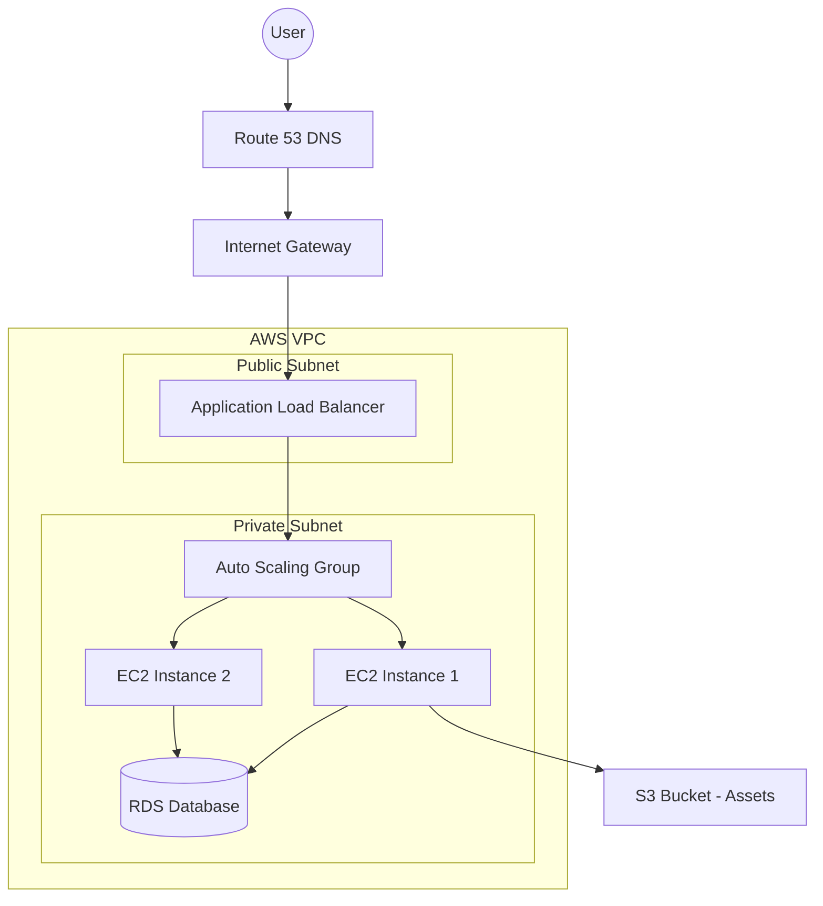

# Overview
Ye AWS Core Services kya hai? Kyu use hota hai? Real life example. Industry kaha use karti hai?
AWS (Amazon Web Services) building blocks provide karta hai modern scalable infrastructure banane ke liye. DevOps engineer hone ke naate, aapka kaam sirf ek server (EC2) provision karna nahi, balki ek highly available ecosystem design karna hai managed services (ELB, ASG, RDS) ko use karke.

Real life analogy: Cloud services bilkul ek rental toolkit ya rented space ki tarah hain. Compute (EC2) aapke workers hain, Storage (S3) aapka godown (warehouse) hai, aur Networking (VPC) wo roads hain jo in sabko connect karte hain. Pehle hum apne server khud kharidte the (on-prem), ab AWS se rent par lete hain jab zaroorat ho (pay-as-you-go). Agar website par sale aa jaye (traffic badhe), toh Auto Scaling Group (ASG) apne aap naye workers (EC2 instances) le aayega.

Industry Use Case: Netflix, Zomato, aur Amazon retail - sab cloud core services par chalte hain. Architecture design karte waqt elasticity aur high availability ensure karna core objective hota hai.

## Architecture


# Working
Internal working and flow:
1. **Compute:** EC2 (Virtual Machines), ASG (Auto Scaling) for dynamic scaling, ELB for traffic distribution, ECS/EKS for containers, aur Lambda for serverless compute.
2. **Storage:** S3 (Object storage, for images/backups), EBS (Block storage, attached disk to EC2), EFS (File storage, shared across multiple EC2s), Glacier (Archive for compliance).
3. **Networking:** VPC (Virtual Private Cloud - aapka private isolated network), Security Groups (Stateful firewalls - EC2 level) vs NACLs (Stateless firewalls - Subnet level), Route 53 (DNS resolution and routing).
4. **Security:** IAM (Identity & Access Management) for users/roles/policies, IRSA (IAM Roles for Service Accounts) in EKS for pod-level security.
5. **Monitoring:** CloudWatch (Metrics/Logs/Alarms), CloudTrail (API Audits - kisne kya kiya account mein), Config (Configuration history tracking).

# Installation
Prerequisites: AWS Account, AWS CLI installed, IAM user with Administrator/PowerUser access. Koi manual server installation nahi hoti, bas API calls ke through provision hota hai.

# Practical Lab
Step-by-step implementation: Provision a highly available web server setup using EC2, ALB, and ASG within a VPC using CLI.

Bajaaye command by command console mein paste karne ke, aap vault ke `examples/` folder se automated bash script use kar sakte hain jo properly variables aur error handling (set -e) use karti hai:
- HA Architecture Bash Script: [examples/07-Cloud/aws-ha-web-architecture.sh](file:///C:/Users/SPTL/Documents/devops/devops/examples/07-Cloud/aws-ha-web-architecture.sh)

**CLI Execution:**
1. Navigate to the examples directory:
   ```bash
   cd ../../examples/07-Cloud/
   chmod +x aws-ha-web-architecture.sh
   ./aws-ha-web-architecture.sh
   ```
2. **Review the Script:** Open the script to see how VPCs, Subnets, IGWs, and Security Groups are programmatically linked together using `query` filters and outputs.
3. **Create an Application Load Balancer (ALB)**
   ```bash
   aws elbv2 create-load-balancer --name my-alb --subnets subnet-xxx subnet-yyy --security-groups sg-xxx
   ```
4. **Create a Launch Template with User Data**
   Create `userdata.txt`:
   ```bash
   #!/bin/bash
   yum update -y
   yum install httpd -y
   systemctl start httpd
   systemctl enable httpd
   echo "Hello from AWS Auto Scaling" > /var/www/html/index.html
   ```
   Deploy Launch Template:
   ```bash
   aws ec2 create-launch-template --launch-template-name web-lt --version-description WebVersion1 \
   --launch-template-data '{"ImageId":"ami-0c55b159cbfafe1f0","InstanceType":"t2.micro","UserData":"<base64-encoded-userdata>"}'
   ```
5. **Create an Auto Scaling Group (ASG)**
   ```bash
   aws autoscaling create-auto-scaling-group --auto-scaling-group-name web-asg \
   --launch-template LaunchTemplateName=web-lt,Version='1' --min-size 2 --max-size 5 \
   --vpc-zone-identifier "subnet-xxx,subnet-yyy" --target-group-arns arn:aws:elasticloadbalancing:...
   ```
6. **Set Target Tracking Scaling Policy**
   ```bash
   aws autoscaling put-scaling-policy --auto-scaling-group-name web-asg \
   --policy-name cpu-tracking --policy-type TargetTrackingScaling \
   --target-tracking-configuration '{"PredefinedMetricSpecification":{"PredefinedMetricType":"ASGAverageCPUUtilization"},"TargetValue":50.0}'
   ```

*Expected Output:* Do (2) EC2 instances automatically launch honge, ALB ke target group mein register honge. Jab aap ALB ke DNS name ko hit karenge, toh "Hello from AWS Auto Scaling" webpage show hoga.

# Daily Engineer Tasks
- **L1 Engineer:** CloudWatch alerts check karna, EC2 instances ko restart karna, S3 bucket permissions ko review karna.
- **L2 Engineer:** ALB/NLB routing issues troubleshoot karna, ASG scaling events monitor karna, IAM roles and cross-account policies manage karna.
- **L3/Senior Engineer:** Cross-region VPC peering setup karna, EKS clusters design karna, Transit Gateway implement karna, CloudTrail logs se security incidents investigate karna.

# Real Industry Tasks
- **Migration:** On-premise VMs ko AWS EC2 par lift-and-shift migrate karna using AWS Application Migration Service (MGN).
- **Upgrade:** RDS MySQL engine version upgrade with minimal downtime using Read Replicas and DNS flip.
- **Patch Management:** AWS Systems Manager (SSM) Patch Manager se puri fleet of instances ko zero downtime ke sath OS updates push karna.
- **Cost Optimization:** Unused/unattached EBS volumes ko find and delete karna. S3 lifecycle rules configure karna taaki 30 days ke baad logs automatically Glacier mein move ho jaye.

# Troubleshooting
| Symptom | Possible Root Cause | Investigation Steps / Commands | Resolution |
| :--- | :--- | :--- | :--- |
| **Connection timed out to EC2 SSH (Port 22)** | Security Group (SG) is blocking port 22 or VPC lacks an Internet Gateway (IGW) route. | `aws ec2 describe-security-groups --group-ids <sg-id>`. Check if IGW is attached and route table has `0.0.0.0/0` targeting IGW. | Add inbound rule for Port 22 in SG. Fix Route Table pointing to IGW. |
| **S3 Access Denied (403)** | IAM Role is missing permissions, or Bucket Policy has an explicit Deny. | Review Bucket Policy. Use IAM Policy Simulator. | Update IAM policy to include `s3:GetObject`. Verify KMS key permissions if objects are encrypted. |
| **ASG not scaling out under load** | CloudWatch metric not crossing the threshold, or ASG Max capacity reached. | Check ASG Activity History in AWS Console. Check CloudWatch alarms. | Increase MaxCapacity parameter of ASG. Check if account-level EC2 limits are hit (Service Quotas). |
| **ECS Tasks stuck in PENDING** | No EC2 instances registered to cluster or insufficient CPU/Memory available. | `aws ecs describe-clusters`. Check instances tab. | Verify Task Definition resource requests fit within available underlying instance capacity. |

*Decision Tree for Website Down (502/504 Error):*
1. Ping/curl the ALB -> Timeout? Check DNS (Route53) and ALB Security Groups.
2. 502/504 Bad Gateway? -> ALB is fine, backend EC2 instances are failing health checks. Check EC2 SG and application logs (CloudWatch).
3. Service down inside EC2? -> SSM/SSH into instance. Check `systemctl status httpd` or application logs. RAM/CPU full?

# Interview Preparation
- **Basic:** What is the difference between S3 and EBS? 
  *Expected Answer:* S3 object storage hai (like Google Drive) accessible via API over internet. EBS block storage hai (like a C: drive) jo directly ek specific EC2 instance se attached hoti hai.
- **Intermediate:** Explain the difference between Security Group and Network ACL? 
  *Expected Answer:* SG operates at instance level, stateful hota hai (return traffic allowed automatically), aur isme sirf Allow rules hote hain. NACL operates at subnet level, stateless hota hai (return traffic manually allow karni padti hai), aur isme Allow/Deny dono rules hote hain.
- **Scenario Based (FAANG):** Marketing team ek huge ad campaign launch karne waali hai 10 minutes mein. Traffic instantly 50x spike hoga. Aap ASG use kar rahe hain. How do you ensure the site stays up without crashing?
  *Expected Answer:* Regular ASG ko scale out hone mein kuch minutes lagte hain (metrics collection + boot time). Instant spike ke liye: 
  1. ALB ko pre-warm karna padega (AWS support ticket raise karke if massive).
  2. CloudFront (CDN) use karenge edge caching ke liye.
  3. ASG ka "Desired Capacity" manually increase karke pre-scale karenge (Scheduled Scaling or manual intervention) bajaye CloudWatch metrics ke wait karne ke.

# Production Scenarios
*Scenario:* "Production Database (RDS) space is 95% full."
- **How to think:** Immediate action vs Long-term fix. Agar disk 100% full ho gayi toh database crash ho jayega.
- **Where to check:** CloudWatch `FreeStorageSpace` metric. RDS Console.
- **Root Cause:** App generating too many logs, huge data insertion, or no data retention policy.
- **Resolution:** Enable RDS Storage Autoscaling (immediate fix). Long term: Clean up old data, optimize queries, review data retention.
- **Prevention:** Setup CloudWatch Alarm at 80% and 90% storage utilization to page on-call via PagerDuty.

# Commands
| Command | Purpose | Syntax/Example | When to use | Danger Level |
| :--- | :--- | :--- | :--- | :--- |
| `aws s3 ls` | Lists all S3 buckets | `aws s3 ls s3://my-app-logs-bucket` | To check bucket presence or contents | Low |
| `aws ec2 describe-instances` | Shows running EC2s | `aws ec2 describe-instances --filters "Name=instance-state-name,Values=running"` | Inventory / troubleshooting | Low |
| `aws sts get-caller-identity` | Shows current IAM entity | `aws sts get-caller-identity` | Verifying "Who am I logged in as?" | Low |
| `aws cloudformation deploy` | Deploys IaC stack | `aws cloudformation deploy --template-file tpl.yaml --stack-name prod` | Creating or updating infrastructure | High |
| `aws eks update-kubeconfig` | Generates K8s config | `aws eks update-kubeconfig --region us-east-1 --name my-cluster` | Connecting `kubectl` to EKS | Medium |

# Cheat Sheet
- **Compute:** EC2 (VM), Lambda (Serverless code), ECS/EKS (Containers).
- **Storage:** S3 (Object), EBS (Block/Boot drive), EFS (Shared File System over NFS), Glacier (Deep Archive).
- **Networking:** VPC (Network boundary), Route53 (DNS), ALB (Layer 7 HTTP routing), NLB (Layer 4 TCP/UDP ultra-fast routing).
- **Security:** IAM (Users/Roles), KMS (Encryption Keys), CloudTrail (Audit logs for API calls).
- **Interview Shortcuts:** Always mention *Principle of Least Privilege* for IAM and *Multi-AZ Deployment* for High Availability / Disaster Recovery.

# SOP & Runbook & KB Article
**Runbook - EC2 CPU Utilization Critical (>90%)**
- **Detection:** CloudWatch Alarm triggers SNS -> PagerDuty.
- **Investigation:** 
  1. Connect to EC2 via AWS Systems Manager (SSM) Session Manager. 
  2. Run `top` or `htop` to identify the culprit process consuming CPU.
  3. Check application logs in `/var/log/`.
- **Resolution:** 
  - If a rogue process / memory leak -> Restart the service (`systemctl restart <app>`).
  - If it's legitimate traffic -> Ensure ASG scaling policies are triggering and new instances are coming up.
- **Validation:** Monitor CloudWatch metrics to ensure CPU drops below 60%.
- **Rollback/Escalation:** If service keeps crashing, escalate to L3/Dev team.

# Best Practices & Beginner Mistakes
- **Best Practices (Production):** 
  - Use IAM Roles for EC2 instead of hardcoding AWS Access/Secret Keys in code. 
  - Always deploy databases in Private Subnets. 
  - Enable S3 bucket versioning to prevent accidental deletions and ransomware.
  - Implement Infrastructure as Code (Terraform/CloudFormation) instead of manual ClickOps.
- **Beginner Mistakes:** 
  - Leaving Security Group port 22 or 3306 open to `0.0.0.0/0` (entire internet).
  - Using root AWS account for daily tasks (always use IAM users with MFA).
  - Ignoring cost optimization (leaving large unused EC2s running over the weekend).

# Advanced Concepts
**IAM Roles for Service Accounts (IRSA):** EKS mein OIDC (OpenID Connect) provider ke through IAM role ko Kubernetes Service Account se directly map kiya jaata hai. Isse ek specific Pod ko AWS permissions milti hain (e.g. S3 access), bina pure EC2 worker node ko broad permissions diye. This perfectly aligns with the Principle of Least Privilege in cloud-native microservices.

# Related Topics & Flashcards & Revision
- [[07-Cloud/AWS-02 AWS DevOps Tools]]
- [[04-Orchestration/K8S-01 Kubernetes Architecture]]
- [[Master Index]]

**Flashcards:**
- **Q:** What makes an ALB different from NLB?
  - **A:** ALB operates at Layer 7 (HTTP/HTTPS, path routing), NLB operates at Layer 4 (TCP/UDP, ultra-low latency).
- **Q:** EBS vs EFS?
  - **A:** EBS can be attached to only ONE instance at a time (generally), EFS is a network file system that can be mounted to THOUSANDS of EC2 instances concurrently.
- **Revision:** 5 min (Cheat sheet), 15 min (Overview + Working), Interview Revision (Interview Prep + Prod Scenarios).
