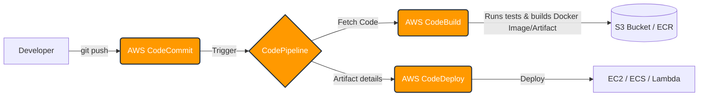
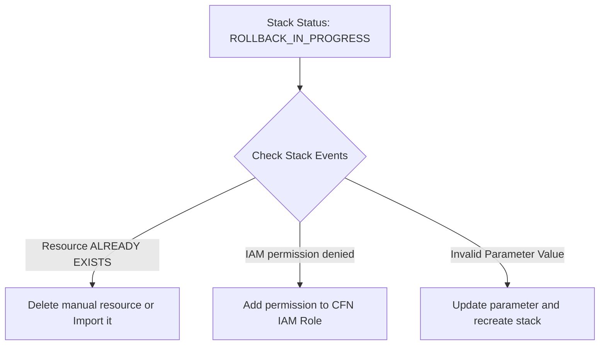

# AWS DevOps Tools (CI/CD, IaC, SSM)

> [!abstract]
> Yeh note AWS native DevOps tools (CodeCommit, CodeBuild, CodeDeploy, CodePipeline, CloudFormation, Elastic Beanstalk, SSM) ke baare me hai. Isme CI/CD pipeline automation aur Infrastructure as Code (IaC) ko deep level par practically aur production standards ke hisaab se cover kiya gaya hai.

# Overview

AWS DevOps tools ka main kaam software delivery aur infrastructure provisioning ko automate karna hai. Real production environment mein hum manually code build ya server deploy nahi karte, balki AWS ki CI/CD pipeline ka use karte hain. 

**Analogy:** Ek car manufacturing factory (AWS DevOps). CodeCommit apka godown hai jahan raw material (code) rakha hai. CodeBuild factory ki machine hai jo parts ko assemble (build/test) karti hai. CodeDeploy delivery truck hai jo cars ko showroom (servers) tak le jaata hai. Aur CodePipeline manager hai jo ensure karta hai ki raw material se leke showroom tak sab smoothly automate ho jaaye. CloudFormation wo blueprint hai jisse aap aisi nayi factory ek click mein bana sakte hain.

**Industry Use-Case:** Swiggy ya Netflix jab naya feature release karte hain, toh code CodeCommit/GitHub se commit hote hi automatically CodePipeline trigger hoti hai, test pass karti hai, Docker image banati hai, aur ECS ya EKS pe bina downtime ke deploy (Blue/Green) kar deti hai.

### Architecture (AWS CI/CD Pipeline)



# Working

Internal data aur request flow AWS DevOps tools mein aise kaam karta hai:
1. **Source Phase:** Developer code push karta hai (CodeCommit ya GitHub). Amazon EventBridge ya webhook CodePipeline ko trigger karta hai.
2. **Build Phase:** CodePipeline source artifact (zip file) banake S3 me rakhti hai aur CodeBuild ko start karti hai. CodeBuild ek temporary container spin up karta hai, repo ke root mein `buildspec.yml` file dhoondhta hai, aur commands execute karta hai. Final build artifact (e.g., jar, war, ya zip) S3 me save ho jaata hai.
3. **Deploy Phase:** CodePipeline CodeDeploy ko instruct karti hai. CodeDeploy Agent (jo EC2 par running hai) S3 se nayi revision download karta hai aur `appspec.yml` ke instructions padh kar code ko servers par place karta hai, aur application ko restart karta hai.
4. **Configuration & Security:** Hardcoded passwords nahi use hote. SSM Parameter Store se runtime par secrets extract hote hain.

# Installation & Configuration

Production mein in tools ko setup karne ka tareeka:

**Prerequisites:**
- AWS Account aur IAM permissions.
- EC2 instance (Jisme CodeDeploy Agent aur SSM Agent installed ho).
- S3 bucket artifacts store karne ke liye.

**EC2 par CodeDeploy Agent Install Karna (Amazon Linux 2023):**
```bash
sudo yum update -y
sudo yum install ruby wget -y
cd /home/ec2-user
wget https://aws-codedeploy-us-east-1.s3.us-east-1.amazonaws.com/latest/install
chmod +x ./install
sudo ./install auto
sudo service codedeploy-agent status
```

**SSM Agent (Already installed in Amazon Linux, check status):**
```bash
sudo systemctl status amazon-ssm-agent
```

# Practical Lab

**Scenario:** Simple Static Website CI/CD Pipeline via AWS CLI. 

**Step 1: CodeCommit Repo Create Karein**
```bash
aws codecommit create-repository --repository-name prod-website --repository-description "Production website repo"
```

**Step 2: buildspec.yml aur appspec.yml Banayein**
Local machine pe project folder mein:
*buildspec.yml*
```yaml
version: 0.2
phases:
  build:
    commands:
      - echo "Building website..."
      - zip -r artifact.zip index.html style.css
artifacts:
  files:
    - artifact.zip
```
*appspec.yml*
```yaml
version: 0.0
os: linux
files:
  - source: /
    destination: /var/www/html/
hooks:
  AfterInstall:
    - location: scripts/restart_apache.sh
      timeout: 300
      runas: root
```

**Step 3: Code Push Karein**
```bash
git remote add origin https://git-codecommit.us-east-1.amazonaws.com/v1/repos/prod-website
git add .
git commit -m "Initial prod code"
git push -u origin master
```

**Step 4: AWS Console se CodePipeline Setup (GUI is better for beginners)**
1. **Developer Tools -> CodePipeline** -> Create pipeline.
2. Source: AWS CodeCommit (prod-website, master branch).
3. Build: AWS CodeBuild -> Create Project (OS: Amazon Linux 2, select New Service Role).
4. Deploy: AWS CodeDeploy -> Select App aur Deployment Group.
5. Create. Pipeline automatically pehla run start kar degi!

# Daily Engineer Tasks

- **L1 Engineer:** Failed pipelines check karna. CodeDeploy agent ki service restart karna (`systemctl restart codedeploy-agent`). CFN stack deployment status monitor karna.
- **L2 Engineer:** IAM roles aur policies me issues fix karna. CloudFormation stacks ke rollback failures investigate karna. SSM run command ke through multiple servers par logs clear karna.
- **L3 / Senior Engineer:** Complex `buildspec.yml` likhna jisme Docker image banke ECR pe push ho. Blue/Green deployment strategy design karna. CloudFormation nested stacks banana.
- **DevOps/Cloud Architect:** Poore organisation ka CI/CD architecture design karna. Security integrations (DevSecOps) implement karna like SonarQube in CodeBuild. 

# Real Industry Tasks

- **Real Change Request (CR):** "Implement Blue/Green Deployment for E-Commerce App." Current in-place deployment server downtime karta hai. CR ka kaam hai CodeDeploy target group ko modify karna aur Blue/Green set karna taaki zero downtime achieve ho.
- **Maintenance Work:** SSM Session Manager ke through sare prod EC2 instances pe OS patching (Run Command / State Manager) schedule karna without SSH keys.
- **Migration:** Purane Jenkins server se AWS CodePipeline me migrate karna taaki server management ka overhead khatam ho jaye.

# Troubleshooting

| Common Issues | Symptoms | Possible Root Causes | Investigation / Resolution |
| :--- | :--- | :--- | :--- |
| **CodeBuild "Access Denied"** | Pipeline Build stage pe fail ho jati hai, logs S3 denied bolta hai. | CodeBuild IAM role ke paas artifact S3 bucket me likhne ki permission (s3:PutObject) nahi hai. | IAM Console me jao, CodeBuild ka role search karo, Policy me S3 PutObject ARN add karo. |
| **CodeDeploy Agent Hook Failed** | Deploy stage fail. Error: "The deployment failed because a specified file already exists at this location" | Nayi file override nahi ho pa rahi kyuki pehle se wahan manual file change ki gayi thi. | Option 1: File overwrite allow karo CodeDeploy settings me. Option 2: Server me login karke old file delete karo. |
| **Session Manager Cannot Connect** | AWS Console me "Connect" button greyed out hai via SSM. | EC2 instance ke paas `AmazonSSMManagedInstanceCore` role nahi hai, ya server private subnet me hai bina NAT/Endpoint ke. | EC2 me IAM Role attach karo. Ensure VPC me SSM ke VPC Endpoints exist karte hain. |
| **CFN Stack ROLLBACK_FAILED** | Stack delete nahi ho raha, stuck ho gaya hai. | Tumne resource (e.g., S3 Bucket) manually delete/modify kar diya, jisse CloudFormation usko delete nahi kar pa raha. | Manually issue resolve karo (jaise S3 bucket khali karo), ya CFN console me jaake stack delete karte time us failed resource ko "Retain" mark karo. |

# Interview Preparation

**Basic:**
Q: `buildspec.yml` aur `appspec.yml` me kya difference hai?
A: `buildspec.yml` CodeBuild ke liye hoti hai (commands run karne aur artifact banane ke liye). `appspec.yml` CodeDeploy ke liye hoti hai (deploy location aur lifecycle hooks define karne ke liye).

**Intermediate:**
Q: AWS CodeDeploy me Blue/Green deployment kaise kaam karta hai?
A: Naya environment (Green) provision hota hai. CodeDeploy naya code Green me daalta hai. Load balancer ka traffic dheere dheere ya ek saath Blue se Green me shift hota hai. Agar Green fail ho jaye toh jaldi se wapas Blue pe traffic shift kar sakte hain (fast rollback).

**Advanced / Production Scenario:**
Q: Ek Developer bolta hai ki uske code me database password hardcoded hai jo GitHub me public ho gaya. As a DevOps engineer, aap isko AWS native way se future ke liye kaise secure karenge?
A: Main password ko AWS Systems Manager (SSM) Parameter Store me as `SecureString` ya AWS Secrets Manager me store karunga. Uske baad `buildspec.yml` me SSM parameter ka path environment variable me pass karunga. CodeBuild runtime pe password fetch karega bina code me show kiye. Code base se purane commits ki history bhi rewrite (git filter-repo) karunga.

# Production Scenarios

**Scenario: Deployment fail ho gaya aur Website Down hai.**
- **How to think:** Sabse pehle rollback socho (MTTR kam karna hai). Phir RCA (Root Cause Analysis).
- **Where to check:** CodePipeline console me fail stage dekho. Agar CodeDeploy fail hua, toh EC2 pe logs check karo `/opt/codedeploy-agent/deployment-root/deployment-logs/codedeploy-agent-deployments.log`.
- **Root Cause:** AppSpec ka `AfterInstall` script fail ho gaya kyuki ek dependency (e.g. nodejs) server pe missing thi.
- **Resolution:** AWS console se "Stop and Rollback Deployment" click karo. Code me dependency fix karo, push karo.

# Commands (Cheat Sheet)

| Command | Purpose | Output / Notes | Danger Level |
| :--- | :--- | :--- | :--- |
| `aws ssm start-session --target i-01234abcd` | EC2 me bina SSH aur Port 22 ke shell access lena. | Opens bash terminal. | Low (Audited by CloudTrail) |
| `aws ssm put-parameter --name "/db/prod_pass" --value "secure123" --type "SecureString"` | Secure secret save karna SSM parameter store me. | Parameter version number. | Medium |
| `git config --global credential.helper '!aws codecommit credential-helper $@'` | CodeCommit ke liye git config setup karna. | Git config updated. | Low |
| `aws cloudformation describe-stack-events --stack-name prod-vpc` | CFN stack ke events aur error reasons dekhna. | JSON list of events. | Low |
| `aws cloudformation delete-stack --stack-name my-db-stack` | Poora infrastructure delete kar dena. | None (Async deletion). | **HIGH / CRITICAL** |

# SOP & Runbook & KB Article

**KB Article: CodeDeploy EC2 Instance Target Not Found**
- **Problem:** CodePipeline CodeDeploy stage me ruk gayi, "No instances found" error.
- **Environment:** EC2, Auto Scaling Group (ASG), CodeDeploy.
- **Cause:** EC2 tags jo Deployment Group me define the (`Environment=Prod`), wo instances me actually apply nahi hue.
- **Resolution:** EC2 console me jao, instances ko tag karo `Environment=Prod`. CodeDeploy retry karo. 

**SOP: Upgrading Instance type via CloudFormation**
- **Purpose:** Update EC2 instance sizes in production without manual clicking.
- **Procedure:** 1. Update `InstanceType` parameter in YAML template. 2. Create Change Set. 3. Review Change Set to ensure no resources are Replaced unexpectedly. 4. Execute Change Set. 5. Monitor events.
- **Rollback:** If fails, CFN automatically rolls back to previous state.

# Best Practices & Beginner Mistakes

**Best Practices:**
- CI/CD me tests zarur run karein (Unit tests, linting, security scans).
- Har deployment environment ke liye alag CloudFormation stack use karein (`dev`, `staging`, `prod`).
- Bastion hosts ki jagah SSM Session Manager use karein. Security group me Inbound 22 port ko `0.0.0.0/0` se delete karein.
- Least Privilege IAM roles de CodeBuild aur CodeDeploy ko.

**Beginner Mistakes:**
- `buildspec.yml` ko code repository ke root ki jagah kisi sub-folder me rakh dena. CodeBuild fail ho jayega.
- S3 Bucket me versioning enable na karna jahan CodePipeline artifacts store hote hain.
- CloudFormation me Production Database ko Delete retain policy na dena (agar galti se stack delete hua, toh DB udel jayega). Use `DeletionPolicy: Retain`.

# Advanced Concepts

- **CloudFormation Change Sets:** Direct stack update karna risky hai. Change Sets se AWS ek "Diff" (Preview) banata hai ki kaunse resources Modify honge aur kaunse completely Replace (Delete hoke wapas banenge). Isse production data loss (like RDS replacement) bachaya jata hai.
- **CloudFormation Custom Resources:** Agar CFN koi chiz native support nahi karta (e.g. kisi third party API ko call karna), to Lambda backed Custom Resources use karte hain.
- **SSM State Manager:** Configuration management tool (like Ansible). Aap define kar sakte ho ki har roz subah 9 baje sabhi windows server pe antivirus scan script run ho.

# Related Topics & Flashcards & Revision

- **Related:** [[07-Cloud/AWS-01 AWS Core Services for DevOps]], [[02-Configuration-Management/Ansible-01 Introduction]], [[10-CI-CD/Jenkins-01 Basics]]
- **Next Topic:** Docker aur EKS ke sath CodePipeline integrate karna.

**Flashcards:**
- *Q: CFN me kisi resource ko galti se delete hone se kaise bachayein?* -> *A: Use `DeletionPolicy: Retain`.*
- *Q: CodeBuild default config file name?* -> *A: `buildspec.yml`.*
- *Q: SSH ka secure AWS alternative?* -> *A: AWS Systems Manager (SSM) Session Manager.*

# Real Production Logs & Decision Tree

**Log Analysis: CodeBuild Phase Failure**
```text
[Container] 2025/06/27 10:15:00 Running command npm install
npm ERR! code E401
npm ERR! Unable to authenticate, need: Basic realm="GitHub Package Registry"
```
*Explanation:* Build fail hua kyuki code ek private npm package pull karne ki koshish kar raha tha, aur CodeBuild container ke paas GitHub ka auth token nahi tha.
*Fix:* SSM Parameter Store se GitHub token pass karo `buildspec.yml` ke environment variables me aur login script add karo `pre_build` phase me.

**Decision Tree: CloudFormation Stack Creation Failed**


---
*Created by Antigravity God Mode DevOps Vault Generator*
