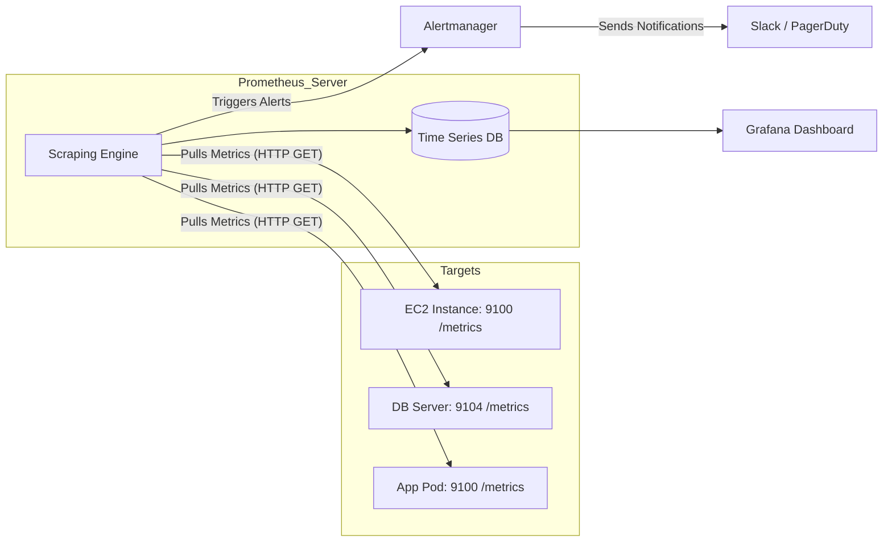
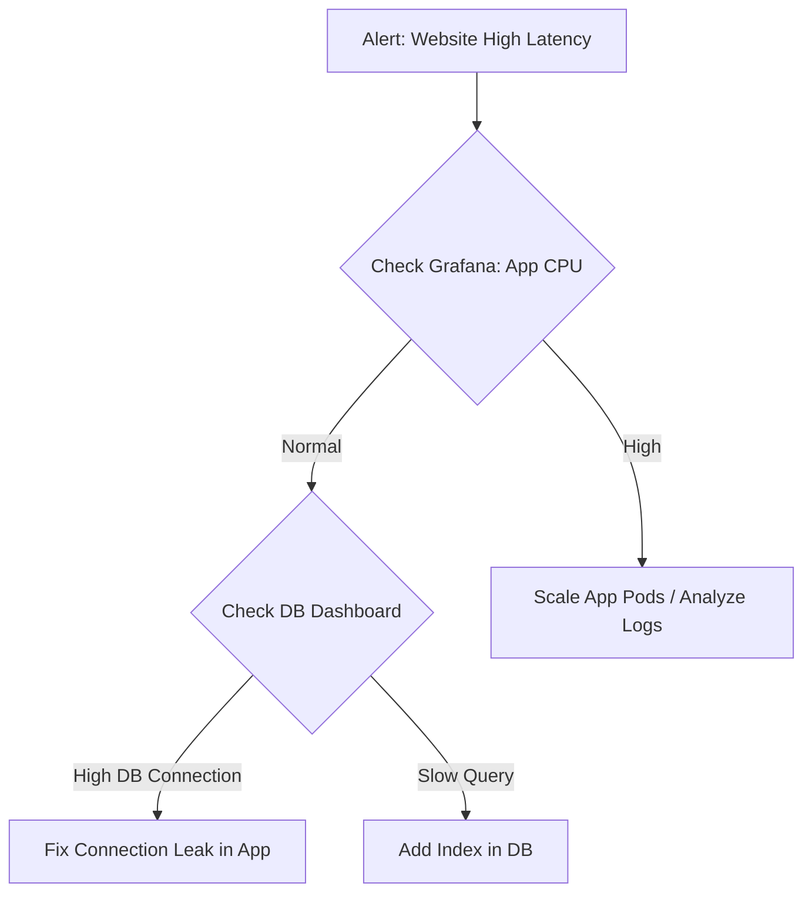

# MON-01 Prometheus and Grafana

# Overview
**Ye kya hai?**
Prometheus ek open-source Time Series Database (TSDB) aur monitoring system hai. Grafana ek open-source visualization tool hai jo data ko sundar dashboards me dikhata hai. Dono milkar modern infrastructure, especially Kubernetes, ka standard monitoring stack banate hain.

**Kyu use hota hai?**
Agar raat ke 3 baje server down ho jaye aur log so rahe ho, toh kaise pata chalega? Monitoring system metrics collect karke Alertmanager ke through on-call engineer ko pagger duty ya slack pe alert bhejta hai. Ye hume CPU, RAM, Network aur Application performance ka real-time data deta hai.

**Real life example:**
Car ka dashboard (Grafana) jo batata hai gaadi ki speed kya hai (Metrics), engine garam to nahi ho raha (Prometheus TSDB), aur agar engine temperature limit cross kare toh red light blink hoti hai (Alertmanager).

**Industry kaha use karti hai?**
Har modern startup se lekar FAANG companies tak, Kubernetes clusters aur microservices ki health track karne ke liye.

**Mermaid Architecture:**

# Working
**Internal working:**
Traditional monitoring (like Nagios/Datadog agent) **Push** model follow karte hain (target khud data bhejta hai). Prometheus **Pull** model use karta hai. Prometheus server har 15 second (scrape interval) me targets ke `/metrics` endpoint (HTTP GET) pe call karta hai aur metrics laakar apni local TSDB (Time Series Database) me store karta hai.

**Data Flow:**
Target (Exposes metrics) -> Prometheus (Scrapes & Stores) -> PromQL (Query) -> Grafana (Visualizes).

**Ports & Protocols:**
- Prometheus Server: `9090` (HTTP)
- Grafana: `3000` (HTTP)
- Alertmanager: `9093` (HTTP)
- Node Exporter: `9100` (HTTP)
- Blackbox Exporter: `9115` (HTTP)

**Dependencies:**
Local disk (fast SSD recommended for TSDB), Target servers par Exporters (e.g., node_exporter, wmi_exporter).

# Installation
**Prerequisites:** 
Linux server, Docker & Docker Compose installed.

**Installation (Docker Compose Method):**
Aap vault ke `examples/` folder se ready-made production stack use kar sakte hain jo persistent volumes aur custom networks ke saath configured hai:
- Docker Compose: [examples/08-Monitoring/prometheus-grafana/docker-compose.yml](file:///C:/Users/SPTL/Documents/devops/devops/examples/08-Monitoring/prometheus-grafana/docker-compose.yml)
- Prometheus Config: [examples/08-Monitoring/prometheus-grafana/prometheus.yml](file:///C:/Users/SPTL/Documents/devops/devops/examples/08-Monitoring/prometheus-grafana/prometheus.yml)

**Verification:** 
Navigate to the examples folder and run `docker compose up -d`. Open `http://localhost:9090` (Prometheus) aur `http://localhost:3000` (Grafana). Check targets in Prometheus UI.

**Rollback:**
`docker compose down -v` to delete stack and data volumes.

# Practical Lab
**Step-by-step implementation for setting up a CPU Dashboard:**
1. **Start Stack:** Terminal me `cd ../../examples/08-Monitoring/prometheus-grafana/` aur phir `docker compose up -d` run karo.
2. **Prometheus Target Check:** Browser me `http://localhost:9090` kholo -> Status -> Targets. `node_exporter` UP (green) hona chahiye.
3. **Connect Grafana:** `http://localhost:3000` pe jao. Login `admin/admin`.
4. **Data Source:** Administration -> Data Sources -> Add Prometheus. URL me `http://prometheus:9090` daalo (kyunki Docker DNS use ho raha hai). Save & Test.
5. **Import Dashboard:** Dashboards -> Import -> ID `1860` (Node Exporter Full) daalo. Load karo aur Prometheus data source select karo.
6. **Expected Output:** Ek professional dashboard dikhega jisme CPU, RAM, aur Disk I/O ke live graphs honge.

# Daily Engineer Tasks
- **L1 Engineer:** Dashboards monitor karna. Red alerts aane pe initial checks karna aur L2/L3 ko inform/escalate karna. Pager duty acknowledge karna.
- **L2 Engineer:** Naye servers pe `node_exporter` install karna, `prometheus.yml` me scrape targets add/update karna, simple Grafana dashboards banana.
- **L3 / Senior Engineer:** Complex PromQL queries likhna (jaise 99th percentile latency), Alerting rules set karna (SLO/SLI base), Prometheus ka scaling manage karna (Thanos / Cortex integration), High Availability (HA) configure karna.
- **Cloud / DevOps Engineer:** Infrastructure as Code (Terraform) se poora monitoring stack AWS EKS / AKS pe deploy karna (via Helm).

# Real Industry Tasks
- **Real Tickets:** "Developer: Prod DB CPU dashboard blank aa raha hai." (Resolution: Target down tha, `prometheus.yml` fix kiya aur service restart ki).
- **Change Requests:** Prometheus ke data retention period ko 15 days se 30 days karna without downtime.
- **Maintenance Work:** Grafana version upgrade karna. Backup of Grafana SQLite DB lene ke baad pod restart.
- **Production Validation:** Release ke baad Grafana dashboard me 500 error rates ka spike toh nahi aya, ye check karna.

# Troubleshooting
**Problem:** Prometheus Target showing as DOWN.
**Symptoms:** Grafana dashboard me 'No Data' dikh raha hai aur Prometheus targets page pe state DOWN (Red) hai.
**Possible Root Causes:** 
1. Exporter crash ho gaya target machine pe.
2. Firewall / Security Group port 9100 block kar raha hai.
3. Network issue between Prometheus server and target.

**Investigation Steps:**
1. Prometheus server ke CLI pe login karo.
2. `curl -I http://<target-ip>:9100/metrics` run karo. 
3. Agar timeout aya, matlab Network/Firewall issue. Agar "Connection Refused" aya, toh target pe service down hai.

**Resolution:** Security Group me Port 9100 open karna ya target pe `systemctl restart node_exporter` chalana.
**Verification:** Target UP in Prometheus UI.

# Interview Preparation
- **Basic:** Push vs Pull model me kya difference hai? (Ans: Push me target bhejta hai, Pull me Prometheus collect karta hai. Pull better hai for avoiding overload and easy local testing).
- **Intermediate:** `rate()` aur `irate()` me kya farq hai? (Ans: `rate` long trend batata hai over a range, `irate` sirf last 2 points ka spike batata hai).
- **Advanced / Scenario Based:** P99 (99th Percentile) kya hota hai aur average kyu nahi use karte? (Ans: Average me outliers chup jate hain. P99 batata hai ki 99% users ki latency is limit ke andar hai. P99 best-case aur worst-case scenario samajhne ke liye zaroori hai).
- **Production (Rapid Fire):** Grafana data source error de raha hai docker me `localhost:9090` daalne par, kyu? (Ans: Docker network me localhost matlab container khud. `prometheus:9090` use karna chahiye).
- **Confidence Level:** Be bold. Bolna "I always use `rate()` with counters, never raw values".

# Production Scenarios
**Scenario: Website slow hone lagti hai.**
**How to think:** Network bandwidth choke ho rahi hai? CPU 100% hai? Ya Database lock hai?
**Decision Tree:**

**Commands / Logs:** Look at Prometheus query `histogram_quantile(0.99, sum(rate(http_request_duration_seconds_bucket[5m])) by (le))`
**Root Cause & Resolution:** Slow query ki wajah se DB wait time badh gaya tha. Developer ne index lagaya aur issue fix ho gaya.

# Commands
| Command | Purpose | Syntax | Output | When to use | Danger Level |
|---------|---------|--------|--------|-------------|--------------|
| `promtool` | Config file check karne ke liye | `promtool check config prometheus.yml` | `SUCCESS: prometheus.yml is valid` | Restart karne se pehle config validate karne ke liye. | Low |
| `systemctl restart prometheus` | Service restart | `sudo systemctl restart prometheus` | `None (returns to prompt)` | Nayi config apply karne ke liye. | Medium (causes short metric gap) |

# Cheat Sheet
**PromQL Must-Knows:**
- **Counter:** Hamesha badhta hai (e.g. Total Requests). Hamesha `rate()` use karo: `rate(http_requests_total[5m])`
- **Gauge:** Upar/neeche ho sakta hai (e.g. CPU, RAM). `rate()` MAT USE KARO. Direct value ya `avg_over_time()` use karo.
- **Histogram/Summary:** P99, P95 nikalne ke liye.
- **Filter:** `http_requests_total{status="500", method="POST"}`

**Important Ports:** 9090 (Prometheus), 3000 (Grafana), 9100 (Node Exporter).

# SOP & Runbook & KB Article
**Runbook: Grafana Out of Memory (OOM)**
- **Detection:** Grafana pod `OOMKilled` state me chala gaya.
- **Investigation:** Check pod memory limit in Kubernetes: `kubectl describe pod grafana-xxx`
- **Resolution:** Heavy dashboards query kar rahe the. `values.yaml` me Grafana ki memory limit 512Mi se 1Gi kardi aur Helm upgrade run kiya.
- **Validation:** Pod running aur logs me `Listen on 3000` aagaya.

# Best Practices & Beginner Mistakes
**Best Practices:**
1. Har resource ko labels aur tags zarur do (e.g., `env="prod"`, `team="backend"`).
2. Prometheus TSDB data storage ke liye SSDs use karo for fast queries.
3. Retention limit soch samajh ke rakho. Lamba retention chahiye toh Thanos ya Cortex (long term storage) ka use karo.

**Beginner Mistakes:**
- **Mistake:** Counter metric (like total errors) ko bina `rate()` function ke graph karna. Graph ek sidhi pahad ban jayega. 
  - **Correct Approach:** Hamesha `rate(metric[5m])` use karein taaki per-second change dikhe.
- **Mistake:** Prometheus server ko manually restart karna bina `promtool` check kiye, jisse syntax error ki wajah se server down reh gaya.

# Advanced Concepts
**TSDB Architecture:** Prometheus internal Time Series Database (TSDB) write-ahead logging (WAL) aur compact blocks use karta hai data store karne ke liye. 
**Thanos / Cortex:** Prometheus default single-node system hai. Data saalo (years) tak rakhne aur high availability ke liye Thanos ya Cortex use hota hai jo Prometheus blocks ko S3 ya GCS (Object Storage) me upload kar deta hai.

# Related Topics & Flashcards & Revision
**Related Links:**
- [[00-MOC/Master-Index|Master Index]]
- [[08-Monitoring-and-Observability/MON-03 Alerting and SLO-SLA-SLI|Alerting and SLOs]]
- [[04-Orchestration/K8S-01 Kubernetes Architecture|Kubernetes Architecture]]

**Flashcards:**
- **Q:** Prometheus ka default port? **A:** 9090
- **Q:** Konse function se 99th percentile nikalte hain? **A:** `histogram_quantile()`
- **Q:** Short-lived jobs ko monitor karne ka tarika? **A:** Pushgateway use karna.

**Revision Plan:**
- **5 min:** Architecture Diagram.
- **15 min:** Basic PromQL queries aur port numbers revise karein.
- **30 min:** Set up docker-compose lab from scratch without looking at notes.
- **Interview:** Explain Push vs Pull and P99 concept clearly with examples.
