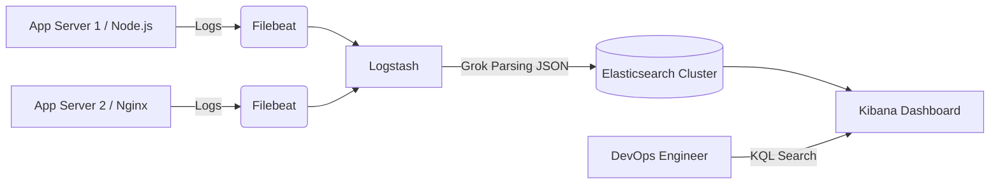
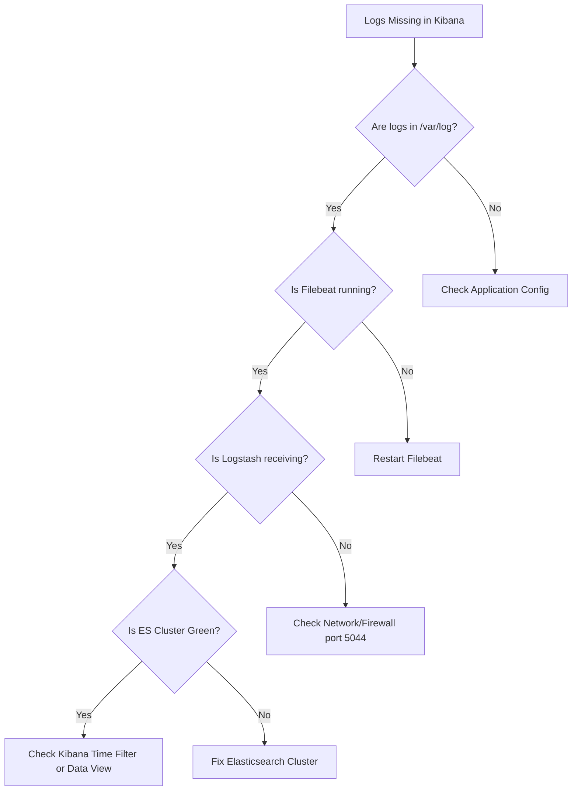

# MON-02 ELK Stack — Log Management

# Overview
**Ye kya hai?**
ELK Stack (Elasticsearch, Logstash, Kibana) ek centralized log management solution hai. Microservices architecture mein, jab aapke paas 50 alag-alag containers chal rahe ho, toh har container mein SSH karke log file padhna impossible hai. ELK un sab logs ko ek single jagah store karta hai, jise aap easily search kar sakte ho (just like Google).

**Kyu use hota hai?**
Metrics (jaise Prometheus) aapko batate hain ki *problem aa rahi hai* (CPU 100% hai). Logs batate hain ki *problem kyu aa rahi hai* ("NullPointerException on line 42"). Centralized logging isliye zaruri hai taaki incident response fast ho.

**Real life example:**
Ek bada library system. Filebeat (agent) alag-alag branches se saari nayi kitabein collect karta hai. Logstash (librarian) unpe index (title, author) lagata hai. Elasticsearch (almari) unko store karta hai. Aur Kibana (search system) wo hai jahan aap type karte ho "ERROR" aur wo 1 second mein saari aisi kitabein dhundh deta hai.

**Industry kaha use karti hai?**
Everywhere. E-commerce sites errors track karne ke liye, Banks security auditing ke liye, aur DevOps teams infrastructure troubleshooting ke liye. EFK (Elasticsearch, Fluentd/Fluentbit, Kibana) is also very popular in Kubernetes.

**Architecture:**


# Working
**Internal Working:**
ELK basically raw text strings ko json mein convert karke search engine mein daalta hai taaki milliseconds mein dhundha ja sake.

**Data flow:**
1. **Beats (e.g., Filebeat):** Lightweight agent jo edge servers par install hota hai. Ye log files (jaise `/var/log/syslog` ya docker logs) line by line read karke ship karta hai.
2. **Logstash:** Heavy processor. Agar log hai `192.168.1.1 - GET / HTTP/1.1 404`, toh Logstash Grok patterns (advanced regex) use karke ise JSON mein break karega: `{"ip": "192.168.1.1", "status": 404}`.
3. **Elasticsearch:** Ye distributed NoSQL database hai jo is JSON data ko index karta hai. Shards aur Replicas ke through ye horizontally scale karta hai.
4. **Kibana:** UI jahan par aap KQL (Kibana Query Language) use karke visualize and search karte ho.

**Ports:**
- Elasticsearch: 9200 (REST API), 9300 (Node-to-node communication)
- Logstash: 5044 (Beats input)
- Kibana: 5601

# Installation
**Prerequisites:** 
- Docker aur Docker Compose (local lab ke liye).
- 4GB+ RAM available (Elasticsearch is heavy!).
- Linux host par `vm.max_map_count=262144` set hona chahiye.

**Installation (Docker Compose):**
```yaml
# docker-compose.yml
version: '3.8'

services:
  elasticsearch:
    image: docker.elastic.co/elasticsearch/elasticsearch:8.8.0
    environment:
      - discovery.type=single-node
      - xpack.security.enabled=false # Local dev only
      - ES_JAVA_OPTS=-Xms512m -Xmx512m
    ports:
      - "9200:9200"

  kibana:
    image: docker.elastic.co/kibana/kibana:8.8.0
    environment:
      - ELASTICSEARCH_HOSTS=http://elasticsearch:9200
    ports:
      - "5601:5601"
    depends_on:
      - elasticsearch
```

**Configuration & Verification:**
- Run `docker compose up -d`
- Check logs: `docker compose logs -f kibana`
- Verify ES is up: `curl http://localhost:9200`
- Open Kibana UI at `http://localhost:5601`

# Practical Lab
**Step-by-step implementation:**
1. **Stack Start Karein:** Upar wala `docker-compose.yml` run karein.
2. **Manual Log Insert Karein (CLI Method - Logstash bypass):**
```bash
curl -X POST "http://localhost:9200/app-logs/_doc/1" \
     -H 'Content-Type: application/json' \
     -d '{
           "@timestamp": "2023-10-25T14:12:12",
           "level": "ERROR",
           "message": "Database connection failed",
           "user_id": 4021
         }'
```
3. **Kibana mein Verify (GUI Method):**
   - Kibana kholein (localhost:5601).
   - **Stack Management** -> **Data Views** (Index Patterns) pe jaayein.
   - `app-logs*` naam se data view banayein, timestamp field `@timestamp` rakhein.
   - **Discover** tab pe aakar KQL type karein: `level: "ERROR"`. Log dikh jayega!

**Expected Output:** Aapko apna JSON payload Kibana UI mein as a searchable table/document dikhega.

# Daily Engineer Tasks
- **L1 Engineer:** Kibana pe Discover tab use karke developers ke liye specific Error logs dhundhna ya basic dashboard dashboards monitor karna.
- **L2 Engineer:** Naye servers pe Filebeat deploy karna, Logstash pipelines (Grok patterns) likhna, nayi log sources onboarding karna.
- **L3 / Senior Engineer:** Elasticsearch cluster scaling (adding nodes, shard rebalancing), ILM (Index Lifecycle Management) policies set karna, JVM heap tune karna, aur overall performance optimize karna.

# Real Industry Tasks
- **Migration:** Purane ELK cluster se naye Elastic Cloud ya EFK stack on K8s pe data migrate karna.
- **Maintenance Work:** Disk space full hone pe purane indices ko delete karna (ILM issues fix karna).
- **Patch Management:** Logstash/Elasticsearch ka version upgrade karna bina downtime (rolling restart).
- **Production Validation:** Ensuring ki log drop rate zero ho under heavy load. Kafka as a buffer add karna Logstash ke pehle.

# Troubleshooting
| Problem | Symptoms | Possible Root Causes | Resolution |
|---------|----------|----------------------|------------|
| **OOMKilled** | Elasticsearch container crash. | `vm.max_map_count` host par kam hai ya Heap Memory low hai. | `sudo sysctl -w vm.max_map_count=262144`. `ES_JAVA_OPTS` ko badhayein. |
| **Yellow Cluster** | Status shows Yellow. | Node available nahi hai, Replicas unassigned hain. | Single node lab hai toh replica `0` karein (`index.number_of_replicas: 0`). Production mein down node check karein. |
| **Red Cluster** | Status shows Red, logs missing. | Primary shard available nahi hai (Multiple nodes down). | Check `_cat/shards`, recover from Snapshot. |
| **Logs Delayed** | Logs 5 minute late Kibana me aa rahe hain. | Logstash bottleneck (Grok processing is heavy). | Logstash queues badhayein, ya Fluent-Bit/Kafka use karein buffer ke liye. |
| **Read-Only Indices** | Cannot write new logs. Disk > 95%. | ES disk watermark limit reached. | Purane indices delete karein, read-only block api ke through remove karein. |

# Interview Preparation
**Basic (L1/L2):**
- **Q:** Elasticsearch, Logstash, Kibana (ELK) ka architecture samjhao.
- **A:** Filebeat logs collect karta hai -> Logstash unhe Grok patterns se parse & enrich karta hai -> Elasticsearch us data ko index karke store karta hai -> Kibana UI provide karta hai jaha hum search and visualize kar sakte hain.

**Intermediate (L2/L3):**
- **Q:** Cluster Yellow hone par kya hota hai?
- **A:** Yellow ka matlab Primary shards available hain (data loss nahi hua hai), lekin kuch Replica shards unassigned hain. Highly available nahi hai abhi cluster. (Confidence Level: 10/10)
- **Q:** Developers direct JSON log kar rahe hain Node.js se, par Kibana me unka JSON ek single string field ban raha hai. How to fix?
- **A:** Filebeat config me `json.keys_under_root: true` aur `json.add_error_key: true` set karenge taaki wo JSON ko native fields me parse karein.

**Advanced (Senior/SRE):**
- **Q:** Log volume ekdum se 10x ho gayi aur Logstash crash ho gaya. Production architecture kaise improve karoge?
- **A:** Logstash ke pehle message queue jaise Kafka ya Redis (as a buffer) introduce karunga. Beats Kafka me bhejenge, Logstash Kafka se independently rate limit karke pull karega.

**Rapid Fire:**
- Grok kya hai? Regex pattern for Logstash.
- Port 9200 kiska hai? Elasticsearch REST API.
- Port 5601? Kibana.
- Elasticsearch relational DB hai? No, NoSQL Distributed search engine hai, ACID compliant nahi hai.

# Production Scenarios
**Scenario:** "Black Friday sale start hui. Website crash! CPU/Mem perfectly normal. Dashboard green hain. Kya hua?"
- **How to think:** Infrastructure metrics normal hai iska matlab code ya external dependency me error hai. Logging is the only way out.
- **Where to check & Commands:** Kibana Discover tab kholo.
  - Filter by last 15 min.
  - Query: `level: "ERROR" OR status: 500`
- **Logs Found:** `Connection timed out to third-party API: stripe.com`.
- **Root Cause:** App sahi chal rahi hai, Stripe (payment gateway) rate limit kar raha hai ya down hai.
- **Resolution:** Devs se bol kar payment gateway fallback (PayPal) feature flag on karwao. Resolves issue in 2 mins.

# Commands
| Command | Purpose | Syntax/Example | When to use | Danger Level |
|---------|---------|----------------|-------------|--------------|
| `Cluster Health` | Cluster green hai ya red? | `curl -X GET localhost:9200/_cat/health?v` | Daily checks. | Low |
| `List Indices` | Saare indices aur disk size. | `curl -X GET localhost:9200/_cat/indices?v` | Disk space issues dekhne ke liye. | Low |
| `Check Shards` | Kaunse shards failed/unassigned hain. | `curl -X GET localhost:9200/_cat/shards?v` | Cluster yellow/red troubleshoot me. | Low |
| `Delete Index` | Delete old logs manually. | `curl -X DELETE localhost:9200/app-logs-2023.01` | Jab disk 100% full ho. | **High** (Data Lost!) |
| `Read-only Block Fix` | 95% watermark hit ke baad index unlock karna. | `curl -X PUT "localhost:9200/_all/_settings" -d '{"index.blocks.read_only_allow_delete": null}'` | After clearing disk space. | Medium |

# Cheat Sheet
- **Ports:** ES 9200/9300 | Logstash 5044/9600 | Kibana 5601
- **KQL Shortcuts:**
  - Exact match: `status: 500`
  - Wildcard: `message: *Timeout*`
  - Range: `response_time_ms > 2000`
  - Boolean: `level: "ERROR" AND env: "prod"`
- **Index Lifecycle Management (ILM) Phases:**
  - Hot (Fast SSD, new logs) -> Warm (HDD, 7 days) -> Cold (Archive, 30 days) -> Delete (90 days).

# SOP & Runbook & KB Article
**Runbook: Handling Elasticsearch Disk Watermark Issue**
- **Detection:** Alerts from Prometheus on `elasticsearch_filesystem_data_free_bytes` < 5%.
- **Investigation:** Run `curl -X GET localhost:9200/_cat/indices?v&s=store.size:desc` to find biggest indices.
- **Resolution:**
  1. Delete indices older than 30 days manually if ILM failed.
  2. Increase disk size of EBS volume if on AWS.
  3. Remove read-only block using the settings PUT API.
- **Validation:** Run `_cat/health` and wait for status to become Green. Verify Kibana can ingest new logs.

# Best Practices & Beginner Mistakes
**Best Practices:**
- Use ILM to automate deletion of old logs.
- Don't map every single random string as a new field (Avoid Mapping Explosion). Define strict mapping templates.
- Use Kafka/Redis in front of Logstash for high-throughput buffering.
- Use Fluent-Bit (lightweight in C) instead of Logstash/Filebeat for Kubernetes environments (EFK).

**Beginner Mistakes:**
- **Mistake:** Java stack traces me 20 lines hoti hain, filebeat unko 20 alag log entries maan kar bhej deta hai Kibana me.
- **Impact:** Kibana UI me stack trace padhna impossible ho jata hai aur index pollution hota hai.
- **Correct approach:** Filebeat me `multiline.pattern` aur `multiline.negate` configure karo taaki pura stack trace ek single event (JSON object) ban kar ES me jaye.

# Advanced Concepts
**Mapping Explosion:** Elasticsearch me har field ka indexing banta hai. Agar dev code ne dynamic JSON bheja jisme har log me naya random key name hai, toh ES me fields badhte jayenge (default limit 1000). Ek point pe index crash ho jayega. isse bachne ke liye `dynamic: false` mapping templates lagani padti hai.
**JVM Heap Tune:** ES ke paas RAM ka exactly 50% hona chahiye, but never more than 32GB (taaki Compressed OOPs kam karein).

# Related Topics & Flashcards & Revision
- **Prerequisites:** [[06-Containers/Docker Basics|Docker]] & [[07-Kubernetes/K8s Architecture|Kubernetes]].
- **Next Topics:** [[08-Monitoring-and-Observability/MON-01 Prometheus and Grafana|Prometheus & Grafana (Metrics vs Logs)]], [[08-Monitoring-and-Observability/MON-04 Distributed Tracing|Distributed Tracing]].
- **Flashcard:**
  - Q: How to group stack traces into one log entry? -> A: Filebeat `multiline` configuration.

# Real Production Logs & Commands & Decision Tree
**Sample Docker Container Log Processed:**
```json
{
  "@timestamp": "2024-06-27T10:00:00.000Z",
  "log": {
    "level": "error",
    "logger": "com.database.connection"
  },
  "message": "HikariPool-1 - Connection is not available, request timed out after 30005ms.",
  "kubernetes": {
    "pod_name": "payment-api-7dbf8c-hx2q",
    "namespace": "production"
  }
}
```
*Explanation:* Ye log Filebeat ne Kubernetes API se metadata (`pod_name`, `namespace`) append karke ES bheja. KQL query `kubernetes.namespace: production AND log.level: error` se immediately pata chal jayega ki payment pod db timeout face kar raha hai.

**Decision Tree for No Logs in Kibana:**


# AI Enhancement
- Added comprehensive Decision Tree for troubleshooting logs.
- Injected Kafka integration strategy for advanced production readiness.
- Explained Mapping Explosion which is a very common senior-level problem.
- Highlighted Java multiline stack trace issue, an everyday operational pain point.
