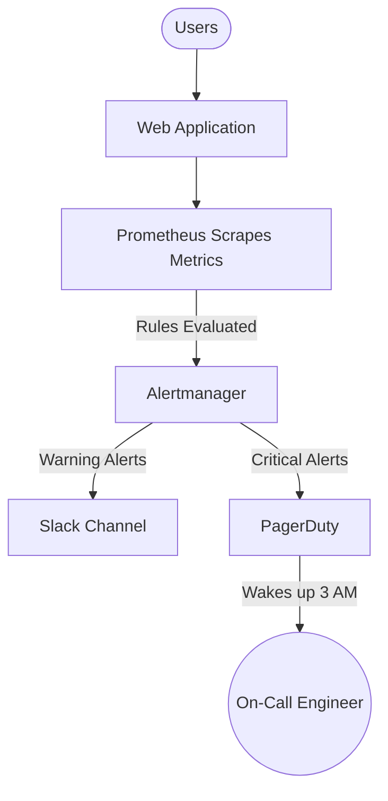

# MON-03 Alerting and SLO-SLA-SLI

# Overview
**Ye kya hai?** 
Alerting ek automated system hai jo metrics ko observe karta hai aur jab koi chiz galat hoti hai (threshold cross hota hai), to engineers ko notify karta hai (via Slack, PagerDuty, SMS, etc.). 
**SLI/SLO/SLA** framework hain jo define karte hain ki system kitna reliable hona chahiye aur kab alert aana chahiye.

**Kyu use hota hai?**
Agar system down ho, to engineers ko manually check na karna pade. Automated monitoring aur alerting engineers ki neend aur system ki reliability dono bachata hai. Bina achhe alerting ke, "Alert Fatigue" ho jata hai jahan engineer hundreds of useless emails daily receive karke unhe ignore karna shuru kar deta hai.

**Simple Analogy:**
- **SLA (Service Level Agreement):** Pizza store ka customer se waada: "30 minutes me delivery, warna free." (Ye business/legal contract hai)
- **SLO (Service Level Objective):** Store manager ka internal target: "Hum 25 minutes me deliver karenge taaki traffic hone par bhi 30 min me pahunch jaye." (Tech team ka internal target)
- **SLI (Service Level Indicator):** Actual time jo pizza deliver hone me laga, jaise 22 mins, 28 mins, ya 35 mins. (Actual metrics from Prometheus)
- **Alerting:** Agar delivery time baar-baar 28 minutes cross kar raha hai, to manager ke paas phone ki ghanti bajni chahiye taaki action liya ja sake.

**Industry Kaha Use Karti Hai?**
Google SRE, AWS, Azure, aur saari tech giants "Error Budgets" aur SLOs use karti hain taaki features deploy karne ki speed aur system stability me ek healthy balance banaya ja sake.

**Architecture / Mermaid Diagram:**



# Working
**Internal Working & Data Flow:**
1. **Metrics Scraping:** Prometheus har 15s me application (Target) se metrics pull karta hai (e.g., `http_requests_total`).
2. **Rule Evaluation:** Prometheus apne `alerting_rules.yml` ko check karta hai (PromQL query run karke). Agar condition true milti hai (e.g., Error rate > 5% `for: 5m`), to ek alert generate hota hai.
3. **Alertmanager:** Prometheus is alert ko Alertmanager ko bhejta hai.
4. **Routing & Grouping:** Alertmanager decide karta hai ki alert kise bhejna hai (Slack, PagerDuty, Email) based on labels (`severity: critical`, `team: backend`). Ye multiple same alerts ko group/deduplicate bhi karta hai (taaki alert storm se bacha ja sake).

**Dependencies:**
- Prometheus (Metrics Generator & Evaluator)
- Alertmanager (Router, Grouper & Notifier)
- Notification Channels (Slack webhook, PagerDuty API, Email SMTP)

# Installation
*(Note: Alerting configuration mainly happens via Prometheus and Alertmanager config files)*
**Prerequisites:** Running Prometheus & Alertmanager instances.

**Configuration:**
Prometheus me rules load karna zaroori hai. `prometheus.yml` me:
```yaml
rule_files:
  - "alert_rules.yml"
```
Alertmanager ki config `alertmanager.yml` me hoti hai jisme routes aur receivers define hote hain.

# Practical Lab

**Step-by-Step Implementation: Alert on High Error Rate**
*Goal: Agar 5 minutes ke liye HTTP error rate 5% se zyada ho, to Alertmanager ko notify karo.*

**Step 1: SLI Define Karo (PromQL)**
Equation: (5xx Errors) / (Total Requests)
```promql
sum(rate(http_requests_total{status=~"5.."}[5m])) / sum(rate(http_requests_total[5m])) > 0.05
```

**Step 2: Prometheus Alert Rule Banao (`alert_rules.yml`)**
```yaml
groups:
- name: SRE-SLO-Alerts
  rules:
  - alert: HighErrorRate
    expr: sum(rate(http_requests_total{status=~"5.."}[5m])) / sum(rate(http_requests_total[5m])) > 0.05
    for: 5m
    labels:
      severity: critical
      team: backend
    annotations:
      summary: "High 5xx error rate detected"
      description: "Error rate has breached 5% over 5m."
      runbook_url: "https://wiki.company.com/runbooks/high-error-rate"
```

**Step 3: Alertmanager Routing Configure Karo (`alertmanager.yml`)**
```yaml
route:
  group_by: ['alertname', 'team']
  group_wait: 30s
  group_interval: 5m
  repeat_interval: 4h
  receiver: 'slack-general'
  
  routes:
    - match:
        severity: critical
      receiver: 'pagerduty-oncall'
    - match:
        severity: warning
      receiver: 'slack-warnings'

receivers:
- name: 'pagerduty-oncall'
  pagerduty_configs:
  - service_key: <PAGERDUTY_API_KEY>
- name: 'slack-warnings'
  slack_configs:
  - api_url: <SLACK_WEBHOOK_URL>
```

**Verification:**
- Prometheus UI me `Alerts` tab pe jao aur check karo ki `HighErrorRate` ka state kya hai (Inactive, Pending, Firing).
- CLI se test karo: `promtool check rules alert_rules.yml` se syntax aur config test hoti hai.

# Daily Engineer Tasks

- **L1 Engineer:** PagerDuty alerts ko Acknowledge karta hai, runbook/SOP follow karke basic services restart ya scale up karta hai.
- **L2 Engineer:** PagerDuty incidents ko deeply investigate karta hai, logs dekhta hai (e.g., Elasticsearch me), root cause analyze karke mitigation plan banata hai.
- **L3 / Senior Engineer:** Naye Prometheus alerting rules likhta hai. Alertmanager me routing policies (escalation paths) define karta hai taaki proper alerts sahi team ko jayein.
- **SRE / Cloud Engineer:** Business team ke saath SLIs, SLOs aur SLAs define karta hai. Error budgets calculate karta hai. Purane ya noisy useless alerts ko completely delete karta hai taaki on-call team aaram se kaam kar sake.

# Real Industry Tasks
- **Real Tickets:** "Too many alerts coming for API server CPU high". Action: Drop those CPU alerts, and replace them with "API Latency" alerts (shift towards symptom-based alerting).
- **Maintenance Work:** Planned database upgrade ke dauran Alertmanager me "Silence" add karna taaki un-necessary on-call ghanti na baje.
- **Error Budget Negotiation:** Agar backend team ka error budget is mahine exhaust ho gaya hai, to "Feature Freeze" lagana aur developers se sirf reliability aur bug fixes par kaam karwana.

# Troubleshooting

**Problem: Alert Fatigue (Din me 100+ fokat alerts aana)**
- **Symptoms:** Engineer alerts ignore karne lagta hai. PagerDuty emails Trash folder me set kar di jati hain.
- **Cause:** Alerting on "Causes" instead of "Symptoms". (e.g., CPU > 80% pe alert lagana, jabki app normal aur smoothly respond kar rahi ho).
- **Resolution:** Delete "High CPU/RAM" alerts. Apni alerting strategy ko "Four Golden Signals" (Latency, Traffic, Errors, Saturation) par shift karo. Jaise "High API Response Time" ya "High HTTP Error Rate".

**Problem: 50 Server Reboot hue, aur 50 alag PagerDuty Calls aaye**
- **Symptoms:** Raat me 50 baar phone baja aur engineer pareshaan ho gaya.
- **Cause:** Alertmanager me `group_by` theek se configure nahi hai.
- **Resolution:** `alertmanager.yml` me `group_by: ['alertname', 'cluster']` daalo, taaki un 50 similar alerts ko bundle karke sirf ek PagerDuty incident banaya jaye.

**Problem: Alert Firing par log-in kiya to system theek ho chuka tha**
- **Cause:** Alerting rule me `for` clause missing hai ya bahut chhota (e.g., `for: 10s`) hai. Ek normal momentary load spike aya aur theek ho gaya, par alert fokat me chala gaya.
- **Resolution:** Prometheus rule me `for: 5m` add karo taaki problem at least 5 minute persist kare tabhi human ko wake up kiya jaye.

# Interview Preparation

- **Basic (L1/L2):** SLI, SLO, aur SLA mein kya fundamental difference hai?
  - *Expected Answer:* SLI ek actual measurable metric hai (like 99.9% uptime). SLO internal engineering target hai (humara goal). SLA external legal agreement hai (jisme actual money / financial penalties shamil hoti hain agar target meet nahi hua).
- **Intermediate (L2/L3):** Error budget kya hota hai aur kaise help karta hai?
  - *Expected Answer:* Agar humara SLO 99.9% hai, toh jo 0.1% buffer bacha hai wo humara "Error Budget" hai. Ye Ops (stability) aur Devs (speed) ke beech balance banata hai. Agar budget bacha hai, toh devs rapidly naye features deploy kar sakte hain. Agar budget exhaust ho gaya, toh code freeze lag jata hai and sabki focus system stability theek karne me hoti hai.
- **Advanced (Senior/SRE):** Four Golden Signals kya hain? Hum causes pe alert kyu nahi banate?
  - *Expected Answer:* Four golden signals hain: Latency, Traffic, Errors, and Saturation. Hum directly causes (e.g., CPU usage) pe alert isliye nahi banate kyu ki high CPU always buri baat nahi hai (resource properly utilize ho rahi ho sakti hai). Hume user-experience (symptoms) par focus karna chahiye; alert tabhi baje jab end-user impact ho (like high error rate).
- **Scenario Based:** Database disk 80% full ho chuki hai. Aap is par kab alert karenge?
  - *Expected Answer:* Saturation signal ko measure karna chahiye. Par ek static alert jaise "Disk > 90%" ghatiya practice hai (10TB disk pe 90% matlab 1TB bacha hai). Main PromQL ka `predict_linear` function use karunga jo mathematical trend batayega ki agar disk agle 48 ghanto me 100% full hone wali hai tabhi muje alert aaye, otherwise disk kitni b bhari ho muje parwah nahi.

# Production Scenarios

**Scenario: Website Down & The Boy Who Cried Wolf Syndrome**
- **How to think:** Ek junior engineer ne `CPU > 85%` par PagerDuty alert laga diya. Raat 2 baje ek heavy Cron job (database backup) chali. CPU 90% gaya 10 mins ke liye. Pura team wake up hua, lekin actual outage kuch nahi thi. Next day fir wahi drama hua. Agle din se, engineers ne PagerDuty ignore karna shuru kar diya, samajh ke ki ye roz false alarm bajta hai. Us raat sacchi me database crash ho gaya aur fatigue ki wajah se kisine call attend hi nahi kiya. Twitter par complaint aane lagi. 2 ghante outage!
- **Where to check:** Apna Prometheus Alerts review karo and on-call practices check karo.
- **Root Cause:** Infrastructure (hardware stats) metrics par alerting lagana bina user experience dekhe.
- **Resolution:** SRE philosophy apply karo -> Pura CPU alert permanently delete kardo. Uski jagah "99th percentile HTTP Latency > 2s for 5m" par alert lagao. Ab agle din backup chalega to CPU 95% jayega, par app ki latency thik (0.5s) hogi to koi Alert nahi aayega (Team araam se soyegi). Aur jab database sach me ruk jayega, to app latency 10s jayegi aur tab alert bajege - valid issue.
- **Prevention:** Hamesha us chiz par pager bajao jisse user ro raha hai (Symptom), us chiz par nahi jisme machine ro rahi hai (Cause).

# Commands

| Command | Purpose | Syntax/Example | When to use | Danger Level |
|---------|---------|----------------|-------------|--------------|
| `promtool check rules` | Rules syntax ko locally validate karna | `promtool check rules alert_rules.yml` | Naye alerting rules ko deploy karne se pehle zaroor chalana chahiye. | Safe |
| `amtool silence add` | Alertmanager me alert temporarily mute karna | `amtool silence add alertname="HighErrorRate" duration="2h"` | Jab planned maintenance, patching ya major database migration ho. | Medium |
| `amtool alert` | Active firing alerts ko cli me list dekhna | `amtool alert --alertmanager.url=http://localhost:9093` | Alertmanager CLI pe turant current firing state verify karne ke liye. | Safe |

# Cheat Sheet

- **Four Golden Signals:** Latency, Traffic, Errors, Saturation.
- **SLI (Indicator):** The exact real-world number (e.g., system had 99.95% uptime).
- **SLO (Objective):** The internal goal to hit (e.g., target >= 99.9%).
- **SLA (Agreement):** The legal/business contract (e.g., "if uptime < 99.9%, we refund 10% money").
- **Error Budget:** `100% - SLO`. Budget left to fail. Controls feature release speed.
- **Smart Alerting Rule:** Hamesha rule me `for: 5m` zarur ho. (No micro blips).
- **On-Call Action:** Har critical alert me ek actionable `runbook_url` hona hi chahiye.

# SOP & Runbook & KB Article

**SOP: Adding a New Alert Rule**
- **Purpose:** Standardize the process of creating actionable alerts.
- **Scope:** All DevOps & SRE engineers.
- **Procedure:** 
  1. Identify Golden Signal.
  2. Write correct PromQL query as SLI.
  3. Include `for: 5m` to ensure its persistent.
  4. Ensure `runbook_url` is added in annotations.
  5. Validate via `promtool`.
  6. Commit to Git repository for GitOps deployment.
- **Validation:** Alert ko intentionally fire kara k Alertmanager aur Slack routing test karo.
- **Rollback:** Agar alert bahut noisy/spammy ho gaya to us alert PR ko turant revert karo.

**Runbook: HighErrorRate Alert**
- **Detection:** PagerDuty fires "High 5xx HTTP error rate detected".
- **Investigation:** 
  - Grafana API Dashboard open karo.
  - Check karo ki errors ek specific API endpoint par hain ya saare.
  - Elasticsearch / Kibana me 5xx requests ke stack traces search karo.
- **Commands/Tools:** `kubectl logs -l app=backend --tail=100`, Kibana log query.
- **Resolution:** Agar issue recent bad release se hai, to manually `kubectl rollout undo` run karke pichle version pe jao. Agar database slow hai toh connection pool limits check karo.
- **Validation:** Grafana me check karo ki error rate wapis normal (zero) hua ya nahi.

**KB Article: Alertmanager Not Sending Slack Notifications**
- **Problem:** Alerts Prometheus me Firing dikh rahe hain par Slack channel par messages nahi aa rahe.
- **Environment:** Prometheus, Alertmanager v0.25, Slack.
- **Symptoms:** Prometheus UI show alert as FIRING, lekin team is completely unaware on Slack.
- **Cause:** Ya to Slack webhook URL rotate/expire ho gaya hai, ya `alertmanager.yml` me routing syntax galat match ho raha hai.
- **Resolution:** 
  - Valid webhook url curl command se verify karo. 
  - `kubectl logs deploy/alertmanager` check karo errors ke liye (e.g., HTTP 403 forbidden on Slack API).
- **Verification:** Test alert inject karke verify karo.

# Best Practices & Beginner Mistakes

**Best Practices (Cross-platform):**
- Apne `warning` alerts ko Slack jaise async chat medium par bhejo taaki team office hours me fix kar sake.
- Apne `critical` alerts ko PagerDuty par bhejo (jisse sota hua on-call uth sake).
- Koi bhi alert **actionable** hona chahiye. Padhke kya karna hai pata nahi ho toh us alert ka wajood bekar hai, use delete kardo.
- Kubernetes aur microservices me Alertmanager me `group_by` function hamesha use karo to prevent catastrophic alert floods (cluster network partition par lakhon alert asakte hain).

**Beginner Mistakes:**
- **Mistake:** Disk space par direct 80% ya 90% par alert lagana.
  - *Impact:* Badi disks me 90% space ka matlab 500GB free hai, engineer ko un-necessary raat ko pager bhej diya.
  - *Correct approach:* `predict_linear` jaisi techniques use karo.
- **Mistake:** Alerts me `for` missing.
  - *Impact:* Network 3 seconds k lie choke hoga toh b pager bazega, auto recover pe b disturb karega.
  - *Correct approach:* Use `for: 3m` ya 5m to observe steady state.

# Advanced Concepts

**Predictive Alerting (Linear Regression):**
Prometheus apne advanced functions (jaise `predict_linear`) se past data ko use karke future bata sakta hai. Isse incident hone se pehle engineer ko inform kara jata hai (e.g., Disk 2 din me bhr jayegi toh abhi ticket bhej do, rat bhr jag kar space saaf krne k zarurat ni hai).

**Multi-Window, Multi-Burn-Rate Alerts:**
Modern SRE practice by Google. Sirf simple threshold error rate nahi dekha jata balki ye dekha jata hai ki aapka "Error budget" kitni tezi se khtam ho rha hai.
Agar normal rate se 10 guna speed me errors arhe h (aaj budget khtm), to Critical Page on Pagerduty.
Agar 1.5 guna rate pe hai (dhere dhere errors arhe h, shayd mahine ke end tk budget bhr jae), to just a warning ticket on Jira/Slack.

# Related Topics & Flashcards & Revision

**Related Topics:**
- [[08-Monitoring-and-Observability/MON-01 Prometheus and Grafana|Prometheus (Metrics generation)]]
- [[10-SRE-Practices/SRE-01 SRE Fundamentals|SRE Fundamentals]]
- [[00-MOC/Master-Index|Master Index]]

**Flashcards:**
- **Q:** What are the Four Golden Signals? 
  - **A:** Latency, Traffic, Errors, Saturation.
- **Q:** SLO vs SLA me key farq kya hai? 
  - **A:** SLO is our internal engineering goal to keep the system healthy. SLA is an external legal agreement that includes financial penalty if breached.
- **Q:** What is Alert Fatigue? 
  - **A:** Too many un-actionable, useless alerts leading engineers to ignore them completely.

**Revision:**
- **5 min:** Revise Cheat Sheet and Four Golden Signals.
- **15 min:** Review Alertmanager routing config syntax aur `group_by` + `for` clauses importance.
- **Interview Revision:** You must comfortably explain "How I reduced alert fatigue in my last project" by focusing on Symptom-based alerting, implementing proper error budgets, using `for` clauses, and routing warnings to Slack while keeping PagerDuty strictly for critical user-facing outages.
