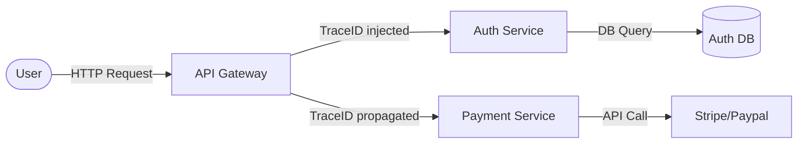

# Overview
Distributed Tracing, observability ke 3 pillars (Metrics, Logs, Traces) me se ek hai. Monolithic application me debugging asaan hoti hai, log file top se bottom padho aur issue mil jata hai. Lekin modern Microservices me ek request multiple services (API Gateway -> Auth -> Inventory -> DB) se hoke guzarti hai. Agar request slow hai (maan lo 10 seconds lag gaye), toh kis service me bottleneck tha? Distributed tracing iss request ka pura lifecycle map karta hai taaki aapko exact milliseconds me bottleneck pata chal sake.

**Real life example:** Jab aap Swiggy/Zomato se order karte ho, toh GPS se track karte ho ki order kahan hai. Tracing bhi waisa hi hai, har request pe ek 'GPS tag' (Trace ID) lag jata hai jo backend me har microservice cross karte waqt time and location note karta hai.

**Mermaid Diagram: Architecture**


# Working
Distributed Tracing internal data flow kaise manage karta hai?

1. **Trace ID:** Har ek nayi user request ko ek globally unique `Trace ID` milti hai. Ye ID pure lifecycle me same rehti hai.
2. **Span ID:** Trace ke andar har step ya operation (jaise DB query, external API call) ko ek `Span` kehte hain aur isko `Span ID` assign hoti hai. Har Span me Start Time, End Time aur Parent Span ID hoti hai taaki ek tree structure ban sake.
3. **Context Propagation:** HTTP headers (e.g., W3C `traceparent`) ke through ek service se dusri service me Trace ID paas hoti hai.
4. **OpenTelemetry (OTel):** Pehle sabke apne SDKs hote the (Jaeger, Zipkin). Ab OpenTelemetry standard ban gaya hai. OTel Collector traces receive karta hai, process karta hai, aur Jaeger/Tempo jaise backend me export karta hai.

# Installation
Hum ek simple OpenTelemetry Collector aur Jaeger All-in-One image install karenge using Docker Compose.

**Prerequisites:** Docker & Docker Compose installed.

**Installation Steps:**
Create `docker-compose.yml`:
```yaml
version: '3'
services:
  jaeger:
    image: jaegertracing/all-in-one:latest
    ports:
      - "16686:16686" # UI
      - "4317:4317"   # OTLP gRPC receiver
      - "4318:4318"   # OTLP HTTP receiver
```

**Verification:**
Run `docker-compose up -d`. Open Browser `http://localhost:16686`. Jaeger UI load hona chahiye.

# Practical Lab
Chalo Node.js app ko trace karte hain using Auto-instrumentation. Zero code changes required!

**CLI Method:**
```bash
# 1. Install OTel packages
npm install @opentelemetry/api @opentelemetry/auto-instrumentations-node

# 2. Run your Node app with auto-instrumentation
export OTEL_EXPORTER_OTLP_ENDPOINT="http://localhost:4317"
export OTEL_SERVICE_NAME="frontend-payment-api"
node --require @opentelemetry/auto-instrumentations-node server.js
```

**Expected Output:** 
Jab aapki API hit hogi, backend (Jaeger) me spans automatically generate aur export honge. Jaeger UI me jake aap `frontend-payment-api` select karke Gantt chart/waterfall trace dekh sakte ho.

# Daily Engineer Tasks
- **L1/L2 Engineer:** Jaeger/Tempo UI check karke pata lagana ki konsa microservice error (e.g., 500) throw kar raha hai, aur concern team ko ticket assign karna.
- **L3/Senior Engineer:** OpenTelemetry Collector ko Kubernetes me deploy karna, backend storage (Elasticsearch/S3) scaling manage karna, aur missing DB query spans ko debug karna.
- **Production/SRE:** W3C TraceContext standards implement karwana cross-functional polyglot teams (Java/Go/Node) me. Sampling strategies design karna taaki cost bache.

# Real Industry Tasks
- **Migration:** Datadog agent se OpenTelemetry me migrate karna taaki vendor lock-in khatam ho.
- **Maintenance:** Elasticsearch index lifecycle management (ILM) configure karna taaki old traces automatically delete ho jaye aur storage bache.
- **Integration:** Logs me Trace ID inject karna (MDC in Java, Winston in Node) taaki Kibana/Loki me jab bhi koi error dekhein, waha Trace ID dikhe, jisse easily Jaeger me trace track ho sake.

# Troubleshooting
- **Symptom:** Traces are broken or UI shows multiple disconnected pieces.
  - **Root Cause:** Context Propagation fail ho gaya hai. Ek service dusri service ko HTTP headers pass nahi kar rahi.
  - **Resolution:** Developers ko verify karne bolo ki W3C headers properly propagate ho rahe hain. Agar koi API gateway hai beech me, ensure karo wo tracing headers strip na kare.
- **Symptom:** Jaeger UI is empty.
  - **Resolution:** OTel Collector logs check karo. Shayad OTLP endpoint reach nahi ho raha, ya port `4317` blocked hai.
- **Symptom:** High CPU on app servers.
  - **Root Cause:** 100% Trace sampling on hai.
  - **Resolution:** Head-based sampling implement karo (e.g., `OTEL_TRACES_SAMPLER="traceidratio"`, ratio = 0.1 for 10%).

# Interview Preparation
- **Basic (L1/L2):** Tracing kya hai aur Metrics se kaise alag hai?
  - *Answer:* Metrics aapko system health (CPU, Memory) batate hain. Tracing ek request ka pura lifecycle dikhata hai cross multiple microservices taaki hum exact bottleneck identify kar sakein.
- **Intermediate (L2/L3):** Span aur Trace me kya difference hai?
  - *Answer:* Trace ek single end-to-end user request hai. Span trace ke andar ek specific logical block of work hai (like a DB query). Multiple Spans milke ek Trace banate hain.
- **Advanced (Senior/FAANG):** Agar humare paas 100k requests/sec aa rahi hain, toh storage exhaust ho jayegi tracing se. Isko optimize kaise karoge?
  - *Answer:* Hum **Tail-based Sampling** use karenge. Hum sab traces ko pehle Collector ki memory me hold karenge, fir end hone ke baad check karenge. Agar trace me error (HTTP 5xx) aaya hai ya time limit cross (latency) kiya hai, sirf unhi 'interesting' traces ko backend (Jaeger) me push karenge, baaki discard kar denge. Is se 100% bugs capture honge while saving 99% storage cost.

# Production Scenarios
**Scenario: Website slow load ho rahi hai, users complain kar rahe hain.**
- **How to think:** Checkout flow me kaunsi specific API latency de rahi hai? Gateway pe dekho.
- **Investigation:** Jaeger me jake traces check karo jinki duration > 5 seconds hai. Trace ID kholo.
- **Resolution:** Span waterfall me dekha ki `Auth-Service` ne 100ms liya, par uske baad `Inventory-DB` MongoDB query ne 4.5 seconds le liye kyunki index missing tha.
- **Verification:** DB team ne query optimize ki. Dobara Jaeger me naya trace check karo, delay resolve ho jana chahiye.

# Commands
| Command / Syntax | Purpose | When to use |
|------------------|---------|-------------|
| `export OTEL_SERVICE_NAME="my-app"` | App ka naam OTel UI me kya dikhega ye define karta hai | Har auto-instrumented app ke deployment script/YAML me. |
| `OTEL_TRACES_SAMPLER="traceidratio"` | Sampling type define karta hai | Production environment me excessive tracing rokne ke liye. |
| `traceparent: 00-<trace_id>-<span_id>-01`| W3C Trace context HTTP Header payload | Debugging during manual curl trace injections |

# Cheat Sheet
- **Span:** Single task duration (e.g. SQL query).
- **Trace:** Full end-to-end user request (Tree of spans).
- **OpenTelemetry:** Open-source standard for tracing instrumentation.
- **Jaeger/Tempo:** Backends for visualizing traces.
- **Baggage:** Custom Key/Value pair passed along the trace (e.g., `userId=123`).

# SOP & Runbook & KB Article
**SOP: Changing Trace Sampling Rate in Production**
- **Purpose:** Storage bachane ke liye trace count reduce karna.
- **Procedure:** 
  1. Open ConfigMap of OTel Collector.
  2. Modify sampling processor setting (e.g. change 100% to 5%).
  3. Restart/Reload OTel Collector Deployment.
- **Validation:** Check backend (Elasticsearch) ingestion rate drop.
- **Rollback:** Revert ConfigMap to previous values if errors are missed.

# Best Practices & Beginner Mistakes
- **Best Practice:** Logs aur Tracing hamesha connect karo. Har ek log line me Trace ID append honi chahiye taaki Logs se direct Jaeger trace khul sake. OTel provides standard log appenders for this.
- **Best Practice:** Service Mesh (like Istio) tracing automatically enable kar deta hai (layer 7 pe), so if possible, leverage it.
- **Beginner Mistake:** 100% tracing ko production me ON chhod dena bina sampling ke. Isse app overhead badhega aur storage DB turant bhar jayega.

# Advanced Concepts
**Head-based vs Tail-based Sampling**
- **Head-based:** Request start hotey hi random decision banta hai ki trace hoga ya nahi. Simple but misses critical errors of dropped requests.
- **Tail-based:** Pura trace Collector memory me rakha jata hai. Jab request complete ho, tab decision banta hai ki store karna hai ya nahi based on rules (errors, latency). Expensive in RAM for Collector but highly accurate.

# Related Topics & Flashcards & Revision
- **Related Topics:** [[08-Monitoring-and-Observability/MON-01 Prometheus and Grafana]], [[08-Monitoring-and-Observability/MON-02 ELK Stack - Log Management]]
- **Prerequisites:** Microservices Architecture, HTTP Headers.
- **Revision:** 
  - 5 mins: Read Overview and Cheat Sheet.
  - 15 mins: Review Working and Interview Questions.
  - Interview Prep: Focus on Context Propagation and Sampling logic.
