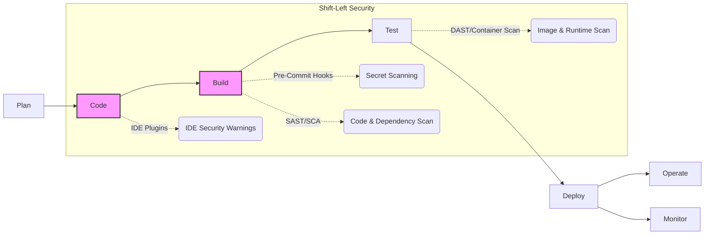
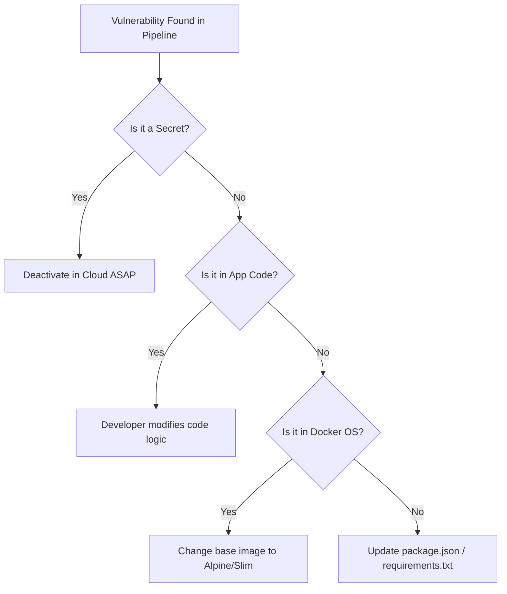

# SEC-01 DevSecOps Fundamentals

## Overview
**Ye kya hai?** DevSecOps (Development, Security, and Operations) ek philosophy hai jahan hum security ko software development lifecycle (SDLC) ke har phase mein integrate karte hain. Pehle security sirf production release ke time check hoti thi (Traditional approach), jisse deployment slow ho jati thi. DevSecOps mein hum security ko left side shift karte hain (Shift-Left), matlab code likhte waqt, build karte waqt, aur deploy karte waqt security checks automatic run hote hain.
**Kyu use hota hai?** Taaki vulnerabilities aur bugs early catch ho jayein. Agar production mein bug mile to fix karna $10,000 lagta hai, par agar developer ke IDE ya CI pipeline mein catch ho jaye to sirf $10 lagta hai.
**Real life example:** Pehle building poori banne ke baad fire-safety inspector aata tha aur kehta tha ki building safe nahi hai, isko todo. Ab DevSecOps mein, fire-safety inspector building banate waqt har ek eent (brick) ko check kar raha hai, taaki baad mein dikkat na aaye.
**Industry kaha use karti hai?** Har FAANG aur modern startup mein, jahan CI/CD pipelines (GitHub Actions/Jenkins) ke andar Trivy, SonarQube, aur TruffleHog jaise tools embedded hote hain.



## Working
**Internal working:** DevSecOps automatically security gates create karta hai CI/CD pipeline mein. Data flow kuch is tarah hota hai:
1. **Pre-commit:** Developer code commit karta hai. `trufflehog` ya `git-secrets` laptop par check karte hain ki koi AWS secret leak to nahi ho raha.
2. **CI Build:** Code GitHub par push hota hai. CI pipeline trigger hoti hai. SonarQube (SAST) source code padhta hai bad logic dhoondhne ke liye.
3. **Containerization:** Docker build hota hai. Trivy (SCA/Container scanning) OS packages aur `package.json` ko scan karta hai CVEs (Common Vulnerabilities and Exposures) ke liye.
4. **Deploy:** Agar koi "CRITICAL" issue milta hai, to pipeline `exit 1` return karti hai aur code deploy nahi hota.

## Installation
*(DevSecOps concept hai, isliye common Trivy scanner ka installation dekhte hain)*
**Prerequisites:** Linux/Ubuntu machine, Docker installed.
**Installation (Trivy on Ubuntu):**
```bash
sudo apt-get install wget apt-transport-https gnupg lsb-release
wget -qO - https://aquasecurity.github.io/trivy-repo/deb/public.key | sudo apt-key add -
echo deb https://aquasecurity.github.io/trivy-repo/deb $(lsb_release -sc) main | sudo tee -a /etc/apt/sources.list.d/trivy.list
sudo apt-get update
sudo apt-get install trivy
```
**Verification:** `trivy --version`

## Practical Lab
**Step-by-step implementation: Adding Trivy to GitHub Actions**
1. Ek basic Dockerfile create karo:
```dockerfile
FROM ubuntu:18.04
RUN echo "Hello World"
```
2. GitHub Repo banakar `.github/workflows/security.yml` create karo:
```yaml
name: CI Security Gate
on: [push]
jobs:
  build-and-scan:
    runs-on: ubuntu-latest
    steps:
      - name: Checkout Code
        uses: actions/checkout@v3
        
      - name: Build Image
        run: docker build -t myapp:latest .
        
      - name: Scan Image with Trivy
        uses: aquasecurity/trivy-action@master
        with:
          image-ref: 'myapp:latest'
          format: 'table'
          exit-code: '1' # Fail pipeline if Critical found
          severity: 'CRITICAL,HIGH'
```
3. Code commit aur push karo.
**Expected Output:** GitHub Actions fail ho jayega kyunki `ubuntu:18.04` mein bahut saare purane vulnerabilities (CVEs) hain.
**Verification:** Pipeline logs mein Trivy ka table dikhega with CVE IDs.

## Daily Engineer Tasks
- **L1 Engineer:** Dashboards monitor karna (SonarQube/Dependency-Track). "LOW" aur "MEDIUM" vulnerabilities ke liye `npm audit fix` chala ke PR raise karna.
- **L2 Engineer:** False positives ko `.trivyignore` ya `.snyk` file mein dalna. Naye repositories mein standard DevSecOps pipeline attach karna.
- **L3 / Senior Engineer:** Core pipeline mein naye scanners (Cosign/Sigstore for image signing) integrate karna. CISO ke saath milkar company-wide security policies define karna.
- **Production/SRE:** Zero-trust architecture implement karna. WAF aur Kubernetes admission controllers likhna.

## Real Industry Tasks
- **Real tickets:** "Fix High vulnerability in microservice-A due to log4j."
- **Real change requests:** "Enforce mandatory TruffleHog scan across all 500 company repos."
- **Migration:** Purane monolithic Jenkins pipeline ko DevSecOps enabled GitHub Actions mein move karna.
- **Patch management:** Har mahine base OS images (e.g., node:14-alpine to node:18-alpine) ko upgrade karna taaki CVEs kam hon.

## Troubleshooting
**Common issues:** 
1. **Pipeline fails constantly on false positives:** 
   - *Symptoms:* Devs chilla rahe hain ki humara code deploy nahi ho raha.
   - *Possible root causes:* Un-tuned security tools failing on everything.
   - *Resolution:* Har SAST/SCA tool mein ignore list hoti hai. Security team se verify karke un CVEs ko `.trivyignore` mein daal do.
2. **Secrets leaked to GitHub despite CI pipeline secret scanning:**
   - *Symptoms:* AWS billing suddenly skyrockets to $50,000.
   - *Root Cause:* GitHub Actions push *ke baad* run hota hai. Jab tak pipeline fail hogi, secret public ho chuka hoga aur bots ne usko copy kar liya hoga.
   - *Resolution:* Pre-commit hooks (`husky` ya `pre-commit`) setup karo dev ke laptop par taaki push command block ho jaye.

## Interview Preparation
- **Basic:** What is DevSecOps and Shift Left? 
  *Expected Answer:* DevSecOps is integrating security at every step of SDLC. Shift Left means moving testing closer to code creation to save cost and time. (Confidence: High)
- **Intermediate:** What's the difference between SAST, DAST, and SCA?
  *Expected Answer:* SAST (Static) scans source code. DAST (Dynamic) attacks running app. SCA scans third-party libraries (e.g., `package.json`) for known CVEs. (Confidence: High)
- **Advanced / Scenario Based:** Developer pushed AWS Secret to public repo. First step?
  *Expected Answer:* IMMEDIATELY deactivate/delete the key in AWS IAM Console. Do NOT waste time deleting the commit or making the repo private because scrapers already copied it. Fix Git history *after* deactivation. (Experience Level: L2/L3)
- **Production:** How do you handle 500 CVEs in an old Docker image?
  *Expected Answer:* Change the base image in Dockerfile. Replace `ubuntu:latest` with `alpine`, `distroless`, or `-slim` versions. This drops CVEs by 90% instantly. (Experience Level: Senior)

## Production Scenarios
**Scenario: "Zero-Day Log4Shell Vulnerability Outbreak"**
- *How to think:* Hamein pata karna hai ki humare 200 microservices mein se kitne log4j use kar rahe hain, directly ya indirectly (transitive).
- *Where to check:* SBOM (Software Bill of Materials) database (e.g., Dependency-Track).
- *Commands / Action:* SBOM tool mein "log4j" search karo. Jo 14 services affected hain unki list nikalo aur unhe patch karo.
- *Root Cause:* Third-party library exploit.
- *Resolution:* Update to patched log4j version in all affected `pom.xml`.
- *Verification:* Re-run syft SBOM generation and ensure no log4j vulnerable version is present.

## Commands
| Command | Purpose | Syntax/Example | Output / When to use |
|---------|---------|----------------|----------------------|
| `npm audit fix` | Fix known Node package vulnerabilities | `npm audit fix` | Updates `package-lock.json`. Use when package CVEs are found. |
| `trivy image` | Scans a Docker image | `trivy image nginx:latest` | Table with CVEs. Use before pushing image to ECR. |
| `trufflehog` | Scans local git repo for secrets | `trufflehog git file://.` | Fails if password found. Run in CI pre-commit. |
| `syft packages` | Generates SBOM | `syft packages myapp:latest` | JSON list of all packages. Use for inventory. |

## Cheat Sheet
- **SAST (Static):** SonarQube, Checkmarx. (Reads Code)
- **SCA (Composition):** Snyk, Trivy. (Reads Dependencies/Packages)
- **DAST (Dynamic):** OWASP ZAP, Burp Suite. (Attacks App)
- **Secret Scanning:** TruffleHog, GitLeaks.
- **IaC Scanning:** Checkov, tfsec (for Terraform misconfigurations).
- **Golden Rule:** Never fail pipeline on Day 1 for "LOW" vulnerabilities. Start with "CRITICAL" only to avoid developer friction.

## SOP & Runbook & KB Article
**SOP: Handling Leaked Credentials in Git**
- **Purpose:** Containment of leaked credentials.
- **Scope:** All GitHub Repositories.
- **Procedure:** 
  1. Deactivate credential in provider (AWS/Azure/DB).
  2. Rotate the credential.
  3. Inform Security Team.
  4. Use `git filter-repo` to remove secret from git history.
  5. Force push (`git push -f`).
- **Validation:** Run Trufflehog again to ensure clean history.
- **Rollback:** Restore from internal secure backup if code goes missing.

## Best Practices & Beginner Mistakes
- **Beginner Mistake:** Running the container as `root` user (`USER root` in Dockerfile).
  - *Impact:* Agar container hack hua to hacker ko host ka root access mil jayega (Container Breakout).
  - *Correct approach:* Always use a non-root user (e.g., `USER appuser`) at the end of the Dockerfile.
- **Best Practice (Security):** Generate and sign SBOMs for every release using Sigstore/Cosign. Supply Chain Attacks (like SolarWinds) ko rokne ka yahi sabse modern tareeka hai.

## Advanced Concepts
**Supply Chain Attacks & SBOM Architecture:** 
Modern applications 90% open-source aur 10% custom code hoti hain. Agar hacker ne `log4j` ya `solarwinds` library ko hack kar liya, to usko use karne wali saari companies hack ho jayengi. Isey "Supply Chain Attack" kehte hain. US Govt ab SBOM (Software Bill of Materials) mandate karti hai taaki har company ke paas exact version list (JSON/XML) ho ki wo kaunsi libraries use kar rahe hain. Ek SBOM essentially ek "ingredients list" hoti hai aapke software ki.

## Related Topics & Flashcards & Revision
- [[00-MOC/Master-Index|Master Index]]
- [[09-Security-DevSecOps/SEC-02 SAST DAST and Container Scanning|Deep Dive: SAST/DAST/SCA]]
- [[05-CI-CD/CICD-01 CI-CD Concepts|CI/CD Concepts]]

**Flashcards:**
- *Q: What scans running application?* -> *A: DAST*
- *Q: What tool checks Terraform for missing encryptions?* -> *A: Checkov or tfsec*

**Revision:** 
- 5 min: Read Cheat Sheet and Mermaid diagrams.
- Interview revision: Read "Interview Preparation" and "Production Scenarios".

## Real Production Logs & Commands & Decision Tree
**Log Example (Trivy Scan Result in CI):**
```
myapp:latest (ubuntu 18.04)
Total: 1 (UNKNOWN: 0, LOW: 0, MEDIUM: 0, HIGH: 0, CRITICAL: 1)
+---------+------------------+----------+-------------------+---------------+
| LIBRARY | VULNERABILITY ID | SEVERITY | INSTALLED VERSION | FIXED VERSION |
+---------+------------------+----------+-------------------+---------------+
| openssl | CVE-2021-3449    | CRITICAL | 1.1.1f-1ubuntu2   | 1.1.1f-1ub..2 |
+---------+------------------+----------+-------------------+---------------+
```
*Explanation:* Pipeline ne `openssl` package mein CRITICAL CVE pakda hai. `exit-code: '1'` ki wajah se pipeline fail ho jayegi. Fix version `1.1.1f-1ub..2` diya gaya hai. Base image (Ubuntu 18.04) update karne ya `apt-get upgrade openssl` chalane se issue resolve ho jayega.

**Troubleshooting Decision Tree:**

