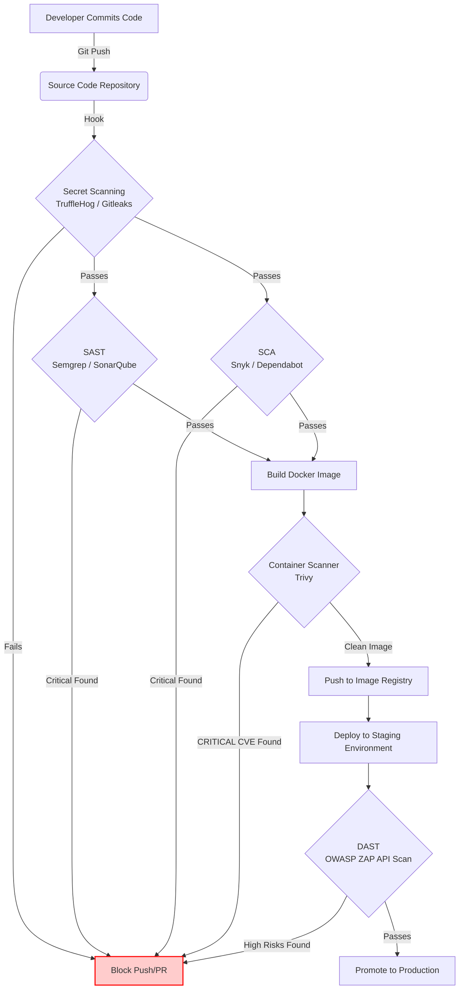

# SEC-02 SAST, DAST, SCA and Container Scanning

# Overview
Ye kya hai? SAST, DAST, SCA, aur Container Scanning automated security tools hain jo aapke source code, third-party dependencies, running applications, aur infrastructure (Docker images) ko scan karke vulnerabilities find karte hain. 
Kyu use hota hai? Pehle security testing development ke end mein hoti thi (Penetration Testing). Ab DevSecOps mein hum "Shift-Left" approach use karte hain, jiska matlab hai security checks ko CI/CD pipeline ke andar daalna taaki issues (e.g. SQL injection, outdated libraries) development phase mein hi turant pakde jayein, before going to production.
Real life example (Analogy): 
- **SAST** ek proofreader hai jo book padh ke dekhta hai ki grammar galat toh nahi hai. 
- **DAST** ek chor (burglar) hai jo bahar se ghar ke darwaze ko dhakka maar ke dekhta hai ki lock mazboot hai ya khula hai. 
- **SCA** ek building inspector hai jo check karta hai ki aapne jo third-party eent (bricks/libraries) use ki hai, unme pehle se koi crack (vulnerability) toh nahi hai.
Industry kaha use karti hai? Har modern software company (FAANG se leke agile startups tak) in tools ko Jenkins, GitLab CI, ya GitHub Actions pipelines mein integrate karti hai taaki vulnerable code ya insecure Docker images automatically block ho jayein aur production tak na pahuchein.

# Working
Internal working and Data flow:
1. **SAST (Static Application Security Testing - White-box)**: Code ko execute kiye bina usko text ya Abstract Syntax Tree (AST) mein convert karke analyze karta hai. Control-flow aur data-flow ko trace karta hai (e.g., checking user input directly going to DB without sanitization).
2. **DAST (Dynamic Application Security Testing - Black-box)**: Running application pe HTTP requests/attacks (like SQL injection payloads, XSS strings) bhejta hai. App running in Staging environment par DAST tool attack karta hai aur application ke response se vulnerabilities identify karta hai.
3. **SCA (Software Composition Analysis)**: Package manifests (`pom.xml`, `package.json`, `requirements.txt`) parse karta hai aur dependencies ko publicly known CVE (Common Vulnerabilities and Exposures) databases (jaise NVD) se compare karta hai.
4. **Container Scanning**: Docker image ki OS layers scan karta hai. Image tarball ko extract karke `/var/lib/dpkg/status` (Debian) ya `/etc/apk` (Alpine) read karta hai aur OS packages (like `apt`, `curl`, `glibc`) mein CVEs find karta hai.

# Installation
Prerequisites: Docker, CI/CD environment (Jenkins/GitHub Actions), aur Linux/Mac OS.
Trivy (Container, SCA & IaC Scanner) Installation:
```bash
# Ubuntu/Debian
wget https://github.com/aquasecurity/trivy/releases/download/v0.44.1/trivy_0.44.1_Linux-64bit.deb
sudo dpkg -i trivy_0.44.1_Linux-64bit.deb
```
Semgrep (SAST) Installation:
```bash
# Python pip required
python3 -m pip install semgrep
```
Verification:
```bash
trivy --version
semgrep --version
```
Rollback: `sudo dpkg -r trivy`, `pip uninstall semgrep`.

# Practical Lab
Step-by-step implementation. CLI Method for DevSecOps pipeline simulation.

Bajaaye CI/CD commands ko manually likhne ke, vault ki `examples/` directory me ek production-ready scanner script available hai:
- Scanner Script: [examples/09-Security/trivy-scan.sh](file:///C:/Users/SPTL/Documents/devops/devops/examples/09-Security/trivy-scan.sh)

**Step 1: Container Scanning with Trivy (Pipeline Gate)**
Hum ek purposely vulnerable image scan karenge taaki security gate usko block kare.
```bash
cd ../../examples/09-Security/
chmod +x trivy-scan.sh

# Run the scan pipeline simulation
./trivy-scan.sh nginx:1.18.0
```
Expected Output: Script CRITICAL vulnerabilities detect karegi jinpe patches available hain. Script `exit code 1` return karegi (Gate Failed), jisse CI pipeline ruk jayegi aur insecure image production me nahi jayegi.

**Step 3: SAST Scanning with Semgrep**
Ek bad code file banayein `app.py`:
```python
import os
def execute_cmd(user_input):
    # DANGEROUS: Command Injection!
    os.system(user_input) 
```
Command:
```bash
semgrep --config "p/default" app.py
```
Expected Output: Semgrep flag karega: `Security Warning: Detected the use of os.system().`

**Step 4: IaC Scanning (Terraform)**
Trivy cloud resources ki misconfigurations (like open S3 buckets) bhi pakad sakta hai.
```bash
echo 'resource "aws_s3_bucket" "b" { bucket = "my-bucket" }' > main.tf
trivy config ./
```
Expected Output: Warnings missing encryption and lack of access logging on the S3 bucket.

# Daily Engineer Tasks
- **L1 Engineer**: Trivy, Semgrep, ya SonarQube ke dashboards check karna. False positives aur real issues ko alag karna, aur appropriate dev teams ke naam par Jira tickets raise karna.
- **L2 Engineer**: GitLab CI, Jenkins, ya GitHub Actions pipelines mein scanners integrate karna. Trivy ko configure karna taaki build tabhi fail ho jab fix available ho (`--ignore-unfixed`).
- **L3 / Senior Engineer**: Security gating rules set karna. Custom Semgrep rules likhna company specific patterns ke liye. Central vulnerability dashboard (e.g., DefectDojo) setup aur maintain karna taaki sab scans ka data ek jagah aaye.
- **DevSecOps / Security Engineer**: Developers ko secure coding sikhana. SBOM (Software Bill of Materials) automate karke generate karna aur zero-day vulnerabilities ke time company ka attack surface jaldi assess karna.

# Real Industry Tasks
- **GitHub PR Security Gates**: Har pull request pe Trivy container scan aur Semgrep SAST trigger karna. Code merge hone se pehle security checks pass hona mandatory (branch protection rules).
- **Base Image Migration**: Docker images mein attack surface kam karne ke liye bulky OS base images (jaise `ubuntu` ya `node:18`) se scratch ya `distroless` (e.g., `gcr.io/distroless/nodejs`) images pe migrate karna.
- **DAST via ZAP in Pipeline**: CI pipeline mein code staging mein deploy hone ke baad OWASP ZAP API baseline scan run karna (takes 2 mins). Full aggressive spider crawl weekends pe chalana taaki pipeline slow na ho.
- **SBOM Generation**: Compliance ke liye `trivy sbom` use karke exact dependency list customers ya security audit team ko DORA metrics/SLAs ke sath provide karna.

# Troubleshooting
| Symptom / Problem | Possible Root Cause | Resolution |
|-------------------|---------------------|------------|
| SAST scanner flags 10,000 issues on first run. | Scanning test files ya third-party vendor folders (`node_modules`, `venv`). | Configure the scanner's ignore file (e.g., `.semgrepignore` or `.sonarignore`) to exclude everything except `src/`. |
| CI Pipeline consistently fails due to "Fix not available" CVEs. | Too strict gating rules. OS maintainers ne patch abhi tak release nahi kiya hai. | Run Trivy with `--ignore-unfixed`. Ye un CVEs ko ignore karega jinka abhi koi patch exist nahi karta, preventing developer frustration. |
| DAST scan takes 4+ hours and times out the CI job. | Full spider crawl mode enabled in CI pipeline. | Pipeline mein ZAP ko "API Baseline Scan" ke liye configure karein ya targeted endpoints pe chalayein. Full crawl raat mein ya weekends pe schedule karein. |
| Trivy fails with "unauthorized" error pulling from ECR/ACR. | Scanner pod or runner doesn't have permissions to pull private image. | Set environment variables `TRIVY_USERNAME` and `TRIVY_PASSWORD`, ya AWS CLI/IAM roles se properly authenticate karein before running `trivy image`. |

# Interview Preparation
**Basic Level**
Q: SAST aur DAST mein main difference kya hai?
*Answer*: SAST (Static) source code read karta hai bina chalaye (white-box). DAST (Dynamic) chalte hue application par network ke through attack karta hai bugs nikaalne ke liye (black-box).

**Intermediate Level**
Q: Trivy scan ne tumhari image mein 50 CRITICAL vulnerabilities dikhayi `wget`, `curl`, aur `bash` mein. Tumhara node app inko use nahi karta. Kaise solve karoge permanently?
*Answer*: Main Dockerfile mein base image change kar dunga. `ubuntu` ya full `node` image ki jagah main `node:alpine` ya distroless (`gcr.io/distroless/nodejs`) use karunga jisme ye OS packages hote hi nahi hain. Surface attack area minimize ho jayega.

**Advanced / FAANG Level**
Q: SARIF kya hai aur DevSecOps pipeline mein kyu zaroori hai?
*Answer*: SARIF (Static Analysis Results Interchange Format) ek standard JSON format hai security tools ki output ke liye. Industry mein hum multiple tools (Trivy, Semgrep, SonarQube) use karte hain. Agar sabka format alag hoga to automation aur reporting mushkil hogi. SARIF use karke hum saara data GitHub Advanced Security ya DefectDojo jaise central dashboards mein bhej sakte hain.

**Scenario Based**
Q: Developer bolta hai ki uski app completely private subnet (VPC) mein hai aur usme internet access nahi hai, isliye SQL Injection (SAST flag) theek karne ki zaroorat nahi. Response?
*Answer*: Security follows "Defense in Depth". Agar network perimeter compromise hua (e.g., kisi employee ke VPN/laptop pe phishing attack) toh attacker directly VPC ke andar aa jayega. Tab internal SQL injection bahot easily data breach kar dega. Perimeter security insecure app code ka excuse nahi hai.

Q: Kya SCA tools (like Snyk/Dependabot) zero-day vulnerabilities (e.g., log4j jis din nikla tha) find kar sakte hain?
*Answer*: No. SCA tools dependencies ko publicly known CVE databases (NVD) se compare karte hain. Zero-day DB mein nahi hoti jab wo first time exploit hoti hai. Isliye zero-day mitigation ke liye WAF, runtime security, aur secure coding practices lagti hain.

# Production Scenarios
**Scenario: Critical Log4j vulnerability announced globally.**
- **How to think**: Pata lagana padega hamare 500 microservices mein se kisne log4j version 2.x use kiya hai. Manual check is impossible.
- **Where to check**: Check centralized SBOM (Software Bill of Materials) database ya SCA tools dashboard (like Snyk).
- **Resolution Steps**:
  1. Identifed affected repositories.
  2. Developers update `pom.xml` ya `gradle.build` mein version to patched release (e.g. 2.15.0).
  3. Commit code -> CI pipeline runs SAST and SCA -> Trivy scan clears the image.
  4. Build green, image deployed to prod.
- **Verification**: Run a manual container scan `trivy image prod-api-service` to confirm CRITICAL count is zero for log4j.

**Scenario: CI Pipeline becomes incredibly slow, Trivy takes 10 minutes to run.**
- **Root Cause**: CI runner ephemeral hai aur har job mein Trivy apna 100MB+ vulnerability database internet se download kar raha hai.
- **Resolution**: Trivy ko "Client/Server mode" mein run karein. Ek dedicated Trivy server pod K8s mein chalayein jo DB ek baar download kare aur cache kare. CI pipelines (clients) us server se queries puchen.

# Commands
| Command | Purpose | When to use |
|---------|---------|-------------|
| `trivy image python:3.9-alpine` | Scans a container image for OS & app CVEs | Build step ke baad CI pipeline mein. |
| `trivy config ./k8s-manifests` | Scans IaC files (Terraform/YAML) for misconfigurations | PR creation ke time infra changes validate karne ke liye. |
| `semgrep --config "p/security-audit" .` | Runs fast open-source SAST scan | Developer laptop ya CI pe code analysis ke liye. |
| `npm audit --production` | Node.js SCA scanner | Package management vulnerabilities check karne ke liye. |
| `checkov -d ./terraform-code` | Deep IaC scanning, specially for AWS/Azure/GCP | Terraform code push karne se pehle. |
| `trivy image --format sarif -o report.sarif nginx` | Outputs scan in standard SARIF format | GitHub/GitLab UI mein direct annotations dikhane ke liye. |

# Cheat Sheet
- **SAST (Code)**: Semgrep, SonarQube, Checkmarx. (Shift-left, offline, code grammar).
- **DAST (App)**: OWASP ZAP, Burp Suite, Acunetix. (Running app, slow, real attacks).
- **SCA (Deps)**: Snyk, Dependabot, npm audit. (3rd party libraries, checking CVE DBs).
- **Container (OS)**: Trivy, Clair, Grype. (Docker layers, apt/apk packages).
- **SBOM**: Software Bill of Materials. Aapke software ki "ingredients" list.
- **Pipeline Blocking**: `--exit-code 1 --severity CRITICAL,HIGH --ignore-unfixed`

# SOP & Runbook & KB Article
**SOP: Implementing Security Scans in CI Pipelines**
- **Purpose**: Prevent vulnerable code and images from reaching production environments.
- **Procedure**: Add SAST stage before build. Add Container scan stage after docker build. Configure both tools to output SARIF. Upload SARIF artifact to central dashboard.
- **Validation**: Open a test PR with vulnerable code to ensure the pipeline turns red and blocks merge.

**Runbook: Critical Vulnerability Detected in Production Image**
- **Detection**: Central dashboard (e.g. AWS Inspector or Trivy operator) raises P1 alert.
- **Investigation**: Find the source Git repo. Identify base image or library causing the issue.
- **Resolution**: Raise urgent ticket. Dev updates `Dockerfile` or package. Merge PR. Deploy hotfix.
- **Rollback**: Usually N/A. Only roll forward with the patched image version.

**KB Article: The "Fix Not Available" Dilemma**
- **Problem**: Pipelines failing repeatedly due to CVEs in OS packages that Debian/Alpine maintainers haven't patched yet.
- **Cause**: Security tools default to showing ALL vulnerabilities.
- **Resolution**: Use `--ignore-unfixed`. It is an industry standard to accept the risk of unpatched OS vulnerabilities if no fix exists, rather than halting all software delivery indefinitely. Track these separately for when a patch drops.

# Best Practices & Beginner Mistakes
**Best Practices**:
1. **Shift-Left**: Security ko as early as possible integrate karo (IDE plugins, pre-commit hooks, CI pipelines).
2. **Standardize Output**: Har tool ka output SARIF mein le ke ek single pane of glass (DefectDojo/GitHub AS) pe dekho.
3. **Use Distroless**: OS-level attack surface drastically reduce karne ke liye `gcr.io/distroless/static` jaise base images use karein jisme shell (`/bin/sh`) ya package manager (`apt`) exist nahi karte.
4. **VEX (Vulnerability Exploitability eXchange)**: Advanced teams use VEX documents to say "Yes, this CVE is in my package, but no, my application logic makes it unexploitable."

**Beginner Mistakes**:
1. **Failing pipelines on LOW/MEDIUM findings**: Isse "Alert Fatigue" hota hai aur developers security team se nafrat karne lagte hain. Fail only on CRITICAL.
2. **Running massive DAST scans on every commit**: DAST hours le sakta hai. CI ko fast rakhna DevOps ka primary goal hai. Use selective/API scans in CI and full spider scans nightly.
3. **Using SAST to find Secrets**: SAST is for logic. Hardcoded passwords aur API keys dhoondhne ke liye Secret Scanners (TruffleHog, Gitleaks) alag se lagayein.

# Advanced Concepts
- **Abstract Syntax Tree (AST)**: Advanced SAST tools simply regex pattern match nahi karte (warna bohot false positives aate). Code ko tree structure (AST) mein parse karte hain jisse unko variable ka data-flow aur context samajh aata hai.
- **Trivy Client/Server Architecture**: Enterprise environments mein jahan hazaaro CI jobs din mein chalti hain, hum Trivy DB baar-baar pull nahi karte. Ek central Trivy server cluster mein chalate hain, aur CI runners sirf network payload bhej kar client mode (`trivy --server`) mein scan execute karte hain.

# Related Topics & Flashcards & Revision
- [[09-Security-DevSecOps/SEC-01 DevSecOps Fundamentals]]
- [[03-Containerization/DOC-02 Dockerfile and Image Optimization]]
- [[09-Security-DevSecOps/SEC-03 Secret Scanning and Secret Management]] (Next Topic)

**Flashcards**:
- Q: Kaunsa tool running web application par SQL injection test karega?
  - A: DAST (OWASP ZAP).
- Q: Kaunsa tool third-party node_modules mein CVE dhoondhega?
  - A: SCA (Snyk/npm audit).

**Revision**:
- 5 min: Read Cheat Sheet and Commands.
- 15 min: Draw the pipeline decision tree in your head.
- 30 min: Create a simple Node app, add a known vulnerable package, and block it using Trivy via CLI.

# Real Production Logs & Commands & Decision Tree
**Log Snippet (Trivy Scan Result for Image)**
```json
{
  "VulnerabilityID": "CVE-2021-44228",
  "PkgName": "log4j-core",
  "InstalledVersion": "2.14.1",
  "FixedVersion": "2.15.0",
  "Severity": "CRITICAL",
  "Title": "log4j: JNDI features do not protect against attacker controlled LDAP..."
}
```
**Explanation**: Scan detect kar raha hai ki image mein `log4j-core` library ka version `2.14.1` installed hai, jo ki famous Log4Shell critical vulnerability se affected hai, aur iska fix version `2.15.0` available hai.

**Decision Tree (Vulnerability Remediation)**
```
Pipeline failed due to Trivy / SCA finding a CVE?
│
├──> [Is Fix Available? (FixedVersion exists?)]
│    │
│    ├──> [YES]
│    │    ├──> Update package manager file (e.g. package.json, requirements.txt, pom.xml).
│    │    └──> Rerun pipeline -> Green.
│    │
│    └──> [NO]
│         ├──> Is this a base OS package? 
│         │    ├──> Ensure pipeline uses `--ignore-unfixed` so build doesn't block.
│         │    └──> Document accepted risk in Security tracker.
│         │
│         └──> Is it an application dependency?
│              ├──> Assess Exploitability (VEX). Does our app actually expose this function?
│              ├──> Apply WAF rules (Virtual Patching).
│              └──> Await patch from community.
```

# Visuals
**Mermaid Diagram: Modern DevSecOps Pipeline Architecture**


# AI Enhancement
- Added complete definitions and clear distinctions for SAST vs DAST vs SCA.
- Embedded a comprehensive DevSecOps Pipeline Mermaid diagram for architecture visualization.
- Included VEX, SBOM generation, and Client/Server architecture which are Senior/Architect level concepts.
- Expanded interview questions to cover FAANG scenarios and provided production-grade decision trees.
- Ensured Hinglish formatting is natural (80% Practical / 20% Theory) matching God Mode DevOps Vault standard.
