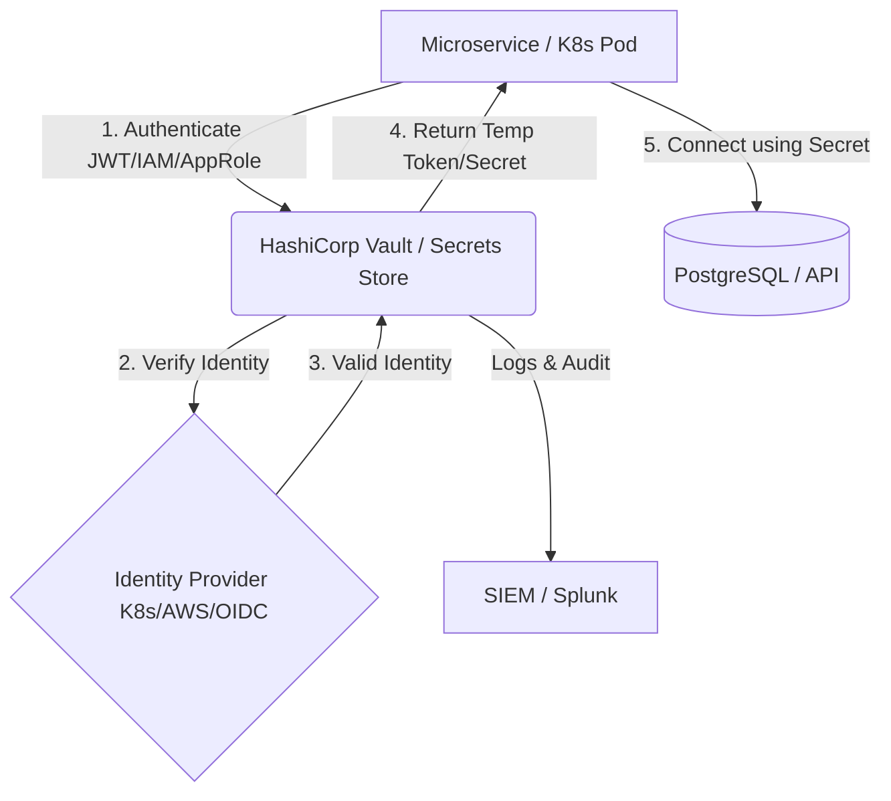
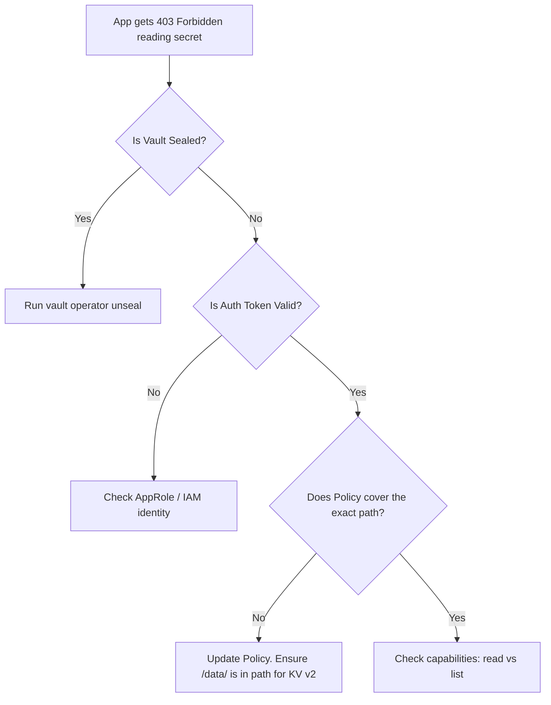

# SEC-03 Secrets Management

## Overview
**Ye kya hai?**
Secrets Management ek practice aur discipline hai jahan hum sensitive credentials (jaise database passwords, API tokens, aur SSH keys) ko apne source code ya configuration files se nikal kar ek highly secure, encrypted digital locker mein store karte hain. 

**Kyu use hota hai?**
Historically developers in secrets ko directly code mein hardcode karte the. Jab yeh code GitHub pe push hota tha, hackers bots ke through easily secrets nikal lete the, causing catastrophic breaches. Secrets management ensures zero credentials in plain text. Pura system dynamic aur automated hota hai.

**Real life example / Simple Analogy:**
Pehle hum ghar ki chabi (password) doormat ke niche (code) chupa dete the, jo koi bhi chor (hacker) dhoond leta tha. Secrets Management ek digital locker (Vault) hai. Chabi code mein nahi, locker mein hai. Jab app start hota hai, wo identity dikhata hai, locker khulta hai, app ko chabi milti hai, aur kaam ho jata hai.

**Industry kaha use karti hai?**
Har modern production environment jahan CI/CD, Kubernetes, aur Cloud (AWS/Azure/GCP) use hota hai, wahan Secrets Management (HashiCorp Vault, AWS Secrets Manager, Azure Key Vault) standard hota hai. Microservices ko db credentials fetch karne ke liye vault ki zarurat padti hai.

**Real production use-case:**
Ek Kubernetes Pod ko database se connect hona hai. Password pod ke YAML file mein likhne ke bajaye, K8s External Secrets Operator ka use karke Pod run-time pe AWS Secrets Manager se password fetch karta hai aur memory mein inject karta hai.

**Architecture (HashiCorp Vault Example)**


## Working
**Internal working & Data flow:**
1. **Never in Code:** Secrets ko source code, git, ya Dockerfile se complete ban karna.
2. **Never in Image:** Docker images mein environment variables (`ENV DB_PASS=secret`) nahi dalna.
3. **Authentication:** App boot hota hai, apna IAM Role ya Kubernetes ServiceAccount token Secret Store ko dikhata hai.
4. **Injection at Runtime:** Store verify karke secret wapas karta hai in-memory (file ya env var mein inject karke) not on disk.
5. **Dynamic Secrets:** Vault directly DB se connect hota hai. Jab bhi koi app password mangta hai, Vault DB mein ek *new temporary SQL user* banata hai (e.g. valid for 1 hour). 1 hour baad auto-delete.

**Communication, Ports & Protocols:**
- Protocol: HTTPS (TLS)
- Vault Port: 8200 (default API port)
- Cluster Port: 8201 (server-to-server)
- Dependencies: Storage backend (Consul, Raft, S3, etcd), KMS for auto-unseal.

## Installation
**Prerequisites:** 
- A Linux/Windows machine or Kubernetes cluster.
- Basic networking and DNS configured.

**Installation (HashiCorp Vault CLI for Lab):**
```bash
# macOS
brew tap hashicorp/tap && brew install hashicorp/tap/vault

# Ubuntu/Debian
wget -O- https://apt.releases.hashicorp.com/gpg | sudo gpg --dearmor -o /usr/share/keyrings/hashicorp-archive-keyring.gpg
echo "deb [signed-by=/usr/share/keyrings/hashicorp-archive-keyring.gpg] https://apt.releases.hashicorp.com $(lsb_release -cs) main" | sudo tee /etc/apt/sources.list.d/hashicorp.list
sudo apt update && sudo apt install vault
```

**Verification:**
`vault version` output should show Vault v1.x.x

**Rollback:**
Stop the Vault service and remove the binary/packages.

## Practical Lab
**Scenario: Run HashiCorp Vault in Dev Mode, store a secret, and fetch it.**

**Step 1: Start Vault in Dev Mode (In-memory, auto-unsealed)**
```bash
vault server -dev &
```
*Note: Dev mode is ONLY for learning.*

**Step 2: Configure Environment Variables**
```bash
# Vault CLI needs to know where to connect and authenticate
export VAULT_ADDR='http://127.0.0.1:8200'
export VAULT_TOKEN='hvs.xxxxxxxxxxxxxxxxxxxx' # Use the root token from the output of step 1
```

**Step 3: Store and Retrieve a Static Secret**
```bash
# Store a key-value secret (KV-v2 is enabled by default at 'secret/')
vault kv put secret/my-database username="admin" password="SuperSecretPassword123"

# Retrieve the secret
vault kv get secret/my-database

# Scripting: Fetch only the password
vault kv get -field=password secret/my-database
```

**Step 4: Setting up AppRole Authentication (for CI/CD)**
```bash
# Enable the AppRole auth method
vault auth enable approle

# Create read-only policy
cat <<EOF > app-policy.hcl
path "secret/data/my-database" {
  capabilities = ["read"]
}
EOF
vault policy write myapp-readonly app-policy.hcl

# Link role to policy
vault write auth/approle/role/myapp policies="myapp-readonly"

# Fetch Role ID & Secret ID
vault read auth/approle/role/myapp/role-id
vault write -f auth/approle/role/myapp/secret-id

# App login using Role & Secret ID
vault write auth/approle/login role_id="<YOUR_ROLE_ID>" secret_id="<YOUR_SECRET_ID>"
```

**Expected Output & Verification:**
Successful login will generate a temporary token that the app will use to read `secret/data/my-database`.

## Daily Engineer Tasks
- **L1 Engineer**: Monitoring Vault service up/down status. Rotating basic passwords in the portal manually. Running security scans using `git-secrets`.
- **L2 Engineer**: Troubleshooting access denied issues for apps. Creating basic Vault policies. Managing CI/CD secrets variables (GitHub Actions/Jenkins).
- **L3 / Senior Engineer**: Configuring Auto-Unseal with AWS KMS, setting up High Availability (Raft cluster), implementing Dynamic Secrets. 
- **Production/SRE**: K8s External Secrets Operator (ESO) integration. Disaster Recovery planning (taking Vault snapshots and restoring). K8s IAM IRSA mapping.

## Real Industry Tasks
- **Real Tickets**: "App team A is getting 403 Forbidden while reading secrets from path /app-a".
- **Change Requests**: "Migration of hardcoded K8s secrets to HashiCorp Vault using External Secrets Operator."
- **Maintenance Work**: Upgrading HashiCorp Vault cluster version in production (Rolling upgrade).
- **Patch Management**: Updating base images for Vault containers due to CVE vulnerabilities.

## Troubleshooting
- **Problem**: `Error response from server: sealed`
  - **Symptoms**: Vault is up, API responds, but all secret reads return 503 or sealed errors.
  - **Root Cause**: Vault was restarted. By default, it locks itself to protect data.
  - **Resolution**: 3 out of 5 key holders must run `vault operator unseal` and provide their portion of the key. Or configure AWS KMS Auto-unseal for automated unsealing.
- **Problem**: App gets `permission denied` reading secret.
  - **Root Cause**: The attached policy doesn't have the `read` capability, OR the path is wrong. For KV-v2, the API path requires `/data/` in the policy (e.g., `secret/data/my-app`).
  - **Resolution**: Update policy to include `/data/` and verify token capabilities.
- **Problem**: Kubernetes External Secret shows `SecretSyncedError`.
  - **Root Cause**: External Secrets Operator (ESO) pod doesn't have correct AWS IAM Role (IRSA) to talk to AWS Secrets Manager.
  - **Resolution**: Fix OIDC/Trust relationships on AWS IAM Role.

## Interview Preparation
- **Basic**: What is the difference between encryption and encoding? (Ans: Base64 encoding can be reversed by anyone. Encryption requires a key to decrypt.)
- **Intermediate**: Why are default Kubernetes Secrets insecure? (Ans: They are only base64 encoded strings in etcd. Unless etcd encryption at rest is enabled, anyone with etcd access can read them).
- **Advanced / Scenario Based**: Your CI/CD pipeline pushes to Docker Hub. How do you pass the password without hardcoding it? (Ans: Store it in GitHub Secrets / GitLab Variables, reference it as `${{ secrets.DOCKER_PASSWORD }}`. CI runner injects it dynamically and masks logs).
- **Production**: Explain Shamir's Secret Sharing in Vault. (Ans: A master key decrypts the encryption key. This master key is split into multiple parts, e.g., 5. You need a quorum, say 3 out of 5, to reconstruct the master key and unseal Vault).

## Production Scenarios
**Scenario: "Developer accidentally committed AWS access key to public GitHub repo"**
- **How to think**: Bots scrape GitHub in milliseconds. Assume the key is already compromised and being used to mine crypto.
- **Where to check**: AWS CloudTrail logs to see what actions that key has performed.
- **Commands**: 
  - `aws iam update-access-key --access-key-id AKIA... --status Inactive --user-name dev`
  - `aws iam delete-access-key --access-key-id AKIA... --user-name dev`
- **Resolution**: NEVER force-push to hide it. Disable the key immediately. Delete it. Rotate the credential. Investigate CloudTrail for any unauthorized resources spawned (EC2 instances).
- **Prevention**: Setup `trufflehog` or `git-secrets` as pre-commit hooks. Enforce GitHub Advanced Security secret scanning.

## Commands
| Command | Purpose | Syntax | Example | Danger Level |
|---------|---------|--------|---------|--------------|
| `vault status` | Check if sealed | `vault status` | `vault status` | Low |
| `vault kv put` | Store secret | `vault kv put path key=val` | `vault kv put secret/api-key key=123` | Medium |
| `vault kv get` | Read secret | `vault kv get path` | `vault kv get secret/api-key` | Low |
| `vault operator init` | Initialize new cluster | `vault operator init` | `vault operator init` | High (Only run once!) |
| `vault operator unseal` | Unseal vault | `vault operator unseal` | `vault operator unseal` | Medium |
| `vault policy write` | Upload ACL policy | `vault policy write name file` | `vault policy write dev-pol pol.hcl`| Medium |

## Cheat Sheet
- **Default Port**: 8200 (Client API)
- **KV V2 API Path**: `secret/data/your-path` (Always remember the `/data/` in policies!)
- **Shamir's Secret Sharing**: Unseal process using split keys.
- **Auto-Unseal**: AWS KMS, Azure Key Vault, or GCP KMS.
- **Dynamic Secrets**: Secrets generated on demand with a TTL (Time-To-Live).

## SOP & Runbook & KB Article
**SOP: Vault Node Restart and Unseal**
- **Purpose**: Safely restart a Vault node and bring it back to active state.
- **Procedure**: 
  1. Drain node if in K8s. 
  2. Restart service (`systemctl restart vault` or restart pod). 
  3. Run `vault status`. If Sealed=true, execute `vault operator unseal` multiple times with different unseal keys until quorum is met.
- **Validation**: `vault status` shows Sealed=false.

**Runbook: Compromised Secret Detected**
- **Detection**: Secret scanning tool alerts in CI/CD.
- **Investigation**: Find the secret owner and system.
- **Resolution**: Invalidate secret on the provider (AWS, DB, etc.). Generate a new one and update the Vault/Secret Manager.
- **Validation**: Verify applications reconnected successfully with new credentials.

**KB Article: K8s Secrets are NOT Encrypted**
- **Problem**: Auditors found passwords in plain text in K8s `etcd`.
- **Cause**: Kubernetes Secrets use Base64 encoding by default.
- **Resolution**: Enable `EncryptionConfiguration` in K8s API server to encrypt secrets at rest using a KMS provider, or use External Secrets Operator to avoid storing long-term secrets in K8s entirely.

## Best Practices & Beginner Mistakes
- **Best Practice**: Use Dynamic Secrets with short TTLs whenever possible. If a password expires in 15 minutes, leaking it is much less dangerous.
- **Best Practice**: Integrate AWS IAM Roles for Service Accounts (IRSA) with Vault so Pods authenticate natively without needing passwords to get passwords.
- **Beginner Mistake**: Putting `ENV DB_PASSWORD=my_secret` in a `Dockerfile`. 
  - **Impact**: Anyone with access to the image can run `docker inspect` and see the password. 
  - **Correct Approach**: Pass environment variables at runtime via K8s, or use Vault Agent injector.
- **Beginner Mistake**: Committing `.env` files to git. Always add `.env` to `.gitignore`.

## Advanced Concepts
- **Vault Architecture**: Vault uses a storage backend (like Consul or Raft) to persist encrypted data. The data is encrypted *before* it hits the storage. Vault never trusts the storage backend.
- **Encryption Algorithm**: Vault uses AES-256 in GCM mode for data encryption.
- **Seal/Unseal**: Vault starts in a sealed state. It knows where data is but cannot decrypt it because it lacks the Master Key. The unseal process reconstructs the Master Key in memory.
- **OIDC/JWT Authentication**: A highly secure way for CI/CD pipelines (like GitHub Actions) to authenticate with Cloud providers without storing any permanent credentials. The CI pipeline presents a JWT token signed by GitHub, which the Cloud provider validates cryptographically.

## Related Topics & Flashcards & Revision
**Related Topics:**
- [[09-Security-DevSecOps/SEC-01 DevSecOps Fundamentals|DevSecOps Foundations]]
- [[04-Orchestration/K8S-03 ConfigMaps and Secrets|Kubernetes ConfigMaps and Secrets]]
- [[09-Security-DevSecOps/SEC-02 IAM and RBAC|Identity and Access Management (IAM)]]

**Flashcards:**
- **Q**: Kubernetes native Secrets default encoding? **A**: Base64 (NOT encryption).
- **Q**: Tool to inject external secrets into K8s? **A**: External Secrets Operator (ESO) or Vault Agent Injector.
- **Q**: Vault Dev mode vs Prod mode? **A**: Dev is in-memory and auto-unsealed. Prod uses persistent storage and starts sealed.

**Revision Timer:**
- **5 min**: What is Vault, why not hardcode secrets, `.env` gitignore.
- **15 min**: K8s Secrets vs Vault, Unseal process.
- **30 min**: AppRole auth, Dynamic Secrets architecture, Auto-unseal with KMS.

## Real Production Logs & Commands & Decision Tree
**Vault Operator Init Output:**
```text
Unseal Key 1: qwe...
Unseal Key 2: asd...
Unseal Key 3: zxc...
Unseal Key 4: rty...
Unseal Key 5: fgh...

Initial Root Token: hvs.xyz...

Vault initialized with 5 key shares and a key threshold of 3. Please securely distribute the key shares...
```
*Explanation*: 
- `Unseal Keys`: 5 generated keys. You need 3 (threshold) to unseal Vault.
- `Root Token`: God-mode token. Use this to setup initial policies and auth methods, then revoke it! Do not use Root Token for daily tasks.

**Troubleshooting Decision Tree (Vault Access):**

