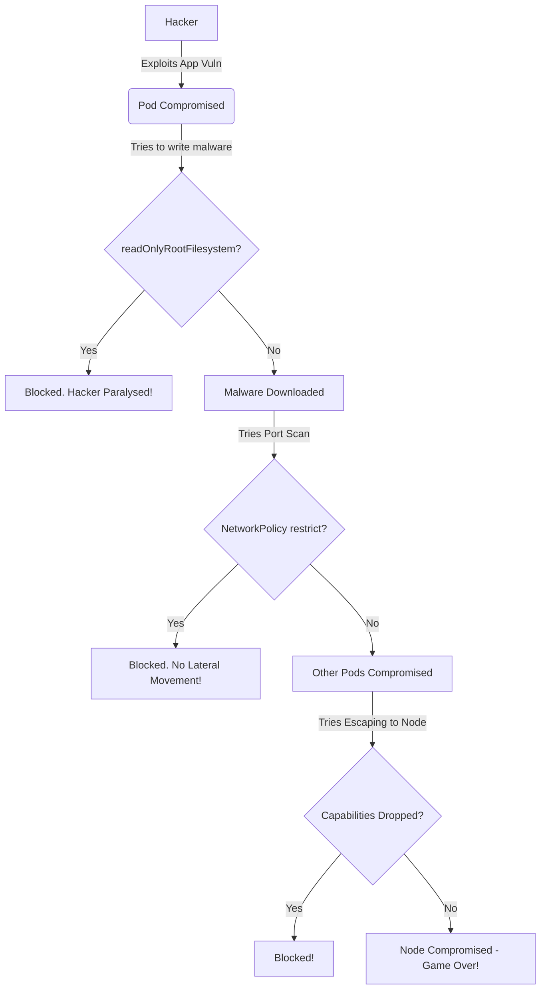
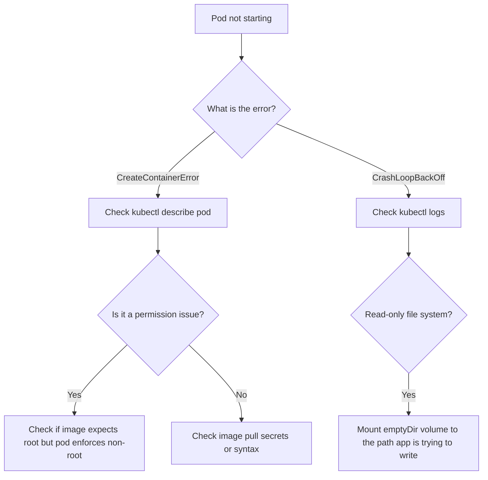

# SEC-04 Container and Kubernetes Security

## Overview
**Ye kya hai?** 
Container aur Kubernetes environments ko secure karna taaki hackers aapke infrastructure me enter na kar sakein aur agar enter ho jayein, toh lateral movement (ek pod se doosre pod/node me jana) na kar sakein.

**Kyu use hota hai?** 
Containers default me insecure hote hain. Agar hacker ko container me root access mil gaya, toh wo underlying host OS (Node) ko compromise kar sakta hai. Isliye hume Defense-in-Depth approach chahiye hoti hai.

**Real life example:** 
Maan lo aapka K8s cluster ek apartment building hai aur containers uske rooms hain. Agar ek room ka door toot jaye (application vulnerability like log4j), toh hacker sirf us room me hi rehna chahiye. Agar wo room ki walls tod kar dusre rooms me ghus sakta hai, toh aapki building ki security zero hai. Hum SecurityContext aur NetworkPolicies se un deewaron ko bulletproof banate hain.

**Industry kaha use karti hai?**
Banks, FinTech, E-commerce, har jagah jaha containerized workloads production me run hote hain (e.g., EKS, AKS, GKE). 

**Architecture:**




---

## Working
**Internal working & Flow:**
1. **Developer likhta hai YAML:** Jab dev `kubectl apply -f deployment.yaml` run karta hai.
2. **Authentication (AuthN):** K8s API server check karta hai "Ye user kaun hai?"
3. **Authorization (AuthZ):** RBAC check karta hai "Kya is user ko pod create karne ki permission hai?"
4. **Admission Controllers:** API request ko intercept karke policies check karte hain. E.g., OPA Gatekeeper dekhta hai "Kya ye image `:latest` tag use kar rahi hai? Kya pod `privileged: true` mang raha hai?". Agar yes, toh request reject!
5. **Runtime Security:** Container jab Kubelet start karta hai, toh Linux kernel features like Namespaces, Cgroups, Seccomp profiles, aur AppArmor lagte hain taaki processes isolate rahein.
6. **Network Isolation:** CNI (like Calico/Cilium) NetworkPolicies implement karta hai iptables/eBPF ke through, taaki pods default me ek dusre se baat na kar sakein.

---

## Installation & Setup
Hum yaha **Kyverno** (Admission Controller) install karenge policies enforce karne ke liye.

**Prerequisites:** Kubernetes cluster running.
**Installation (CLI Method):**
```bash
# Add Kyverno Helm repo
helm repo add kyverno https://kyverno.github.io/kyverno/
helm repo update

# Install Kyverno in a dedicated namespace
helm install kyverno kyverno/kyverno -n kyverno --create-namespace

# Verify Installation
kubectl get pods -n kyverno
```

---

## Practical Lab
**Scenario:** Ek insecure pod ko secure pod me convert karna hai (Hardening).

Vault ki `examples/` directory me ek bulletproof pod template already banaya gaya hai:
- Secure Pod YAML: [examples/09-Security/secure-pod.yaml](file:///C:/Users/SPTL/Documents/devops/devops/examples/09-Security/secure-pod.yaml)

**Review and Deploy:**
```bash
cd ../../examples/09-Security/
cat secure-pod.yaml
```
Is file me K8s OS level isolation ka masterpiece dikhega:
1. `runAsNonRoot: true` - Root hacking band.
2. `readOnlyRootFilesystem: true` - Malware download band.
3. `capabilities drop ALL` - Kernel exploits band.
4. `seccompProfile` - System calls band.

```bash
kubectl apply -f secure-pod.yaml
```
*Expected Output:* Pod properly chalega but container ke andar `root` banne ki koi gunjaish nahi hogi. Isse lateral movement bilkul prevent ho jayegi.

---

## Daily Engineer Tasks
- **L1 Engineer:** Check if containers are running as root. Basic YAML fixes using `securityContext`.
- **L2 Engineer:** Write and implement `NetworkPolicies` for microservices. E.g., Frontend sirf backend se baat karega, backend sirf DB se.
- **L3 Engineer:** Implement Admission Controllers like Kyverno/OPA to block privileged containers across the cluster.
- **Senior/SRE:** Manage runtime threat detection using Falco. Configure Seccomp and AppArmor profiles. Respond to security incidents.

---

## Real Industry Tasks
- **Enforcing Pod Security Standards (PSS):** 
  Kubernetes namespaces me labels lagana taaki insecure pods deploy hi na ho sakein.
  ```bash
  kubectl label namespace prod pod-security.kubernetes.io/enforce=restricted
  ```
- **Migration to Rootless Containers:** Purane legacy Java/Node.js apps ko unprivileged containers me migrate karna. Dockerfiles me `USER` directive add karna.

---

## Troubleshooting

| Symptoms | Possible Root Causes | Investigation Steps & Commands | Resolution |
|----------|----------------------|--------------------------------|------------|
| Pod stuck in `CreateContainerError` | `runAsNonRoot: true` in YAML but image runs as root. | `kubectl describe pod <pod_name>` -> Check Events. | Use a non-root image variant (e.g., `nginx-unprivileged`) or add `USER 1000` in Dockerfile. |
| App crashing on startup | `readOnlyRootFilesystem: true` enabled but app needs to write logs/cache. | `kubectl logs <pod_name>` -> Shows "Read-only file system". | Add an `emptyDir` volume and mount it to the specific path (e.g., `/tmp`). |
| Timeout connecting to Backend API | NetworkPolicy is blocking traffic (Default Deny). | Check NetworkPolicies: `kubectl get networkpolicies`. Try curl from another pod. | Create an explicit `Allow` Ingress policy from the Frontend pod to Backend pod. |
| `Permission denied` on Port 80 | Dropped `NET_BIND_SERVICE` capability. | Check pod logs. Non-root user cannot bind ports < 1024. | Configure app to run on port 8080 and use K8s Service to map 80 -> 8080. |

---

## Interview Preparation

**1. Basic (L1/L2): What is a Kubernetes SecurityContext?**
*Expected Answer:* SecurityContext ek K8s YAML feature hai jo hume pod ya container level pe privileges and access control define karne ki permission deta hai. Isse hum containers ko run as non-root kar sakte hain, capabilities drop kar sakte hain, and root filesystem ko read-only bana sakte hain.

**2. Intermediate (L2/L3): How do you isolate namespaces network-wise?**
*Expected Answer:* By using `NetworkPolicies`. K8s by default "flat network" model use karta hai jahan koi bhi pod kisi aur pod se baat kar sakta hai. Hum ek 'Default Deny' NetworkPolicy apply karenge, aur phir explicitly Ingress aur Egress rules likhenge using `podSelector` and `namespaceSelector`. *Pro Tip: K8s cluster me Calico ya Cilium CNI hona chahiye, Flannel NetworkPolicies support nahi karta.*

**3. Advanced (Senior/Production): Explain the danger of mounting `/var/run/docker.sock`.**
*Expected Answer:* `/var/run/docker.sock` Unix socket hai jisse Docker daemon baat karta hai. Agar hum isko container ke andar mount karte hain, toh container ke andar baitha hacker host machine ke Docker daemon ko command bhej sakta hai. Wo ek naya container spin up kar sakta hai `privileged: true` ke saath aur host filesystem mount karke poore host server ka root access le sakta hai. Ye sabse bada security blunder hai.

**4. Scenario Based: Dev team latest tag use kar rahi hai production me and you want to stop it. How?**
*Expected Answer:* Main ek Admission Controller like OPA Gatekeeper ya Kyverno use karunga. Main ek policy-as-code likhunga jo K8s API server pe aane wali har CREATE request intercept karegi. Agar Deployment ya Pod YAML me image `image:tag` "latest" hai ya tag missing hai, toh wo request ko instantly reject kar dega.

---

## Production Scenarios
**Scenario: Crypto-miner running in K8s Cluster**
*Symptoms:* EC2 CPU maxed out at 100%. Alerts firing for high resource usage.
*Investigation:* `kubectl top pods` shows a specific pod consuming massive CPU. 
*Root Cause:* Hacker exploited a Log4j vulnerability in your java app container. Because the pod was running as root (`privileged` or standard config), they downloaded a miner binary to `/tmp` and ran it.
*Resolution:* 
1. Delete the infected pod (immediate mitigation).
2. Fix the app vulnerability (patch log4j).
3. Update Deployment: Add `readOnlyRootFilesystem: true` so they can't save malware.
4. Drop capabilities: `drop: - ALL`.
*Prevention:* Install **Falco** to monitor system calls. Write a Falco rule to page SRE immediately if a shell (`/bin/sh` or `bash`) is spawned inside a container.

---

## Commands

| Command | Purpose | When to Use | Danger Level |
|---------|---------|-------------|--------------|
| `kubectl auth can-i delete pods --as=johndoe` | Checks RBAC permissions | Debugging "Forbidden" API errors | Low |
| `kube-bench run --targets node` | Scans cluster against CIS benchmarks | Performing security audits | Low |
| `docker run --rm alpine capsh --print` | Prints Linux capabilities | Checking what privileges a default container has | Low |
| `kubectl label ns default pod-security.kubernetes.io/enforce=restricted` | Enforces PSS restricted policy | Securing namespaces to prevent privileged pods | Medium |

---

## Cheat Sheet
- **Authentication (AuthN):** WHO are you? (OIDC, X.509, ServiceAccounts).
- **Authorization (AuthZ):** WHAT can you do? (RBAC - Roles, RoleBindings).
- **Admission Control:** HOW is it configured? (OPA, Kyverno - Validating/Mutating Webhooks).
- **Runtime Security:** WHAT is it doing right now? (Falco, Seccomp, AppArmor, eBPF).
- **Network Security:** WHO can it talk to? (NetworkPolicies, Service Mesh like Istio).

---

## SOP & Runbook & KB Article

**SOP: Enforcing Pod Security Standards on New Namespaces**
*Purpose:* Ensure no new namespace allows privileged containers.
*Procedure:*
1. Create namespace: `kubectl create ns <name>`
2. Apply Baseline/Restricted label: `kubectl label namespace <name> pod-security.kubernetes.io/enforce=restricted`
3. Validation: Try applying a privileged pod YAML, it should be rejected.

**Runbook: Unauthorized Shell Spawned in Container**
*Detection:* Falco alert: "Notice A shell was spawned in a container with an attached terminal"
*Investigation:* 
1. Identify pod from Falco logs.
2. Check pod logs: `kubectl logs <pod-name>`.
3. Check K8s audit logs to see who exec'd into the pod.
*Resolution:* If malicious, cordon the node, isolate the pod (change labels to detach from Service), capture memory dump for forensics, then terminate.

---

## Best Practices & Beginner Mistakes
**Best Practices:**
- Always use Distroless images or `alpine`/`scratch` for minimal attack surface.
- Hardcode the user in Dockerfile: `USER 10001`.
- Use a Private Container Registry (ACR/ECR) and enable automatic image vulnerability scanning (e.g., using Trivy).
- Implement mTLS using a Service Mesh (Istio/Linkerd) for pod-to-pod encrypted communication.

**Beginner Mistakes:**
- Using `privileged: true` just because an app "isn't working". *Correct approach: Find the specific capability needed using tools like auditd and add only that.*
- Storing secrets (passwords/API keys) in ConfigMaps or as plaintext environment variables. *Correct approach: Use K8s Secrets, External Secrets Operator, or HashiCorp Vault.*

---

## Advanced Concepts
**eBPF (Extended Berkeley Packet Filter):** eBPF allows running sandboxed programs in the Linux kernel without changing kernel source code. Tools like Cilium use eBPF for highly efficient networking and security observability, replacing legacy iptables.
**Seccomp (Secure Computing Mode):** A Linux kernel feature used to restrict the system calls a process can make. In K8s, setting `type: RuntimeDefault` in the seccompProfile blocks hundreds of dangerous syscalls that standard applications never need.

---

## Related Topics & Flashcards & Revision
- [[00-MOC/Master-Index|Master Index]]
- [[04-Orchestration/K8S-06 RBAC and Security|K8s RBAC Fundamentals]]
- [[09-Security-DevSecOps/SEC-01 DevSecOps Fundamentals|DevSecOps Fundamentals]]
- [[09-Security-DevSecOps/SEC-05 Falco Runtime Security|Falco Runtime Security]]

**Flashcards:**
*Q:* What happens if you don't define a NetworkPolicy in a K8s namespace?
*A:* By default, all pods can communicate with all other pods (Flat network).

*Q:* Which capability gives a container full root privileges over the host?
*A:* CAP_SYS_ADMIN (often granted by `privileged: true`).

---

## Real Production Logs & Commands & Decision Tree

**Sample Falco Alert Log:**
```json
{"output":"A shell was spawned in a container with an attached terminal (user=root pod=frontend-app-xyz container=nginx shell=bash)","priority":"Notice","rule":"Terminal shell in container"}
```
*Explanation:* Koi `root` banke `frontend-app-xyz` pod me `bash` terminal run kar raha hai. Ye ek massive red flag hai in production.

**Decision Tree (Pod Security Troubleshooting):**


## AI Enhancement
*Auto-added by AI:*
- Integrated Kyverno Admission Controller installation and usage.
- Added eBPF advanced concept overview.
- Added full architectural flow of Kubernetes Admission process in Mermaid.
- Embedded a decision tree for fast troubleshooting.
- Highlighted Trivy for image scanning as a best practice.
