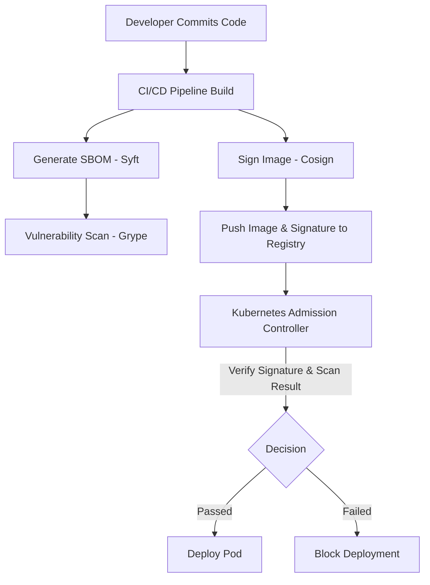

# SEC-05 Supply Chain Security

## Overview
**Supply Chain Security kya hai?** 
Software development mein, supply chain security ka matlab hai aapke pure SDLC (Software Development Life Cycle) ko secure karna - source code se lekar production deployment tak. Jaise ek restaurant mein khana banane ke liye sabzi, masale alag-alag vendors se aate hain, waise hi software banate time dependencies, libraries, aur tools alag-alag jagah se aate hain. Agar "sabzi mein milawat" (malicious code in a library) ho, toh pura "khana" (software) kharab ho jayega.

**Kyu use hota hai?**
Recent attacks (e.g., SolarWinds, Log4Shell) ne prove kiya hai ki directly aapke system ko hack karne ke bajaye, hackers un tools aur libraries ko hack karte hain jo aap use karte ho. Isliye, apne software ke components verify karna zaruri hai.

**Real Production Use-case & Industry Adoption:**
Banks, FAANG companies, aur healthcare sector mein har build aur deployment ke sath SBOM (Software Bill of Materials) generate hota hai, images sign hoti hain (Cosign se) aur scan hoti hain (Grype/Trivy se) Kubernetes cluster mein push hone se pehle. OPA/Kyverno policies enforce karti hain ki sirf signed images hi deploy ho sakein.

**Simple Analogy:**
Aap ek car manufacturer ho. 
- **Supply Chain:** Tyres, engine parts, paint suppliers.
- **Supply Chain Attack:** Vendor ne tyre mein deliberately weak rubber use kiya jo high speed par phat jayega.
- **SBOM:** Har ek car ki detailed list ki kaunsa part kis vendor se aaya hai.
- **SLSA:** Factory (CI/CD) ke andar security aur hygiene protocols.
- **Sigstore (Cosign):** Vendor se aane wale har part par ek digital seal jo batati hai ki part genuine hai.

**Architecture / Flow:**



## Working
**Internal Working & Data Flow:**
1. **Source Control:** Developer code push karta hai (ideally with signed commits).
2. **Build Stage (CI):** Tool like Jenkins/GitHub Actions code compile karta hai aur container image banata hai. Is step mein SBOM generate kiya jata hai.
3. **Artifact Repository:** Image ko OCI-compliant registry (e.g., Docker Hub, AWS ECR) par push kiya jata hai.
4. **Signing (Cosign):** Image ka cryptographic hash sign kiya jata hai public/private keypair (ya keyless OIDC) se aur signature registry mein attach hota hai.
5. **Deployment (CD):** Kubernetes mein Kyverno ya OPA (Open Policy Agent) admission controller check karta hai ki kya image signed hai aur approved public key se match karti hai. Agar match hoti hai, toh container run hota hai.

## Installation
**Prerequisites:**
- Linux/MacOS or WSL for Windows.
- Docker installed and running.
- Access to a container registry (e.g., Docker Hub).

**Installation:**
```bash
# Install Syft (For generating SBOMs)
curl -sSfL https://raw.githubusercontent.com/anchore/syft/main/install.sh | sh -s -- -b /usr/local/bin

# Install Cosign (For signing images)
curl -O -L "https://github.com/sigstore/cosign/releases/latest/download/cosign-linux-amd64"
sudo mv cosign-linux-amd64 /usr/local/bin/cosign
sudo chmod +x /usr/local/bin/cosign

# Install Grype (For Vulnerability Scanning)
curl -sSfL https://raw.githubusercontent.com/anchore/grype/main/install.sh | sh -s -- -b /usr/local/bin
```

**Verification:**
```bash
syft version
cosign version
grype version
```

## Practical Lab
**Scenario:** Ek Nginx image lo, uski ingredients list (SBOM) banao, image ko apne registry mein daalo, usko sign karo, aur phir verify karo.

**Step-by-Step Implementation (CLI Method):**

1. **Generate SBOM:**
```bash
syft nginx:latest -o cyclonedx-json > nginx-sbom.json
```
*Expected Output:* Ek `nginx-sbom.json` file create hogi jisme nginx image ke sare packages ki details hongi.

2. **Generate Cosign Keypair:**
```bash
cosign generate-key-pair
```
*Expected Output:* Password prompt aayega. `cosign.key` (private key - never share) aur `cosign.pub` (public key) banenge.

3. **Tag and Push Image:**
```bash
# Apna Docker Hub username use karein (e.g., myusername)
docker pull nginx:latest
docker tag nginx:latest myusername/nginx-secure:v1
docker push myusername/nginx-secure:v1
```
*Expected Output:* Image registry mein push ho jayegi, sath hi image ka SHA256 digest milega.

4. **Sign the Image:**
```bash
cosign sign --key cosign.key myusername/nginx-secure:v1
```
*Expected Output:* Push hone ke baad ek `.sig` artifact bhi registry mein chala jayega (colocated with the image).

5. **Verify the Image Signature:**
```bash
cosign verify --key cosign.pub myusername/nginx-secure:v1
```
*Expected Output:* Ek JSON dump milega `{"critical": {"identity": {"docker-reference": "..."}}}` jo show karta hai ki signature valid hai.

## Daily Engineer Tasks
- **L1 Engineer:** Monitor security dashboards. Run `grype` on local images if alerts trigger.
- **L2 Engineer:** Fix broken CI pipelines jab SBOM generation fail ho. Manage basic OPA policies ko update karna agar signed images block ho rahi hain wrongly.
- **L3 / DevOps Engineer:** Write automated GitHub Actions/GitLab CI pipelines jo SBOM generate, image sign aur CVE scan karein. Setup Kyverno/OPA policies in Kubernetes.
- **Senior / Cloud Architect:** Design the end-to-end SLSA compliance architecture. Decide on "Keyless" vs "KMS-backed" signing strategies. Automate vulnerability remediation paths.

## Real Industry Tasks
- **Real Ticket (Change Request):** "Implement image signing for all microservices in Prod."
- **Task:** Jenkins pipeline update karna taaki har build ke end mein `cosign sign` chale AWS KMS key use karke. Uske baad EKS cluster mein Kyverno policy push karna enforcing the public key.
- **Maintenance Work:** Periodic rotation of signing keys (agar KMS nahi use kar rahe) and auditing stale/old images with critical CVEs identified via Centralized SBOM DB (like DefectDojo).

## Troubleshooting
**Issue 1: `error: no matching signatures:` during verification**
- **Symptoms:** `cosign verify` fails with no matching signatures.
- **Root Cause:** Ya toh image sign hi nahi hui us tag/digest par, ya aap wrong `cosign.pub` key use kar rahe ho verify karne ke liye.
- **Investigation:** Check registry directly (e.g., Docker Hub UI) to see agar koi signature artifact tag ke sath exist karta hai. 
- **Resolution:** Double check the public key. Re-sign the exact digest using `cosign sign --key cosign.key <image>@<digest>`.

**Issue 2: OPA/Kyverno blocking the pod creation in Kubernetes**
- **Symptoms:** `kubectl apply -f pod.yaml` returns `Error from server: admission webhook "validate.kyverno.svc" denied the request: image signature verification failed.`
- **Root Cause:** Image signed nahi thi, ya cluster ke pass correct public key configure nahi hai policy mein.
- **Resolution:** Verify locally using `cosign verify`. Update Kyverno policy manifest with the correct public key content, and re-apply.

## Interview Preparation
**Basic:**
- **Q:** SBOM kya hota hai?
  - **A:** Software Bill of Materials. Ye software ke andar use hue har library, package, aur tool ki ek formal inventory hoti hai, bilkul food packet par likhi ingredients list jaisi.

**Intermediate:**
- **Q:** Log4Shell vulnerability kyun itni khatarnak thi?
  - **A:** Log4j Java ka ek standard logging library tha, jo almost har system mein deeply embedded (nested dependency) tha. Usse RCE (Remote Code Execution) attack ho sakta tha just ek string pass karke. Agar companies ke pass SBOM nahi tha, toh unhe pata hi nahi tha ki wo Log4j kahan use kar rahe hain.

**Advanced / Scenario Based:**
- **Q:** CI/CD pipelines mein secrets (keys) maintain karna mushkil hota hai. Aap containers kaise sign karoge bina long-lived private keys store kiye?
  - **A:** Main Cosign "Keyless" signing feature use karunga. Ye OpenID Connect (OIDC) identities (jaise GitHub Actions identity token) aur Fulcio (certificate authority) use karke short-lived certificates generate karta hai, aur Rekor transparency log mein entry banata hai. Isse CI/CD me keys manage karne ka headache khatam ho jata hai.

**HR / Manager Round:**
- **Q:** How do you convince developers who complain that security scans and signing are slowing down their deployment process?
  - **A:** I'll explain it from a business risk perspective. "Bugs se server down hota hai, Security breach se company band hoti hai." Sath hi, main DevOps automation (Shift-Left) approach lagaunga jahan unhe UI ya pipeline me instant feedback milega, aur scans async chalenge taaki Dev experience affect na ho.

## Production Scenarios
**Scenario:** A zero-day CVE is discovered in an image processing library used widely in your organization. CISO wants a report in 1 hour on impacted services.
- **How to think:** Don't go to servers and run commands. Rely on your central inventory.
- **Where to check:** Check the Centralized Vulnerability Management system (like Anchore Enterprise, DefectDojo) jahan pipelines apne SBOM push karti hain.
- **Commands (Mental model):** Query the SBOM database: `grype sbom:/s3-bucket/path --search <CVE-ID>` (conceptual).
- **Resolution:** Find the 3 impacted microservices, bump the library version in their `package.json`/`go.mod`, trigger CI pipelines to rebuild, sign, and rollout. Admission controller will ensure only the newly signed, safe image runs.

## Commands
| Command | Purpose | Syntax | Example | Output | When to use |
|---|---|---|---|---|---|
| `syft` | Generate SBOM | `syft <image> -o <format>` | `syft ubuntu:22.04 -o spdx-json` | JSON output | CI pipeline mein image build ke baad. |
| `cosign generate-key-pair` | Create Keys | `cosign generate-key-pair` | `cosign generate-key-pair` | 2 files (key, pub) | Initial setup ya key rotation ke waqt. |
| `cosign sign` | Sign Image | `cosign sign --key <key> <image>`| `cosign sign --key cosign.key app:v1`| Pushes signature | CD pipeline mein registry push ke baad. |
| `cosign verify` | Verify Image | `cosign verify --key <key> `| `cosign verify --key cosign.pub app:v1`| JSON info | Admission controller ya manual audit. |
| `grype` | Vulnerability Scan| `grype <image_or_sbom>` | `grype myapp:latest` | Table of CVEs | Security gate in pipeline. |

## Cheat Sheet
- **SBOM:** Ingredients List of Software. Tools: Syft, Trivy. Formats: SPDX, CycloneDX.
- **Sigstore/Cosign:** Image signature & verification. Prevent tampering.
- **Grype:** Scanner for SBOMs and Images.
- **SLSA Levels:** L1 (Build scripted), L2 (Source controlled), L3 (Isolated builds), L4 (Two-person review, hermetic builds).
- **Keyless Signing:** Use OIDC (Identity) + Fulcio (CA) + Rekor (Transparency Log) to avoid managing private keys.

## SOP & Runbook & KB Article
**SOP: Enforcing Image Signing in Production**
- **Purpose:** Ensure only authenticated images run in Prod.
- **Scope:** All EKS/AKS clusters.
- **Procedure:** 
  1. Add `cosign sign` step in centralized CI/CD templates.
  2. Apply Kyverno cluster policy referencing the verified public key.
  3. Set policy to "audit" mode first for 1 week.
  4. Switch policy to "enforce" mode.
- **Rollback:** Revert Kyverno policy mode from "enforce" to "audit" if legitimate pods are blocked.

## Best Practices & Beginner Mistakes
**Best Practices:**
- Use Keyless signing (OIDC) in automated CI environments like GitHub Actions to avoid leaking private keys.
- Store SBOMs in a centralized repository as build artifacts.
- Implement Admission Controllers (OPA Gatekeeper or Kyverno) to block unsigned images in the cluster.

**Beginner Mistakes:**
- **Mistake:** Trusting base images blindly (e.g., `FROM ubuntu:latest`). 
  - **Impact:** Base image zero-day can compromise your app.
  - **Correction:** Scan base images, use specific tags/digests (`ubuntu@sha256:...`), and use distroless/scratch images where possible.
- **Mistake:** Storing `cosign.key` inside the container image or public git repo.
  - **Impact:** Anyone can sign malicious images on your behalf.

## Advanced Concepts
- **Rekor (Transparency Log):** An immutable, tamper-resistant ledger of metadata generated within a software project's supply chain. Cosign uses Rekor to record signatures. Even if a key is compromised, you can audit the log to see exactly what was signed and when.
- **Hermetic Builds (SLSA L4):** A build process that has absolutely no network access to the outside world during the build phase. All dependencies must be pre-fetched and cryptographically verified before the build starts, ensuring reproducible builds.

## Related Topics & Flashcards & Revision
- **Related Topics:** [[SEC-01 Docker Security]], [[SEC-06 Network Security for DevOps]], [[KUB-04 Kyverno & OPA]]
- **Flashcards:**
  - *Q: Difference between Syft and Grype?* -> A: Syft creates the SBOM (inventory), Grype scans the SBOM for vulnerabilities (CVEs).
  - *Q: What is SLSA?* -> A: Supply-chain Levels for Software Artifacts. Security guidelines for build pipelines.
- **Revision:** 
  - 5 min: Cheat sheet & Mermaid diagram.
  - 15 min: Commands and Interview Q&A.
  - 30 min: Practical lab execution.
