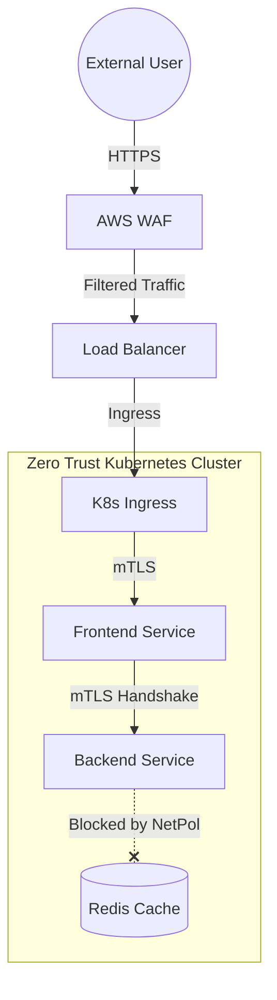
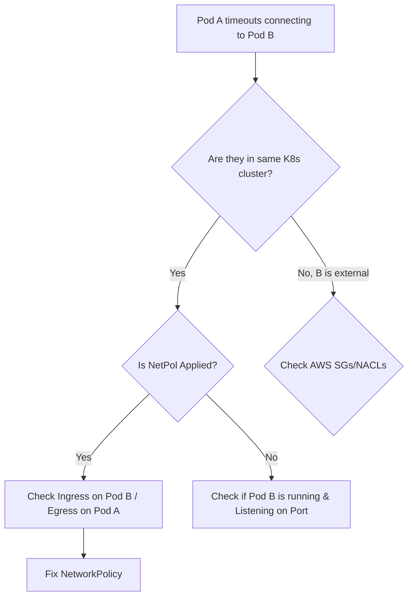

# SEC-06 Network Security for DevOps

# Overview
**Ye kya hai?**
Network Security in DevOps ka matlab hai traditional "castle-and-moat" (ek bada firewall) model se nikal kar, granular aur identity-driven security model apnana. Modern DevOps aur Cloud native environments mein, "Zero Trust" (Zero Trust Network Access - ZTNA) follow hota hai—iska matlab hai ki network ke andar ho ya bahar, kisi bhi entity par default trust nahi kiya jayega.

**Kyu use hota hai?**
Microservices, cloud resources, aur remote work ke karan koi fixed boundary (perimeter) nahi rahi. Agar ek pod ya VM compromise ho jaye, to attacker lateral movement karke doosre resources tak na pahuch paye, isliye har communication path ko secure, authenticate, aur authorize karna zaruri hai.

**Real life example / Simple analogy:**
Standard TLS/Network Security ek Bank ki tarah hai—gate par guard ID check karega (Firewall), par bank ke andar sab allowed hai.
**Zero Trust (mTLS)** ek High-Security Military Base jaisa hai. Guard aapki ID check karega (Server Auth), aur aap bhi guard ka badge check karoge (Client Auth). Aur har room mein ghusne se pehle phir se verification hoga.

**Industry kaha use karti hai & Real production use-case:**
FAANG aur top tech companies Kubernetes (NetPol), AWS (VPC, SG, NACL), aur Service Mesh (Istio mTLS) use karke secure microservices communication implement karti hain. Example: Swiggy/Zomato jaisi apps jahan Payment Gateway service sirif Checkout service se hi baat kar sakti hai, doosri koi service use ping nahi kar sakti.

**Architecture (Mermaid diagram):**


# Working
**Internal working & Data flow:**
1. **Zero Trust Network Access (ZTNA):** Har request ko continuously validate kiya jata hai. Sirf valid identity (JWT, Certificates) aur context ke based par access milta hai.
2. **mTLS (Mutual TLS):** Client aur server dono ke paas digital certificates hote hain. Handshake ke time dono ek doosre ko verify karte hain. Yeh eavesdropping aur MITM (Man-In-The-Middle) attacks ko rokti hai.
3. **VPC Security:** AWS/Cloud me resources Subnets me hote hain. **NACLs** (stateless, subnet level) se broad block rules lagate hain, aur **Security Groups** (stateful, instance/ENI level) se granular allow rules.

**Ports & Protocols:**
- HTTPS (Port 443) for WAF/mTLS.
- DNS (Port 53) for internal K8s CoreDNS resolution.
- Istio Envoy proxy generally intercepts traffic internally and encrypts it seamlessly.

# Installation
**Prerequisites:**
- Kubernetes cluster with a CNI that supports Network Policies (e.g., Calico or Cilium).
- Istio ya Linkerd for Service Mesh (mTLS).
- AWS Account for VPC/WAF implementation.

**Configuration (K8s Calico example):**
1. Install Calico CNI on cluster creation.
2. Create `NetworkPolicy` YAMLs.
3. Enable Istio sidecar injection: `kubectl label namespace default istio-injection=enabled`.

**Verification:**
- `kubectl get networkpolicy`
- `istioctl x authz check`

# Practical Lab
**Scenario:** Implement Zero Trust in K8s. By default, pods in a namespace can talk to any pod. We will lock it down so `backend` ONLY receives traffic from `frontend`.

**Step 1: Setup resources**
```bash
kubectl create namespace zt-demo
kubectl run frontend --image=nginx --labels="app=frontend" -n zt-demo
kubectl run backend --image=nginx --labels="app=backend" -n zt-demo --expose --port=80
```
*Expected Output:* Pods & Service created successfully.

**Step 2: Apply Default Deny (Bash/CLI Method)**
Create `default-deny.yaml`:
```yaml
apiVersion: networking.k8s.io/v1
kind: NetworkPolicy
metadata:
  name: default-deny-all
  namespace: zt-demo
spec:
  podSelector: {} # Selects all pods
  policyTypes:
  - Ingress
  - Egress
```
```bash
kubectl apply -f default-deny.yaml
```
*Expected Output:* `networkpolicy.networking.k8s.io/default-deny-all created`. Ab sab connection blocked hain! `kubectl exec -it frontend -- curl http://backend` timeout ho jayega.

**Step 3: Allow explicit communication (Frontend -> Backend)**
Create `allow-frontend.yaml`:
```yaml
apiVersion: networking.k8s.io/v1
kind: NetworkPolicy
metadata:
  name: allow-backend-ingress
  namespace: zt-demo
spec:
  podSelector:
    matchLabels:
      app: backend
  policyTypes:
  - Ingress
  ingress:
  - from:
    - podSelector:
        matchLabels:
          app: frontend
    ports:
    - protocol: TCP
      port: 80
```
*(Note: CoreDNS egress bhi allow karna padta hai production me).*
```bash
kubectl apply -f allow-frontend.yaml
```
*Verification:* `kubectl exec -it frontend -- curl -s http://backend` kaam karega. Koi doosra pod access nahi kar payega.

# Daily Engineer Tasks
- **L1 Engineer:** WAF alerts monitor karna, false positive rules ko flag karna. SGs ke open ports (like 22, 3389) ko check karna.
- **L2 Engineer:** K8s me nayi microservices deploy hone par Network Policies update karna. DB instances ke liye strict Security Groups banana.
- **L3/Senior Engineer:** Istio Service Mesh implement karna mTLS ke liye. Cloud-native architecture design karna jahan network boundaries Zero Trust principles par chalti ho.
- **Production Engineer/DevOps:** Production me packet drops debug karna (tcpdump/VPC flow logs). Security teams (CISO) ke sath milkar audit clear karna.

# Real Industry Tasks
- **Real Ticket:** "App 504 Gateway Timeout de rahi hai jab se Naya K8s cluster up hua hai."
- **Real Change Request:** "Move all legacy microservices from plaintext HTTP to mTLS communication using Linkerd."
- **Maintenance Work:** WAF rulesets update karna to protect against the latest Log4j style vulnerabilities.

# Troubleshooting
**Problem:** Cannot resolve DNS inside Kubernetes pod after applying NetPol.
**Symptoms:** `curl https://google.com` says `Could not resolve host`.
**Possible Root Cause:** Default Deny Egress policy blocked traffic to `kube-system` (CoreDNS).
**Investigation Steps:** Check if pod can ping external IP vs Domain name. 
**Resolution:** Egress NetworkPolicy lagao allowing UDP/TCP port 53 to `kube-system`.

**Problem:** AWS DB Connection timeout.
**Root Cause:** Security Group missing inbound rule for the Web Server SG.
**Commands:** `aws ec2 describe-security-groups --group-ids sg-db`
**Resolution:** Add inbound rule on DB SG allowing traffic from Web SG on port 3306.

# Interview Preparation
**Basic:** Stateful vs Stateless firewalls me kya difference hai?
*Expected Answer:* SGs are stateful (inbound allow kiya to return traffic automatic allowed hai). NACLs stateless hain (return traffic manually outbound me allow karna padta hai). Confidence: High.

**Intermediate:** WAF kya karta hai jo normal firewall nahi kar sakta?
*Expected Answer:* WAF Layer 7 par kaam karta hai. Ye HTTP payload ko inspect karta hai SQLi, XSS, bots ko block karne ke liye, jabki normal firewall sirf Layer 4 (IP/Port) dekhta hai. Experience Level: L2.

**Advanced / Scenario Based:** Microservices me mTLS kyu zaruri hai? 
*Expected Answer:* Network compromise hone par attacker internal API calls sniff kar sakta hai. mTLS ensure karta hai ki data encrypted ho (TLS) aur dono microservices identity verify kare (Mutual auth). Yeh lateral movement rokti hai.

**Production:** "Zero Trust" Kubernetes me kaise achieve karoge?
*Expected Answer:* 1. Network Policies (Default Deny ingress/egress). 2. Service Mesh (mTLS). 3. RBAC & OIDC authentication for users/pods.

# Production Scenarios
**Scenario:** "Website Down - WAF Blocking Legitimate Users"
- **How to think:** Kya recent WAF rule update hua hai? Kya naya feature deploy hua jisme payload size badh gaya ho?
- **Where to check:** AWS WAF Sampled Requests / CloudWatch Logs.
- **Root Cause:** A new rule blocking specific JSON payloads as "SQL Injection" (False Positive).
- **Resolution:** Identify rule ID, set it to "Count" mode temporarily instead of "Block", add an exception for the specific endpoint.

**Scenario:** "Developer Pod Compromised"
- **How to think:** Attacker DB access try karega.
- **Where to check:** Falco logs, VPC Flow Logs, K8s audit logs.
- **Resolution:** Default deny NetPol automatically rokti hai. Isolate the namespace further and terminate the pod.

# Commands
| Command | Purpose | Example | Danger Level |
|---|---|---|---|
| `kubectl get netpol -A` | List all network policies | `kubectl get netpol -n prod` | Low |
| `kubectl describe netpol <name>` | See specific rules | `kubectl describe netpol default-deny` | Low |
| `istioctl x authz check <pod>` | Debug Istio RBAC/mTLS | `istioctl x authz check app-pod` | Medium |
| `aws ec2 describe-security-groups` | View SGs | `aws ec2 describe-security-groups` | Low |
| `tcpdump -i any port 80` | Capture packets | `tcpdump -i any port 80 -n` | Medium |

# Cheat Sheet
- **VPC SGs:** Stateful, Default Deny Inbound, Allow All Outbound. Subnet-agnostic.
- **VPC NACLs:** Stateless, Default Allow All (if default NACL), explicit allow/deny. Subnet-level.
- **K8s NetPol:** Default Allow All. The moment 1 NetPol matches a pod, it shifts to Default Deny for that pod, and only explicit rules are allowed.
- **Important Ports:** 53 (DNS UDP/TCP), 443 (HTTPS/mTLS), 15021 (Istio Health).

# SOP & Runbook & KB Article
**SOP: Creating a new Kubernetes Application**
- **Purpose:** Ensure Zero Trust networking.
- **Procedure:** Har naye Helm chart ke sath 2 yaml zaroor honge: Default-Deny-Ingress aur Allow-Gateway-Ingress.
- **Validation:** Run `curl` from a rogue pod to test denial.

**Runbook: Pod Isolation**
- **Detection:** IDS/Falco detects malicious behavior in Pod A.
- **Investigation:** Check connections via `netstat` or `ss`.
- **Commands:** Immediately apply a strict Deny-All ingress/egress NetPol to the namespace.
- **Resolution:** Quarantine and investigate. 

# Best Practices & Beginner Mistakes
**Best Practices:**
- Always use **Least Privilege Principle**.
- Apply a Default-Deny NetworkPolicy to all namespaces by default using Kyverno or OPA Gatekeeper.
- Encrypt everything in transit using Service Mesh (Istio/Linkerd).

**Beginner Mistakes:**
- *Mistake:* AWS Security Group me Inbound `0.0.0.0/0` on Port 22 / 3306 dena.
  - *Impact:* DB / Server hacked by automated scripts in minutes.
  - *Correct Approach:* Sirf apne VPN IP ya specific Security Group (Web Tier) ko allow karo.
- *Mistake:* K8s NetPol apply karna but DNS port (53) egress me block kar dena.
  - *Impact:* Application will crash as it cannot resolve database endpoints.

# Advanced Concepts
**eBPF (Extended Berkeley Packet Filter):**
Modern CNIs like Cilium use eBPF. Ye Linux kernel level par packet filtering aur network observability deta hai bina iptables ke overhead ke. Yeh Istio jaise proxies se bhi fast mTLS implement karne me help karta hai.

**Envoy Proxy Architecture:**
Service mesh me Envoy as a sidecar chalta hai. App samajhti hai HTTP request ja rahi hai, par Envoy (Layer 7 proxy) us request ko intercept karke TLS wrap karta hai, doosre Envoy se handshake karta hai, aur certificate validation ke baad packet aage bhejta hai.

# Related Topics & Flashcards & Revision
- [[SEC-01 Docker Security]]
- [[SEC-05 Supply Chain Security]]
- [[Master Index]]

**Flashcards:**
- *Q:* SG aur NACL me kaun stateful hai? *A:* Security Group.
- *Q:* K8s me Zero Trust kaise implement karte hain? *A:* NetworkPolicies (Default Deny).
- *Q:* WAF kis layer pe kaam karta hai? *A:* Layer 7 (Application).

**Revision:**
- 5 min: Read Cheat Sheet and Commands.
- 15 min: Draw Mermaid architecture mentally.
- 30 min: Perform the K8s Practical Lab on Minikube.

# Real Production Logs & Commands & Decision Tree
**Sample Envoy Sidecar Log (mTLS failure):**
```json
{"level":"warning","msg":"upstream connect error or disconnect/reset before headers. reset reason: connection failure, transport failure reason: TLS error: 268435581:SSL routines:OPENSSL_internal:CERTIFICATE_VERIFY_FAILED"}
```
*Explanation:* Client aur Server ke certificates match nahi ho rahe. Ek side ki validity expire ho gayi hai, ya Istio CA root cert update nahi hua.

**Decision Tree (Pod Connection Timeout):**

