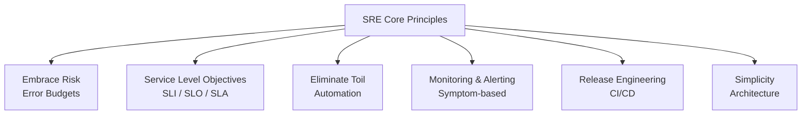

# SRE-01 SRE Fundamentals

# Overview
**Ye kya hai?** Site Reliability Engineering (SRE) ek software engineering approach hai jo IT operations ke problems ko solve karti hai. Google ne is concept ko start kiya tha. SRE engineers operations ka kaam code aur automation ke through karte hain (toil ko reduce karne ke liye). Agar DevOps ek abstract vichardhara (mindset) hai, toh SRE uska concrete mathematical implementation hai.

**Kyu use hota hai?** Traditional SysAdmins manual tareeke se servers fix karte hain (like fighting fire with extinguishers). SREs automate karke "fire-suppression systems" build karte hain. Main goal hai system reliability aur feature velocity ke beech balance maintain karna through "Error Budgets".

**Real life example & Simple analogy:** DevOps agar ye bolna hai ki "Gaadi safe chalao aur jaldi pahuncho", toh SRE us gaadi mein "ABS brakes aur Airbags lagana hai" taaki accident ka impact kam ho. Ek SRE engineer wo software developer hai jise Operations ka kaam de diya gaya hai.

**Real production use-case:** E-commerce website (like Amazon) ka checkout system 99.99% available rakhna. Agar downtime error budget se zyada hota hai, toh SRE feature releases ko block karke stability pe focus karwata hai.

**Architecture / Core Pillars Diagram:**

# Working
**Internal working & Data flow:**
SRE relies on metrics and math. Ye hava mein baatein nahi karta, data pe kaam karta hai.
1. **SLI (Service Level Indicator):** System ka current performance kya hai? (e.g., 99.5% requests successful within 500ms).
2. **SLO (Service Level Objective):** Hamein kitna performance chahiye? (e.g., 99.9% success rate). Ye engineering target hota hai.
3. **SLA (Service Level Agreement):** Agar humne SLO meet nahi kiya toh customer ko penalty/refund kya milega? (Ye business/legal deal hoti hai).
4. **Error Budget:** `100% - SLO`. Agar SLO 99.9% hai, toh Error Budget 0.1% hai. Matlab hum 0.1% failure afford kar sakte hain. Jab tak ye budget bacha hai, Devs nayi features push kar sakte hain. Agar budget khatam, toh feature freeze lagta hai aur sirf stability pe kaam hota hai.

**Toil (The 50% Rule):** Toil matlab manual, repetitive, tactical kaam jisme koi enduring value nahi hai (like manual deployments, database backups, password resets). SRE ka strict rule hai ki ek engineer ka maximum 50% time toil mein jaana chahiye, baaki 50% automation aur system improvement (engineering work) mein.

# Installation
SRE koi specific software nahi hai jise `apt-get install` kiya jaye. Ye ek cultural aur technical implementation hai. Par SRE practices ko implement karne ke liye kuch industry-standard tools ka setup zaroori hai:
- **Monitoring/Alerting:** Prometheus, Grafana, Datadog, New Relic.
- **Incident Management:** PagerDuty, Opsgenie, VictorOps.
- **Automation/IaC:** Ansible, Terraform, Python/Bash scripts, Kubernetes.
- **Prerequisites:** System architecture samajhna, aur product/business teams ke sath baith kar SLOs define karna.

# Practical Lab
**Step-by-step implementation: Calculating SLOs and Error Budgets**
**Goal:** E-commerce checkout API ke liye Error Budget calculate aur enforce karna.

**Step 1: Define System Boundaries**
Ek mahine (30 days) mein Total API Requests = `10,000,000` (10 million).

**Step 2: Set the SLO**
Product Manager aur SRE ne mil kar SLO decide kiya: `99.9%` success rate.

**Step 3: Calculate the Error Budget**
Error Budget = `100% - SLO` => `100% - 99.9% = 0.1%`.

**Step 4: Convert to Absolute Numbers (Math)**
`0.1% of 10,000,000 requests` = `10,000 requests`.
Aapka Error Budget = **10,000 failed requests per month**.

**Step 5: Enforce the Budget (Real Implementation in CI/CD)**
- **Week 1:** Naya feature launch hua, thode bugs the. 4,000 requests fail hui. (Budget bacha: 6,000).
- **Week 2:** Database crash hua 10 minute ke liye. 7,000 requests aur fail ho gayi. (Total fail: 11,000. Budget: -1,000).
- **Week 3 (SRE Action):** Error budget exceed ho gaya. SRE immediately production deployment pipeline ko freeze (block) kar deta hai. Nayi features deploy nahi hongi jab tak Devs system ki stability improve nahi karte, tests nahi likhte, aur 30-day rolling window mein budget wapas positive nahi hota.

# Daily Engineer Tasks
- **L1/L2 Engineer:** On-call alerts (PagerDuty) ka response dena, verified Runbooks follow karke incidents resolve karna. Manual tickets ko handle karna.
- **L3 / DevOps Engineer:** Repetitive tasks (toil) ko identify karke Bash, Python ya Ansible se automate karna. Grafana mein nayi services ke liye monitoring dashboards banana.
- **Senior SRE / Cloud Architect:** Naye microservices ke architecture ko review karna, company-wide SLOs define karna. Complex Sev-1 outages ki Blameless Postmortem (RCA) lead karna. Capacity aur scaling planning karna.
- **Production Engineer:** CI/CD pipelines mein reliability gates lagana (e.g., automated load testing before production rollout) taaki bad code production mein na jaaye.

# Real Industry Tasks
- **Task 1 (Toil Reduction):** Har hafte server disk space full hone ka alert aata hai jisme manual log cleanup karna padta hai. SRE ne ek Ansible playbook likha jo logrotate configure karta hai, aur is kaam ko hamesha ke liye automate kar diya.
- **Task 2 (Defining SLIs):** Ek naye payment gateway integration ke liye proper SLI setup kiya: "Percentage of HTTP POST requests to `/pay` returning 200 OK within 500 milliseconds".
- **Task 3 (Blameless Postmortem):** Pata chala ki ek engineer ne galat YAML config push kiya jisse production down hua. SRE ne engineer ko fire/blame nahi kiya, balki CI pipeline mein ek OPA (Open Policy Agent) validation stage add ki taaki future mein aisi malformed config deploy hi na ho paye.

# Troubleshooting
| Common Issues | Symptoms | Possible Root Causes | Investigation & Resolution |
|---|---|---|---|
| SREs spend 90% time closing Jira tickets | Team is burnt out, no engineering/coding work is happening. | High Toil / Understaffing | Track toil hours meticulously. Prove to management that the 50% cap is breached. Halt feature work and dedicate sprints entirely to automating the top 3 most common tickets. |
| Developers ignore Error Budgets | SRE blocks deployment, but PM overrides and forces it anyway. | Lack of Executive Buy-in | CTO level pe alignment chahiye. Without enforced error budgets, SRE is just a rebranded SysAdmin. Escalation is required. |
| Engineer panics during 3 AM alert and makes it worse | System downtime increases (High MTTR). | Missing or outdated Runbooks | Har alert ke sath verified Runbook ka link mandatory karo. Staging/Prod mein "Game Days" (fire drills) conduct karo practice ke liye. |
| Postmortem turns into a blame game argument | Engineers hide mistakes out of fear of getting fired. | Lack of Blameless Culture | Incident Commander ko rule enforce karna chahiye: "Focus on the system failure, not the human error. Why did the system allow Bob to break it?" |

# Interview Preparation
- **Basic:** SRE vs DevOps mein kya difference hai? *(Ans: DevOps ek cultural philosophy hai silos break karne ke liye. SRE uska implementation hai. "Class SRE implements interface DevOps".)*
- **Intermediate:** SLI, SLO aur SLA mein kya farak hai? *(Ans: SLI current measurement (indicator) hai. SLO internal engineering target hai. SLA ek business agreement (contract) hai external customer ke sath jisme financial penalty involve hoti hai.)*
- **Advanced (Scenario Based):** Agar SLI 99.9% dikha raha hai par customers furiously complain kar rahe hain ki app slow/broken hai, kya issue hai? *(Ans: Aap galat SLI measure kar rahe ho. Sirf HTTP 200 check karna kaafi nahi agar page blank render ho raha hai. SLI must reflect the actual user journey/experience.)*
- **Production (Rapid Fire):** Toil ko SRE mein kitna cap kiya jata hai? *(Ans: Max 50%. Baaki 50% automation aur engineering improvements ke liye.)*
- **Manager Round:** Aap apne business manager ko 100% uptime ke liye kaise convince karoge ki ye wrong goal hai? *(Ans: 100% uptime mathematically impossible hai due to network cuts, hardware faults, AWS region failures. 99.999% pe pohochne ki cost exponentially high hoti hai aur usse development speed 0 ho jayegi. Realistic SLO chahiye based on actual user needs.)*

# Production Scenarios
**Scenario: The 3 AM False Alarm**
- **How to think:** Raat ko 3 baje PagerDuty baji: `WARNING: Server CPU at 95%`. Aapne Grafana dashboard dekha, customer API latency 200ms (normal) hai aur error rate 0% hai.
- **Root Cause & Resolution:** CPU high hona "cause" hai, "symptom" nahi. User experience bilkul fine hai. SRE wapas so jayega (ya ticket acknowledge karega). Agle din subah is alert ko delete ya modify karega. Alerts hamesha **Symptom-based** (jo actually user ko impact karein) hone chahiye, na ki cause-based.

**Scenario: Manual Deployment Fatigue**
- **How to think:** Team har Friday raat 3 ghante manual deployment script chalati hai aur database migrations krti hai.
- **Resolution:** Ye purely **Toil** hai. Isko Jenkins/GitLab/ArgoCD se fully automate karna padega. SRE ek proper pipeline likhega jo canary ya blue-green deployments kare zero-downtime ke sath.

# Commands
*(Note: SRE is mostly conceptual and monitoring based. Commands below reflect basic operational metric gathering and toil reduction.)*

| Command | Purpose | Syntax/Example | When to use | Danger Level |
|---|---|---|---|---|
| `curl` | Check endpoint availability and latency (SLI test) | `curl -w "%{time_total}\n" -I -s https://api.example.com` | Rapidly testing if an API is up and responding fast. | Low |
| `uptime` | Check system uptime and load average | `uptime` | Quick check if server was recently rebooted or is under heavy CPU load. | Low |
| `awk` / `sort` / `uniq` | Rapid log parsing during incidents | `cat access.log \| awk '{print $9}' \| sort \| uniq -c` | Finding HTTP status codes count (e.g., how many 500 errors) in raw access logs. | Low |
| `crontab -e` | Schedule simple automated tasks | `crontab -e` | Quick toil reduction (e.g., schedule daily temp file cleanup). (Use Ansible for scalable infra). | Medium |

# Cheat Sheet
- **MTTF (Mean Time To Failure):** Uptime between crashes. (Goal: Increase to years).
- **MTTR (Mean Time To Recovery/Resolve):** Time to fix a crash. (Goal: Decrease, under 15 mins).
- **MTTD (Mean Time To Detect):** Time until monitoring alerts you. (Goal: Decrease, under 1 min).
- **Toil:** Manual, repetitive, tactical, non-enduring work that scales linearly. (Cap at 50%).
- **Runbook / Playbook:** Step-by-step guide attached to alerts.
- **Blameless Postmortem:** Finding system flaws, not blaming humans. Focusing on prevention.

# SOP & Runbook & KB Article
**SOP: Blameless Postmortem Process**
- **Purpose:** Major incident ke root cause (RCA) ko identify karna without blaming individuals.
- **Scope:** All Sev-1 and Sev-2 production incidents.
- **Procedure:** 
  1. Timeline of events collect aur document karo. 
  2. "5 Whys" root cause analysis perform karo. 
  3. Action items (AIs) assign karo (e.g., Add missing alert, fix code bug, write new test).
- **Validation:** Publish document to all engineering teams for transparency and learning.

**Runbook: NodeFilesystemSpaceFillingUp**
- **Detection:** Prometheus alert triggers when disk space is > 85%.
- **Investigation:** SSH into server, run `df -h` to find mount point, and `du -sh /*` to locate large files/directories.
- **Resolution:** 
  1. Clear `/var/log` rotated logs. 
  2. Implement/fix `logrotate` config. 
  3. If permanent storage is needed, resize EBS volume in AWS console/Terraform.
- **Validation:** Check Grafana disk usage panel drops below 80%. Alert resolves automatically.

**KB Article: Handling Exhausted Error Budgets**
- **Problem:** Development team frustrated because SRE blocked their new feature release pipeline.
- **Symptoms:** CI/CD pipeline returns error: "Error Budget Exhausted. Deployment blocked."
- **Resolution:** Explain that the 0.1% error budget for the 30-day window is exhausted due to recent outages. Deployments are strictly frozen. The Dev team must shift focus to writing unit tests, fixing memory leaks, and improving stability until the rolling window recovers and the budget turns positive.

# Best Practices & Beginner Mistakes
**Beginner Mistakes:**
- **Chasing 100% Uptime:** Ye impossible aur financially ruinous hai. Product velocity dead ho jayegi.
- **Alert Fatigue:** Har choti technical metric pe alert lagana (e.g., CPU > 80%). Aise alerts noise ban jate hain aur engineers ignore karna shuru kar dete hain. Sirf SLI breaches (latency, error rate) pe alert karo (Symptom-based alerting).
- **Blaming People:** "Bob ne prod DB drop kar diya". Ye toxic culture banata hai. Log mistakes hide karne lagenge.

**Best Practices:**
- **Cap Toil at 50%:** Agar toil badh raha hai, pause feature work and automate it.
- **Practice Chaos Engineering:** Jaan-boojh kar production/staging systems fail karo ("Game Days" ya "DiRT" exercises) taaki check ho ki alerts aur runbooks actually kaam kar rahe hain ya nahi.
- **Golden Signals:** Char cheezein hamesha monitor karo: **Latency, Traffic, Errors, and Saturation** (Google's 4 Golden Signals).

# Advanced Concepts
**Availability Math and The Cost of Nines:**
- **99% (Two Nines):** 3.65 days downtime/year. (Good for internal batch processing tools).
- **99.9% (Three Nines):** 8.76 hours/year. (Standard for most e-commerce/SaaS).
- **99.99% (Four Nines):** 52.6 minutes/year. (Mission-critical core systems).
- **99.999% (Five Nines):** 5.26 minutes/year. (Telecom, Pacemakers, Aviation).
*Har extra 'nine' add karne se cost aur engineering complexity 10x badh jaati hai. Hamesha business requirement ke hisaab se SLO decide karo.*

**Burn Rate and Alerting:**
Error budget kitni tezi se exhaust ho raha hai usko "Burn Rate" bolte hain. SREs alerts tab trigger karte hain jab burn rate abnormally high ho, taaki budget puri tarah khatam hone se pehle issue fix ho jaye (e.g., "Alert if 5% of error budget is consumed in 1 hour").

# Related Topics & Flashcards & Revision
- **Related Topics:** [[08-Monitoring-and-Observability/MON-03 Alerting and SLO-SLA-SLI|Alerting and SLOs]], [[10-SRE-Practices/SRE-02 Incident Management|Incident Management]], [[01-Linux-Basics/LIN-01 Linux Fundamentals|Linux Fundamentals]]
- **Flashcards:** 
  - *Q: What implements DevOps?* -> **A:** Class SRE implements DevOps.
  - *Q: What is the Error Budget formula?* -> **A:** 100% - SLO.
  - *Q: What is the maximum allowed time spent on toil?* -> **A:** 50% of an engineer's time.
- **Revision:** 
  - 5 Min: Review the 4 Golden Signals.
  - 15 Min: Practice calculating an Error Budget for a 99.95% SLO system with 1,000,000 requests.
  - Interview Prep: Prepare your explanation of "Toil" and "Blameless Postmortems" with a real-life scenario from your experience.
