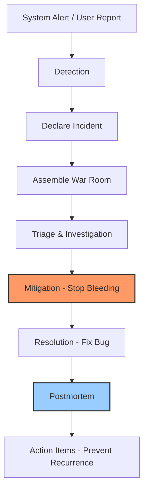
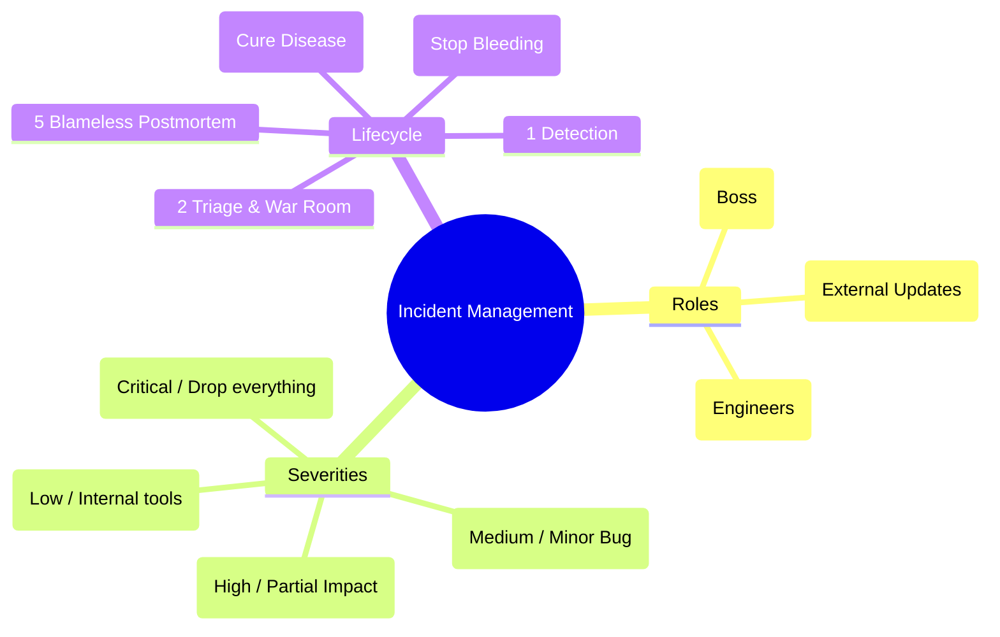

# SRE-02 Incident Management

# Overview
Ye kya hai? Incident Management ek structured process hai jo unplanned IT outages ya interruptions (incidents) ko efficiently handle karne ke liye use hota hai. Jab production system break hota hai, toh ek chaotic situation ban sakti hai. Incident Management is chaos ko order mein convert karta hai.
Kyu use hota hai? To reduce MTTR (Mean Time To Recovery). Bina process ke 10 engineers ek hi issue par Zoom pe chila rahe hote hain, duplicate kaam karte hain, aur outage lamba chalega.
Real life example: Socho ek hospital ka emergency room (ER). Jab koi accident wala patient aata hai, sab doctors panic nahi karte. Ek senior doctor lead karta hai (Commander), ek nurse vitals check karti hai, ek aur doctor blood flow rokta hai. Sabka role fixed hota hai. Incident Management bhi IT systems ka emergency room hai.
Industry kaha use karti hai? Har IT company (FAANG se leke startups tak) PagerDuty, Opsgenie, ya xMatters jaise tools use karti hai on-call rotation aur incident response manage karne ke liye.
Real production use-case: Amazon Prime Day pe achanak checkout service crash ho gayi. SRE team turant ek incident declare karti hai aur war room (Zoom/Slack) mein aake roles assign karke issue mitigate karti hai.



# Working
Internal working: Incident Management usually SRE principles aur ICS (Incident Command System - jo fire brigade use karti hai) pe based hota hai. 
Data flow & Communication: Incident declare hote hi ek dedicated Slack/Teams channel aur Zoom bridge automatically create hota hai (via ChatOps bots like Rootly, FireHydrant). 
Roles: 
1. **Incident Commander (IC)**: Ye boss hai incident ka. Ye code fix nahi karta, decision leta hai aur tasks delegate karta hai. 
2. **Communications Lead (Comms)**: Stakeholders ko update karta hai (Status page update karna, CEO/Managers ko update dena). Engineers ko external noise se bachata hai.
3. **Operations/SME (Subject Matter Experts)**: Asli engineers jo logs check karte hain aur fix apply karte hain.

# Installation
Pre-requisites: Slack/Teams, PagerDuty/Opsgenie account, Datadog/NewRelic monitoring setup.
Installation & Configuration:
1. PagerDuty mein "Escalation Policies" banai jati hain (Level 1 On-call -> Agar 5 min mein acknowledge nahi kiya -> Pings Level 2 Backup).
2. Monitoring tools (Datadog/Prometheus) ko PagerDuty se integrate kiya jata hai via Webhooks.
3. Slack mein incident bot install kiya jata hai (e.g., FireHydrant, Rootly, Jeli).

# Practical Lab
Step-by-step implementation: Mock SEV-1 Incident
1. **Detection (CLI/GUI)**: PagerDuty app pe raat ko 2 AM alert aaya: `High Error Rate on Payment Gateway`.
2. **Declaration**: SRE slack ke `#sre-alerts` channel mein jata hai aur bot command type karta hai: `/incident declare SEV-1 Payment Gateway Failing`.
3. **War Room**: Bot ek naya slack channel `#inc-payment-gateway` banayega. IC channel mein aate hi announce karta hai: *"I am the IC. Rohan, please check the Datadog logs. Priya, take Comms and update the Status Page."*
4. **Mitigation**: Rohan dekhta hai ki recently deploy kiye gaye naye code mein Stripe API key missing hai. IC order deta hai: *"Rohan, execute rollback immediately to the previous tag."*
5. **Verification**: Rohan executes `kubectl rollout undo deployment/payment-gateway`. Pods cycle hote hain. Error rates 0% pe aa jate hain. Incident is mitigated!
6. **Closing**: IC says, *"Great job team. We are stable. I am ending the active incident."* Bot command: `/incident resolve`.

# Daily Engineer Tasks
- **L1 Engineer**: Alerts ko acknowledge karna, runbooks follow karke basic services restart karna, disk space clear karna.
- **L2 Engineer**: Log analysis, root cause dhundhna, complex issues ko L3 pe escalate karna, stakeholder update drafts banana.
- **L3/Senior Engineer**: SEV-1/SEV-2 issues mein Incident Commander banna, cross-team coordination karna, architectural bugs resolve karna.
- **SRE / DevOps / Cloud Engineer**: Monitoring and alerting setup karna, auto-remediation scripts likhna (jaise disk full hone pe khud temp files delete ho jayein), Postmortem meetings drive karna.

# Real Industry Tasks
- **Tickets/Incidents**: "Website loading slow in EU region." -> SEV-3 incident, investigating Cloudflare edge nodes.
- **Change Requests (CRs)**: Database schema upgrade on a Saturday night. (Incident process standby pe rakhte hain in case CR fails, so turant SEV declare kar sakein).
- **Maintenance Work**: SSL certificate renewals, Kubernetes cluster upgrades. Agar downtime unexpectedly lamba ho, toh SEV incident declare karna padta hai.
- **Postmortems**: Har major outage ke baad ek "Blameless Postmortem" document likhna aur engineers ke sath review karna.

# Troubleshooting
- **Problem**: Executive/Manager bar bar engineering Slack channel mein aa ke pooch raha hai "Aur kitna time lagega?".
  - **Resolution**: IC turant ek Comms lead assign karega jo ek separate `#executive-updates` thread/channel mein managers ko update dega. Engineers ko direct message karna strict NO hai.
- **Problem**: 2 hours ho gaye aur outage theek nahi hua kyunki engineers bug fix karne mein lage hue hain.
  - **Resolution**: IC ko bich mein aake bolna padega: *"Stop trying to fix the bug. Mitigation pe focus karo. Rollback to the previous version NOW."* Stop the bleeding first, cure the disease tomorrow.
- **Problem**: Pager alert miss ho gaya kyunki raat mein phone silent tha.
  - **Prevention**: PagerDuty mein "Override System Volume / Do Not Disturb" policy allow karni hoti hai smartphone app mein.

# Interview Preparation
- **Basic (L1/L2)**: What is MTTD and MTTR?
  - *Ans*: MTTD is Mean Time To Detect (kab pata chala issue hai). MTTR is Mean Time To Recovery (kab mitigate/theek hua). Dono ko minimum rakhna is the main goal.
- **Intermediate**: Mitigation vs Resolution mein kya difference hai?
  - *Ans*: Mitigation matlab temporary fix ya rollback karna taaki customers ka system chalne lage (Stopping the bleeding). Resolution matlab naya PR banakar root cause code mein fix karna aur permanently deploy karna (Curing the disease).
- **Scenario Based (FAANG/Senior)**: You are the IC. Two very senior engineers are arguing aggressively over Zoom about whether it's a network routing issue or a database lock, wasting 15 minutes. What do you do?
  - *Ans*: As IC, mai unka argument turant rokunga aur parallel tracks assign karunga: "Engineer A, 5 mins lo aur network logs prove karo. Engineer B, 5 mins lo aur DB locks prove karo. Hum 5 minute baad wapas update lenge."
- **Production Round**: How do you conduct a Blameless Postmortem?
  - *Ans*: Hum humans ko blame ya fire nahi karte. Hum system failures ko blame karte hain. Example: "Why was a junior able to drop the prod DB table? Because our Terraform and IAM policies failed to restrict manual access." Hum fix system me lagate hain, aadmi par nahi.

# Production Scenarios
- **Scenario**: "Database 100% CPU spike mar raha hai, Website is Down."
  - *How to think*: Pehle mitigate karna hai. Kya hum read replicas ko auto-scale kar sakte hain? Kya koi recent code push hui thi jiski queries inefficient hain?
  - *Commands*: Check DB processes via `SHOW PROCESSLIST` in MySQL, ya RDS Performance Insights/Datadog APM dekho.
  - *Resolution*: Bad query ko kill karo aur agar code change tha, toh rollback the recent deployment.
- **Scenario**: "Third-party dependency (like Stripe for Payments ya AWS S3) is down."
  - *How to think*: Hum AWS S3 ya Stripe theek nahi kar sakte. Hum apne system ko gracefully degrade karenge.
  - *Resolution*: Circuit Breaker pattern trigger karo taaki humari app unhe ping karke timeout na ho. Frontend pe message dikhao: "Payments temporarily unavailable". Rest of the app zinda rahegi.

# Commands
- **Command**: `kubectl rollout undo deployment/api-service`
  - *Purpose*: Rollback Kubernetes deployment to the previous stable state.
  - *When to use*: Jab bhi naya deployment fail ho aur SEV-1 create kar de. Fastest mitigation!
  - *Danger Level*: Medium. Pata hona chahiye ki rollback kis version par ho raha hai.
- **Command**: `/incident declare` (In Slack with Incident bots)
  - *Purpose*: Slack war room, Zoom bridge aur Jira ticket automatically create karta hai.
- **Command**: `git revert <commit-hash>`
  - *Purpose*: Bad code ko undo karne ke liye ek naya commit push karna (safe rollback in code).

# Cheat Sheet
- **Severity Levels**:
  - **SEV-1 (Critical)**: Core business down. Heavy revenue loss. Drop everything & join bridge immediately.
  - **SEV-2 (High)**: Major functionality broken, partial user impact. Workarounds exist.
  - **SEV-3 (Medium)**: Minor bug, no major revenue impact.
  - **SEV-4 (Low)**: Internal tool issue, fix during next business hours.

- **Postmortem Structure**:
  Incident resolve hone ke baad, humesha ek document likha jata hai. Vault ki `examples/` directory me ek production standard template available hai:
  - FAANG Post-Mortem Template: [examples/10-SRE/post-mortem-template.md](file:///C:/Users/SPTL/Documents/devops/devops/examples/10-SRE/post-mortem-template.md)

# SOP & Runbook & KB Article
- **SOP**: "How to Declare an Incident" -> Login to Slack -> Go to `#sre-alerts` -> Type `/incident declare` -> Fill the modal -> Assign Incident Commander.
- **Runbook**: "Handling 502 Bad Gateway" 
  - *Detection*: Datadog synthetic test ya Prometheus alert trigger hua.
  - *Investigation*: Check Nginx Ingress logs, check upstream app pods status (`kubectl get pods`).
  - *Resolution*: If pods are in CrashLoopBackOff, check logs (`kubectl logs`). Agar recent code push hua, rollback.
- **KB Article**: "Why we get occasional 504 Gateway Timeouts at midnight" 
  - *Reason*: Nightly database backup script locks tables for 2 mins. 
  - *Resolution*: Known and expected behavior. No action needed, but ideally move backups to a read replica.

# Best Practices & Beginner Mistakes
- **Best Practices**: Hamesha explicitly handoff karo. Agar IC ko washroom jana hai ya debug karna hai, he must say: *"Alice, I am handing off IC duties to you."* Action Items (Jira tickets) hamesha next sprint mein highest priority par hone chahiye.
- **Beginner Mistakes**:
  - *Mistake*: IC khud terminal khol ke debug karne lag gaya. 
  - *Impact*: Leadership lost, team bhatak jaati hai. 
  - *Correct Approach*: IC only coordinates. Delegating is key.
  - *Mistake*: Incident declare karne mein late hona dar ke maare (fear of blame). 
  - *Correct Approach*: "Declare early, declare often." False alarm better hai banisbat 1-hour late SEV-1 ke.

# Advanced Concepts
- **Chaos Engineering**: Jan bujh kar production mein controlled failures inject karna (like unplugging servers, randomly killing pods) taaki check ho sake ki system ki resilience and monitoring/incident response kitna strong hai (e.g., Netflix Chaos Monkey).
- **The "5 Whys" Method**: Root cause (RCA) dhundhne ke liye 5 baar "Why" pucho. 
  - *Problem*: Checkout down. 
  - *Why?* DB connection failed. 
  - *Why?* Max connections reached. 
  - *Why?* Naya code connections leak kar raha hai. 
  - *Why?* PR mein `db.close()` miss ho gaya. 
  - *Why?* PR review process and CI tests cover nahi karte. (Real Systemic Root Cause).

# Related Topics & Flashcards & Revision
- [[10-SRE-Practices/SRE-01 SRE Fundamentals|SRE Fundamentals]]
- [[10-SRE-Practices/SRE-03 Chaos Engineering|Chaos Engineering]]
- [[08-Observability/OBS-01 Observability and Monitoring|Observability and Monitoring]]
- **Flashcard Q**: Ek SEV-1 incident mein "Stop the bleeding" ko kya bolte hain? **A**: Mitigation.
- **Revision Tip**: Interview se pehle Incident roles (IC, Comms, SME), SEV levels, aur Blameless Postmortem concept revise karke jao.

# Real Production Logs & Commands & Decision Tree
Sample PagerDuty Alert JSON:
```json
{
  "incident_key": "payment_gateway_500s",
  "service": "checkout-service",
  "status": "triggered",
  "urgency": "high",
  "title": "P1 - HTTP 500 error rate > 10% for 5m",
  "details": {
    "dashboard_url": "https://datadoghq.com/dashboard/checkout"
  }
}
```
**Decision Tree for Triage**:
Alert received -> Is it impacting real customers? 
- **YES** -> Declare SEV-1 -> Assemble War Room -> Identify recent changes -> Mitigate (Rollback) -> Resolve Bug -> Postmortem.
- **NO** (Only internal impact) -> Declare SEV-3 / Create JIRA ticket -> Fix during business hours.

# Visuals


# AI Enhancement
*Automatically enhanced with: Blameless Postmortem Deep Dive, Real-World FAANG Scenario-Based Questions, "5 Whys" Root Cause Analysis methodology, ChatOps/Bot configurations, and advanced visual mapping of the incident lifecycle.*
