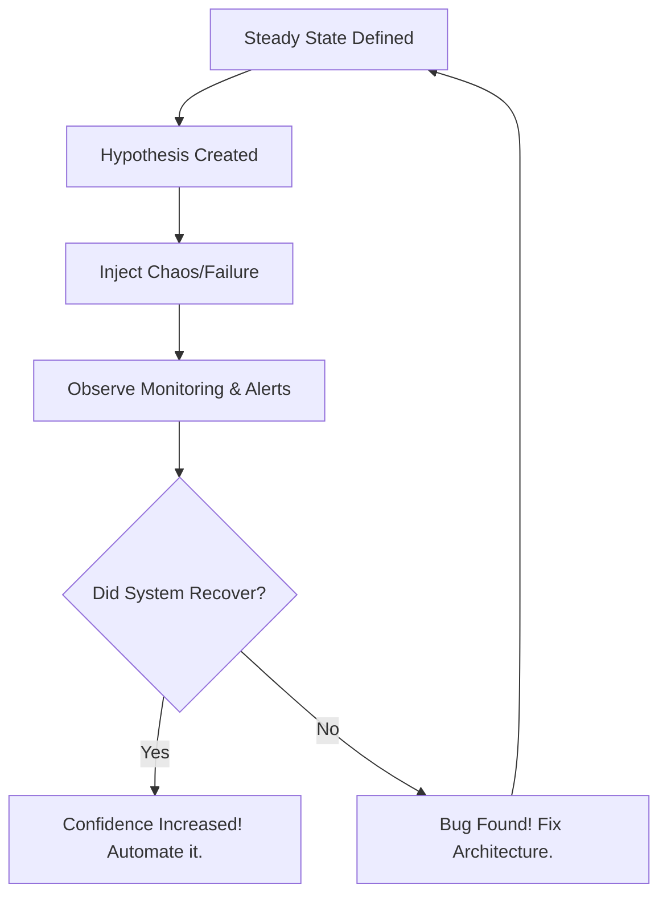
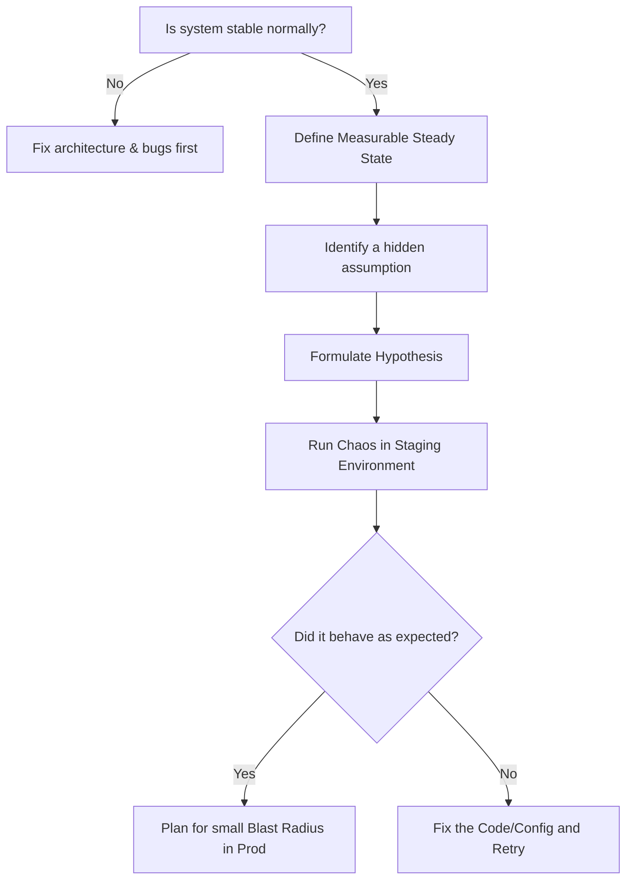

# SRE-03 Chaos Engineering

# Overview
**Ye kya hai?** Chaos Engineering ek aisi practice hai jisme hum intentionally apne production ya staging environment mein failures (jaise server kill karna, network delay daalna) inject karte hain taaki system ki resilience (sehne ki kshamta) ko test kar sakein. 
**Kyu use hota hai?** Traditional testing normal conditions ke liye hoti hai, but Chaos Engineering turbulent (kharab) conditions ke liye. Hum assume karte hain ki AWS AZ down hone par auto-failover hoga, but kya sach mein hoga? Is assumption ko validate karne ke liye.
**Real life example:** Building mein aag lagne ka wait mat karo. Khud ek choti si aag (controlled) lagao aur check karo ki fire alarms baj rahe hain ya nahi, aur sprinkler system theek se chal raha hai ya nahi.
**Industry kaha use karti hai?** Netflix ne "Chaos Monkey" banaya tha. Amazon, Google, aur badi tech companies "GameDays" conduct karti hain apne microservices architecture ko test karne ke liye.
**Simple analogy:** Immunity badhane ke liye vaccine (chota sa virus) dena taaki asli bimaari aane par body lad sake.

**Architecture Diagram:**


# Working
**Internal working:** Chaos Engineering follows the Scientific Method. Sabse pehle ek "Steady State" (normal behavior) define hota hai, jaise P99 latency < 200ms and 0% Error rate. Phir hum hypothesis banate hain ("agar DB node marega, toh standby node take over karega aur API affect nahi hogi"). Phir chaos tool (jaise Chaos Mesh ya Gremlin) under-the-hood Linux kernel utilities (jaise `tc` for traffic control, ya `kill` process) ko use karke fault inject karta hai. 
**Data flow:** Chaos controller pod instructions pass karta hai daemon pod ko jo target node par baitha hota hai, aur wo target resource par action perform karta hai.
**Dependencies:** Solid observability (Prometheus, Grafana, Datadog) hona zaroori hai, warna pata hi nahi chalega ki chaos ka kya impact hua.

# Installation
Hum yahan **Chaos Mesh** (CNCF project) ko Kubernetes (minikube/EKS) par install karenge.

**Prerequisites:** Running K8s cluster, Helm installed.

**Installation:**
```bash
# Add Chaos Mesh Helm repo
helm repo add chaos-mesh https://charts.chaos-mesh.org
helm repo update

# Install Chaos Mesh in its own namespace
helm install chaos-mesh chaos-mesh/chaos-mesh -n=chaos-testing --create-namespace \
  --set chaosDaemon.runtime=containerd \
  --set chaosDaemon.socketPath=/run/containerd/containerd.sock
```

**Verification:**
```bash
kubectl get pods -n chaos-testing
# Verify chaos-controller-manager aur chaos-daemon running mode mein hain
```

# Practical Lab
**Step-by-step implementation (Pod Kill in Kubernetes):**

Vault ki `examples/` directory me ek real Chaos Mesh manifest maujood hai jo har 1 minute me random pod ko maarta hai:
- Chaos Template: [examples/10-SRE/pod-kill-chaos.yaml](file:///C:/Users/SPTL/Documents/devops/devops/examples/10-SRE/pod-kill-chaos.yaml)

1. **Setup Target App:** Ek simple Nginx deployment run karo.
```bash
kubectl create deployment nginx-test --image=nginx --replicas=3
```
2. **Define Steady State:** Nginx should serve traffic with 3 replicas. Load tester se check karo.
3. **Apply Chaos Manifest:**
```bash
cd ../../examples/10-SRE/
kubectl apply -f pod-kill-chaos.yaml
```
4. **Observation:**
```bash
kubectl get pods -w
# Dekho kaise ek pod Terminate hota hai aur K8s instantly naya pod ContainerCreating state mein laata hai.
```
5. **Stop Chaos / Rollback:**
```bash
kubectl delete -f pod-kill-chaos.yaml
```

# Daily Engineer Tasks
- **L1/L2 Engineer:** Observability dashboards ko monitor karna jab GameDay chal raha ho. Alerts check karna ki sahi time par trigger hue ya nahi. JIRA tickets banana bugs ke liye.
- **L3/Senior Engineer:** Chaos experiments ke manifests likhna. Blast radius meticulously define karna. Staging mein chaos run karke unhandled exceptions dhoondhna.
- **SRE / Production Engineer:** GameDays architect karna. Production mein continuous automated chaos run karne ka pipeline set karna. Team ko convince karna for reliability testing culture.

# Real Industry Tasks
- **GameDay Execution:** Thursday afternoon ko team ke saath milkar staging environment ka master DB down karna mock drill mein.
- **Network Degradation Testing:** Check karna ki agar Payment Gateway API 5 second delay (latency spike) deta hai, toh kya humara frontend gracefully timeout handle karta hai ya crash hota hai.
- **Zone Failure Simulation:** Ek pure AWS Availability Zone (AZ) ka traffic drop karke dekhna ki Cross-AZ failover properly trigger ho raha hai ya nahi bina downtime ke.

# Troubleshooting
**Common Issues & Fixes:**
- **Symptom:** Chaos experiment start kiya aur pura production environment down ho gaya.
  - **Root Cause:** Uncontrolled Blast radius. Target selector ne saare pods select kar liye.
  - **Resolution:** Hamesha `mode: one` ya `fixed: 1` se start karo. Abort button/script hamesha ready rakho aur SLI thresholds par automatic rollback laga ke rakho.
- **Symptom:** `NetworkChaos` se delay add kiya par application par koi effect nahi aya.
  - **Root Cause:** Chaos Daemon pods ke paas worker nodes par `NET_ADMIN` capabilities missing hain (Linux kernel permission issue).
  - **Resolution:** Helm chart deploy karte time privilege isolation settings theek karo taaki daemon kernel ke `tc` (traffic control) ko modify kar sake.
- **Symptom:** Experiment pass ho gaya backend pe, par frontend customer ko errors mile.
  - **Root Cause:** Wrong Steady State monitoring. CPU/Memory monitor kiya gaya par real user latency track nahi ki.
  - **Resolution:** Hamesha business-centric SLIs (jaise user checkout rate) ko monitor karo during chaos.

# Interview Preparation
- **Basic:** What is Chaos Engineering? (A: Proactively injecting failures in a controlled way to build confidence in system resilience.)
- **Intermediate:** Difference between Chaos Engineering and Load Testing? (A: Load testing checks volume capacity under normal conditions. Chaos checks behavior under unexpected failures during normal traffic.)
- **Advanced / Scenario:** "CTO bol raha hai Production mein Chaos mat karo, risk hai. Kaise manaaoge?" (A: Convince with "Blast Radius". Pehle staging mein prove karenge. Phir prod mein canary traffic (1%) par off-peak hours mein apply karenge, with automated kill-switches jo SLA tutne par chaos stop kar denge.)
- **Production Question:** What is Steady State? Kyu zaroori hai? (A: It's the baseline of normal system behavior. Bina iske, chaos ke baad system normally behave kar raha hai ya degraded mode mein hai, ye measure karna impossible hai.)

# Production Scenarios
**Scenario: Website Down After Microservice Timeout**
- **How to think:** Ek third-party shipping API was slow. Developer ne socha 5-second timeout lagana enough hai aur graceful degradation hogi. But Black Friday pe checkout page hang ho gaya.
- **Where to check:** APM tools (AppDynamics/Datadog) mein dekho kaha threads stuck hain aur pending requests badh rahi hain.
- **Root Cause:** Timeout sirf connection phase ke liye apply hua tha, read phase ke liye nahi. I/O threads block ho gaye aur naye requests process nahi hue.
- **Resolution:** Code modify karke circuit breaker pattern (e.g., Istio ya application level par) implement kiya.
- **Verification (Chaos):** Staging mein Chaos tool use karke Shipping API IPs par 15s latency daali (NetworkChaos). Check kiya ki ab circuit breaker immediately trip hoke fallback/cached shipping rate de raha hai aur checkout chal raha hai.

# Commands
| Command | Purpose | Syntax | When to use | Danger Level |
|---------|---------|--------|-------------|--------------|
| `kubectl apply -f chaos.yaml` | Start chaos experiment | `kubectl apply -f <file.yaml>` | To trigger a fault in environment | High |
| `kubectl delete podchaos --all` | Abort all pod chaos | `kubectl delete <chaos-type> --all` | Emergency stop (Abort Button) if things go wrong | Low (Safe) |
| `helm uninstall chaos-mesh` | Remove chaos tool completely | `helm uninstall <release> -n <ns>` | Post GameDay cleanup | Medium |
| `tc qdisc show` | Linux level check for network rules | `tc qdisc show dev eth0` | Verifying if network chaos actually applied at kernel level | Low |

# Cheat Sheet
- **Core Principle:** Steady State -> Hypothesis -> Blast Radius -> Inject -> Observe -> Improve.
- **Tools:** Chaos Mesh (Kubernetes native), LitmusChaos (CNCF), Gremlin (Enterprise SaaS), AWS Fault Injection Simulator (FIS).
- **Chaos Mesh CRDs:** 
  - `PodChaos` (kill, restart pods)
  - `NetworkChaos` (delay, loss, corrupt packets)
  - `StressChaos` (CPU/Memory burn on nodes)
  - `TimeChaos` (Clock skew simulation)

# SOP & Runbook & KB Article
**SOP/Runbook: Executing a GameDay Event**
- **Purpose:** Validate system reliability against zone failures.
- **Detection / Pre-flight:** Verify all monitoring dashboards (Grafana) and alerting (PagerDuty) are fully functional. Baseline metrics capture kar lo.
- **Investigation / Planning:** Document the expected behavior (Hypothesis). E.g., "If AZ-1 is dropped, Auto Scaling will spin up instances in AZ-2 within 3 mins."
- **Execution:** Run the targeted chaos experiment via CLI/GitOps targeting specifically AZ-1.
- **Validation:** Check SLIs (Service Level Indicators) - Success rate, Latency.
- **Rollback:** Instantly execute the abort script or delete the CRD if SLI drops below defined danger threshold (`kubectl delete -f az-chaos.yaml`).

# Best Practices & Beginner Mistakes
**Best Practices:**
- Never run chaos if you know the system will break. Chaos is to find "Unknown Unknowns", not to prove a known bug. Fix the known issues first.
- Always meticulously control the Blast Radius.
- Run experiments during business hours (jaise Netflix karta hai) jab sabhi engineers available hon respond karne ke liye. Never at 2 AM.

**Beginner Mistakes:**
- Directly production pe full scale attack karna. (Impact: Major Outage -> Correct Approach: Start with staging, then canary in prod).
- Sirf CPU/Memory infrastructure metrics monitor karna. (Correct Approach: Monitor business metrics like "Checkout success rate" or "Video play starts").
- Forgetting to setup an automatic kill-switch.

# Advanced Concepts
- **eBPF & Traffic Control (`tc`):** Network chaos works by manipulating Linux Kernel `tc` qdiscs and using eBPF. Tools inject rules to drop or delay packets at the virtual network interface level without touching the application code.
- **Continuous Chaos / Chaos in CI/CD:** Highly mature teams integrate chaos experiments directly into CI/CD pipelines. Har deployment ke baad staging mein ek automated short fault injection test run hota hai regression check karne ke liye.

# Related Topics & Flashcards & Revision
- [[10-SRE-Practices/SRE-01 SRE Fundamentals|SRE Fundamentals]]
- [[10-SRE-Practices/SRE-02 Incident Management|Incident Management]]
- [[Kubernetes/K8s-10 Advanced Scheduling|Kubernetes Advanced Scheduling]]

**Flashcards:**
- **Q:** What defines normal system behavior in Chaos? -> **A:** Steady State.
- **Q:** What controls the extent or scope of the failure? -> **A:** Blast Radius.
- **Q:** Main purpose of Chaos Engineering? -> **A:** Uncover unknown weaknesses in a distributed system before they cause an unplanned outage.

**Revision:** 5 min for Cheat Sheet, 15 min for Troubleshooting & Scenarios before an interview.

# Real Production Logs & Commands & Decision Tree
**Log Analysis:**
```text
[INFO] chaos-daemon: Injecting 500ms delay to eth0 on Pod nginx-xyz (pid 3452)
[ERROR] app-service: Timeout waiting for response from http://nginx-xyz:80, elapsed 202ms
[WARN] circuit-breaker: Threshold reached, opening circuit for nginx-xyz
```
*Explanation:* Chaos daemon ne kernel level pe 500ms network delay inject kiya. Humari backend app service sirf 200ms wait kar paayi aur fail ho gayi. Par achi baat ye hai ki next line mein Circuit Breaker ne trip hoke fallback route le liya. The experiment was a success!

**Decision Tree (Chaos Planning):**

