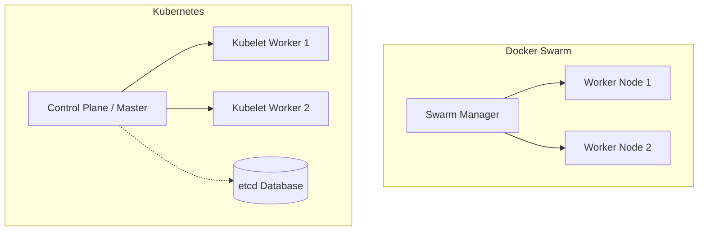
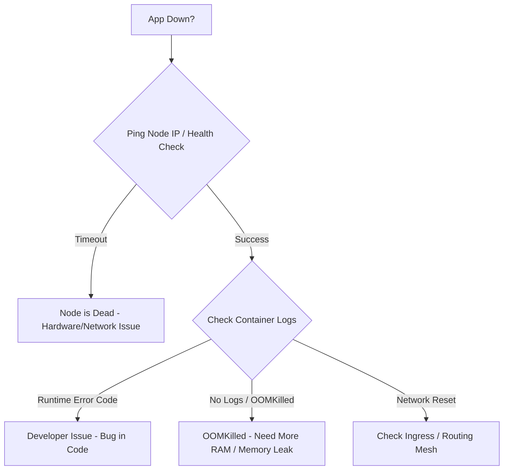

# Docker Swarm vs Kubernetes

# Overview
**Ye kya hai?** Docker Swarm aur Kubernetes (K8s) dono container orchestration platforms hain. Jab aapke paas hundreds of containers hote hain, toh unko manually manage karna impossible ho jata hai. Ye tools automatically containers ko start, stop, scale, aur self-heal karte hain.
**Kyu use hota hai?** High availability, auto-scaling, aur load balancing ke liye. Agar ek server (node) fail ho jaye, toh ye applications ko doosre server par shift kar dete hain.
**Real life example:** Socho ek restaurant hai. Docker Swarm ek chhota fast-food joint hai jahan ek hi manager (Swarm Manager) sab kuch simple tarike se manage kar leta hai. Kubernetes ek 5-star hotel hai, jahan har kaam ke liye alag department aur strict rules hain (Master node components). Swarm simple aur fast hai, K8s complex but highly scalable hai.
**Industry kaha use karti hai?** Startups, edge computing (like IoT devices), aur internal basic tooling mein Swarm use hota hai. Large-scale enterprise applications, microservices, aur FAANG companies mein Kubernetes industry standard hai.

**Architecture:**


# Working
**Internal working & Data Flow:** 
- **Docker Swarm:** Isme alag se heavy components nahi hote. Docker daemon hi sab karta hai. Manager nodes internally `Raft consensus algorithm` use karte hain cluster state maintain karne ke liye. Networking ke liye built-in overlay network aur routing mesh use hota hai.
- **Kubernetes:** K8s me control plane (Master) aur data plane (Worker) decoupled hote hain. Control Plane me heavy components chalte hain: `kube-apiserver` (frontend for CLI/API calls), `etcd` (state data store karne wala key-value DB), `kube-scheduler` (decide karta hai pod kahan chalega), aur `kube-controller-manager` (desired state maintain karta hai).

**Ports & Protocols:**
- **Swarm:** 2377 (Cluster management), 7946 (Node communication TCP/UDP), 4789 (Overlay network UDP).
- **K8s:** 6443 (API server), 2379-2380 (etcd client/peer), 10250 (Kubelet API).

# Installation
**Prerequisites:** Servers par container runtime (e.g., Docker, containerd) installed hona chahiye.
**Installation (Swarm):** Bahut asaan hai. Manager node par bas `docker swarm init` chalao aur output command ko workers par paste karo.
**Installation (K8s):** Complex setup. `kubeadm init` karna padta hai, uske baad CNI (Container Network Interface like Calico ya Flannel) install karna zaroori hai tabhi networking chalu hogi. (Real world me log EKS/AKS/GKE managed services use karte hain).
**Verification:** 
- Swarm: `docker node ls`
- K8s: `kubectl get nodes`
**Rollback:** Swarm cluster se exit karne ke liye `docker swarm leave --force`.

# Practical Lab
**Step-by-step implementation (CLI Method - Docker Swarm)**
K8s setup lamba hota hai, par Swarm 2 minute me ho jata hai.

1. **Initialize the Swarm Manager:**
```bash
docker swarm init --advertise-addr 192.168.1.100
# Output: Swarm initialized: current node is now a manager.
```
2. **Worker join karega (optional, on 2nd VM):**
```bash
docker swarm join --token SWMTKN-1-... 192.168.1.100:2377
```
3. **Deploy a Stack via YAML:** Create a file `docker-compose.yml`:
```yaml
version: '3.8'
services:
  web:
    image: nginx:alpine
    ports:
      - "8080:80"
    deploy:
      replicas: 3
```
4. **Run deployment:**
```bash
docker stack deploy -c docker-compose.yml myapp
```
5. **Expected Output & Verification:**
```bash
docker service ls
# Output me dikhega myapp_web 3/3 replicas chal rahe hain
docker service ps myapp_web
# Ye dikhayega ki 3 containers kaunse nodes par run ho rahe hain.
```

# Daily Engineer Tasks
- **L1 Engineer:** Alerts monitor karna. Agar container crash ho, toh uske logs check karna (`docker service logs` / `kubectl logs`).
- **L2 Engineer:** Node capacity manage karna. Storage volumes attach karna. Pending tasks troubleshoot karna.
- **L3 / Senior Engineer:** K8s architecture design karna. Legacy monoliths ko Swarm se EKS par migrate karna. Helm charts likhna.
- **Platform Engineer:** CI/CD pipelines set up karna taaki jab bhi developer code push kare, automatically `kubectl apply` ya `docker stack deploy` trigger ho.

# Real Industry Tasks
- **Real Tickets:** "App running in Swarm is not scaling beyond 5 replicas." -> Action: Check memory/CPU constraints or limits in the YAML file.
- **Migrations:** "Migrate Docker Swarm to AWS EKS (K8s)." Kyu? Kyunki compliance rules kehte hain ki strict RBAC (Role Based Access Control) chahiye jo Swarm me achha nahi hai.
- **Node Maintenance:** OS patching ke liye node ko empty karna.
  - Swarm: `docker node update --availability drain worker1`
  - K8s: `kubectl drain worker1 --ignore-daemonsets`

# Troubleshooting
**Common Issue: Pods / Service replicas stuck in `Pending` state.**
- **Symptoms:** Application scale nahi ho rahi, naye containers start nahi ho rahe.
- **Possible root causes:** Worker nodes par sufficient CPU ya RAM nahi bachi hai, ya node NotReady state me chala gaya hai.
- **Investigation steps:** 
  - K8s: `kubectl describe pod <pod_name>` -> Events section padho. "Insufficient CPU" error dikhega.
  - Swarm: `docker service ps <service_name>` -> ERROR column dekho.
- **Resolution:** Ya toh Naya node add karo (Scale out), ya existing app ki CPU limits kam karo config me.
- **Escalation:** Agar node dead ho chuka hai hardware issue ki wajah se, toh Cloud Infra team ko ticket raise karo.
- **Prevention:** Setup proper Prometheus/Grafana alerts for node resource utilization (e.g., alert at 80% CPU).

# Interview Preparation
- **Basic:** Swarm aur K8s me cluster state kahan store hoti hai? 
  - *Expected Answer:* Swarm natively managers me Raft algorithm se state maintain karta hai. K8s ek external distributed key-value store, jise `etcd` kehte hain, wahan sab metadata rakhta hai. (Experience: L1/L2)
- **Intermediate:** Routing mesh kya hota hai? 
  - *Expected Answer:* Swarm me routing mesh har node par ek port open kar deta hai. Agar app Node A par chal rahi hai aur request Node B par aati hai, toh Node B automatically traffic Node A ko forward kar dega overlay network ke through. K8s me iske liye Services aur Ingress Controller use hote hain. (Experience: L2)
- **Scenario Based / FAANG:** Your startup has a tight budget, low devops expertise, but needs to deploy 5 microservices today. Which orchestration tool do you choose and why?
  - *Expected Answer:* I will choose Docker Swarm. Iska learning curve almost zero hai agar team ko pehle se `docker-compose` aata hai. Fast time-to-market milega, aur jab traffic millions me jaayega tab gradually Kubernetes par migrate karenge, as premature K8s adoption operational overhead bahut badha dega. (Experience: L3 / Architect)

# Production Scenarios
**Scenario: Website Down, Cluster Node Not Reachable.**
- **How to think:** Don't panic. Orchestrator ka kaam hi self-healing hai. Check if the orchestrator rescheduled the workload. 
- **Where to check:** Check node status using `kubectl get nodes` ya `docker node ls`.
- **Commands & Logs:** Agar Node `Down` ya `NotReady` hai, toh us node par SSH karo. Check `dmesg -T` ya `/var/log/syslog` -> ho sakta hai OS kernel panic kar gaya ho, ya Out Of Memory (OOM) killer ne Kubelet/Docker agent ko maar diya ho.
- **Resolution:** Reboot the instance from AWS/Azure portal. The orchestrator will bring it back to Ready state automatically.
- **Verification:** `kubectl get pods -o wide` to ensure workloads are running and healthy.

# Commands
| Command | Purpose | Syntax | Example | Output | When to use | Danger Level |
| :--- | :--- | :--- | :--- | :--- | :--- | :--- |
| `docker swarm init` | Naya cluster banana | `docker swarm init --advertise-addr <IP>` | `docker swarm init ...` | Node manager ban jata hai | 1st time setup | Low |
| `docker stack deploy` | App deploy/update karna | `docker stack deploy -c <yaml_file> <name>` | `docker stack deploy -c app.yml web` | Network/Service creates | Har nayi deployment pe | Medium |
| `docker service scale` | Replicas modify karna | `docker service scale <svc>=<count>` | `docker service scale web_app=5` | App scales up/down | High traffic aane par | Low |
| `kubectl get pods -A` | All namespaces me pods dekhna | `kubectl get pods -A` | `kubectl get pods -A` | List of all pods | Health check karte time | Low |
| `kubectl drain <node>` | Node ko empty karna | `kubectl drain <node_name>` | `kubectl drain worker1` | Evicts all pods | Server patch/restart se pehle | High |

# Cheat Sheet
- **Quick revision:** Swarm = Simplicity, Fast setup, No complex YAMLs. Kubernetes = Extensibility, Standard for enterprise, Heavy infrastructure, CRDs (Custom Resources).
- **Network Default:** Swarm = Overlay, VXLAN. Kubernetes = Needs CNI (Calico, Flannel, Cilium).
- **Core Logs Paths (Linux):** `/var/log/syslog`, `/var/log/messages`. Systemd logs for Kubelet: `journalctl -u kubelet`.

# SOP & Runbook & KB Article
- **SOP: Adding a New Worker Node**
  - **Purpose:** Cluster capacity badhana.
  - **Procedure:** Manager node par `docker swarm join-token worker` chalao. Output ko copy karo aur naye server par paste karo.
  - **Validation:** Run `docker node ls` on manager, verify state is `Ready`.
- **Runbook: Node Shows "NotReady" in K8s**
  - **Detection:** Grafana Alert triggers.
  - **Investigation:** SSH into the node -> run `systemctl status kubelet`. Check for errors. Check disk space (`df -h`).
  - **Resolution:** If kubelet crashed due to CPU spike, `systemctl restart kubelet`. If disk full, clear dangling images (`crictl rmi --prune`).
- **KB Article: Error - "no suitable node (insufficient resources)"**
  - **Cause:** Swarm ya K8s me aapne YAML me CPU/RAM limit zyada mangi hai aur node par jagah nahi hai.
  - **Fix:** Update deployment YAML and lower the resource requests, then re-deploy.

# Best Practices & Beginner Mistakes
- **Best Practices:**
  - Managers humesha odd numbers me rakho (3, 5, 7) for split-brain/quorum safety.
  - Self-managed Kubernetes scratch se mat banao (Kelsey Hightower ka kelseyhightower/kubernetes-the-hard-way try karna sirf learning ke liye). Hamesha EKS, AKS, ya GKE use karo production ke liye.
- **Beginner Mistakes:**
  - Databases (like MySQL/PostgreSQL) ko container ke andar bina proper Persistent Volume (PV/PVC) ke chalana. Container marega toh saara data udd jayega!
  - `image: nginx:latest` use karna. Humesha explicit tag use karo jaise `nginx:1.24` taaki rollback asaan ho.

# Advanced Concepts
- **Internal Architecture (Networking):** Swarm overlay network internally VXLAN technology use karta hai to encapsulate Layer 2 traffic over Layer 3. K8s me advanced CNI plugins like Cilium, eBPF (Extended Berkeley Packet Filter) technology use karte hain for insanely fast networking and security.
- **Extensibility:** K8s Custom Resource Definitions (CRD) allow karta hai. Aap apna resource type (jaise Pod hota hai waise `MyCustomApp`) bana sakte ho. Swarm closed-box hai, aap native functionality extend nahi kar sakte.

# Related Topics & Flashcards & Revision
- **Related Topics:** [[DOCKER-02 Docker Compose]], [[KUBERNETES-01 Kubernetes Architecture]], [[AWS-10 EKS Basics]]
- **Flashcards:**
  - *Q:* Swarm aur K8s me state kon hold karta hai? -> *A:* Swarm: Raft protocol in Managers, K8s: etcd.
  - *Q:* Node maintenance commands? -> *A:* Swarm: `node update --availability drain`, K8s: `kubectl drain`.
- **Revision:** Interview se 15 minutes pehle 'Working' aur 'Architecture' (Mermaid diagram) dhyan se dekh lena. Load balancer aur networking ka difference yaad rakhna.

# Real Production Logs & Commands & Decision Tree
**Sample K8s Error Log Explained:**
`[ERROR] Failed to pull image "mycompany/app:v1.2": rpc error: code = NotFound`
- *Meaning:* Kubelet ko ECR/DockerHub par aisi koi image nahi mili. 
- *Fix:* Check karo ki Jenkins pipeline ne image push ki thi ya nahi, ya image name ki spelling galat hai YAML file me.

**Decision Tree for Application Downtime (Swarm/K8s):**

