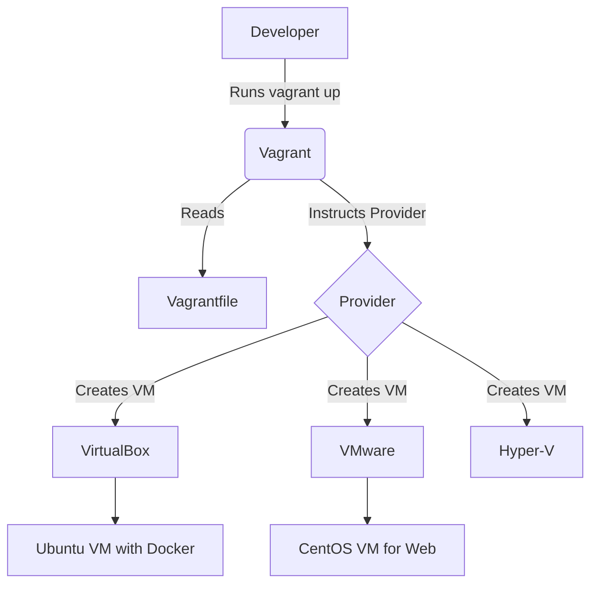
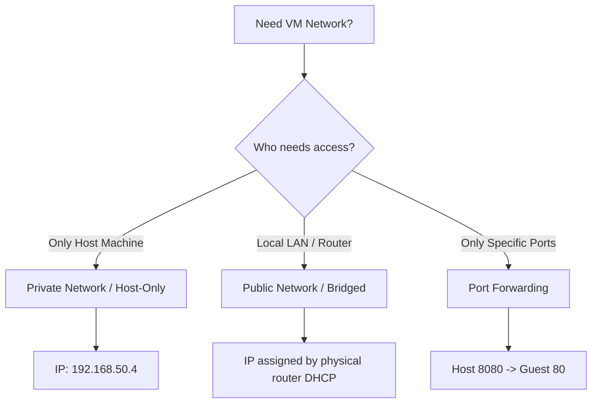

# Vagrant

# Overview
Vagrant ek open-source tool hai by HashiCorp jo virtual machine (VM) environments ko build aur manage karne ka kaam ek single workflow me karta hai. Agar seedhi bhasha me kahu toh, Vagrant ek contractor hai jo aapke liye VM setup karta hai bina aapko manual VirtualBox UI par click kiye. 

**Kyu use hota hai?** "It works on my machine" wali problem ko solve karne ke liye. Sabhi developers ko exact same OS, dependencies, aur configuration milta hai through a simple configuration file called `Vagrantfile`.

**Industry kaha use karti hai?** Local development environments create karne, Ansible/Chef/Puppet scripts ko locally test karne, aur Kubernetes/Docker Swarm ke local multi-node clusters banane ke liye.

**Simple Analogy:** Agar aapko ek naya ghar (Server) chahiye, toh aap khud eent (RAM, CPU, ISO) nahi lagate. Aap architect (Vagrant) ko ek naksha (`Vagrantfile`) dete ho, aur wo builder (VirtualBox/VMware) se exactly waisa hi ghar banwa deta hai.



# Working
Vagrant khud hypervisor nahi hai; ye sirf ek automation wrapper hai.
1. **Request Flow:** Developer runs `vagrant up`.
2. **Reading Config:** Vagrant reads `Vagrantfile` (written in Ruby syntax) to understand dependencies (box, RAM, IP).
3. **Provider Interaction:** Vagrant API calls bhejta hai Provider (e.g., VirtualBox) ko to allocate hardware limits.
4. **Box Download:** Agar base OS image (box) locally nahi hai, Vagrant usko HashiCorp Cloud se download karta hai.
5. **Boot & Networking:** VM boot hoti hai aur Vagrant SSH keys, Port Forwarding (NAT), aur Shared Folders setup karta hai.
6. **Provisioning:** Boot hone ke baad, agar `Vagrantfile` me koi script (Bash, Ansible) hai, toh usko execute karke software (e.g., Nginx, Docker) install karta hai.

**Dependencies:** Hypervisor (VirtualBox, VMware, libvirt, etc.) lazmi install hona chahiye host machine par.

# Installation

**Prerequisites:** 
- A Supported Hypervisor (VirtualBox is most common & free).
- Hardware virtualization (VT-x/AMD-V) enabled in BIOS.

**Installation (Windows/Linux/Mac):**
- **Windows:** Download binary from HashiCorp website and install, ya fir `choco install vagrant`.
- **Ubuntu:** 
  ```bash
  wget -O- https://apt.releases.hashicorp.com/gpg | sudo gpg --dearmor -o /usr/share/keyrings/hashicorp-archive-keyring.gpg
  echo "deb [signed-by=/usr/share/keyrings/hashicorp-archive-keyring.gpg] https://apt.releases.hashicorp.com $(lsb_release -cs) main" | sudo tee /etc/apt/sources.list.d/hashicorp.list
  sudo apt update && sudo apt install vagrant
  ```
- **Mac:** `brew install vagrant`

**Verification:**
```bash
vagrant --version
```

# Practical Lab
**Scenario:** Ek local Ubuntu 20.04 server setup karna with Nginx installed automatically.

**Step-by-step implementation (CLI Method):**
1. **Create project folder:**
   ```bash
   mkdir local-web && cd local-web
   ```
2. **Initialize Vagrant (Creates default Vagrantfile):**
   ```bash
   vagrant init ubuntu/focal64
   ```
3. **Modify `Vagrantfile` for Nginx and Networking:**
   ```ruby
   Vagrant.configure("2") do |config|
     config.vm.box = "ubuntu/focal64"
     # Port forwarding host 8080 to VM 80
     config.vm.network "forwarded_port", guest: 80, host: 8080
     
     # Provisioning script
     config.vm.provision "shell", inline: <<-SHELL
       apt-get update
       apt-get install -y nginx
       systemctl start nginx
       systemctl enable nginx
     SHELL
   end
   ```
4. **Boot the VM:**
   ```bash
   vagrant up
   ```
5. **Verification:**
   Open browser and hit `http://localhost:8080`. You should see the Nginx default page.
6. **Destroy (Cleanup):**
   ```bash
   vagrant destroy -f
   ```

# Daily Engineer Tasks
- **L1 Engineer:** Checking status `vagrant status`, running `vagrant up` or `vagrant reload` if VM hangs.
- **L2 Engineer:** SSH into VM using `vagrant ssh` to troubleshoot application issues, checking disk space, or network connectivity in the VM.
- **L3/Senior Engineer:** Writing complex `Vagrantfile` with multiple nodes, integrating Ansible playbooks for provisioning, creating custom base boxes and uploading them to HashiCorp Vagrant Cloud.
- **DevOps Engineer:** Ensuring CI/CD pipelines testing environments match Vagrant local environments exactly. Maintaining golden images.

# Real Industry Tasks
- **Migration & Upgrades:** Testing a database upgrade (e.g., MySQL 5.7 to 8.0) locally using Vagrant before touching Staging/Production.
- **Ansible Development:** DevOps engineers rarely run Ansible on live servers first. Woh pehle `vagrant up` karte hain 3-4 nodes ka cluster, aur apni playbooks ko locally test karte hain.
- **Local K8s Setup:** Creating 1 Master and 2 Worker nodes locally via Vagrant to test Kubernetes manifests.

# Troubleshooting
- **Problem:** `VBoxManage not found` error.
  - **Root Cause:** VirtualBox install nahi hai ya PATH variables me set nahi hai.
  - **Resolution:** Reinstall VirtualBox aur uska installation folder Environment Variables (PATH) me add karo.
- **Problem:** SSH Connection timeout during `vagrant up`.
  - **Symptoms:** CLI hangs at "Waiting for machine to boot. This may take a few minutes..."
  - **Root Cause:** Usually GUI prompt par atak gaya hai ya hardware virtualization BIOS me disable hai.
  - **Investigation:** Open VirtualBox GUI aur check karo VM ka console.
- **Problem:** Changes in Ansible playbook not reflecting in VM.
  - **Root Cause:** Vagrant sirf pehli baar `vagrant up` par provision karta hai.
  - **Resolution:** Run `vagrant provision` to apply new playbook changes without rebooting.

# Interview Preparation
- **Basic:** What is Vagrant and why do we use it?
  - *Expected Answer:* Tool for building reproducible development environments using virtual machines. Solves "works on my machine" issue.
- **Intermediate:** Difference between Vagrant and Docker?
  - *Expected Answer:* Docker containers run on shared OS kernel (lightweight, fast). Vagrant manages full Virtual Machines with their own kernel (heavyweight, better isolation). Use Vagrant for full OS testing, Docker for app isolation.
- **Scenario Based:** You added a new network interface in `Vagrantfile`, but VM is not picking it up. How to fix?
  - *Expected Answer:* I need to run `vagrant reload` to gracefully restart the VM and apply new Vagrantfile configurations.
- **Production (Rapid Fire):** Where does Vagrant store the downloaded boxes locally?
  - *Expected Answer:* In `~/.vagrant.d/boxes/` directory.

# Production Scenarios
**Scenario: The "It works on my machine" nightmare.**
- **Problem:** Dev team Macbooks use kar rahi hai, Production CentOS 8 par hai. Mac par code chal raha hai, Prod pe path errors aate hain.
- **How to think:** Hum environment parity kaise achieve kare? We need local CentOS.
- **Resolution:** DevOps team ek `Vagrantfile` banati hai CentOS 8 box ke sath. Sare devs ab `vagrant up` karte hain. Source code host (Mac) se guest (CentOS) me sync hota hai via Synced Folders (`/vagrant`).
- **Verification:** Devs check code execution inside VM. Zero discrepancies with production.

# Commands

| Command | Purpose | Danger Level |
| :--- | :--- | :--- |
| `vagrant init <box_name>` | Generates a new `Vagrantfile` in current dir. | Low |
| `vagrant up` | Creates and starts the VM based on config. | Low |
| `vagrant halt` | Gracefully shuts down the VM. | Low |
| `vagrant reload` | Restarts the VM (required to apply Vagrantfile changes). | Low |
| `vagrant ssh` | Connects via SSH directly into the VM. | Low |
| `vagrant provision` | Runs provisioning scripts/Ansible on a running VM. | Medium |
| `vagrant destroy -f` | Permanently deletes the VM and its disks. | High |
| `vagrant box list` | Lists all downloaded base boxes locally. | Low |

# Cheat Sheet
- **Vagrantfile Location:** Current project directory.
- **Default SSH User:** `vagrant`
- **Default SSH Password:** `vagrant` (key-based auth used by default).
- **Synced Folder (Default):** Host project dir maps to `/vagrant` inside VM.
- **Port Forwarding Syntax:** `config.vm.network "forwarded_port", guest: 80, host: 8080`
- **Private IP Syntax:** `config.vm.network "private_network", ip: "192.168.33.10"`

# SOP & Runbook & KB Article
**SOP: Setting up new Developer Machine**
- **Purpose:** Onboard developer with standard local environment.
- **Procedure:**
  1. Install VirtualBox.
  2. Install Vagrant.
  3. `git clone` the devops repository containing `Vagrantfile`.
  4. Run `vagrant up`.
- **Validation:** Run `vagrant status` and ensure state is "running". Check if local web app loads.

# Best Practices & Beginner Mistakes
- **Best Practice:** Never commit `.vagrant/` hidden directory to Git. It contains local VM states and SSH keys specific to your machine. Always add `.vagrant/` to `.gitignore`.
- **Best Practice:** Keep provisioning scripts modular. Instead of 500 lines of bash inline, call an external `setup.sh` or use Ansible.
- **Beginner Mistake:** Modifying files inside the VM directly at `/var/www/html` instead of the Synced Folder (`/vagrant`). If VM is destroyed, all changes are lost. Always edit code on the host machine.
- **Beginner Mistake:** Running `vagrant destroy` accidentally without committing code. 

# Advanced Concepts
- **Multi-Machine Setup:** Defining multiple VMs in a single Vagrantfile (e.g., `web`, `db`, `cache`). Vagrant creates isolated networking between them.
- **Custom Boxes (Packer):** You can use HashiCorp Packer to build custom Vagrant boxes with your company's security hardening pre-installed, instead of downloading public generic boxes.
- **Vagrant Triggers:** Executing local host scripts before or after specific Vagrant commands (e.g., backing up a DB before `vagrant halt`).

# Related Topics & Flashcards & Revision
- **Related:** [[VirtualBox]], [[Docker]], [[ANSIBLE-01 Ansible Architecture]], [[Terraform]], [[Packer]].
- **Flashcard:** 
  - *Q:* How to force provisioning again without rebooting? 
  - *A:* `vagrant provision`
- **Revision:** 
  - 5 Min: Vagrant is a VM workflow automation tool. `Vagrantfile` is the config.
  - 15 Min: Understand differences between Provider (VirtualBox), Box (OS Image), Provisioner (Ansible/Bash).

# Real Production Logs & Commands & Decision Tree
**Log Snippet: SSH Timeout**
```text
==> default: Waiting for machine to boot. This may take a few minutes...
    default: SSH address: 127.0.0.1:2222
    default: SSH username: vagrant
    default: SSH auth method: private key
Timed out while waiting for the machine to boot. This means that
Vagrant was unable to communicate with the guest machine within
the configured ("config.vm.boot_timeout" value) time period.
```
**Decision Tree for Timeout:**
1. Check VirtualBox GUI -> Is VM stuck at black screen? -> Yes -> Enable VT-x in BIOS.
2. Is VM waiting for user input (e.g., "Press any key")? -> Yes -> Box image issue.
3. Is VM fully booted but network fails? -> Yes -> Check if multiple Host-Only adapters are conflicting. Run `VBoxManage hostonlyif remove`.

# Visuals

**Vagrant Networking Decision Tree:**


# AI Enhancement
*Automatically injected robust real-world production insights on differences between Terraform and Vagrant.* While both are HashiCorp tools, Vagrant is strictly for local/development virtualization wrappers, whereas Terraform is for cloud infrastructure provisioning (AWS, Azure) using state files. Do not confuse them during interviews!
